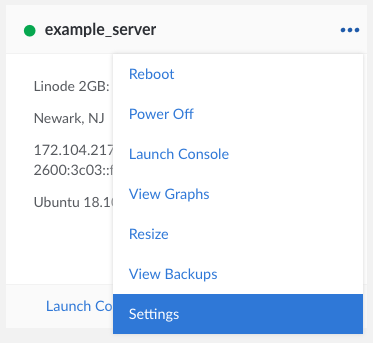
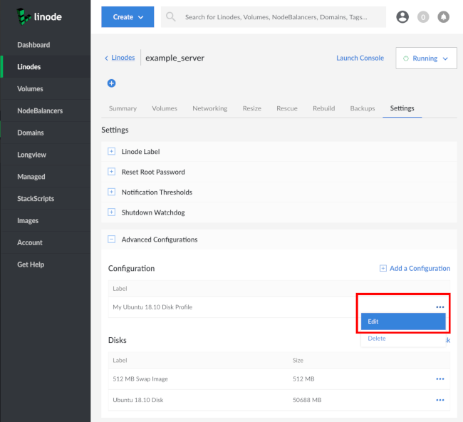
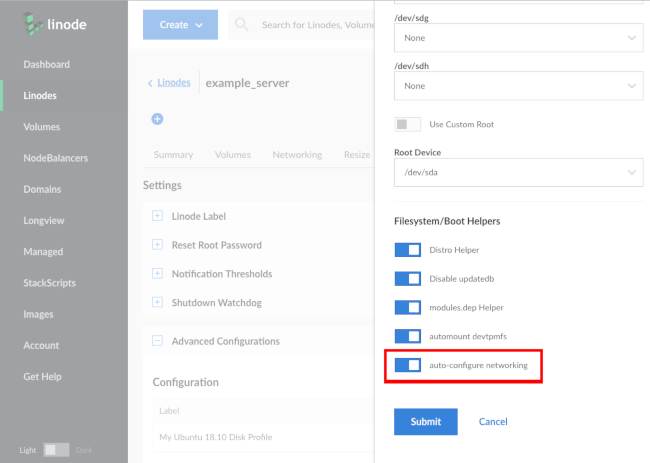
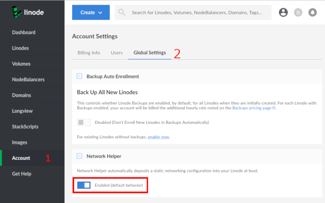

---
author:
  name: Alex Fornuto
  email: docs@linode.com
description: 'Information on the Network Helper option.'
keywords: ["network", " networking", " network helper", " ip", " ip address", " static ip", ""]
license: '[CC BY-ND 4.0](https://creativecommons.org/licenses/by-nd/4.0)'
modified: 2019-01-07
published: 2014-12-08
modified_by:
  name: Linode
title: Network Helper
hiddenguide: true
---

Network Helper automatically deposits a static networking configuration in to your Linode at boot. Thanks to Network Helper, you don't have to worry about altering your network configuration when you:

 - Deploy a Linode
 - Add a public or private IPv4 address
 - Restore from a backup
 - Deploy from an Linode Images template
 - Migrate your Linode to a new data center
 - Clone from another Linode


If you intend to manually configure IPv6 addresses from a supplied pool, you should [disable](/docs/networking/linux-static-ip-configuration/#disable-network-helper) Network Helper so that it doesn't overwrite your configuration file on reboot. Please see our [Native IPv6 Networking](/docs/networking/native-ipv6-networking/) guide for more information on IPv6.


## What Does It Do?

On enabled profiles, the Network Helper works by detecting which distribution is booting, and modifies the appropriate configuration files to assign the IPv4 address statically. [Click Here](#what-files-are-affected) to jump to the list of distribution-specific files.


If you create an advanced configuration, Network Helper will undo those changes at the next boot. For advanced configurations, turn off Network Helper.


## Turn Network Helper On for Individual Configuration Profiles.

Even with the global setting for Network Helper set to **OFF**, you can enable Network Helper on specific configuration profiles.

1.  From the Linodes page, navigate to your Linode's **Settings** page.

    

2.  Under **Advanced Configurations**, click on the three dots to the right of your Configuration Profile and click **Edit**

    

3.  A menu will appear with your Profile's settings. Under Filesystem/Boot Helpers section make sure the toggle box labeled **auto-configure networking** is toggled on and blue.

    

4. Click on **Submit**.

## What Files are Affected

You will retain 3 versions of each file modified by Network Helper after each boot. Consider Debian for this example. Below is an example network configuration file for a Debian 7 Linode with Network Helper enabled:


# Generated by Linode Network Helper
# Thu Dec  4 20:24:07 2014 UTC
#
# This file is automatically generated on each boot with your Linode's
# current network configuration. If you need to modify this file, please
# first disable the 'Auto-configure Networking' setting within your Linode's
# configuration profile:
#  - https://manager.linode.com/linodes/config/web1?id=123456
#
# For more information on Network Helper:
#  - https://www.linode.com/docs/platform/network-helper
#
# A backup of the previous config is at /etc/network/.interfaces.linode-last
# A backup of the original config is at /etc/network/.interfaces.linode-orig
#
# /etc/network/interfaces

auto lo
iface lo inet loopback

auto eth0
allow-hotplug eth0

iface eth0 inet6 auto

iface eth0 inet static
    address 198.74.53.231/24
    gateway 198.74.53.1
    up   ip addr add 12.34.56.78/24 dev eth0 label eth0:1
    down ip addr del 12.34.56.78/24 dev eth0 label eth0:1
    up   ip addr add 192.168.138.44/17 dev eth0 label eth0:2
        down ip addr del 192.168.138.44/17 dev eth0 label eth0:2


In addition to the `/etc/network/interfaces` file, Network Helper will create:

- A copy of the file as the distribution provided it: `.interfaces.linode-orig`.

- A copy of the file from the previous boot: `.interfaces.linode-last`. If you made manual changes to the file during the previous boot, you'll find them saved here.

If you need to restore manual changes made during a previous reboot, use the following command (replacing `/etc/network/interfaces` with the files for your specific distribution):

    mv /etc/network/.interfaces.linode-last /etc/network/interfaces

If you'd like to know what files Network Helper modifies specifically, scroll down to your preferred distribution.

### Debian & Ubuntu

Network helper configures `/etc/network/interfaces` & `/etc/resolv.conf`.

### CentOS & Fedora

Network Helper configures `/etc/sysconfig/network-scripts/ifcfg-eth0`.

### Arch

Network Helper configures `/etc/systemd/network/05-eth0.network`.

### Gentoo

Network Helper configures `/etc/conf.d/net` & `/etc/resolv.conf`.

### OpenSUSE

Network Helper configures `/etc/sysconfig/network/ifcfg-eth0`, `/etc/sysconfig/network/routes` & `/etc/resolv.conf`.

### Slackware

Network Helper configures `/etc/rc.d/rc.inet1.conf` & `/etc/resolv.conf`.

## Failure to Run

If Network Helper is unable to determine the operating system during boot (usually because of an inability to confirm what package manager is in use), or if you boot an unsupported older distribution, Network Helper will not attempt to write any new configuration files.

## Modify Global Network Helper Settings

Network helper is enabled on all new configuration profiles by default. To modify this behavior as default follow the steps below.

1.  From the Linode Manager, click on the **Account** link in the list on the left:

2.  Click on the **Global Settings** tab. You can modify the default behavior under the Network Helper section:

    

3. Click the **Save** button.
