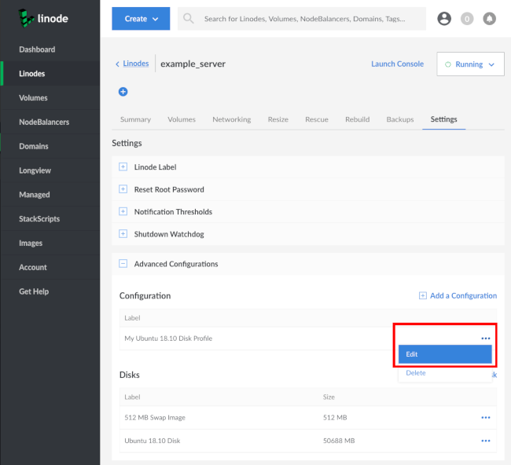

---
author:
  name: Linode
  email: docs@linode.com
description: 'What is Network Helper and how to use it.'
keywords: ["network helper", "static"]
license: '[CC BY-ND 4.0](https://creativecommons.org/licenses/by-nd/4.0)'
modified: 2019-01-07
published: 2014-12-08
modified_by:
  name: Linode
title: Network Helper
aliases: ['platform/network-helper-new-manager/']
classic_manager_link: platform/network-helper-classic-manager/
---

## What is Network Helper?

Network Helper is a host-side service which automatically sets a static IPv4 address and gateway for your Linode. This means you do not need to manually reconfigure your Linode's network addressing when you:

 - Deploy a Linode
 - Add a public or private IPv4 address
 - Restore from a backup
 - Migrate your Linode to a new data center
 - Clone from another Linode

Network Helper is enabled by default, and works by detecting which distribution is booting and then modifying the appropriate network configuration files. If Network Helper is unable to determine the operating system during boot, or if you boot an unsupported operating system, Network Helper will not attempt to write any new configuration files. Be aware that Network Helper configures only IPv4 addressing; your Linode's IPv6 address is assigned by SLAAC.


If you instead choose to manually configure your Linode's network interface settings, be the IPv4 or IPv6, you must disable Network Helper for that Linode or your configuration will overwritten during the next boot.


## Network Helper Settings

 Network Helper can be enabled or disabled globally for your account, or on a per-Linode basis. Network Helper can still be toggled on and off for specific Linodes, regardless of whether enabled or disabled globally.

### Global

When Network Helper is enabled globally, all new Linodes created on your account will have Network Helper enabled by default.

1.  Click on **Account** in the sidebar of the [Linode Cloud Manager](https://cloud.linode.com).

1.  Click on the **Global Settings** tab. Set the switch under the **Network Helper** section to the desired setting. Blue is enabled, gray is disabled.

    

1. Click the **Save** button.

### Single (Per-Linode)

1.  Click on **Linodes** link in the sidebar of the Linode Cloud Manager.

1.  Click on the **more options ellipsis** for the Linode for which you want to enable Network Helper. Then, click **Settings**.

    

1.  From the Linode's Dashboard screen, click the tab labeled **Advanced**.  Next, click on the **more options ellipsis** for your Disk Profile. From the menu, select **Edit**:

    

1.  A menu will appear with that configuration profile's settings. Under the **Filesystem/Boot Helpers** section, toggle the **Auto-configure networking** switch  to the desired setting. Blue is enabled, gray is disabled.

    

1. Click **Submit**.

## What Files are Modified

The specific files Network Helper modifies varies by distribution.

### Arch & Ubuntu (18.04 LTS and later)

Network Helper configures `/etc/systemd/network/05-eth0.network`.

### CentOS & Fedora

Network Helper configures `/etc/sysconfig/network-scripts/ifcfg-eth0`.

### Debian & Ubuntu (versions before 18.04 LTS)

Network helper configures `/etc/network/interfaces` and `/etc/resolv.conf`.

### Gentoo

Network Helper configures `/etc/conf.d/net` and `/etc/resolv.conf`.

### OpenSUSE

Network Helper configures `/etc/sysconfig/network/ifcfg-eth0`, `/etc/sysconfig/network/routes`, and `/etc/resolv.conf`.

### Slackware

Network Helper configures `/etc/rc.d/rc.inet1.conf` and `/etc/resolv.conf`.

## What is Modified in Those Files

Below are example network configuration files for a Debian 9 Linode with Network Helper enabled:


# Generated by Linode Network Helper
# Wed Jan  9 21:30:02 2019 UTC
#
# This file is automatically generated on each boot with your Linode's
# current network configuration. If you need to modify this file, please
# first disable the 'Auto-configure Networking' setting within your Linode's
# configuration profile:
#  - https://manager.linode.com/linodes/config/lin1?id=13561415
#
# For more information on Network Helper:
#  - https://www.linode.com/docs/platform/network-helper
#
# A backup of the previous config is at /etc/network/.interfaces.linode-last
# A backup of the original config is at /etc/network/.interfaces.linode-orig
#
# /etc/network/interfaces

auto lo
iface lo inet loopback

auto eth0
allow-hotplug eth0

iface eth0 inet6 auto

iface eth0 inet static
    address 203.0.113.5/24
    gateway 203.0.113.1



# Generated by Linode Network Helper
# Wed Jan  9 21:30:02 2019 UTC
#
# This file is automatically generated on each boot with your Linode's
# current network configuration. If you need to modify this file, please
# first disable the 'Auto-configure Networking' setting within your Linode's
# configuration profile:
#  - https://manager.linode.com/linodes/config/lin1?id=13561415
#
# For more information on Network Helper:
#  - https://www.linode.com/docs/platform/network-helper
#
# A backup of the previous config is at /etc/.resolv.conf.linode-last
# A backup of the original config is at /etc/.resolv.conf.linode-orig
#
domain members.linode.com
search members.linode.com
nameserver 66.228.53.5
nameserver 96.126.122.5
nameserver 96.126.124.5
nameserver 96.126.127.5
nameserver 198.58.107.5
nameserver 198.58.111.5
nameserver 23.239.24.5
nameserver 173.255.199.5
nameserver 72.14.179.5
nameserver 72.14.188.5


In addition to the network interface file (again, specific to this Debian example), Network Helper will create:

- A copy of the interface and resolver file as the distribution provided it: `.interfaces.linode-orig` and `/etc/.resolv.conf.linode-orig`. Note that Network Helper does not modify `/etc/resolv.conf` on all of our distributions.

- A copy of the interface and resolver files from the previous boot: `.interfaces.linode-last` and `/etc/.resolv.conf.linode-last`. If you manually changed either of these file before the previous boot, you'll find them saved there.

Use the following command to restore manual changes made before the previous reboot. Be sure to replace `/etc/network/interfaces` with the network interface file for your distribution from [above](#what-files-are-modified).

    mv /etc/network/.interfaces.linode-last /etc/network/interfaces
