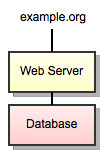
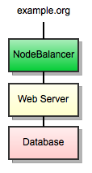
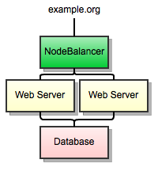
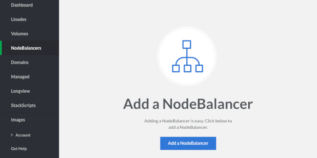
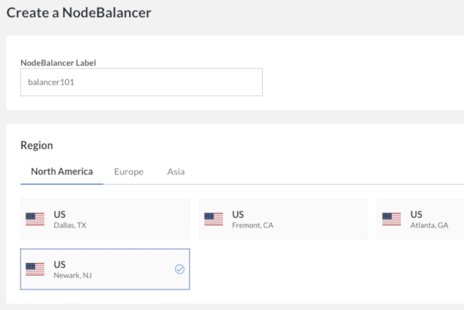
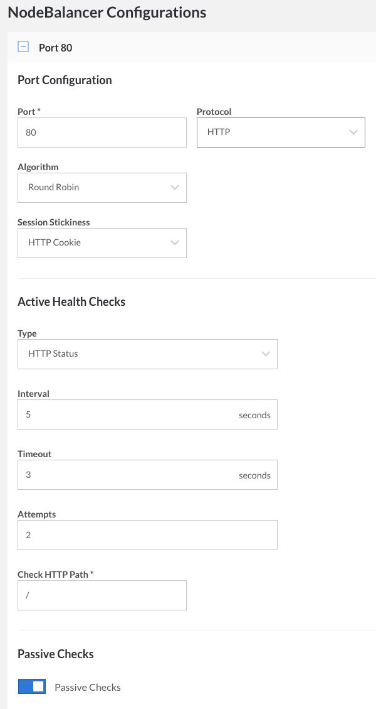
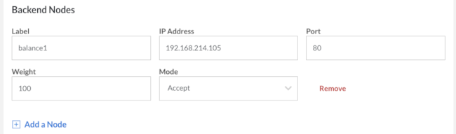
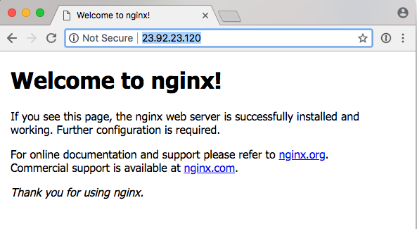
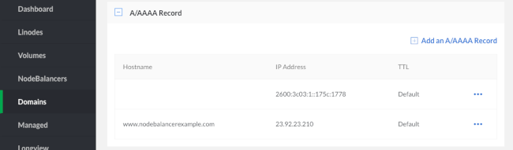
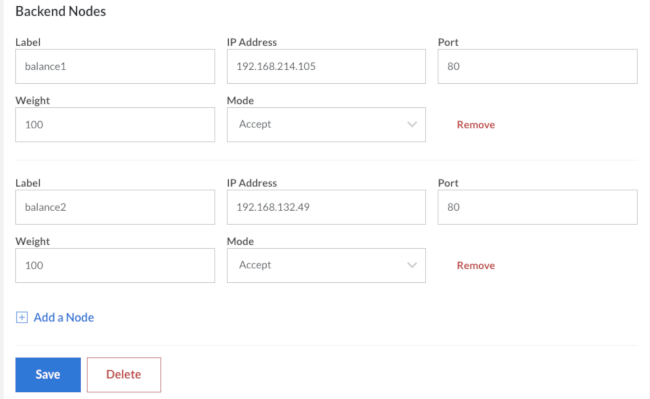

---
author:
  name: Linode
  email: docs@linode.com
description: 'Using a NodeBalancer to begin managing a simple web application.'
keywords: ["nodebalancers", "nodebalancer", "load balancers", "load balancer", "load balancing", "high availability", "ha"]
license: '[CC BY-ND 4.0](https://creativecommons.org/licenses/by-nd/4.0)'
aliases: ['nodebalancers/getting-started/','linode-platform/nodebalancer-howto/','platform/nodebalancer/getting-started-with-nodebalancers-new-manager/']
modified: 2018-08-21
modified_by:
  name: Linode
published: 2015-02-12
title: Getting Started with NodeBalancers
classic_manager_link: platform/nodebalancer/getting-started-with-nodebalancers-classic-manager/
---

Nearly all applications that are built using Linodes can benefit from load balancing, and load balancing itself is the key to expanding an application to larger numbers of users. Linode now provides NodeBalancers, which can ease the deployment and administration of a load balancer.

NodeBalancers are built for high availability and designed to be "set and forgotten". The most difficult part of transitioning to a NodeBalancer is simply making sure your application works well in the new environment. In this guide, we will examine a common use case: using a NodeBalancer to load balance a website and prepare it for scaling to thousands of users.

This guide provides a high-level overview of transitioning to a NodeBalancer, but it's outside this page's scope to explain each application a NodeBalancer could balance. For more information on various applications that might be useful behind NodeBalancer, see the rest of Linode Guides & Tutorials.

## Overview

A NodeBalancer listens on a public IP address for incoming connections, then uses configurable rules to select a backend node (out of one or more) to which to send the connection. In HTTP mode, NodeBalancers can reach into the incoming web request and make decisions based on it.

A NodeBalancer allows the incoming load to your application to be spread over any number of Linodes. This, however, comes with new challenges: many web applications have sessions that do not exist outside of the backend node. For this reason, NodeBalancers allow you to specify that the same client should land on the same backend Linode.

As an example, this guide will start with a typical, simple web application.

There are a few drawbacks to making this application scale, namely that any modifications require updating DNS (which takes time) or inflicting users with downtime. NodeBalancers can bring administrative ease to this application by becoming its front face.

Now, backend Linodes can be added or removed to the work load seamlessly, without end users noticing any downtime.

Additionally, NodeBalancer will watch each backend for failure, rerouting users to working backends transparently and without any manual intervention.

## Configuring a NodeBalancer

Sticking with the simple web application example above, the backend Linode currently powering it must have a private IP address. If it does not, add one now -- this will also be a good opportunity to do the same for the database server, since private network traffic is unbilled. Reboot if necessary, and configure your web application to respond on the private IP address, if it is not already.

1.  Visit the NodeBalancers page in the Linode Cloud Manager and select **Add a NodeBalancer**.

    

1.  For the example web application, only one NodeBalancer is needed. Add one in the same data center that your backend Linodes are located in.

    

1.  A NodeBalancer is configured using ports, and let's say our example web application uses only one: port 80 for regular HTTP traffic.

    

    **HTTP**

    For the traditional web application, the settings in the screenshot above are a good start. HTTP cookie stickiness is preferred so that the same client will always land on the same backend -- for a simple web application that keeps sessions in memory, this is necessary to avoid session errors on clients.

    **HTTPS**

    If you select the HTTPS protocol, two new fields will appear where you can add your SSL certificate, chained certificates (if applicable) and a private key (which must not have passphrase protection).

    Every ten seconds, the NodeBalancer will request the root of the web application and look for a valid response code. With our example setup, there is only one backend node (which we will add shortly); if the backend goes down, the NodeBalancer will serve a plain 503 Service Unavailable error page. This is more desirable than refusing connections or making browsers wait for a timeout.

1.  Now we must add the single backend node to the NodeBalancer's configuration. Point this at the private IP address of your web server Linode.

    

    These configuration changes will take a few moments to be reflected by your NodeBalancer. If everything is configured on your backend correctly, once the changes have gone through, the **Node Status** column will update to **1 up / 0 down**.

    

    If the backend status reports **0 up / 1 down**, check to make sure that your web application is configured to respond on the Linode's private IP address.  You do this by adding the private IP address to your /etc/hosts file on your Linode and then reboot your Linode. There might be a virtual host mismatch as well -- check the notes in the next section.

1.  Now that the backend is up, go directly to your NodeBalancer's IP address in a browser. You should see your web application as the NodeBalancer proxies the traffic through.

    

### A Note about Virtual Hosts

You might not see the web application that you expect when you go directly to the NodeBalancer's IP address. This is due to virtual hosts, and is not an issue unique to NodeBalancers. In the default configurations of many web servers, an application might only be configured to respond for certain hostnames. This can impact testing NodeBalancers as well as the behavior of their health checks.

It is important to configure the "default" virtual host in your web server to point at something useful. NodeBalancer will pass the Host header from a browser untouched, so virtual hosts will work entirely normally once you are pointing a domain at the NodeBalancer. It is only mentioned here because testing NodeBalancers can demonstrate quirks in a web server's configuration, particularly when browsing by the NodeBalancer's IP address.

 
Health checks are transmitted with a Host header (in HTTP/1.0 mode).


## Putting the NodeBalancer in Charge

Your NodeBalancer is now working and is able to pass traffic to your web application. It is important to note at this point that configuring the NodeBalancer has not impacted your application's normal operations at all -- you can test the NodeBalancer without your users ever knowing.

Once you are satisfied that NodeBalancer is working normally, you can switch your web application's traffic over to it through DNS.

1.  On the NodeBalancer's overview, you can see its IP address. Take note of the IP address, to use in the A record for your domain.

1.  Edit or create an A record for your website's domain name, pointing to your NodeBalancer's IP address.

    

    Also add an AAAA record for the IPv6 address.

Once the DNS changes propagate, traffic will begin flowing through the NodeBalancer. At this point, you will want to wait at least 24 hours for all caches to catch up to the NodeBalancer before proceeding.

# Additional NodeBalancers and Features

On another Linode, make an exact copy of your current web server. The Linode backups service can be instrumental for doing so, as a snapshot can be restored to any other Linode. Once you have another backend ready, simply repeat step four of [Configuring a NodeBalancer](/docs/platform/nodebalancer/getting-started-with-nodebalancers/#configuring-a-nodebalancer) to add it to the NodeBalancer configuration.

Once the configuration is sent to the backend, users will be balanced over the two Linodes and each will be monitored for health. This configuration is very easy to work with, as upgrades can be rolled out to each backend without disrupting service and backends can be taken in and out of rotation at will.

This is just the beginning; NodeBalancers are extremely flexible and cater to a lot of needs. From here, the API can be used to add many backends. Multiple ports on one backend can be balanced for complex setups. Additionally, new tools like *memcached* can be introduced to the application to allow session stickiness to become irrelevant.

# Limitations

Nodebalancers do have a maximum connection limit of 10,000 concurrent connections.
