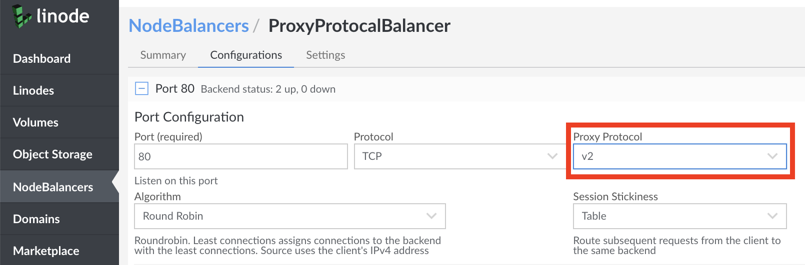

---
author:
  name: Linode
  email: docs@linode.com
description: 'Using Proxy Protocol on Your NodeBalancer.'
og_description: 'Enable Proxy Protocol on a NodeBalancer'
keywords: ["nodebalancers", "nodebalancer", "load balancers", "load balancer", "load balancing", "high availability", "ha", "proxy protocol", "proxy"]
tags: ["cloud manager","linode platform","networking","web applications"]
license: '[CC BY-ND 4.0](https://creativecommons.org/licenses/by-nd/4.0)'
modified: 2018-08-21
modified_by:
  name: Linode
published: 2015-02-12
title: Using Proxy Protocol with NodeBalancers
---

By default when using Linode's NodeBalancers to balance traffic, it is normal to observe traffic on the server's themselves coming directly from the NodeBalancer as opposed to the information related to the actual clients requesting data from your backend servers. While this is fine for some environments, in many cases it is necessary to handle client information on the backend servers. For this reason, NodeBalancers support **Proxy Protocol**.

## What is Proxy Protocol

[Proxy protocol](http://www.haproxy.org/download/1.8/doc/proxy-protocol.txt) is an internet protocol generally used in various high availability and load balancing solutions to carry information from a client directly to backend servers. Currently, there are two different versions of Proxy Protocol available, `v1` and `v2`.

When using TCP as your selected protocol, **Proxy Protocol** can be used to add a header with information regarding client information to backend Linodes, instead of only showing information related to the connecting NodeBalancer. Proxy Protocol can be used via two different selectable versions:

  - **v1**: Proxy Protocol v1 adds a human readable string to all requests, similar to the following:
    
PROXY TCP4 68.80.83.127 45.79.247.228 56147 80
    

    The syntax for this output is as follows:

    
PROXY, PROTOCOL, CLIENT_IP, NODEBALANCER_IP, CLIENT ORIGIN PORT, NODEBALANCER PORT


  - **v2**: Proxy Protocol v2 adds a header with more specialized binary data, which will appear similar to the following output:

\r\n\r\n\x00\r\nQUIT\n!\x11\x00\x0c\xach\x11\x05\xcf\xc0D8\xfe\x1e\x04\xd2


## Configuring Proxy Protocol

To enable Proxy protocol for your Linode's NodeBalancer:

1.  Visit the NodeBalancers page in the Linode [Cloud Manager](http://cloud.linode.com).

1. Select the NodeBalancer you'd like to add ProxyProtocol to, or [Create and Configure a New One](https://www.linode.com/docs/platform/nodebalancer/nodebalancer-reference-guide/#adding-a-nodebalancer) using TCP mode.

1. Select the `Cofigurations` tab for your NodeBalancer followed by the configuration you will be enabling Proxy Protocol for.

1. Ensure that the `Protocol` option is set to `TCP`, and the `Proxy Protocol` dropdown menu will appear. Select the version of Proxy Protocol version you would like to use.

    

1. Click the `Save` button on the bottom of the page to Save your changes.

