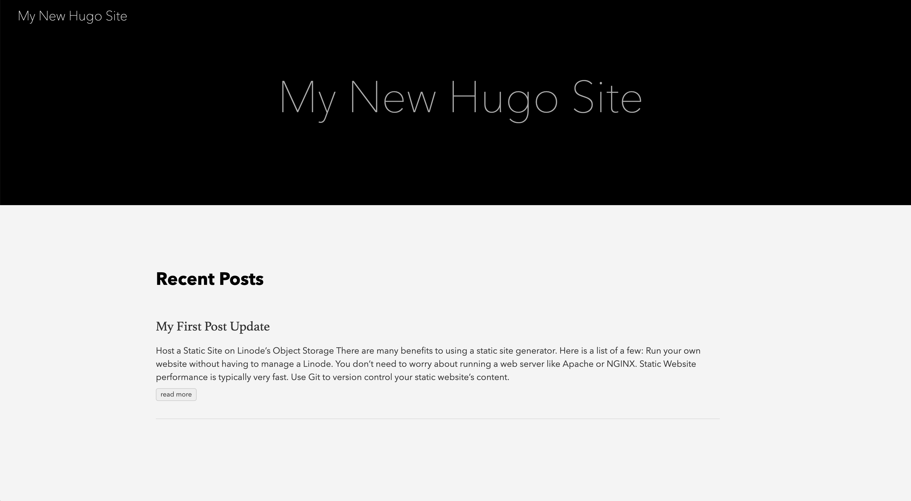

---
author:
  name: Linode Community
  email: docs@linode.com
description: "Host a Static Site using Linode\'s Object Storage."
keywords: ['list','of','keywords','and key phrases']
license: '[CC BY-ND 4.0](https://creativecommons.org/licenses/by-nd/4.0)'
published: 2019-04-09
modified: 2019-04-09
modified_by:
  name: Linode
title: "Host a Static Site using Linode's Object Storage"
contributor:
  name: Linode
external_resources:
- '[s3cmd Options and Commands](https://s3tools.org/usage)'
- '[s3cmd Sync How-To](https://s3tools.org/s3cmd-sync)'
---

Object Storage is currently in a closed early access Beta, and as such you may not have access to Object Storage through the Cloud Manager or other tools. To gain access to the Early Access Program (EAP), visit the Linode EAP page.

Additionally, because Object Storage is in Beta, there may be breaking changes to how you access and manage Object Storage. This guide will be updated to reflect these changes if and when they occur.


Static site generators are a popular solution for creating simple, fast, flexible, and attractive websites. You create your site content using markdown, an easy-to-learn and light-weight markup language and the static site generator handles converting your markdown files into static HTML files.

Using Object Storage to host your static site means you do not have to worry about maintaining your site's infrastructure as you might when hosting a site on a traditional server. It is no longer necessary to perform typical server maintenance tasks, like software and package upgrades, web server configuration, and security upkeep. Object storage provides an HTTP REST gateway to objects, which means a unique URL over HTTP is available for every bucket object. Once your static site is built, making it available publicly over the internet is as easy uploading files to an Object Storage bucket.

At a high-level, the required steps to host a static site using Object Storage are:

1. Install the static site generator of your choice to your local computer.
1. Create the desired content and build the site.
1. Upload the static files to your Object storage bucket to make the content publicly available over the internet.

This guide will use [Hugo](https://gohugo.io/) to demonstrate how to create a static site and host it on Linode's Object Storage. However, there are many static site generators to choose from --[Jekyll](https://jekyllrb.com/) and [Gatsby](https://www.gatsbyjs.org/) are other popular choices. The general steps outlined in this guide can be applied to host any static site on Linode's Object Storage. For more information on choosing a static site generator, see the [How to Choose a Static Site Generator](/docs/websites/static-sites/how-to-choose-static-site-generator/) guide.

## Before You Begin

1. Ensure you have read the How to Use Object Storage guide to familiarize yourself with Object Storage on Linode. Be sure you have completed the following steps outlined in that guide:

    - Created your Object Storage access and secret keys.
    - Installed [s3cmd CLI](https://s3tools.org/download).

1. [Install and configure Git](https://linode.com/docs/development/version-control/how-to-install-git-and-clone-a-github-repository/#install-and-configure-git) on your local computer.

## Install the Hugo Static Site Generator

Hugo is written in [Go](https://golang.org/) and known for being extremely fast. It is well-supported, [well-documented](https://gohugo.io/documentation/) and has an [active community](https://discourse.gohugo.io/). Some useful Hugo features include *shortcodes*, an easy way to include predefined templates inside of your markdown, and built-in *LiveReload*, which allows you to preview your site changes locally as you make them.

1. Install the Hugo static site on your computer:

    **macOS**

    - Use the Homebrew package manager for macOS to install Hugo:

            brew install hugo

    **Linux/Ubuntu**

    - Determine your Linux kernel's architecture:

            uname -r

        Your output will resemble the following:

        
      4.9.0-8-amd64
        

    - Navigate to [Hugo's GitHub releases page](https://github.com/gohugoio/hugo/releases) download the appropriate version for your platform.

            wget https://github.com/gohugoio/hugo/releases/download/v0.55.0/hugo_0.55.0_Linux-64bit.deb

    - Install the package using `dpkg`:

            sudo dpkg -i hugo*.deb

1. Verify that Hugo has installed. You should see an output indicating your installed Hugo's version number:

        hugo version

## Create a Hugo Site

In this section, you will use the [Hugo CLI](https://gohugo.io/commands/) (command line interface) to create your Hugo site, initialize a Hugo theme, and add content. Hugo's CLI provides several useful commands for common tasks needed to build, configure, and interact with your Hugo site.

1. Create a new Hugo site on your local computer:

        hugo new site example-site

1. Move into your Hugo site's root directory. All commands in this section of the guide should be issued from your site's root directory.

        cd example-site

1. You will use Git to add a theme to your Hugo site's directory. Initialize your Hugo site's directory as a Git repository:

        git init

1. Install the [Ananke theme](https://github.com/budparr/gohugo-theme-ananke) as a submodule of your Hugo site's Git repository. [Git submodules](https://git-scm.com/book/en/v2/Git-Tools-Submodules) allow one Git repository to be stored as a subdirectory of another Git repository, while still being able to treat each repository separately. Note that the Ananke theme's repository will be located in the `~/example-site/themes/ananke` directory of your Hugo site.

        git submodule add https://github.com/budparr/gohugo-theme-ananke.git themes/ananke

    Hugo has many [available themes](https://themes.gohugo.io/) that can be installed as a submodule of your Hugo site's directory.

1. Add the theme to your Hugo site's configuration file. The configuration file is located at the root of your Hugo site's directory.

        echo 'theme = "ananke"' >> config.toml

      To learn more about configuring Hugo, see their [official documentation](https://gohugo.io/getting-started/configuration/).

1. Create a new content file for your site. This command will generate a markdown file with an auto-populated date and title.

        hugo new posts/my-first-post.md

    You should see a similar output. Note that the file is located in the `content/posts/` directory of your Hugo site:

    
    /home/username/example-site/content/posts/my-first-post.md created
    

1. Open the markdown file in the text editor of your choice to begin modifying its content. You will notice that the file contains *front matter*, which is metadata embedded in your content file within opening and closing `---`.

    Front matter is a powerful Hugo feature that provides a mechanism for passing data that is attached to a specific piece of content to Hugo's rendering engine. Hugo accepts front matter in TOML, YAML, and JSON formats. In this example, there is YAML front matter for the title, date, and draft state of the markdown file.

    Set your desired value for `title`. Then, set the `draft` state to `false` and add your content below the `---` in markdown syntax. The example below contains updated front matter with some example markdown. To learn markdown, consult [Hugo's suggested reading list](https://gohugo.io/content-management/formats/).:

    
---
title: "My First Post"
date: 2019-04-11T11:25:11-04:00
draft: false
---

# Host a Static Site on Linode's Object Storage

There are many benefits to using a static site generator. Here is a list of a few of them:

- Run your own website without having to manage a Linode.
- You don't need to worry about running a web server like Apache or NGINX.
- Static website performance is typically very fast.
- Use Git to version control your static website's content.
    

1. Once you have added the desired content, you can preview your changes by building and serving the site using Hugo's built-in webserver:

        hugo server

    You will see a similar output:

    
&nbsp&nbsp&nbsp&nbsp&nbsp&nbsp&nbsp&nbsp&nbsp&nbsp&nbsp&nbsp&nbsp&nbsp&nbsp&nbsp&nbsp&nbsp&nbsp| EN
+------------------+----+
  Pages            | 11
  Paginator pages  |  0
  Non-page files   |  0
  Static files     |  3
  Processed images |  0
  Aliases          |  1
  Sitemaps         |  1
  Cleaned          |  0

Total in 7 ms
Watching for changes in /Users/lsalazar/hugo-obj/{content,data,layouts,static,themes}
Watching for config changes in /Users/lsalazar/hugo-obj/config.toml
Serving pages from memory
Running in Fast Render Mode. For full rebuilds on change: hugo server --disableFastRender
Web Server is available at http://localhost:1313/ (bind address 127.0.0.1)
Press Ctrl+C to stop
    

    The output will provide a url to preview your site. Copy and paste the url into a browser to access the site. In the above example Hugo's web server url is `http://localhost:1313/`.

1. When you are happy with your site's content you can *build* your site. This means Hugo will generate your site's static HTML files and store them in a `public` directory that it will create. The static files that are generated by Hugo are the files that you will upload to your Object Storage bucket to make your site accessible via the internet.

          hugo -v

    View the contents of your site's `public` directory:

          ls public

    Your output should resemble the following example. When you built the site, the markdown file you created and edited in steps 6 & 7 was used to generate its corresponding static HTML file in the `public/posts/my-first-post/index.html` directory.

    
  404.html    categories  dist        images      index.html  index.xml   posts       sitemap.xml tags
    

    
  While it is not necessary to version control your local Hugo site files with Git in order to host a static site on Linode's Object Storage, it is recommended to do so.

  1. Display the state of your current working directory (root of your Hugo site):

        git status

  1. Stage all your files to be committed:

        git add -A

  1. Commit all your changes and add a meaningful commit message:

        git commit -m 'Add my first post.'

  Once you have used Git to track your local Hugo site files, you can easily push them to a remote Git repository, like [GitHub](https://github.com/) or [GitLab](https://about.gitlab.com/). Storing your static site files on a remote Git repository opens up many possibilities for collaboration and automating your static site's deployment to Linode's Object storage. To learn more about Git, see the [Getting Started with Git](/docs/development/version-control/how-to-configure-git/) guide.
    

## Upload your Static Site to Linode's Object Storage

Before proceeding with this section ensure that you have already created your Object Storage access and secret keys and have installed the s3cmd CLI.

1. Create a new Object Storage bucket:

        s3cmd mb my-bucket

1. Initialize your Object Storage bucket as a website. You must tell your bucket which file to server as the index page and the error page for your static site. This is done with the `--ws-index` and `--ws-error` options. In our Hugo example, the site's index file is `index.html` and the error file is `404.html`. Whenever a user visits your static site's URL, the Object Storage service will serve the `index.html` page. If a site visitor tries to access an invalid path, they will be presented with the `404.html` page.

        s3cmd ws-create --ws-index=index.html --ws-error=404.html s3://my-bucket

    The command will return the following message:

      
    Bucket 's3://my-bucket/': website configuration created.
      

1. Display information about your Object Storage's website configuration to obtain your site's URL:

        s3cmd ws-info s3://my-bucket

    You should see a similar output. Be sure to take not of your Object Storage bucket's URL:

    
      Bucket s3://ss-6/: Website configuration
Website endpoint: http://my-bucket.alpha-website.linodeobjects.com/
Index document:   index.html
Error document:   404.html
    

    
  Linode's Object Storage early access Beta provides SSL enabled by default. This means you can access your Object Storage bucket using `https`, as well.
    

1. Use s3cmd's `sync` command to upload the contents of your static site's `public` directory to your Object storage bucket. This step will make your site available publicly on the internet. Ensure you are at your site's root directory `/home/user/example-site`.

        s3cmd --no-mime-magic --acl-public --delete-removed --delete-after sync public/ s3://my-bucket

    The following options are added to the sync command:
    - `no-mime-magic`: tells Object Storage not to use file signatures when guessing the object's MIME-type.
    - `acl-public`: this sets the access level control of the objects to public.
    - `delete-removed`: deletes any destination objects with no corresponding source file.
    - `delete-after`: deletes destination files that are no longer found at the source after all files are uploaded to the bucket.

1. Use a browser to navigate to your Object Storage bucket's URL to view your Hugo site:

      

    If needed, you can continue to update your static site locally and upload any changes using s3cmd's `sync` command from step 3 of this section.

## *Optional* Next Steps

After uploading your static site to Linode's Object Storage, you may want to use a custom domain for your site. To do this, you can add a CNAME entry to your domain's DNS record that aliases it to your Object Storage bucket's URL. To learn about DNS records on Linode, see the [DNS Records: An Introduction](/docs/networking/dns/dns-records-an-introduction/) guide.

