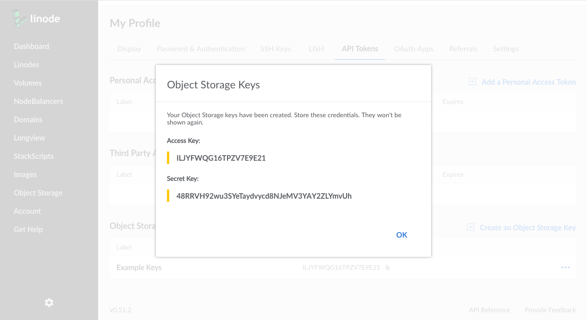

---
author:
  name: Linode Community
  email: docs@linode.com
description: "Get started using Linode's Object Storage."
keywords: ['object','storage','bucket']
license: '[CC BY-ND 4.0](https://creativecommons.org/licenses/by-nd/4.0)'
published: 2019-04-12
modified: 2019-04-12
modified_by:
  name: Linode
title: "How to Use Linode Object Storage"
contributor:
  name: Linode
external_resources:
- '[S3cmd usage and command reference](https://s3tools.org/usage)'
---


Object Storage is currently in a closed early access Beta. You may not have access to Object Storage through the Cloud Manager or other tools. Additionally, there may be breaking changes to how you access and manage Object Storage while it is in beta. This guide will be updated to reflect these changes if and when they occur. To gain access to the Early Access Program (EAP), visit the Linode EAP page.


Linode's Object Storage is a globally-available, S3- and Swift-compatible method for storing and accessing data. Object Storage differs from traditional hierarchical data storage (as in a Linode's disk) and [Block Storage Volumes](https://www.linode.com/docs/platform/block-storage/). Under Object Storage, files (also called *objects*) are stored in flat data structures (referred to as *buckets*) alongside their own rich metadata.

Additionally, **Object Storage does not require the use of a Linode.** Instead, Object Storage gives each object a unique URL with which you can access your data. An object can be publicly accessible, or you can set it to be private and only visible to you. This makes Object Storage great for sharing and storing unstructured data like images, documents, archives, streaming media assets, and file backups, and the amount of data you store can range from small collections of files up to massive libraries of information. Lastly, Linode Object Storage has the built-in ability to host a [link to SSG Object Storage guide]().

Below you will find instructions on how to connect to Object Storage, and how to upload and access objects:

1.  First, you'll need to create a [*key pair*](#object-storage-key-pair) to access the service.

1.  Then, you'll use choose from a variety of available [first-party and third-party tools](#object-storage-tools) to access and use the service.

## Object Storage Key Pair

The first step towards using Object Storage is to create a pair of keys for the service. This pair is composed of an *access key* and a *secret key*:

-   The access key allows you to access any objects that you set to have private read permissions.

    
To use your access key when viewing a private object, you first need to generate a *signed* URL for the object. The signed URL is much like the standard URL for your object, but some extra URL parameters are appended to it, including the access key. Instructions for generating a signed URL can be found for each of the tools outlined in this guide.


-   Your secret key is used together with your access key to authenticate the various Object Storage tools with your Linode account. You should not share the secret key.

    
Each Object Storage key pair on your Linode account has complete access to all of the buckets on your account.


### Generate a Key Pair

1.  Log in to the [Linode Cloud Manager](https://cloud.linode.com).

    
Object Storage is not available in the Linode Classic Manager.


1.  Click on the **Object Storage** link in the sidebar, click the **Access Keys** tab, and then click the **Create an Access Key** link.

    

1.  The **Create an Access Key** menu will appear.

    

1.  Enter a label for the key pair. This label will be how you reference your key pair in the Linode Cloud Manager. Then, click **Submit**.

1.  A window will appear that contains your access key and your secret key. Write these down somewhere secure. The access key will be visible in the Linode Cloud Manager, but **you will not be able to retrieve your secret key again once you close the window.**

    

    You now have the credentials needed to connect to Linode Object Storage.

## Object Storage Tools

There are a number of tools that are available to help manage Linode Object Storage. This guide explains how to install and use the following options:

-   The [Linode Cloud Manager](#cloud-manager) can be used to create buckets (you are currently not able to upload objects to a bucket from the Cloud Manager).

-   [s3cmd](#s3cmd) is a powerful command line utility that can be used with any S3-compatible object storage service, including Linode's. s3cmd can be used to create and remove buckets, add and remove objects, convert a bucket into a static site from the command line, plus other functions like syncing entire directories up to a bucket.

-   [Cyberduck](#cyberduck) is a graphical utility available for Windows and macOS and is a great option if you prefer a GUI tool.

## Cloud Manager

### Create a Bucket

The Cloud Manager provides a web interface for creating buckets. To create a bucket:

1.  If you have not already, log in the [Linode Cloud Manager](https://cloud.linode.com).

1.  Click on the **Object Storage** link in the sidebar, and then click on **Add a Bucket**.

    

1.  The **Create a Bucket** menu will appear.

    

1.  Add a label for your bucket. A bucket's label needs to be unique within the cluster that it lives in, and this includes buckets of the same name on different Linode accounts. If the label you enter is already in use, you will have to choose a different label.

1.  Choose a cluster location for the bucket to reside in.

1.  Click **Submit**. You are now ready to upload objects to your bucket using one of the other tools outlined in this guide.

## s3cmd

s3cmd is a command line utility that you can use for any S3-compatible Object Storage.

### Install and Configure s3cmd

1.  s3cmd can be downloaded using `apt` on Debian and Ubuntu, and [Homebrew](https://brew.sh/) on macOS. To download s3cmd using Homebrew, run the following command:

        brew install s3cmd

    
On macOS, s3cmd might fail to install if you do not have XCode command line tools installed. If that is the case, run the following command:

    xcode-select --install

You will be prompted to agree to the terms and conditions.


    To install s3cmd on Debian or Ubuntu, run the following command:

        apt install s3cmd

1.  Once s3cmd has been installed, you will need to configure it:

        s3cmd --configure

    You will be presented with a number of questions. To accept the default answer that appears within the brackets, press enter. Here is an example of the answers you will need to provide:

        Access Key: 4TQ5CJGZS92LLEQHLXB3
        Secret Key: enteryoursecretkeyhere
        Default Region: US
        S3 Endpoint: us-east-1.linodeobjects.com
        DNS-style bucket+hostname:port template for accessing a bucket: us-east-1.linodeobjects.com
        Encryption password: YOUR_GPG_KEY
        Path to GPG program: /usr/local/bin/gpg
        Use HTTPS protocol: False
        HTTP Proxy server name:
        HTTP Proxy server port: 0

    
It is not necessary to supply a GPG key when configuring s3cmd, though it will allow you to store and retrieve encrypted files. If you do not wish to configure GPG encryption, you can leave the `Encryption password` and `Path to GPG program` fields blank.


1.  When you are done, enter `Y` to save your configuration.

    
s3cmd offers a number of additional configuration options that are not presented as prompts by the `s3cmd --configure` command. One of those options is `website_endpoint`, which instructs s3cmd on how to construct an appropriate URL for a bucket that is hosting a static site, similar to the `S3 Endpoint` in the above configuration. This step is optional, but will ensure that any commands that contain your static site's URL will output the right text. To edit this configuration file, open the `~/s3.cfg` file on your local computer:

    nano ~/.s3cfg

Scroll down until you find the `website_endpoint`, then add the following value:

    http://%(bucket)s.website-us-east-1.linodeobjects.com/



You are now ready to use s3cmd to create a bucket in Object Storage.

### Create a Bucket with s3cmd

You can create a bucket with s3cmd issuing the following `mb` command, replacing `my-example-bucket` with the name of the bucket you would like to create. Bucket names need to be unique within the same cluster, including buckets on other Linode accounts. If you choose a name for your bucket that someone else has already created, you will have to choose a different name:

    s3cmd mb s3://my-example-bucket

To remove a bucket, you can use the `rb` command:

    s3cmd rb s3://my-example-bucket


To delete a bucket that has files in it, include the `--recursive` (or `-r`) option *and* the `--force` (or `-f`) option. Use caution when using this command:

    s3cmd rb -r -f s3://my-example-bucket/


### Upload, Download, and Delete an Object with s3cmd

1.  As an example object, create a text file and fill it with some example text.

        echo 'Hello World!' > example.txt

1.  Now, transfer the text file object to your bucket using s3cmd's `put` command, replacing `my-example-bucket` with the label of the bucket you gave in the last section:

        s3cmd put example.txt s3://my-example-bucket -P

    
The `-P` flag at the end of the command instructs s3cmd to make the object public. To make the object private, which means you will only be able to access it from a tool such as s3cmd, simply leave the '-P' flag out of the command.


    
If you chose to enable encryption when configuring s3cmd, you can store encrypted objects by supplying the `-e` flag:

    s3cmd put -e encrypted_example.txt s3://my-example-bucket


1.  The object will be uploaded to your bucket, and s3cmd will provide a public URL for the object:

        upload: 'example.txt' -> 's3://my-example-bucket/example.txt'  [1 of 1]
        13 of 13   100% in    0s   485.49 B/s  done
        Public URL of the object is: http://us-east-1.linodeobjects.com/my-example-bucket/example.txt

    
The URL for the object that s3cmd provides is one of two valid ways to access your object. The first, which s3cmd provides, places the name of your bucket after the domain name. You can also access your object by affixing your bucket name as a subdomain: `http://my-example-bucket.us-east-1.linodeobjects.com/example.txt`. The latter URL is generally favored.


1.  To retrieve a file, issue the `get` command:

        s3cmd get s3://my-example-bucket/example.txt

    If the file you are attempting to retrieve is encrypted, you can retrieve it using the `-e` flag:

        s3cmd get -e s3://my-example-bucket/encrypted_example.txt

1.  To delete a file, you can issue the `rm` command:

         s3cmd rm s3://my-example-bucket/example.txt

    
To delete all files in a bucket, include the `--recursive` (or `-r`) option *and* the `--force` (or `-f`) option. Use caution when using this command:

    s3cmd rm -r -f s3://my-example-bucket/


1.  To list all available buckets, issue the `ls` command:

        s3cmd ls

1.  To list all objects in a bucket, issue the `ls` command and supply a bucket:

        s3cmd ls s3://my-example-bucket

### Create a Static Site with s3cmd

You can also create a static website using Object Storage and s3cmd:

1.  To create a website from a bucket, issue the `ws-create` command:

        s3cmd ws-create --ws-index=index.html --ws-error=404.html s3://my-example-bucket

    The `--ws-index` and `--ws-error` flags specify which objects the bucket should use to serve the static site's index page and error page, respectively.

1.  You will need to separately upload the `index.html` and `404.html` files (or however you have named the index and error pages) to your bucket:

        echo 'Index page' > index.html
        echo 'Error page' > 404.html
        s3cmd put index.html 404.html s3://my-example-bucket

1.  Your static site is accessed from a different URL than the generic URL for your Object Storage bucket. Static sites are available at the `website-us-east-1` subdomain. Using `my-example-bucket` as an example, you would navigate to `http://my-example-bucket.website-us-east-1.linodeobjects.com`.

For more information on hosting a static website with Object Storage, read our [Host a Static Site on Linode's Object Storage]() guide.

### Other s3cmd Commands

To upload an entire directory of files, you can use the the `sync` command, which will automatically sync all new or changed files. Navigate to the directory you would like to sync, then enter the following:

    s3cmd sync . s3://my-example-bucket -P

This can be useful for uploading the contents of a static site to your bucket.


The period in the above command instructs s3cmd to upload the current directory. If you do not want to first navigate to the directory you wish to upload, you can supply a path to the directory instead of the period.


## Cyberduck

Cyberduck is a desktop application that facilitates file transfer over FTP, SFTP, and a number of other protocols, including S3.

### Install and Configure Cyberduck

1.  Download Cyberduck by [visiting their website](https://cyberduck.io/).

1.  Once you have Cyberduck installed, open the program and click on **Open Connection**.

1.  At the top of the Open Connection dialog, select **Amazon S3** from the dropdown menu.

    

1.  For the Server address, enter `us-east-1.linodeobjects.com`.

1.  Enter your access key in the **Access Key ID** field, and your secret key in the **Secret Access Key** field.

1.  Click **Connect**.

You are now ready to create a bucket in Object Storage.

### Create a Bucket with Cyberduck

To create a bucket in Cyberduck:

1. Right click within the window frame, or click **Action**, then click **New Folder**:

    

1.  Enter your bucket's name and then click **Create**. Bucket names need to be unique within the same cluster, including buckets on other Linode accounts. If the name of your bucket is already in use, you will have to choose a different name.

To delete the bucket using Cyberduck, right click on the bucket and select **Delete**.

### Upload, Download, and Delete an Object with Cyberduck

1.  To upload objects with Cyberduck, you can simply drag and drop the object, or directory of objects, to the bucket you'd like to upload them to, and Cyberduck will do the rest. Alternatively, you can click on the **Action** button and select **Upload** from the menu:

    

1.  To make your objects publicly accessible, meaning that you can access them from the object's URL, you need to set the proper READ permissions. Right click on the object and select **Info**.

1.  Click on the **Permissions** tab.

1.  Click the gear icon at the bottom of the window and select **Everyone**.

    

1.  A new entry for *Everyone* will appear in the Access Control List. Next to *Everyone*, under *Permissions* column heading, select **READ** from the drop down menu.

    

    Your object is now accessible via the internet, at the URL `http://my-example-bucket.us-east-1.linodeobjects.com/example.txt`, where `my-example-bucket` is the name of your bucket, and `example.txt` is the name of your object.

1.  To download an object, right click on the object and select **Download**, or click **Download As** if you'd like to specify the location of the download.

1.  To delete an object, right click the object name and select **Delete**.

### Create a Static Site with Cyberduck

To create a static site from your bucket:

1.  Select a bucket, then right click on that bucket or select the **Action** button at the top of the menu.

1.  Click on **Info**, and then select the **Distribution (CDN)** tab.

1.  Check the box that reads **Enable Website Configuration (HTTP) Distribution**:

    

1.  You will need to separately upload the `index.html` and `404.html` files (or however you have named the index and error pages) to your bucket. Follow the instructions from the [Upload, Download, and Delete an Object with Cyberduck](#upload-download-and-delete-an-object-with-cyberduck) section to upload these files.

1.  Your static site is accessed from a different URL than the generic URL for your Object Storage bucket. Static sites are available at the `website-us-east-1` subdomain. Using `my-example-bucket` as an example, you would navigate to `http://my-example-bucket.website-us-east-1.linodeobjects.com`.

    For more information on hosting a static website with Object Storage, read our [Host a Static Site on Linode's Object Storage]() guide.

## Next Steps

There are S3 bindings available for a number of programming languages, including the popular [Boto](https://github.com/boto/boto3) library for Python, that allow you to interact with Object Storage programmatically.
