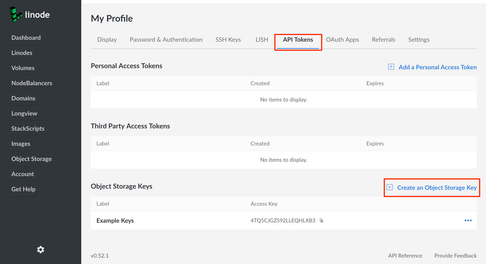

---
author:
  name: Linode Community
  email: docs@linode.com
description: "How to use Linode's Object Storage."
keywords: ['object','storage','bucket']
license: '[CC BY-ND 4.0](https://creativecommons.org/licenses/by-nd/4.0)'
published: 2019-04-12
modified: 2019-04-12
modified_by:
  name: Linode
title: "How to Use Object Storage"
contributor:
  name: Linode
external_resources:
- '[S3cmd usage and command reference](https://s3tools.org/usage)'
---


Object Storage is currently in a closed early access Beta, and as such you may not have access to Object Storage through the Cloud Manager or other tools. To gain access to the Early Access Program (EAP), visit the Linode EAP page.

Additionally, because Object Storage is in Beta, there may be breaking changes to how you access and manage Object Storage. This guide will be updated to reflect these changes if and when they occur.


Linode's Object Storage is a globally available, S3 and Swift compatible method for storing and accessing data. Object Storage differs from traditional hierarchical data storage and [Block Storage](https://www.linode.com/docs/platform/block-storage/) in that files, called *objects*, are stored in flat data structures, called *buckets*, alongside their own rich metadata. Additionally, **Object Storage does not require the use of a Linode**. Instead, Object Storage gives each object its own public URL with which you can access your data. This makes Object Storage great for sharing and storing massive amounts of unstructured data, like images, documents, archives, streaming media assets, and file backups.

Below you will find instructions on how to connect to Object Storage, and how to upload and access objects.

## Create Object Storage Access Keys

The first step towards using Object Storage is to create a set of access keys. These keys will act as a kind of password for Object Storage. To retrieve a set of access keys:

1.  Login to the [Linode Cloud Manager](https://cloud.linode.com).

    
Object Storage is not available in the Classic Manager.


1.  Navigate to the *My Profile* page by clicking on your username at the top of the screen and selecting **My Profile**. On mobile, the link is the sidebar navigation.

    

1.  Click on the **API Tokens** tab, then scroll down to the *Object Storage Keys* pane.

    

1.  Click on **Create an Object Storage Key**. The *Create an Object Storage Key* menu appears.

    

1.  Enter a label for the keys. This label will be how you reference your keys in the Linode Cloud Manager. Then, click **Submit**.

1.  A window will appear that contains your access key and your secret key. Write these down somewhere secure, as **you will not be able to retrieve your secret key again once you close the window**.

    

    You are now have the credentials needed to connect to Object Storage.

## Object Storage Tools

There are a number of tools that are available to help manage Object Storage. Currently, you can use the Linode Cloud Manager to create buckets. If you're looking for a command line utility, the [Linode CLI](#linode-cli) has an Object Storage plugin, and [s3cmd](#s3cmd) is another powerful command line utility. [Cyberduck](#cyberduck) is graphical utility available for Windows and macOS if you prefer a GUI tool. The following sections will outline how to download and install these tools, and how to manage Object Storage with them.

## Cloud Manager

### Create a Bucket

The Cloud Manager provides a web interface for creating buckets. To create a bucket:

1.  If you have not already, log in the [Linode Cloud Manager](https://cloud.linode.com).

1.  Click on **Object Storage** in the sidebar links.

    

1.  Click on **Add a Bucket**. The **Create a Bucket** menu appears.

    

2.  Add a label for your bucket. Bucket labels need to be unique within the cluster. If the label of your bucket is already in use, you will have to choose a different label.

3.  Choose a cluster for the bucket to reside in.

4.  Click **Submit**.

You are now ready to upload objects to your bucket.

## Linode CLI

The Linode Command Line Interface (CLI) is a command line utility that allows you complete control over your Linode account. With the Object Storage plugin you can create and remove buckets, upload objects, and more.

### Install and Configure

1.  Download the Linode CLI, or, if you have already downloaded it, make sure it has been upgraded to the latest version:

        pip install linode-cli --upgrade

1.  Download the Object Storage plugin for the Linode CLI by [clicking on this link](http://alpha.linodeobjects.com/lnl-demo/cli_plugin_internal_obj-1.0.4-py2.py3-none-any.whl?Signature=Ua2KJFkXw50XwISDl%2BLIOLffSlQ%3D&Expires=1555914280&AWSAccessKeyId=4X9DR4N2LFRROT8EUS6H).

1.  Navigate to the directory where the plugin has been downloaded, and install the Object Storage plugin:

        pip install cli_plugin_internal_obj-1.0.4-py2.py3-none-any.whl

1.  Register the plugin with the Linode CLI:

        linode-cli register-plugin cli_plugin_internal_obj

1.  Configure the Object Storage plugin:

        linode-cli obj --help

    You will be prompted to enter in your Object Storage access key and secret key. Once you've entered your credentials, you will be ready to create buckets and upload objects.

### Create a Bucket

To create a bucket with the Linode CLI, issue the `mb` command. Bucket names need to be unique within the cluster. If the name of your bucket is already in use, you will have to choose a different name:

    linode-cli obj mb my-example-bucket

To delete a bucket, issue the `rb` command:

    linode-cli obj rb my-example-bucket

### Upload, Download, and Delete an Object

1.  As an example object, create a text file and fill it with some example text.

        echo 'Hello World!' > example.txt

1.  To upload an object to a bucket using the Linode CLI, issue the `put` command by supplying the object name as the first parameter and the bucket name as the second:

        linode-cli obj put --acl-public example.txt my-example-bucket

    The file will now be accessible at the URL `http://my-example-bucket.beta.linodeobjects.com/example.txt`.

    
The `--acl-public` flag is used to make the object publically accessible, meaning that you will be able to access the object from its URL. By default, all objects are set to private. To make a public file private, or a private file public, use the `setacl` command and supply the corresponding flag.

For instance, if you want to make a public file private, you would supply the `--acl-private` flag:

    linode-cli obj setacl --acl-private my-example-bucket example.txt


1.  To download an object, issue the `get` command by supplying the name of the bucket as the first parameter and the name of the file as the second:

        linode-cli obj get my-example-bucket example.txt

1.  To delete an object, issue the `rm` or `del` command by supplying the name of the bucket as the first parameter and the name of the object as the second:

        linode-cli obj rm my-example-bucket example.txt

### Other Commands

To get a list of all available buckets, issue the `ls` command:

    linode-cli obj ls

To get a list of all objects in a bucket, issue the `ls` command with the name of a bucket:

    linode-cli obj ls my-example-bucket

To create a static website from a bucket, issue the `ws-create` command.

    linode-cli obj ws-create my-example-bucket

For more information on hosting static websites from Linode Object Storage, see our guide.

For a complete list of commands available with the Object Storage plugin, issue use the `--help` flag:

    linode-cli obj --help

## s3cmd

s3cmd is a command line utility that you can use for any S3 compatible Object Storage.

### Install and Configure

1.  s3cmd can be downloaded using `apt` on Debian and Ubuntu, and [Homebrew](https://brew.sh/) on macOS. To download s3cmd using Homebrew, run the following command:

        brew install s3cmd

    
On macOS, s3cmd might fail to install if you do not have XCode command line tools installed. If that is the case, run the following command:

    xcode-select --install

You will be prompted to agree to the terms and conditions.


    To install s3cmd on Debian or Ubuntu, run the following command:

        apt install s3cmd

1.  Once s3cmd has been installed, you will need to configure it:

        s3cmd --configure

    You will be presented with a number of questions. To accept the default answer that appears within the brackets, press enter. Here is an example of the answers you will need to provide:

        Access Key: 4TQ5CJGZS92LLEQHLXB3
        Secret Key: e4dY0SSYavqJ0fuRrMnTXiDzZaeHKc1MsH7panKH
        Default Region: US
        S3 Endpoint: beta.linodeobjects.com
        DNS-style bucket+hostname:port template for accessing a bucket: beta.linodeobjects.com
        Encryption password: YOUR_GPG_KEY
        Path to GPG program: /usr/local/bin/gpg
        Use HTTPS protocol: False
        HTTP Proxy server name:
        HTTP Proxy server port: 0

    
It is not necessary to supply a GPG key when configuring s3cmd, though it will allow you to store and retrieve encrypted files. If you do not wish to configure GPG encryption, you can leave the `Encryption password` and `Path to GPG program` fields blank.


You are now ready to use s3cmd to create a bucket in Object Storage.

### Create a Bucket

You can create a bucket with s3cmd issuing the following `mb` command, replacing `my-example-bucket` with the name of the bucket you would like to create. Bucket names must be unique within the cluster. If you choose a name for your bucket that someone else has already created, you will have to choose a different name:

    s3cmd mb s3://my-example-bucket

To remove a bucket, you can use the `rb` command:

    s3cmd rb s3://my-example-bucket

### Upload, Download, and Delete an Object

1.  As an example object, create a text file and fill it with some example text.

        echo 'Hello World!' > example.txt

1.  Now, transfer the text file object to your bucket using s3cmd's `put` command, replacing `my-example-bucket` with the label of the bucket you gave in the last section:

        s3cmd put example.txt s3://my-example-bucket -P

    
The `-P` flag at the end of the command instructs s3cmd to make the object public. To make the object private, which means you will only be able to access it from a tool such as s3cmd, simply leave the '-P' flag out of the command.


    
If you chose to enable encryption when configuring s3cmd, you can store encrypted objects by supplying the `-e` flag:

    s3cmd put -e encrypted_example.txt s3://my-example-bucket


    The object will be uploaded to your bucket, and s3cmd will provide a public URL for the object:

        upload: 'eample.txt' -> 's3://my-example-bucket/example.txt'  [1 of 1]
        13 of 13   100% in    0s   485.49 B/s  done
        Public URL of the object is: http://beta.linodeobjects.com/my-example-bucket/example.txt

    
The URL for the object that s3cmd provides is one of two valid ways to access your object. The first, which s3cmd provides, places the name of your bucket after the domain name. You can also access your object by affixing your bucket name as a subdomain: `http://my-example-bucket.beta.linodeobjects.com/example.txt`. The latter URL is generally favored.


1.  To retrieve a file, issue the `get` command:

        s3cmd get s3://my-example-bucket/example.txt

    If the file you are attempting to retrieve is encrypted, you can retrieve it using the `-e` flag:

        s3cmd get -e s3://my-example-bucket/encrypted_example.txt

1.  To delete a file, you can issue the `rm` command:

         s3cmd rm example.txt s3://my-example-bucket

1.  To list all available buckets, issue the `ls` command:

        s3cmd ls

1.  To list all objects in a bucket, issue the `ls` command and supply a bucket:

        s3cmd ls s3://my-example-bucket

### Other Commands

To upload an entire directory of files, you can use the the `sync` command, which will automatically sync all new or changed files. Navigate to the directory you would like to sync, then enter the following:

        s3cmd sync . s3://my-example-bucket -P

    
The period in the above command instructs s3cmd to upload the current directory. If you do not want to first navigate to the directory you wish to upload, you can supply a path to the directory instead of the period.


You can also create a static website using Object Storage and s3cmd. For more information on hosting a static website with Object Storage, read our guide.

## Cyberduck

Cyberduck is a tool that allows for a wide range of file transer protocols, including S3.

### Install and Configure

To download Cyberduck, you can [visit their website](https://cyberduck.io/), or you can download it on macOS via [Homebrew](https://brew.sh/):

    brew install cyberduck

1.  Once you have Cyberduck installed, open the program and click on **Open Connection**.

2.  At the top of the Open Connection dialog, select **Amazon S3** from the dropdown menu.

    

3.  For the Server addess, enter `beta.linodeobjects.com`.

4.  Enter your access key in the Access Key ID field, and your secret key in the Secret Access Key field.

5.  Click **Connect**.

You are now ready to create a bucket in Object Storage.

### Create a Bucket

To create a bucket in Cyberduck:

1. Right click within the window frame, or click **Action**, then click **New Folder**:

    

1.  Enter your bucket's name and then click **Create**. Bucket names must be unique within the cluster. If the name of your bucket is already in use, you will have to choose a different name.

To delete the bucket using Cyberduck, right click on the bucket and select **Delete**.

### Upload, Download, and Delete an Object

1.  To upload objects with Cyberduck, you can simply drag and drop the object, or directory of objects, to the bucket you'd like to upload them to, and Cyberduck will do the rest. Alternatively, you can click on the **Action** button and select **Upload** from the menu:

    

2.  To make your objects publically accessible, meaning that you can access them from the object's URL, you need to set the proper READ permissions. Right click on the object and select **Info**.

3.  Click on the **Permissions** tab.

4.  Click the gear icon at the bottom of the window and select **Everyone**.

    

5.  A new entry for *Everyone* will appear in the Access Control List. Next to *Everyone*, under *Permissions* column heading, select **READ** from the drop down menu.

    

    Your object is now accessible via the internet, at the URL `http://my-example-bucket.beta.linodeobjects.com/example.txt`, where `my-example-bucket` is the name of your bucket, and `example.txt` is the name of your object.

6.  To download an object, right click on the object and select **Download**, or click **Download As** if you'd like to specify the location of the download.

7.  To delete an object, right click the object name and select **Delete**.

## Next Steps

One of the most popular use cases for Object Storage is static website hosting. You might check out our guide on How to Host a Static Site with Object Storage. Additionally, there are S3 bindings available for a number of programming languages, including the popular [Boto](https://github.com/boto/boto3) library for Python, that allow you to interact with Object Storage programmatically.