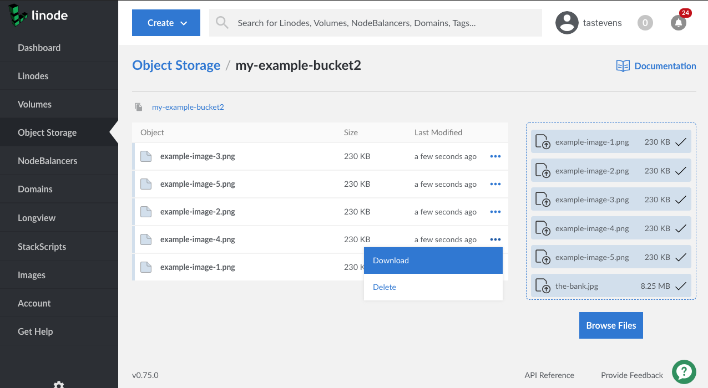
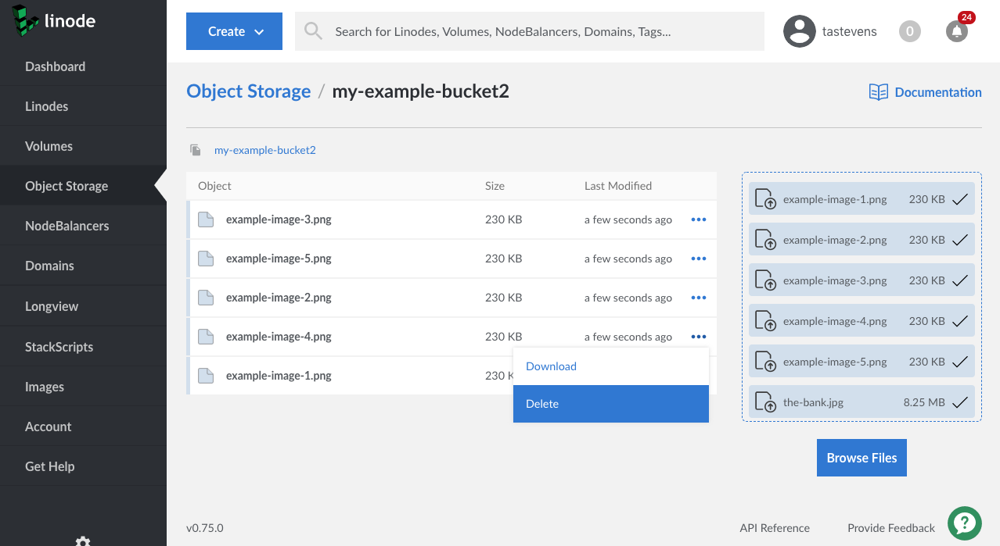

---
author:
  name: Linode Community
  email: docs@linode.com
description: "Get started using Linode's Object Storage."
keywords: ['object','storage','bucket']
license: '[CC BY-ND 4.0](https://creativecommons.org/licenses/by-nd/4.0)'
published: 2019-04-12
modified: 2019-04-12
modified_by:
  name: Linode
title: "How to Use Linode Object Storage"
contributor:
  name: Linode
external_resources:
- '[S3cmd usage and command reference](https://s3tools.org/usage)'
---





Linode's Object Storage is a globally-available, S3-compatible method for storing and accessing data. Object Storage differs from traditional hierarchical data storage (as in a Linode's disk) and [Block Storage Volumes](https://www.linode.com/docs/platform/block-storage/). Under Object Storage, files (also called *objects*) are stored in flat data structures (referred to as *buckets*) alongside their own rich metadata.

Additionally, **Object Storage does not require the use of a Linode.** Instead, Object Storage gives each object a unique URL with which you can access the data. An object can be publicly accessible, or you can set it to be private and only visible to you. This makes Object Storage great for sharing and storing unstructured data like images, documents, archives, streaming media assets, and file backups, and the amount of data you store can range from small collections of files up to massive libraries of information. Lastly, Linode Object Storage has the built-in ability to [host a static site](/docs/platform/object-storage/host-static-site-object-storage/).

In this guide you learn about:

 - How to get set-up for object storage by [creating an Object Storage Key Pair](/docs/platform/object-storage/how-to-use-object-storage/#object-storage-key-pair).

 - The variety of first-party and third-party [tools available](/docs/platform/object-storage/how-to-use-object-storage/#object-storage-tools) to access and use the service.

 - How to connect to Object Storage, how to upload and access objects, and how to host a static site using:

   - [Cloud Manager](/docs/platform/object-storage/how-to-use-object-storage/#cloud-manager)

   - [Linode CLI](/docs/platform/object-storage/how-to-use-object-storage/#linode-cli)

   - [s3cmd](/docs/platform/object-storage/how-to-use-object-storage/#s3cmd)

   - [Cyberduck](/docs/platform/object-storage/how-to-use-object-storage/#cyberduck)

## Enable Object Storage

Object Storage is not enabled for a Linode account by default. All that is required to enable Object Storage is to create a bucket or an Object Storage access key. To cancel Object Storage, see the [Cancel Object Storage](#cancel-object-storage) section.


Billing for Object Storage starts when it is enabled on the account, **regardless of how it is enabled**. For example, if you enable the service by creating an access key, but you have not yet created a bucket, the $5 monthly flat rate (prorated) for Object Storage is charged for the account. [Cancelling Object Storage](#cancel-object-storage) stops billing for it.


## Object Storage Key Pair

The first step towards using Object Storage is to create a pair of keys for the service. This pair is composed of an *access key* and a *secret key*:

-   The access key allows you to access any objects that you set to have private read permissions.

    
To use the access key when viewing a private object, you first need to generate a *signed* URL for the object. The signed URL is much like the standard URL for the object, but some extra URL parameters are appended to it, including the access key. Instructions for generating a signed URL can be found for [s3cmd](#create-a-signed-url-with-s3cmd) and the [Linode CLI](#create-a-signed-url-with-the-cli), outlined in this guide.


-   The secret key is used together with the access key to authenticate the various Object Storage tools with the Linode account. You should not share the secret key.

    
Each Object Storage key pair on the Linode account has complete access to all of the buckets on the account.


### Generate a Key Pair

1.  Log into the [Linode Cloud Manager](https://cloud.linode.com).

1.  Click the **Object Storage** link in the sidebar, click the **Access Keys** tab, and then click the **Create an Access Key** link.

    

1.  A prompt appears asking you to confirm that you'd like to enable Object Storage. Click **Enable Object Storage**.

    

2.  The **Create an Access Key** menu appears.

    

3.  Enter a label for the key pair. This label is how you reference the key pair in the Linode Cloud Manager. Then, click **Submit**.

4.  A window appears that contains the access key and the secret key. Write these down somewhere secure. The access key is visible in the Linode Cloud Manager, but **you can not retrieve the secret key again after you close the window!**

    

    You now have the credentials needed to connect to Linode Object Storage.

## Bucket Names

Bucket names, also referred to as labels, need to be unique within the same cluster, including buckets on other users' Linode accounts. This also means if you reserve a bucket name in one cluster, it is not automatically reserved in another. For example, if you have `my-bucket.us-east-1.linode.com` and want `my-bucket.eu-central-1.linode.com` you must manually reserve them both. They are separate clusters and not guaranteed. If the label you enter is already in use, then choose a different label. Additionally, bucket labels have the following rules:

- Cannot be formatted as IP addresses.
- Must be between 3 and 63 characters in length.
- Can only contain lower-case characters, numbers, periods, and dashes.
- Must start with a lowercase letter or number.
- Cannot contain underscores (_), end with a dash (-) or period (.), have consecutive periods (.), or use dashes (-) adjacent to periods (.).



## Object Storage Tools

There are a number of tools that are available to help manage Linode Object Storage. This guide explains how to install and use the following options:

-   The [Linode Cloud Manager](#cloud-manager) can be used to create buckets, and upload and delete objects, as well as create access keys for use with the S3 compatible clients.

-   The [Linode CLI](#linode-cli) has an Object Storage plugin and can be used to create and remove buckets, add and remove objects, and convert a bucket into a static site from the command line.

-   [s3cmd](#s3cmd) is a powerful command line utility that can be used with any S3-compatible object storage service, including Linode's. s3cmd can be used to create and remove buckets, add and remove objects, convert a bucket into a static site from the command line, plus other functions like syncing entire directories up to a bucket.

-   [Cyberduck](#cyberduck) is a graphical utility available for Windows and macOS and is a great option if you prefer a GUI tool.

## Cloud Manager

### Create a Bucket

The Cloud Manager provides a web interface for creating buckets. To create a bucket:

1.  If you have not already, log into the [Linode Cloud Manager](https://cloud.linode.com).

1.  Click the **Object Storage** link in the sidebar, and then click **Add a Bucket**.

    

    If you have not created an access key or a bucket before, you are prompted to enable Object Storage.

1.  The **Create a Bucket** menu appears.

    

1.  Add a label for the bucket. See the [Bucket Name](#bucket-names) section for rules on naming the bucket.

1.  Choose a cluster location for the bucket to reside in.

    

1.  Click **Submit**. You are now ready to [upload objects to the bucket](#upload-objects-to-a-bucket).

### Upload Objects to a Bucket

1.  If you have not already, log into the [Linode Cloud Manager](https://cloud.linode.com).

1.  Click the **Object Storage** link in the sidebar. A list of all the buckets appears. Click the bucket where you want to upload the objects.

    

1. The bucket's **Objects Listing Page** appears. In the example, the *my-example-bucket* does not yet contain any objects. You can use the **Upload Files Pane** to drag and drop a file from the local computer to the object storage bucket.

    
You can drag and drop multiple files to the **Upload Files Pane** at one time.
    

    

    You can also click the **Browse Files** button to bring up the local computer's file browser and select a file to upload to the bucket.

    

1.  When the upload has completed, the object appears in the **Objects Listing Page**.

    

    
Individual object uploads are limited to a size of 5GB each, though larger object uploads can be facilitated with multipart uploads. [s3cmd](#s3cmd) and [cyberduck](#cyberduck) do this for you automatically if a file exceeds this limit as part of the uploading process.


### View Bucket Objects

1.  If you have not already, log into the [Linode Cloud Manager](https://cloud.linode.com).

1.  Click the **Object Storage** link in the sidebar. A list of all the buckets appears. Click the bucket whose objects you'd like to view.

    

1. The bucket's **Objects Listing Page** appears, which displays all the objects in the bucket.

    

1. Click the ellipsis menu corresponding to the object you'd like to view. Then, select **Download**.

    

1. The object is downloaded to the local computer.

### Delete Objects from a Bucket

1.  If you have not already, log into the [Linode Cloud Manager](https://cloud.linode.com).

1.  Click the **Object Storage** link in the sidebar. A list of all the buckets appears. Click the bucket whose objects you'd like to delete.

    

1. The bucket's **Objects Listing Page** appears, which displays all the objects in the bucket.

    

1. Click the ellipsis menu corresponding to the object you'd like to delete. Then, select **Delete**.

    

1. A dialog box appears prompting you to confirm if you'd like to delete the object. Click **Delete** to proceed. After the object has been deleted, it is no longer be visible on the **Objects Listing Page**.

### Delete a Bucket


You can only delete an empty Object Storage bucket. See the [Delete Objects from a Bucket](#delete-objects-from-a-bucket) section for information on deleting a bucket's objects using the Cloud Manager.


1.  If you have not already, log into the [Linode Cloud Manager](https://cloud.linode.com).

1.  Click the **Object Storage** link in the sidebar. A list of all the buckets appears.

1. Click the ellipsis menu corresponding to the bucket you'd like to delete. Then, select **Delete**.

    

1. A dialog box appears that prompts you to enter the bucket's name as a way to confirm that you'd like to delete the bucket. Type the bucket's name into the text entry field and click **Delete**.

    

    After the bucket has been deleted, it is no longer be visible on the **Buckets Listing Page**.

## Linode CLI

The Linode Command Line Interface (CLI) is a command line utility that allows you complete control over the Linode account. With the Object Storage plugin, you can also create and remove buckets, upload objects, and more.

### Install and Configure the CLI

1.  Download the Linode CLI, or, if you have already downloaded it, make sure it has been upgraded to the latest version:

        pip3 install linode-cli --upgrade

1.  Configure the Object Storage plugin:

        linode-cli obj --help

    You are prompted to enter the Personal Access Token and default settings for deploying new Linodes.

1.  Install the `boto` module:

        pip3 install boto

Now you are ready to create buckets and upload objects.

### Create a Bucket with the CLI

To create a bucket with the Linode CLI, use the `mb` command. See the [Bucket Name](#bucket-names) section for rules on naming the bucket.

    linode-cli obj mb my-example-bucket

To delete a bucket, use the `rb` command:

    linode-cli obj rb my-example-bucket

Currently, the Linode CLI defaults to creating buckets in the Newark data center. To change the cluster a bucket is created in, use the `--cluster` option, followed by the cluster name below:

  - `us-east-1` for the Newark data center. This is the current default.
  - `eu-central-1` for the Frankfurt data center.
  - `ap-south-1` for the Singapore data center.


You will need to use the `--cluster` option for every interaction with your bucket if it is not in `us-east-1`.


If the bucket has objects in it, you can not delete it from the Linode CLI immediately. Instead, remove the objects first, then delete the bucket. The [s3cmd](/docs/platform/object-storage/how-to-use-object-storage/#s3cmd) tool has commands for deleting all objects from a bucket, and it can also force-delete a bucket with objects in it.

### Upload, Download, and Delete an Object with the CLI

1.  As an example object, create a text file and fill it with some example text.

        echo 'Hello World!' > example.txt

1.  To upload an object to a bucket using the Linode CLI, use the `put` command. Provide the object name as the first parameter and the bucket label as the second:

        linode-cli obj put --acl-public example.txt my-example-bucket

    - If the bucket is in the Newark data center, the file is accessible at the URL `http://my-example-bucket.us-east-1.linodeobjects.com/example.txt`.
    - If the bucket is in the Frankfurt data center, the file is accessible at the URL `http://my-example-bucket.eu-central-1.linodeobjects.com/example.txt`.
    - If the bucket is in the Singapore data center, the file is accessible at the URL `https://my-example-bucket.ap-south-1.linodeobjects.com/example.txt`

    
The `--acl-public` flag is used to make the object publicly accessible, meaning that you can access the object from its URL. By default, all objects are set to private. To make a public file private, or a private file public, use the `setacl` command and supply the corresponding flag.

For example, if you want to make a public file private, you would append the `--acl-private` flag:

    linode-cli obj setacl --acl-private my-example-bucket example.txt


1.  To download an object, use the `get` command. Provide the label of the bucket as the first parameter and the name of the file as the second:

        linode-cli obj get my-example-bucket example.txt

1.  To delete an object, use the `rm` or `del` command. Provide the label of the bucket as the first parameter and the name of the object as the second:

        linode-cli obj rm my-example-bucket example.txt

### Create a Signed URL with the CLI

Creating a **signed URL** allows you to create a link to objects with limited permissions and a time limit to access them. To create a signed URL on a preexisting object with the CLI, use the following syntax:

    linode-cli obj signurl my-example-bucket example.txt +300

The output of the command is a URL that can be used for a set period of time to access the object, even if the ACL is set to private. In this case, `+300` represents the amount of time in seconds that the link remains active, or five minutes total. After this time has passed, the link expires and can no longer be used.

### Create a Static Site with the CLI

To create a static website from a bucket:

1.  Use the `ws-create` command, including the `--ws-index` and `--ws-error` flags:

        linode-cli obj ws-create my-example-bucket --ws-index=index.html --ws-error=404.html

    The `--ws-index` and `--ws-error` flags specify which objects the bucket should use to serve the static site's index page and error page, respectively.

1.  You need to separately upload the `index.html` and `404.html` files (or however you have named the index and error pages) to the bucket:

        echo 'Index page' > index.html
        echo 'Error page' > 404.html
        linode-cli obj put index.html 404.html my-example-bucket

1.  Set the `--aclpublic` flag on both the `index.html` and `404.html` files:

        linode-cli obj setacl --acl-public my-example-bucket index.html
        linode-cli obj setacl --acl-public my-example-bucket 404.html

1.  The static site is accessed from a different URL than the generic URL for the Object Storage bucket. Static sites are available at the `website-us-east-1` subdomain for the Newark data center, the `website-eu-central-1` subdomain for the Frankfurt data center, or the `website-ap-south-1` subdomain for the Singapore data center. Using `my-example-bucket` as an example, navigate to either:

    - `http://my-example-bucket.website-us-east-1.linodeobjects.com` or
    - `http://my-example-bucket.website-eu-central-1.linodeobjects.com` or
    - `http://my-example-bucket.website-ap-south-1.linodeobjects.com`

For more information on hosting static websites from Linode Object Storage, see [Host a Static Site on Linode's Object Storage](/docs/platform/object-storage/host-static-site-object-storage/) guide.

### Creating a New Access Key

If for whatever reason the access key you've set up when initially [Configuring the CLI](#install-and-configure-the-cli) has been revoked or deleted, you may see the following error message:


Error: InvalidAccessKeyId


You can create and configure a new Access Key at any time by running the following command:

    linode-cli obj regenerate-keys

After running the command the access is restored, and you can see the new key listed at any time using the following command:

    linode-cli-linode-cli object-storage keys-list


Any new object storage keys issued through the CLI is prefixed with `linode-cli` as the label.


### Other CLI Commands

To get a list of all available buckets, use the `ls` command:

    linode-cli obj ls

To get a list of all objects in a bucket, use the `ls` command with the label of a bucket:

    linode-cli obj ls my-example-bucket

For a complete list of commands available with the Object Storage plugin, use the `--help` flag:

    linode-cli obj --help

## s3cmd

s3cmd is a command line utility that you can use for any S3-compatible Object Storage.

### Install and Configure s3cmd

1.  s3cmd can be downloaded using `apt` on Debian and Ubuntu, and [Homebrew](https://brew.sh/) on macOS. To download s3cmd using Homebrew, run the following command:

        brew install s3cmd

    
On macOS, s3cmd might fail to install if you do not have XCode command line tools installed. If that is the case, run the following command:

    xcode-select --install

You are prompted to agree to the terms and conditions.


    To install s3cmd on Debian or Ubuntu, run the following command:

        apt install s3cmd

1.  After s3cmd has been installed, you need to configure it:

        s3cmd --configure

    A number of questions are presented. To accept the default answer that appears within the brackets, press enter. Here is an example of the answers you need to provide. Substitute `eu-central-1` for the subdomain if the bucket is in the Frankfurt data center:

        Access Key: 4TQ5CJGZS92LLEQHLXB3
        Secret Key: enteryoursecretkeyhere
        Default Region: US
        S3 Endpoint: us-east-1.linodeobjects.com
        DNS-style bucket+hostname:port template for accessing a bucket: us-east-1.linodeobjects.com
        Encryption password: YOUR_GPG_KEY
        Path to GPG program: /usr/local/bin/gpg
        Use HTTPS protocol: False
        HTTP Proxy server name:
        HTTP Proxy server port: 0

    
It is not necessary to provide a GPG key when configuring s3cmd, though it allows you to store and retrieve encrypted files. If you do not wish to configure GPG encryption, you can leave the `Encryption password` and `Path to GPG program` fields blank.


1.  When you are done, enter `Y` to save the configuration.

    
s3cmd offers a number of additional configuration options that are not presented as prompts by the `s3cmd --configure` command. One of those options is `website_endpoint`, which instructs s3cmd on how to construct an appropriate URL for a bucket that is hosting a static site, similar to the `S3 Endpoint` in the above configuration. This step is optional, but ensures that any commands that contain the static site's URL outputs the right text. To edit this configuration file, open the `~/s3.cfg` file on the local computer. This is most likely located in '/home/$user/.s3cfg' if you are using a Linux-based system:

    nano ~/.s3cfg

Add the following values:

    host_base = us-east-1.linodeobjects.com
    host_bucket = %(bucket)s.us-east-1.linodeobjects.com
    website_endpoint = http://%(bucket)s.website-us-east-1.linodeobjects.com/

**Note:** Use the `eu-central-1` subdomain for buckets in the Frankfurt data center, and the `ap-south-1` subdomain for buckets in the Singapore data center.



You are now ready to use s3cmd to create a bucket in Object Storage.

### Create a Bucket with s3cmd

You can create a bucket with s3cmd using the `mb` command, replacing `my-example-bucket` with the label of the bucket you would like to create. See the [Bucket Name](#bucket-names) section for rules on naming the bucket.

    s3cmd mb s3://my-example-bucket

To remove a bucket, you can use the `rb` command:

    s3cmd rb s3://my-example-bucket


To delete a bucket that has files in it, include the `--recursive` (or `-r`) option *and* the `--force` (or `-f`) option. Use caution when running this command:

    s3cmd rb -r -f s3://my-example-bucket/


### Upload, Download, and Delete an Object with s3cmd

1.  As an example object, create a text file and fill it with some example text.

        echo 'Hello World!' > example.txt

1.  Now, transfer the text file object to the bucket using s3cmd's `put` command, replacing `my-example-bucket` with the label of the bucket you gave in the last section:

        s3cmd put example.txt s3://my-example-bucket -P

    
The `-P` flag at the end of the command instructs s3cmd to make the object public. To make the object private, which means you only access it from a tool such as s3cmd, simply leave the '-P' flag out of the command.


    
If you chose to enable encryption when configuring s3cmd, you can store encrypted objects by supplying the `-e` flag:

    s3cmd put -e encrypted_example.txt s3://my-example-bucket


1.  The object is uploaded to the bucket, and s3cmd provides a public URL for the object:

        upload: 'example.txt' -> 's3://my-example-bucket/example.txt'  [1 of 1]
        13 of 13   100% in    0s   485.49 B/s  done
        Public URL of the object is: http://us-east-1.linodeobjects.com/my-example-bucket/example.txt

    
The URL for the object that s3cmd provides is one of two valid ways to access the object. The first, which s3cmd provides, places the label of the bucket after the domain name. You can also access the object by affixing the bucket label as a subdomain: `http://my-example-bucket.us-east-1.linodeobjects.com/example.txt`. The latter URL is generally favored.


1.  To retrieve a file, use the `get` command:

        s3cmd get s3://my-example-bucket/example.txt

    If the file you are attempting to retrieve is encrypted, you can retrieve it using the `-e` flag:

        s3cmd get -e s3://my-example-bucket/encrypted_example.txt

1.  To delete a file, you can use the `rm` command:

         s3cmd rm s3://my-example-bucket/example.txt

    
To delete all files in a bucket, include the `--recursive` (or `-r`) option *and* the `--force` (or `-f`) option. Use caution when running this command:

    s3cmd rm -r -f s3://my-example-bucket/


1.  To list all available buckets, use the `ls` command:

        s3cmd ls

1.  To list all objects in a bucket, use the `ls` command and provide a bucket:

        s3cmd ls s3://my-example-bucket

### Create a Signed URL with s3cmd

Creating a **signed URL** allows you to create a link to objects with limited permissions and a time limit to access them. To create a signed URL on a preexisting object with s3cmd, use the following syntax:

    s3cmd signurl s3://my-example-bucket/example.txt +300

The output of the command is a URL that can be used for a set period of time to access the object, even if the ACL is set to private. In this case, `+300` represents the amount of time in seconds that the link remains active, or five minutes total. After this time has passed, the link expires and can no longer be used.

### Create a Static Site with s3cmd

You can also create a static website using Object Storage and s3cmd:

1.  To create a website from a bucket, use the `ws-create` command:

        s3cmd ws-create --ws-index=index.html --ws-error=404.html s3://my-example-bucket

    The `--ws-index` and `--ws-error` flags specify which objects the bucket should use to serve the static site's index page and error page, respectively.

1.  You need to separately upload the `index.html` and `404.html` files (or however you have named the index and error pages) to the bucket:

        echo 'Index page' > index.html
        echo 'Error page' > 404.html
        s3cmd put index.html 404.html s3://my-example-bucket

1.  The static site is accessed from a different URL than the generic URL for the Object Storage bucket. Static sites are available at the `website-us-east-1` subdomain for the Newark data center, the `website-eu-central-1` subdomain for the Frankfurt data center, and the `website-ap-south-1` subdomain for the Singapore data center. Using `my-example-bucket` as an example, you would navigate to either:

    - `http://my-example-bucket.website-us-east-1.linodeobjects.com` or
    - `http://my-example-bucket.website-eu-central-1.linodeobjects.com`.

For more information on hosting a static website with Object Storage, read our [Host a Static Site using Linode Object Storage](/docs/platform/object-storage/host-static-site-object-storage/) guide.

### Other s3cmd Commands

To upload an entire directory of files, you can use the the `sync` command, which automatically syncs all new or changed files. Navigate to the directory you would like to sync, then enter the following:

    s3cmd sync . s3://my-example-bucket -P

This can be useful for uploading the contents of a static site to the bucket.


The period in the above command instructs s3cmd to upload the current directory. If you do not want to first navigate to the directory you wish to upload, you can provide a path to the directory instead of the period.


## Cyberduck

Cyberduck is a desktop application that facilitates file transfer over FTP, SFTP, and a number of other protocols, including S3.

### Install and Configure Cyberduck

1.  Download Cyberduck by [visiting their website](https://cyberduck.io/).

1.  After you have Cyberduck installed, open the program and click **Open Connection**.

1.  At the top of the Open Connection dialog, select **Amazon S3** from the dropdown menu.

    

1.  For the Server address, enter either `us-east-1.linodeobjects.com` if the bucket is in the Newark data center, `eu-central-1.linodeobjects.com` if the bucket is in the Frankfurt data center, or `ap-south-1.linodeobjects.com` if the bucket is in the Singapore data center.

1.  Enter the access key in the **Access Key ID** field, and the secret key in the **Secret Access Key** field.

1.  Click **Connect**.

You are now ready to create a bucket in Object Storage.

### Create a Bucket with Cyberduck

To create a bucket in Cyberduck:

1. Right click within the window frame, or click **Action**, then click **New Folder**:

    

1.  Enter the bucket's label and then click **Create**. See the [Bucket Name](#bucket-names) section for rules on naming the bucket.

1.  To delete the bucket using Cyberduck, right click the bucket and select **Delete**.

### Upload, Download, and Delete an Object with Cyberduck

1.  To upload objects with Cyberduck, you can simply drag and drop the object, or directory of objects, to the bucket you'd like to upload them to, and Cyberduck will do the rest. Alternatively, you can click the **Action** button and select **Upload** from the menu:

    

1.  To make the objects publicly accessible, meaning that you can access them from the object's URL, you need to set the proper READ permissions. Right click the object and select **Info**.

1.  Click the **Permissions** tab.

1.  Click the gear icon at the bottom of the window and select **Everyone**.

    

1.  A new entry for *Everyone* appears in the Access Control List. Next to *Everyone*, under *Permissions* column heading, select **READ** from the drop down menu.

    

    The object is now accessible through the internet, at the URL `http://my-example-bucket.us-east-1.linodeobjects.com/example.txt`, where `my-example-bucket` is the label of the bucket, `us-east-1.linodeobjects.com` is the cluster where the bucket is hosted, and `example.txt` is the name of the object.

1.  To download an object, right click the object and select **Download**, or click **Download As** if you'd like to specify the location of the download.

1.  To delete an object, right click the object name and select **Delete**.

### Create a Static Site with Cyberduck

To create a static site from the bucket:

1.  Select a bucket, then right click the bucket or select the **Action** button at the top of the menu.

1.  Click **Info**, and then select the **Distribution (CDN)** tab.

1.  Check the box that reads **Enable Website Configuration (HTTP) Distribution**:

    

1.  You need to separately upload the `index.html` and `404.html` files (or however you have named the index and error pages) to the bucket. Follow the instructions from the [Upload, Download, and Delete an Object with Cyberduck](#upload-download-and-delete-an-object-with-cyberduck) section to upload these files.

1.  The static site is accessed from a different URL than the generic URL for the Object Storage bucket. Static sites are available at the `website-us-east-1` subdomain for the Newark data center,  the `website-eu-central-1` subdomain for the Frankfurt data center, and the `website-ap-south-1` subdomain for the Singapore data center. Using `my-example-bucket` as an example, you would navigate to either:

    - `http://my-example-bucket.website-us-east-1.linodeobjects.com` or
    - `http://my-example-bucket.website-eu-central-1.linodeobjects.com` or
    - `https://my-example-bucket.website-ap-south-1.linodeobjects.com`

    For more information on hosting a static website with Object Storage, read the [Host a Static Site using Linode Object Storage](/docs/platform/object-storage/host-static-site-object-storage/) guide.

## Cancel Object Storage

1.  To cancel Object Storage, you must first delete all the buckets. To delete a bucket, the bucket must be empty. For buckets that contain large amounts of objects, consider employing [lifecycle policies](/docs/platform/object-storage/lifecycle-policies/) to delete the objects.

    
If you have removed all of the buckets, but you have not also cancelled the Object Storage service, the account is billed at a flat rate of $5 per month (prorated) for the service. Make sure that you complete each step of this section to fully cancel the Object Storage service and to stop billing for it. For more information, see our [Pricing and Limitations](/docs/platform/object-storage/pricing-and-limitations/) guide.


1.  After you've deleted all the buckets, navigate to the **Account** page in the left-hand navigation. Click the *Settings* tab. In the menu, you should see a setting for Object Storage:

    

1.  Click **Cancel Object Storage**. A prompt appears asking you to confirm the cancellation. If you still have active buckets, you are prompted to delete them.

## Next Steps

There are S3 bindings available for a number of programming languages, including the popular [Boto](https://github.com/boto/boto3) library for Python, that allow you to interact with Object Storage programmatically.
