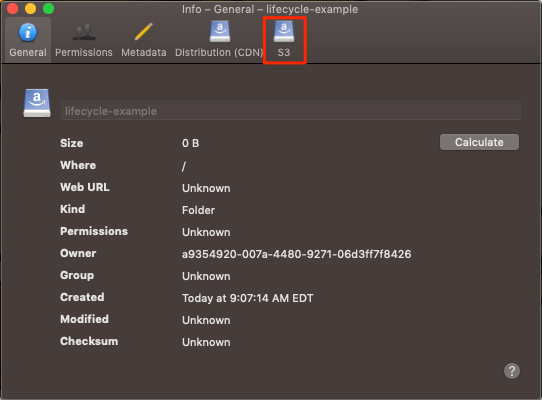
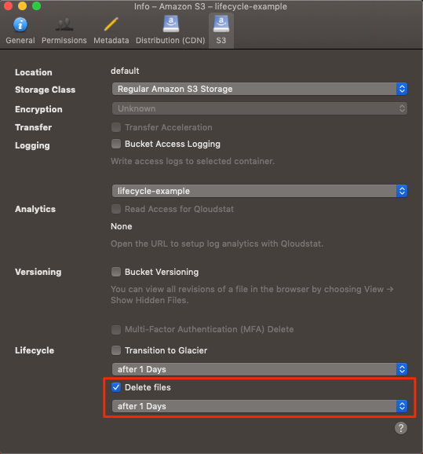

---
author:
  name: Linode Community
  email: docs@linode.com
description: 'How to mangage the deletion of objects in Linode Object Storage with lifecycle policies.'
keywords: ['object','storage','lifecycle','policy','policies','delete']
license: '[CC BY-ND 4.0](https://creativecommons.org/licenses/by-nd/4.0)'
published: 2019-09-19
modified_by:
  name: Linode
title: "Manage Objects with Lifecycle Policies"
contributor:
  name: Linode
---

While deleting a few objects in an Object Storage bucket might not take that long, when the objects number in the thousands or even millions the time required to complete the delete operations can easily become unmanageable. It's best when deleting a substantial amount of objects to use what are known as *lifecycle policies*.

A lifecycle policy is a set of rules that govern the deletion of objects after a given amount of time. For instance, a lifecycle policy can be created that deletes objects every thirty days, or once a week. This is useful for cases where the data in a bucket becomes outdated, such as when collecting activity logs. Beyond simply deleting every object in a bucket, depending on the tool used lifecycle policies are capable of deleting older versions of objects in buckets that have bucket versioning enabled.

Lifecycle policies are enacted starting at midnight of the Object Storage cluster's local time. This means that if you set a lifecycle policy of one day, the objects will be deleted the midnight after they become 24 hours old.


There is a chance that a lifecycle policy will not delete all of the files in a bucket the first time the lifecycle policy is enacted. This is especially true for buckets with upwards of a million objects. In cases like these, *most* of the objects are deleted, and any further objects are typically deleted during the next iteration of the lifecycle policy's rules.


This guide will show you how to create and delete lifecycle policies with the [s3cmd command line interface](https://s3tools.org/s3cmd) (CLI) and the [Cyberduck graphical user interface](https://cyberduck.io/) (GUI).

### Before You Begin

You should familiarize yourself with Linode Object Storage by reading the [How to Use Object Storage](/docs/platform/object-storage/how-to-use-object-storage/) guide. For demonstration purposes, you will want a bucket with a few objects that you don't mind deleting within it.

## s3cmd

s3cmd allows users to set and manage lifecycle policies from the command line. Below you will find instructions on how to create and manage lifecycle policies using s3cmd.

### Creating a Lifecycle Policy File

In S3-compatible Object Storage, a lifecycle policy is represented by an XML file. This XML file can be created in the file editor of your choosing. Consider the following lifecycle policy file:


<LifecycleConfiguration>
    <Rule>
        <ID>delete-all-objects</ID>
        <Prefix></Prefix>
        <Status>Enabled</Status>
        <Expiration>
            <Days>1</Days>
        </Expiration>
    </Rule>
</LifecycleConfiguration>


The above lifecycle policy deletes all objects in the bucket after one day. Each lifecycle policy file needs a `LifecycleConfiguration` block and a nested `Rule` block. The `Rule` block must contain `Prefix`, `Status`, and `Expiration` blocks, and it's also a good idea to include an `ID` block.

- The `ID` block defines a name for the lifecycle policy rule. This must be unique.
- The `Prefix` is a string of characters. This string is used to select objects for deletion with the same matching prefix. For example, objects that begin with `error_report-` could be targeted for deletion by providing this prefix. This `Prefix` can be empty if you'd like to delete all files in a bucket.
- The `Status` is a string value describing the status of the lifecycle policy. To enable the policy, set this value to `Enabled`, to disable the policy set the value to `Disabled`.
- The `Expiration` block contains the `Days` block. The `Days` block is a the number of days before this rule will be enacted. In the above example, the `Days` is set to `1`, meaning that the objects in the bucket will be deleted after one day.

There also exists another block not mentioned in the above example, the `NoncurrentVersionExpiration` block, and its child, `NoncurrentDays`. This block is meant to control the lifecycle of objects with multiple older versions, and should only be used with buckets that have bucket versioning enabled. Using `NoncurrentVersionExpiration` will delete objects that are not the newest, most current version. Below is an example of how to use `NoncurrentVersionExpiration`.


<LifecycleConfiguration>
    <Rule>
        <ID>delete-prior-versions</ID>
        <Prefix></Prefix>
        <Status>Enabled</Status>
        <Expiration>
            <Days>1</Days>
        </Expiration>
        <NoncurrentVersionExpiration>
            <NoncurrentDays>1</NoncurrentDays>
        </NoncurrentVersionExpiration>
    </Rule>
</LifecycleConfiguration>


A lifecycle policy file can contain one `LifecycleConfiguration` block, but the `LifecycleConfiguration` block can contain more than one `Rule`. For instance, if you had a bucket that contained both error and general output logs, you could set a lifecycle policy that saves error logs for a week but deletes standard logs at the end of every day:


<LifecycleConfiguration>
    <Rule>
        <ID>delete-error-logs</ID>
        <Prefix>error</Prefix>
        <Status>Enabled</Status>
        <Expiration>
            <Days>7</Days>
        </Expiration>
    </Rule>
    <Rule>
        <ID>delete-standard-logs</ID>
        <Prefix>logs</Prefix>
        <Status>Enabled</Status>
        <Expiration>
            <Days>1</Days>
        </Expiration>
    </Rule>
</LifecycleConfiguration>


### Uploading the Lifecycle Policy to a Bucket

In order to apply a lifecycle policy to a bucket with s3cmd, you need to upload the lifecycle file to the bucket. This operation is not a normal PUT operation. Instead, the command to use is `setlifecycle`, followed by the name of the lifecycle policy file, followed by the name of bucket:

    s3cmd setlifecycle lifecycle_policy.xml s3://lifecycle-policy-example

You should see output like the following:

    s3://lifecycle-policy-example/: Lifecycle Policy updated

Once the lifecycle policy has been uploaded, objects will be deleted according to the policy set in place.

### Viewing a Bucket's Lifecycle Policy

To view a lifecycle policy after it has been uploaded to a bucket, use the `getlifecycle` command and provide the bucket name:

    s3cmd getlifecycle s3://lifecycle-policy-example

You should see the contents of the XML file that was uploaded:

    <?xml version="1.0" ?>
    <LifecycleConfiguration xmlns="http://s3.amazonaws.com/doc/2006-03-01/">
      <Rule>
        <ID>delete-all</ID>
        <Prefix/>
        <Status>Enabled</Status>
        <Expiration>
          <Days>1</Days>
        </Expiration>
      </Rule>
    </LifecycleConfiguration>

### Deleting a Lifecycle Policy

To delete a lifecycle policy that you've uploaded, effectively disabling it, use the `dellifecycle` command and provide the bucket name:

    s3cmd dellifecycle s3://lifecycle-policy-example

You'll see a confirmation that the lifecycle policy was deleted:

    s3://lifecycle-example/: Lifecycle Policy deleted

## Cyberduck

Cyberduck allows less control over lifecycle polices than the s3cmd command line tool. In particular, this means that Cyberduck does not allow setting a lifecycle policy to remove outdated versions of objects in buckets with versioning enabled, and limits the length of the lifecycle policy to commonly used time spans. Below you will learn how to set a lifecycle policy using Cyberduck.

### Enable a Lifecycle Policy

1.  Right click or control + click on the bucket you would like to set a lifecycle policy in. This will bring up the bucket info menu.

2.  Click on the **S3** tab to open the S3 bucket settings.

    

3.  Click on the checkbox labeled **Delete files** and select a time interval from the drop-down menu below it.

    

After the selected time, the objects within the bucket will be deleted.

### Disable a Lifecycle Policy

To disable a lifecycle policy, uncheck the box entitled *Delete Files* that you checked in the previous section.