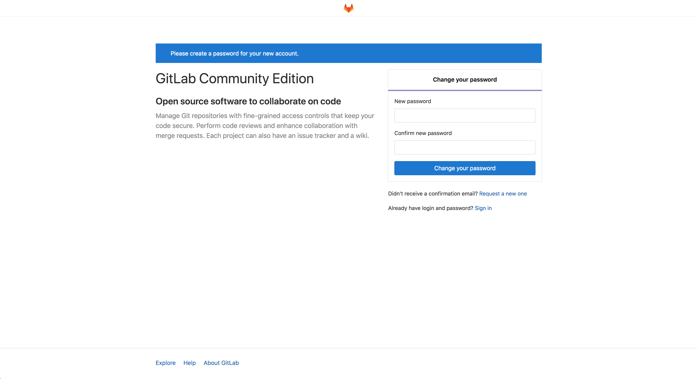

---
author:
  name: Linode Community
  email: docs@linode.com
description: 'Deploy GitLab on Linode using One-Click Apps.'
keywords: ['list','of','keywords','and key phrases']
license: '[CC BY-ND 4.0](https://creativecommons.org/licenses/by-nd/4.0)'
published: 2019-03-27
modified: 2019-03-27
modified_by:
  name: Linode
title: "Deploy GitLab with One-Click Apps"
contributor:
  name: Linode
external_resources:
- '[GitLab Adminstrator Documentation](https://docs.gitlab.com/ee/administration/)'
---
## GitLab One-Click App

GitLab is a complete solution for all aspects of your software development. At its core, GitLab serves as your centralized remote Git repository. GitLab also features built-in tools that represent every task in your development workflow, from planning to testing to releasing.

Self-hosting your software development with GitLab offers total control of your codebase. At the same time, its familiar interface will ease collaboration for you and your team. GitLab is the most popular self-hosted Git repository, so you'll benefit from a robust set of integrated tools and an active community.

### Deploy a GitLab One-Click App



### GitLab Options

You can configure your GitLab App by providing values for the following fields:

| **Field** | **Description** |
|:--------------|:------------|
| **Domain** | Your GitLab site's domain name. This domain will also be used by Postfix to send mail. If you do not have a domain name, you can leave this field blank. Postfix will use your Linode's default Reverse DNS to send email instead, i.e. `gitlab@li926-227.members.linode.com`.  *Advanced Configuration*. |
| **SSH public key** | Your SSH public key. The public key will be stored in the `/root/.ssh/authorized_keys` file on your Linode. *Advanced Configuration*. |

### Linode Options

After providing the app specific options, provide configurations for your Linode server:

| **Configuration** | **Description** |
|:--------------|:------------|
| **Select an Image** | Debian 9 is currently the only image supported by the GitLab One-Click App. *Required* |
| **Region** | Choose the region where you would like your Linode to reside. If you’re not sure which to select, see our [How to Choose a Data Center](/docs/platform/how-to-choose-a-data-center) guide. You can also generate [MTR reports](/docs/networking/diagnostics/diagnosing-network-issues-with-mtr/) for a deeper look at the route path between you and a data center in each specific region. *Required* |
| **Linode Plan** | Select a Linode plan. We recommend that you use, at minimum, an **8GB Linode plan** for your GitLab server. For more information on GitLab's system requirements see their [official documentation](https://docs.gitlab.com/ee/install/requirements.html).  *Required* |
| **Linode Label** | Give your Linode a label. This is a name to help you easily identify it within the Cloud Manager’s Dashboard. |
| **Root Password** | Create a root password for your Linode in the Root Password field. This password must be provided when you log in to your Linode via SSH. It must be at least 6 characters long and contain characters from two of the following categories: lowercase and uppercase case letters, numbers, and punctuation characters. *Required* |

When you've provided all required Linode Options, click on the **Create** button. **Your GitLab app will complete installation anywhere between 3-7 minutes after your Linode has finished provisioning**.

## Getting Started After Deployment

### Access Your GitLab Site

After GitLab has finished installing, you will be able to access your GitLab site over `http://` with your Linode's IPv4 address or the domain name entered when deploying your GitLab One-Click App.

1. Access your GitLab instance.

    **With Your Linode's IP Address**

    You will be able to access your GitLab site by copying your Linode's IPv4 address and entering it in the browser of your choice. To find your Linode's IPv4 address:

    1. Click on the **Linodes** link in the sidebar. You will see a list of all your Linodes.

    1. Find the Linode you just created when deploying your app and select it.

    1. Navigate to the **Networking** tab.

    1. Under the **IPv4** heading, you will find your IPv4 address listed under the **Address** column.

    1. Copy and paste the IPv4 address into a browser window. Ensure you are using `http://`.

    **With a Domain Name**

    If you deployed your GitLab One-Click App with a domain name and it is pointing to the Linode's IP address that is hosting your GitLab instance, then you can enter the domain name in a browser window to access your GitLab site.Ensure you are using `http://`.

    For more details on registering your domain, see the [DNS Manager](/docs/platform/manager/dns-manager/) guide.

1. Once you have accessed your GitLab site, you will be brought to GitLab's password reset screen. Provide a secure password for the administrator's account:

    

1. You will be redirected to the login screen. Enter `root` as the username and the password you just created to log in. You can now begin creating GitLab repositories, users, and more. See [GitLab's official documentation](https://docs.gitlab.com/ee/university/training/topics/getting_started.html) for more information.

### Add a Domain After Deploying Your GitLab Instance

If you configured your GitLab One-Click App without providing a domain, you can set one up after the app has been deployed.

1. Ensure you have added a domain record for your domain by following the steps in the [DNS Manager](/docs/platform/manager/dns-manager/) guide.

    Once you have completed those steps, you will need to update your GitLab instance's `/etc/gitlab/gitlab.rb` file with the domain name. This will ensure that any emails sent to users by the GitLab instance will use your site's domain.

1. [Connect to your Linode via SSH](/docs/getting-started/#connect-to-your-linode-via-ssh).

1. With a text editor of your choice, open the `/etc/gitlab/gitlab.rb` file and modify the value of `external_url`. Ensure you replace `http://example.com` with your domain.:

    
    ## GitLab URL
    ##! URL on which GitLab will be reachable.
    ##! For more details on configuring external_url see:
    ##! https://docs.gitlab.com/omnibus/settings/configuration.html#configuring-the-external-url-for-gitlab
    external_url 'http://example.com'
    

1. Issue the following command to enable your new configuration:

        gitlab-ctl reconfigure

1. Navigate to the domain in a browser window and verify that you are directed to your GitLab instance.

### Software Included

The Drupal One-Click App will install the following required software on your Linode:

| **Software** | **Description** |
|:--------------|:------------|
| **GitLab** | Remote Git repository software. |
| **Postfix** | Postfix is a free and open-source mail transfer agent that routes and delivers electronic mail. |
| **UFW** | Firewall utility. Ports 22/tcp, 80/tcp, 443/tcp, 25, 587, and 110 for IPv4 and IPv6 will allow outgoing and incoming traffic. |
| **Fail2ban** | Fail2Ban is an intrusion prevention software framework that protects computer servers from brute-force attacks. |
