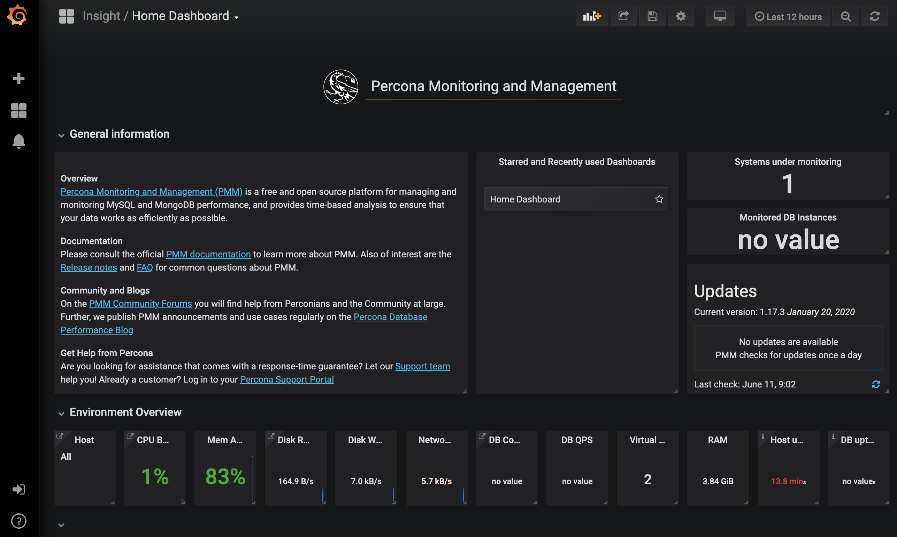
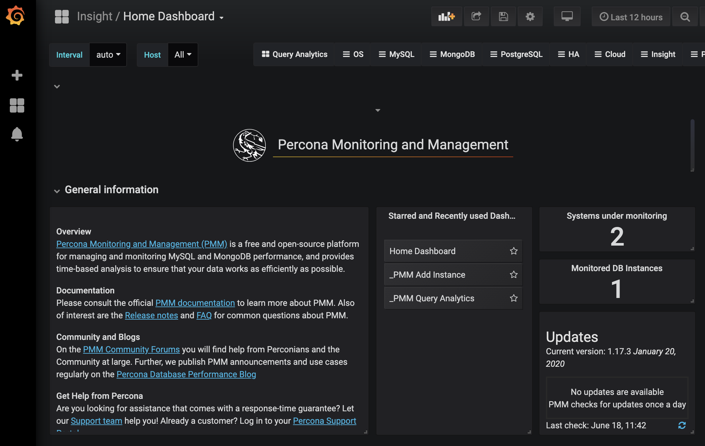

---
author:
  name: Linode
  email: docs@linode.com
description: 'Deploy Percona Monitoring and Management (PMM) on Linode using One-Click Apps. This will install the PMM server on a Linode instance giving you access to monitor and visualize metrics collected from database instances. This guide shows you how to deploy PMM with One-Click Apps and basic configuration steps to get you started monitoring your databases.'
og_description: 'Deploy Percona Monitoring and Management (PMM) on Linode using One-Click Apps. This will install the PMM server on a Linode instance giving you access to monitor and visualize metrics collected from database instances. This guide shows you how to deploy PMM with One-Click Apps and basic configuration steps to get you started monitoring your databases.'
keywords: ['percona','one-click apps','monitoring', 'database']
license: '[CC BY-ND 4.0](https://creativecommons.org/licenses/by-nd/4.0)'
published: 2020-06-11
modified: 2020-06-11
modified_by:
  name: Linode
title: "How to Deploy Percona Monitoring Management (PMM) with One-Click Apps"
h1_title: "Deploy Percona Monitoring Management (PMM) with One-Click Apps"
contributor:
  name: Linode
---

## Percona PMM One-Click App

Percona Monitoring and Management (PMM) is an open-source tool which provides a GUI powered by [Grafana](https://grafana.com/) for monitoring and managing MySQL, MariaDB, PostgreSQL, and MongoDB databases. You can use PMM to easily observe important metrics, logging, and statistics related to your databases and the hosts they run on. Additionally, it includes a number of tools which can help to optimize your database's performance, manage all database instances, and track and identify potential security threats.

### PMM Architecture Overview

The PMM tool uses a client-server model which makes it easy to scale monitoring across several databases hosted on various remote hosts. See the table below to better understand how each PMM component fits into the context of Linode's PMM One-Click App.

| **Component** | **Description** |
|:-------:|:--------:|
| **PMM Server** | The PMM One-Click App deploys an instance of the PMM Server, which includes the Grafana web interface to visualize all the data collected from the databases it monitors.|
| **PMM Client** | You will need to install the PMM Client on any Linode that hosts a database that you would like to monitor. The PMM Client will help you connect to the PMM Server and relay host and database performance metrics to the PMM Server. |


For a more detailed information on PMM's architecture see [Percona's official documentation](https://www.percona.com/doc/percona-monitoring-and-management/architecture.html).


### Deploy a Percona PMM One-Click App



### Percona PMM Options

| **Configuration** | **Description** |
|--------------|------------|
| **Hostname** | The [hostname](https://www.linode.com/docs/getting-started/#set-the-hostname) to assign to your new Linode. *Required*. |

### Linode Options

The following configuration options are possible for your Linode server:

| **Configuration** | **Description** |
|--------------|------------|
| **Select an Image** | Debian 10 and Ubuntu 20.04 are currently the only images supported by the PMM One-Click App. *Required*. |
| **Region** | The region where you would like your Linode to reside. In general, it's best to choose a location that's closest to you. For more information on choosing a DC, review the [How to Choose a Data Center](/docs/platform/how-to-choose-a-data-center) guide. You can also generate [MTR reports](/docs/networking/diagnostics/diagnosing-network-issues-with-mtr/) for a deeper look at the network routes between you and each of our data centers. *Required*. |
| **Linode Plan** | Your Linode's [hardware resources](/docs/platform/how-to-choose-a-linode-plan/#hardware-resource-definitions). Percona recommends roughly 1 GB of storage on your PMM Server for each database node you would like to monitor. For more information on Percona's system requirements see their [official documentation](https://www.percona.com/doc/percona-monitoring-and-management/faq.html#what-are-the-minimum-system-requirements-for-pmm). If you decide that you need more or fewer hardware resources after you deploy your app, you can always [resize your Linode](/docs/platform/disk-images/resizing-a-linode/) to a different plan. *Required*. |
| **Linode Label** | The name for your Linode, which must be unique between all of the Linodes on your account. This name will be how you identify your server in the Cloud Manager’s Dashboard. *Required*. |
| **Root Password** | The primary administrative password for your Linode instance. This password must be provided when you log in to your Linode via SSH. It must be at least 6 characters long and contain characters from two of the following categories: lowercase and uppercase case letters, numbers, and punctuation characters. Your root password can be used to perform any action on your server, so make it long, complex, and unique. *Required*. |

When you've provided all required Linode Options, click on the **Create** button. **Your PMM app will complete installation anywhere between 1-5 minutes after your Linode has finished provisioning**.

### Software Included

The PMM One-Click App will install the following required software on your Linode:

| **Software** | **Description** |
|:--------------|:------------|
| [**Docker**](https://www.docker.com/) | Docker is used to containerize Percona PMM. |
| [**Grafana**](https://grafana.com/) | Grafana is a visualization tool that provides charts, graphs, and alerts. Provides these tools for Percona PMM |
| [**pmm-admin**](https://www.percona.com/doc/percona-monitoring-and-management/pmm-admin.html) | `pmm-admin` is a command-line tool used to managing PMM clients. |



## Getting Started after Deployment

### Access your PMM Server's Grafana Dashboard

After the Percona PMM server has finished installing, you will be able to access its Grafana dashboard it over `http://` with your Linode's IPv4 address. To find your Linode's IPv4 address:

  1. Click on the **Linodes** link in the sidebar. You will see a list of all your Linodes.

  1. Find the Linode you just created when deploying your app and select it.

  1. Navigate to the **Networking** tab.

  1. Your IPv4 address will be listed under the **Address** column in the **IPv4** table.

  1. Copy and paste the IPv4 address into a browser window. Ensure you are using `http://`.

  1. You will see the PMM Home Dashboard actively monitoring your server:

    

### Installing the PMM Client

To begin monitoring a database node, you will need to install the PMM Client on the Linode that hosts your database and connect the node to the PMM Server.


The PMM Server deployed with Linode's PMM One-Click App is compatible with [**PMM Client version 1**](https://www.percona.com/doc/percona-monitoring-and-management/index.html).


1. [Connect to your Linode](/docs/getting-started/#connect-to-your-linode-via-ssh) via SSH.

1. Update your system's software.

      > **Debian or Ubuntu**:
      >
      >
        sudo apt-get update && apt-get upgrade

      > **CentOS**:
      >
      >
        sudo yum update

1. Install the PMM Client (version 1):

      > **Debian or Ubuntu**:
      >
      >
        sudo apt-get install pmm-client

      > **CentOS**:
      >
      >
        sudo yum install pmm-client

1. Connect your database node to the PMM Server. Replace `192.0.2.0` with your PMM Server's IPv4 address.

      
Follow the steps in [Find Your Linode's IP Address](/docs/quick-answers/linode-platform/find-your-linodes-ip-address/) to retrieve your PMM Server's IPv4 address.
      

        sudo pmm-admin config --server 192.0.2.0

    Once complete, you should see a similar output:

      
OK, PMM server is alive.

PMM Server      | 192.0.2.0
Client Name     | li222-111
Client Address  | 192.0.2.1
      

### Monitor a Database Instance

Once your database node and your PMM Server are communicating, the final step is to add your database instance to be monitored by your PMM Server. These steps are completed on your Database node.

1. [Connect to your Linode](/docs/getting-started/#connect-to-your-linode-via-ssh) via SSH.

1. Add your database instance to be monitored by your PMM Server. This command will add a MySQL database instance to be monitored. You can replace `mysql` with the database type that your node is hosting (i.e. `postgresql` or `mongodb`). See Percona's [Managing PMM Client](https://www.percona.com/doc/percona-monitoring-and-management/pmm-admin.html#pmm-admin-add) documentation for details.

        pmm-admin add mysql

    Your Percona dashboard should now be monitoring your MySQL service. To learn how to monitor a different database service, see [Percona's official documentation](https://www.percona.com/doc/percona-monitoring-and-management/2.x/concepts/services-index.html).

    

    
You can also [add a database remote instance node using the Grafana interface](https://www.percona.com/doc/percona-monitoring-and-management/remote-instance.html). In order to do this, your node must be configured with a public DNS name. This method of adding a remote database instance will not provide host-level metrics.
    

## Next Steps

The Percona Monitoring Management Tool is very powerful and can be configured to monitor and display various pieces of your database instances. Once you have completed the basic configurations outlined in this guide, you should review Percona's documentation to learn more about the PMM tool. Here are some suggested topics:

- [Tools of PMM](https://www.percona.com/doc/percona-monitoring-and-management/tool.html)
- [Adding general system metrics service](https://www.percona.com/doc/percona-monitoring-and-management/pmm-admin.html#pmm-admin-add-linux-metrics)
- [Configuring MySQL for Best Results](https://www.percona.com/doc/percona-monitoring-and-management/conf-mysql.html)
- [Checking Network Connectivity](https://www.percona.com/doc/percona-monitoring-and-management/pmm-admin.html#pmm-admin-check-network)
- [Percona Documentation Table of Contents](https://www.percona.com/doc/percona-monitoring-and-management/index.html)
