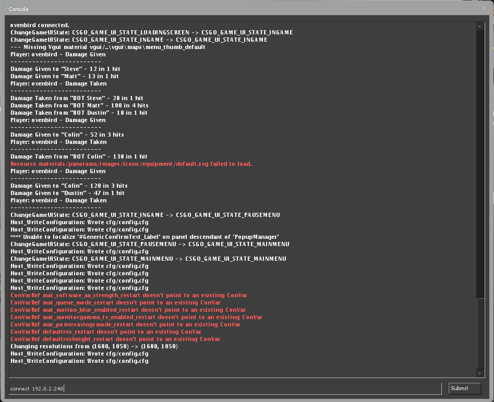

---
author:
  name: Linode Community
  email: docs@linode.com
description: 'Deploy a Counter-Strike: Global Offensive server on Linode using One-Click Apps.'
keywords: ['counter-strike','cs', 'go','one-click']
license: '[CC BY-ND 4.0](https://creativecommons.org/licenses/by-nd/4.0)'
published: 2019-03-28
modified: 2019-03-28
modified_by:
  name: Linode
title: "Deploy Counter-Strike: Global Offensive with One-Click Apps"
contributor:
  name: Linode
external_resources:
- '[List of CS:GO Cvar Commands to use with RCON](https://developer.valvesoftware.com/wiki/List_of_CS:GO_Cvars)'
---

## Counter-Strike: Global Offensive One-Click App

Counter-Strike: Global Offensive (CS:GO) is a fast-paced first person shooter. Teams compete against each other to complete objectives or to eliminate the opposing team.

A competitive match requires two teams of five players, but hosting your own server offers you control over team size and server location, so you and your friends can play with low latency. Up to 64 players can be hosted on a single server.

### Deploy a CS:GO One-Click App



The [CS:GO Options](#cs-go-options) section of this guide provides details on all available configuration options for this app.

### CS:GO Options

You can configure your CS:GO App by providing values for the following fields:

| **Field**&nbsp;&nbsp;&nbsp;&nbsp;&nbsp;&nbsp;&nbsp;&nbsp;&nbsp;&nbsp;&nbsp;&nbsp;&nbsp;&nbsp;&nbsp;&nbsp;&nbsp;&nbsp;&nbsp;&nbsp;&nbsp;&nbsp;&nbsp;&nbsp; | **Description** |
|:--------------|:------------|
| **Game Server Login Token** | A Steam game server login token. This is required to publicly list your server. To get a Steam Token, visit the [Steam Game Server Account Management](https://steamcommunity.com/dev/managegameservers) page. *Required*. |
| **RCON Password** | Password for [RCON](https://developer.valvesoftware.com/wiki/Source_RCON_Protocol), a protocol which allows CS:GO administrators to remotely execute commands on the game server. Password must be at least 6 characters and contain each of the following characters: uppercase, lowercase, numeric, and special character. *Required*. |
| **Server Name** | Your CS:GO server's name. *Advanced Configuration*. |
| **Message of the Day** | The message of the day text that is displayed whenever a player logs on to the server. *Advanced Configuration*. |
| **CS:GO Server Password** | The password for the CS:GO server, if you want to make it password protected. Password must be at least 6 characters and contain each of the following characters: uppercase, lowercase, numeric, and special character. *Advanced Configuration*. |
| **Team Balance Enabled** | When enabled, automatically balances the number of players on a team. *Advanced Configuration*. |
| **Round Time Limit** | The time per round, in minutes. *Advanced Configuration*. |
| **Maximum Rounds** | The maximum amount of rounds before the map changes. *Advanced Configuration*. |
| **Buy Anywhere** | When enabled, allows teams to buy equipment from outside buy zones. *Advanced Configuration*. |
| **Friendly Fire Enabled** | Friendly fire allows teammates to damage and kill each other. *Advanced Configuration*. |

### Linode Options

After providing the app specific options, provide configurations for your Linode server:

| **Configuration** | **Description** |
|-------------------|-----------------|
| **Select an Image** | Debian 9 is currently the only image supported by the CS:GO One-Click App, and it is pre-selected on the Linode creation page. *Required*. |
| **Region** | The region where you would like your Linode to reside. In general, it's best to choose a location that's closest to you. For more information on choosing a DC, review the [How to Choose a Data Center](/docs/platform/how-to-choose-a-data-center) guide. You can also generate [MTR reports](/docs/networking/diagnostics/diagnosing-network-issues-with-mtr/) for a deeper look at the network routes between you and each of our data centers. *Required*. |
| **Linode Plan** | Your Linode's [hardware resources](/docs/platform/how-to-choose-a-linode-plan/#hardware-resource-definitions). Your CS:GO server should be sized based on the amount of traffic you are expecting on your server. Higher-tier plans may also provide better network game performance than lower-tier plans. We recommend using a 4GB Linode as the minimum plan for CS:GO servers. If you decide that you need more or fewer hardware resources after you deploy your app, you can always [resize your Linode](/docs/platform/disk-images/resizing-a-linode/) to a different plan. *Required*. |
| **Linode Label** | The name for your Linode, which must be unique between all of the Linodes on your account. This name will be how you identify your server in the Cloud Manager’s Dashboard. *Required*. |
| **Root Password** | Create a root password for your Linode in the Root Password field. This password must be provided when you log in to your Linode via SSH. It must be at least 6 characters long and contain characters from two of the following categories: lowercase and uppercase case letters, numbers, and punctuation characters. *Required*. |

When you've provided all required Linode Options, click on the **Create** button. **CS:GO should complete its installation between 5-15 minutes after your Linode has successfully provisioned**.

## Getting Started after Deployment

After CS:GO has finished installing, you will be able to access your game server by connecting to its IP address. To find your Linode's IPv4 address:

1. Click on the **Linodes** link in the sidebar. You will see a list of all your Linodes.

1. Find the Linode you just created when deploying your app and select it.

1. Navigate to the **Networking** tab.

1. Your IPv4 address will be listed under the **Address** column in the **IPv4** table.

1. Copy the IPv4 address.

1. In CS:GO, use the back tick key (**&#96;**) to open the developer's console. Type `connect 192.0.2.240` and click **Submit**, where `192.0.2.240` is the IP address of your Linode:

    

1.  If pressing the back tick key does not bring up the developer's console, you might need to enable it in the settings. Under *Game Settings* choose **Enable Developer's Console** and select **Yes**:

    

### Software Included

The CS:GO One-Click App will install the following required software on your Linode:

| **Software** | **Description** |
|--------------|-----------------|
| [**Counter-Strike: Global Offensive**](https://store.steampowered.com/app/730/CounterStrike_Global_Offensive/) | Game server. |
| [**LinuxGSM**](https://linuxgsm.com) | A command line tool for the deployment and management of Linux game servers. |
| [**UFW**](https://wiki.ubuntu.com/UncomplicatedFirewall) | Firewall utility. Ports 27015, 27020/udp, 27005/udp, will allow outgoing and incoming traffic. |
| [**Fail2ban**](https://www.fail2ban.org/wiki/index.php/Main_Page) | Fail2Ban is an intrusion prevention software framework that protects computer servers from brute-force attacks. |
