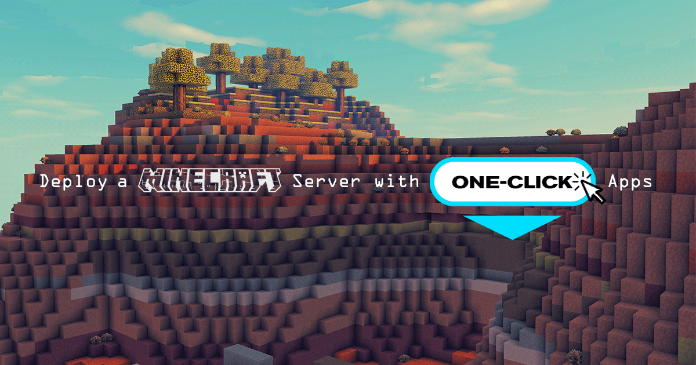
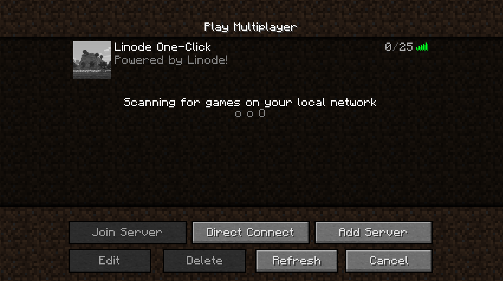

---
author:
  name: Linode Community
  email: docs@linode.com
description: 'Deploy a Minecraft server on Linode using One-Click Apps.'
keywords: ['minecraft','one-click', 'server']
license: '[CC BY-ND 4.0](https://creativecommons.org/licenses/by-nd/4.0)'
published: 2019-04-01
modified: 2019-04-01
modified_by:
  name: Linode
title: "Deploy a Minecraft Server with One-Click Apps"
contributor:
  name: Linode
external_resources:
- '[Minecraft Wiki](https://minecraft.gamepedia.com/Minecraft_Wiki)'
---

## Minecraft One-Click App

With over 100 million users around the world, [Minecraft](https://www.minecraft.net/en-us/) is the most popular online game of all time. You and other players are free to build and explore in a 3D generated world made up of millions of mineable blocks. Collect resources by leveling mountains, taming forests, and venturing out to sea. Choose a home from the varied list of biomes like ice worlds, flower plains, and jungles. Build ancient castles or modern mega cities, and fill them with redstone circuit contraptions and villagers. Fight off nightly invasions of Skeletons, Zombies, and explosive Creepers, or adventure to the End and the Nether to summon the fabled End Dragon and the chaotic Wither. If that is not enough, Minecraft is also highly moddable and customizable. You decide the rules when hosting your own Minecraft server for you and your friends to play together in this highly addictive game.

### Deploy a Minecraft Server One-Click App



The [Minecraft Options](#minecraft-options) section of this guide provides details on all available configuration options for this app.

### Minecraft Options

You can configure your Minecraft Server App by providing values for the following fields:

| **Field**&nbsp;&nbsp;&nbsp;&nbsp;&nbsp;&nbsp;&nbsp;&nbsp;&nbsp;&nbsp; | **Description** |
|:--------------|:------------|
| **World Name** | The world name and it's corresponding file name. *Advanced Configuration*. |
| **Message of the Day** | Text that is displayed whenever a player logs on to the server. *Advanced Configuration*. |
| **Flight Enabled** | Allows flight if there is a mod installed that supports flying. This configuration has no effect on creative mode flight. *Advanced Configuration*. |
| **Nether World Enabled** | Enables the Nether world. *Advanced Configuration*. |
| **Player Achievements Enabled** | Whenever a player unlocks an achievement, it is broadcast to all logged in players. *Advanced Configuration*. |
| **Maximum Players** | Maximum amount of players allowed on the server. *Advanced Configuration*. |
| **Player Idle Timeout Limit** | If not set to *disabled*, the amount of time in minutes a player can be idle before being kicked off of the server. *Advanced Configuration*. |
| **Difficulty Level** | The game difficulty. *Advanced Configuration*. |
| **Hardcore Mode Enabled** | If set to `true`, the difficulty will be set to *Hard*. Additionally, on death the player won't respawn and will be limited to *spectator* mode. *Advanced Configuration*. |
| **PvP Enabled** | Enables player versus player combat on the server. *Advanced Configuration*. |
| **Force Game Mode Enabled** | Forces players to join the server's default game mode. `false` allows players to join with their previous game mode. `true` forces the default game mode.
| **World Type** | Type of world to generate. *Default* = standard, *flat* = featureless and flat, *largebiomes* = larger biomes, *amplified* = larger height limit. *Advanced Configuration*. |
| **World Seed** | A random value used by Minecraft's world generation algorithm to create a unique world. For example: `qazwsx123`. See [Minecraft's Gamepedia](https://minecraft.gamepedia.com/Seed_(level_generation)) entry on seeds for more information. *Advanced Configuration*. |
| **Spawn Animals Enabled** | Determines if animals (sheep, chickens, squid, etc.) will spawn. *Advanced Configuration*. |
| **Spawn Monsters Enabled** | Determines if monsters (creepers, skeletons, spiders, etc.) will spawn. *Advanced Configuration*. |
| **Spawn NPCs Enabled** | Determines if villagers will spawn. *Advanced Configuration*. |
| **Game Mode** | The game mode of the server. *Survival* is the default game mode, *creative* allows for flight and unlimited resources, *adventure* prevents players from destroying blocks, and *spectator* will grant the ability to fly, but will prevent any player interaction on the server. *Advanced Configuration*. |
| **Structure Generation Enabled** | Enables the ability to generate structures like villages and mineshafts. *Advanced Configuration*. |
| **Maximum Build Height** | Maximum height at which players can place blocks. World generation may exceed this limit. *Advanced Configuration*. |
| **Maximum World Size** | Maximum radius of the world, in blocks. *Advanced Configuration*. |
| **View Distance** | The distance a player can see, measured in chunks (16 block cubes). For example, `10` will enable the user to see 10 chunks in any direction. |
| **Command Block Enabled** | Enables the placement of command blocks through the `/give` command. *Advanced Configuration*. |
| **Querying Enabled** | Enables GameSpy4. Used to obtain information about the server. *Advanced Configuration*. |
| **Enable RCON** | Enable remote access (RCON) to the Minecraft server to run commands. *Advanced Configuration*. |
| **RCON Password** | The RCON password. *Advanced Configuration*. |
| **RCON Port** | The port used for RCON. *Advanced Configuration*. |
| **Maximum Tick Time** | The maximum amount of milliseconds a single tick can take before the server considers itself frozen or crashed and will shut down. *Advanced Configuration*. |
| **Network Compression Threshold** | The threshold at which bytes are compressed. *Advanced Configuration*. |
| **Op-permission Level** | Sets the permission level for operators (ops) when using the `/op` command. *Advanced Configuration*. |
| **Port Number** | The server's listening port number. *Advanced Configuration*. |
| **Snooper Enabled** | Determines if the server sends stats to [https://snoop.minecraft.net](https://snoop.minecraft.net). *Advanced Configuration*. |
| **Use Native Transport Enabled** | Improve server performance by optimizing sent and received packets. *Advanced Configuration*. |

### Linode Options

After providing the app specific options, provide configurations for your Linode server:

| **Configuration** | **Description** |
|:--------------|:------------|
| **Select an Image** | Debian 9 is currently the only image supported by Minecraft One-Click Apps, and it is pre-selected on the Linode creation page. *Required*. |
| **Region** | The region where you would like your Linode to reside. In general, it's best to choose a location that's closest to you. For more information on choosing a DC, review the [How to Choose a Data Center](/docs/platform/how-to-choose-a-data-center) guide. You can also generate [MTR reports](/docs/networking/diagnostics/diagnosing-network-issues-with-mtr/) for a deeper look at the network routes between you and each of our data centers. *Required*. |
| **Linode Plan** | Your Linode's [hardware resources](/docs/platform/how-to-choose-a-linode-plan/#hardware-resource-definitions). Your MineCraft App should be sized based on the amount of traffic you expect to see on your server. We recommend 1GB of RAM for every 15 players maximum on your server. For example, If you are expecting a small group of players (between 1-15), you should be okay with a Nanode. Up to 30 players, a 2GB Linode, and so on. *Required*. |
| **Linode Label** | The name for your Linode, which must be unique between all of the Linodes on your account. This name will be how you identify your server in the Cloud Manager’s Dashboard. *Required*. |
| **Root Password** | The primary administrative password for your Linode instance. This password must be provided when you log in to your Linode via SSH. It must be at least 6 characters long and contain characters from two of the following categories: lowercase and uppercase case letters, numbers, and punctuation characters. Your root password can be used to perform any action on your server, so make it long, complex, and unique. *Required*. |

When you've provided all required Linode Options, click on the **Create** button. **MineCraft should install between 5-10 minutes after your Linode has successfully provisioned**.

## Getting Started after Deployment

Ensure that you have [installed Minecraft](https://my.minecraft.net/store/minecraft/) on your personal computer and created a Minecraft user account before getting started with this section.

After Minecraft has finished installing on your Linode, you will be able to access your Minecraft server by copying your Linode's IPv4 address and entering it in the Multiplayer menu on your personal computer's Minecraft installation. To find your Linode's IPv4 address:

1. Click on the **Linodes** link in the sidebar. You will see a list of all your Linodes.

1. Find the Linode you just created when deploying your app and select it.

1. Navigate to the **Networking** tab.

1. Under the **IPv4** heading, you will find your IPv4 address listed under the **Address** column. Copy your IPv4 address.

1. Open Minecraft on your computer and click on **Multiplayer**, then click **Add Server**.

1. Enter a name for your server in the **Server Name** box. This name will show up on the *Play Multiplayer* server selection screen.

1. Paste your IP address in the **Server Address** field and click **Done**:

    

1. Once your server is ready to play on, the status indicator will show a series of green bars.

    

    If there is a red *X* over the status bars, or it says *old*, then your Linode has not finished installing Minecraft. Wait a few minutes, then hit **Refresh**.

### Software Included

The Minecraft One-Click App will install the following required software on your Linode:

| **Software** | **Description** |
|:--------------|:------------|
| [**Minecraft 1.13**](https://www.minecraft.net/en-us/) | Game server. |
| [**LinuxGSM**](https://linuxgsm.com) | A command line tool for the deployment and management of Linux game servers. |
| [**UFW**](https://wiki.ubuntu.com/UncomplicatedFirewall) | Firewall utility. Port 25575 will allow outgoing and incoming traffic. |
| [**Fail2ban**](https://www.fail2ban.org/wiki/index.php/Main_Page) | Fail2Ban is an intrusion prevention software framework that protects computer servers from brute-force attacks. |
