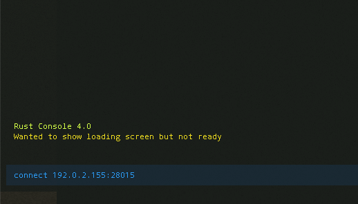

---
author:
  name: Linode Community
  email: docs@linode.com
description: 'Deploy a Rust server on Linode using One-Click Apps.'
keywords: ['rust','one-click', 'server']
license: '[CC BY-ND 4.0](https://creativecommons.org/licenses/by-nd/4.0)'
published: 2019-03-25
modified: 2019-03-25
modified_by:
  name: Linode
title: "Deploy Rust with One-Click Apps"
contributor:
  name: Linode
external_resources:
- '[Rust Dedicated Server Wiki](https://developer.valvesoftware.com/wiki/Rust_Dedicated_Server)'
---

## Rust One-Click App

[Rust](https://rust.facepunch.com/) is a multiplayer game where you play as a survivor that must work with or against other players to ensure your own survival. Players are able to steal, lie, cheat, or trick each other. You can build a shelter, hunt animals for food, craft weapons and armor, and much more.

Hosting your own Rust server allows you to customize settings and curate the number of players in the world.

### Deploy a Rust One-Click App



The [Rust Options](#rust-options) section of this guide provides details on all available configuration options for this app.

### Rust Options

You can configure your Rust App by providing values for the following fields:

| **Field** | **Description** |
|:--------------|:------------|
| **RCON Password** | The password for your remote console, which allows you to issue commands on the Rust server *Required*. |
| **Server Hostname** | The name of your Rust server. *Advanced Options* |
| **Server Description** | Your server's description. Use `\n` to create a new line. *Advanced Options* |
| **Maximum Players** | The maximum number of players allowed on a server at one time. Default is 50, minimum is 10, maximum is 100. *Advanced Options* |
| **World** | Sets the type of map to generate. Options are Procedural Map, Barren, Hapis Island, Savas Island. *Advanced Options*.
| **World Size** | The size of the world map. Default is 3000, minimum is 1000, maximum is 8000. *Advanced Options* |
| **Seed** | A random numeric seed used by the world generation algorithm to create a unique world. The maximum value is 4,294,967,295. *Advanced Options* |
| **Global Chat Enabled** | Enables global chat. Chat messages will be broadcast to all players. *Advanced Options* |
| **PvE Enabled** | Allow player vs. environment combat. *Advanced Options* |

### Linode Options

After providing the app specific options, provide configurations for your Linode server:

| **Configuration** | **Description** |
|:--------------|:------------|
| **Select an Image** | Debian 9 is currently the only image supported by Rust One-Click Apps, and it is pre-selected on the Linode creation page. *Required*. |
| **Region** | The region where you would like your Linode to reside. In general, it's best to choose a location that's closest to you. For more information on choosing a DC, review the [How to Choose a Data Center](/docs/platform/how-to-choose-a-data-center) guide. You can also generate [MTR reports](/docs/networking/diagnostics/diagnosing-network-issues-with-mtr/) for a deeper look at the network routes between you and each of our data centers. *Required*. |
| **Linode Plan** | Your Linode's [hardware resources](/docs/platform/how-to-choose-a-linode-plan/#hardware-resource-definitions). Your Rust server should be sized based on the amount of traffic you are expecting on your server as well as the game play performance you are looking for. We recommend using a 8GB Linode as the smallest plan to ensure good performance of your game server. A 8GB Dedicated plan will provide better game performance. If you decide that you need more or fewer hardware resources after you deploy your app, you can always [resize your Linode](/docs/platform/disk-images/resizing-a-linode/) to a different plan. *Required*. |
| **Linode Label** | The name for your Linode, which must be unique between all of the Linodes on your account. This name will be how you identify your server in the Cloud Manager’s Dashboard. *Required*. |
| **Root Password** | The primary administrative password for your Linode instance. This password must be provided when you log in to your Linode via SSH. It must be at least 6 characters long and contain characters from two of the following categories: lowercase and uppercase case letters, numbers, and punctuation characters. Your root password can be used to perform any action on your server, so make it long, complex, and unique. *Required*. |

When you've provided all required Linode Options, click on the **Create** button. **Rust should install between 5-15 minutes after your Linode has successfully provisioned**.

## Getting Started after Deployment

Ensure that you have installed Rust to your computer before getting started with this section. You can install Rust from [Steam's Web Store](https://store.steampowered.com/).

After the Rust One-Click App has finished deploying to your Linode, you will be able to access your Rust server by copying your Linode's IPv4 address and entering it in to the Rust game installed on your computer. To find your Linode's IPv4 address:

1. Click on the **Linodes** link in the sidebar. You will see a list of all your Linodes.

2. Find the Linode you just created when deploying your app and select it.

3. Navigate to the **Networking** tab.

4. Under the **IPv4** heading, you will find your IPv4 address listed under the **Address** column.

5. Copy the IPv4 address. Open Rust, and then open the developer's console by pressing `f1`.

6. In the console, type `connect 192.0.2.155:28015` and replace 192.0.2.155 with your Linode's IP address. Be sure append the port `28015` to the end of the IP address. Press **enter** when you are done typing.

    <!---->

    You will be logged into the server, and the game will load.

### Software Included

The Rust One-Click App will install the following required software on your Linode:

| **Software**&nbsp;&nbsp;&nbsp;&nbsp;&nbsp;&nbsp;&nbsp; | **Description** |
|:--------------|:------------|
| [**Rust Server**](https://store.steampowered.com/app/252490/Rust/) | Game server. |
| [**LinuxGSM**](https://linuxgsm.com) | A command line tool for the deployment and management of Linux game servers. |
| [**UFW**](https://wiki.ubuntu.com/UncomplicatedFirewall) | Firewall utility. Ports 28015 and 28016 will allow outgoing and incoming traffic. |
| [**Fail2ban**](https://www.fail2ban.org/wiki/index.php/Main_Page) | Fail2Ban is an intrusion prevention software framework that protects computer servers from brute-force attacks. |
