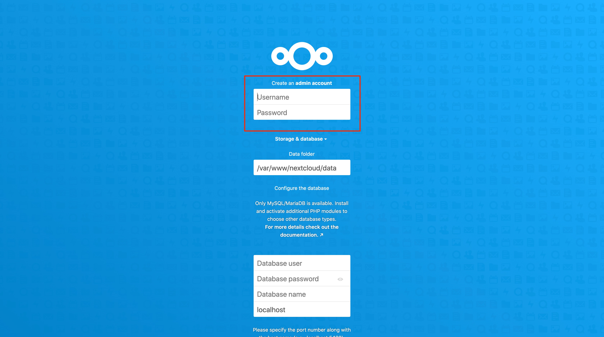
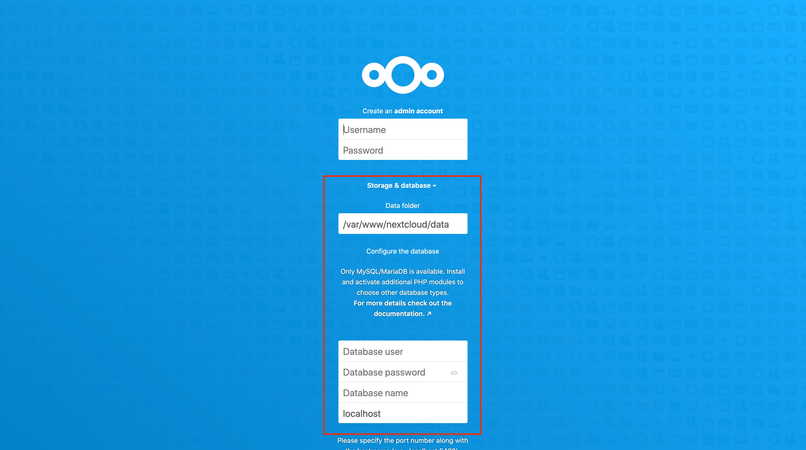

---
author:
  name: Linode Community
  email: docs@linode.com
description: 'Nextcloud is a file sharing service that allows you to store your important documents and images in one centralized location. The Nextcloud One-Click App will deploy a Nextcloud server instance. Once deployed, you can immediately access your Nextcloud instance and begin uploading and sharing files.'
og_description: 'Nextcloud is a file sharing service that allows you to store your important documents and images in one centralized location. The Nextcloud One-Click App will deploy a Nextcloud server instance. Once deployed, you can immediately access your Nextcloud instance and begin uploading and sharing files.'
keywords: ['Nextcloud','oone-click','file sharing']
license: '[CC BY-ND 4.0](https://creativecommons.org/licenses/by-nd/4.0)'
published: 2020-06-11
modified_by:
  name: Linode
title: "How to Deploy Nextcloud on Linode with One-click Apps"
h1_title: "Deploying Nextcloud on Linode with One-Click Apps"
contributor:
  name: Linode
external_resources:
- '[Nextcloud Documentation Overview](https://docs.nextcloud.com/)'
---

[Nextcloud](https://nextcloud.com/) is an open source solution to file hosting and sharing. With Nextcloud, you can synchronize files from your local computer to your Linode server and share them with your collaborators. Nextcloud’s customizable security features and intuitive user interface help to keep your files safe and easy to manage.

## Before You Begin

While a Domain Name is not strictly required, it is recommended. If you will be using a domain name for your deployment, the following steps must be completed before proceeding:

1. [Create a Linode API v4 access token](/docs/platform/api/getting-started-with-the-linode-api/#get-an-access-token). The Nextcloud One-Click App needs a Linode API v4 token to create a domain name system (DNS) record for your Nextcloud instance.

1. Register (purchase) a domain name.

1. Set your domain name to [use Linode’s name servers](/docs/platform/manager/dns-manager/#use-linode-s-name-servers-with-your-domain). You’ll need to do this on your domain registrar’s website and then wait up to 24 hours for the change to take effect.

### Deploy a NextCloud One-Click App



### NextCloud Options

| **Field** | **Description** |
|-----------|-----------------|
| **MySQL database root password** | The root user's password for your Nextcloud database. *Required*. |
| **MySQL user password** | Your new MySQL user's password. *Required*. |

#### Advanced Options
##### LAMP Stack Options
| **Field** | **Description** |
|-----------|-----------------|
| **MySQL database username** | The name of a new MySQL user to create. If no value is provided, the user will be named `nextcloud`. *Required*. |
| **MySQL database name** | The name to assign to your Nextcloud instance's MySQL database. If no value is provided, the database will be named `nextcloud`. *Required*. |

##### Linode Server Security Options

| **Field** | **Description** |
|-----------|-----------------|
| **Linode limited sudo username** | The username for a new limited user account with sudo privileges. *Advanced Configuration*. |
| **Linode limited user password** | The password for the new limited user account. *Advanced Configuration*. |
| **SSH Public Key** | A public key belonging to the user that will access the Linode. If you do not have an authentication key-pair see the [Securing Your Server](#create-an-authentication-key-pair) guide for steps on creating one. *Advanced Configuration*. |
| **Enable passwordless sudo** | Enable passwordless sudo access for the limited user account. *Advanced Configuration*. |
| **Disable root access** | Disable root user access for your Linode. *Advanced Configuration*. |

##### Domain Options

| **Field** | **Description** |
|-----------|-----------------|
| **Linode API v4 token** | Your [Linode API v4](https://developers.linode.com/api/v4) token. The token is needed to create a domain name system (DNS) record for your Nextcloud instance. See the [Getting Started with the Linode API](/docs/platform/api/getting-started-with-the-linode-api/#get-an-access-token) guide to learn how to generate an API token. *Advanced Configuration*. |
| **Linode hostname** | The hostname to assign to your Linode. If no value is provided, the hostname will be `nextcloud`. *Advanced Configuration*. |
| **Domain name** | The domain name to use when creating a DNS record for your Linode. The One-Click app will create a subdomain named `nextcloud`. You can access your Nextcloud instance using the `nextcloud` subdomain; for example, `www.nextcloud.example.com`. *Advanced Configuration*. |
| **Admin email address** | The email address to use for your Nextcloud instance's admin user. *Advanced Configuration*. |
| **Enable SSL** |  Enable a free [HTTPS CertBot SSL certificate](https://certbot.eff.org/) on your Nextcloud domain. If no value is provided, `no` will be selected by default.  *Advanced Configuration*. |
| **Timezone** | The timezone to use for your Linode. If no value is provided, the Linode data center's timezone will be used. Refer to [TZ database names](https://en.wikipedia.org/wiki/List_of_tz_database_time_zones) for possible timezone values. *Advanced Configuration*. |

### Linode Options

After providing the app specific options, provide configurations for your Linode server:

| **Configuration** | **Description** |
|:--------------|:------------|
| **Select an Image** | Debian 10 is currently the only image supported by the Nextcloud One-Click App, and it is pre-selected on the Linode creation page. *Required*. |
| **Region** | The region where you would like your Linode to reside. In general, it's best to choose a location that's closest to you. For more information on choosing a DC, review the [How to Choose a Data Center](/docs/platform/how-to-choose-a-data-center) guide. You can also generate [MTR reports](/docs/networking/diagnostics/diagnosing-network-issues-with-mtr/) for a deeper look at the network routes between you and each of our data centers. *Required*. |
| **Linode Plan** | Your Linode's [hardware resources](/docs/platform/how-to-choose-a-linode-plan/#hardware-resource-definitions). You should select a Linode plan type based on the amount of data you would like to store on your Nextcloud instance. You can always [resize your Linode](/docs/platform/disk-images/resizing-a-linode/) to a different plan later if you feel you need to increase or decrease your system resources. *Required*. |
| **Linode Label** | The name for your Linode, which must be unique between all of the Linodes on your account. This name will be how you identify your server in the Cloud Manager’s Dashboard. *Required*. |
| **Add Tags** | A tag to help organize and group your Linode resources. [Tags](/docs/quick-answers/linode-platform/tags-and-groups/) can be applied to Linodes, Block Storage Volumes, NodeBalancers, and Domains. |
| **Root Password** | The primary administrative password for your Linode instance. This password must be provided when you log in to your Linode via SSH. It must be at least 6 characters long and contain characters from two of the following categories: lowercase and uppercase case letters, numbers, and punctuation characters. Your root password can be used to perform any action on your server, so make it long, complex, and unique. *Required*. |

When you've provided all required Linode Options, click on the **Create** button. **Your Nextcloud app will complete installation anywhere between 2-5 minutes after your Linode has finished provisioning**.

## Getting Started after Deployment
### Log Into Your Nextcloud Instance

The Nextcloud One-Click App will create

1. Open a browser window and navigate to your Nextcloud instance's domain. For example, enter `nextcloud.example.com` into the browser, replacing `example.com` with the value of your own domain. If you did not install the App with a domain name, the domain will be the public IP address of your Linode appended with a forward slash and "nextcloud. An example of this would be `192.168.17.43/nextcloud/`.

1. Create a Nextcloud admin account by providing values in the presented form.

      

1. In the **Storage & database** section, provide the MySQL database values you used in the [Nextcloud Options](#nextcloud-options) section.

      

1. Click on the **Finish setup** button to complete the configuration. The set up will take a couple of minutes to complete. You will then be taken to the Nextcloud Hub where you can begin uploading files to your Nextcloud server.

      

### Next Steps



- Install the [Nextcloud desktop synchronization client](https://docs.nextcloud.com/desktop/2.3/installing.html) to your local computer to easily synch your desktop files to your Nextcloud server.