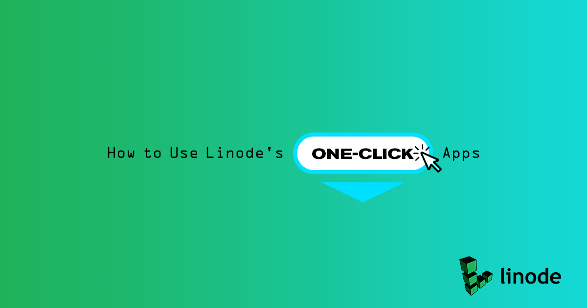
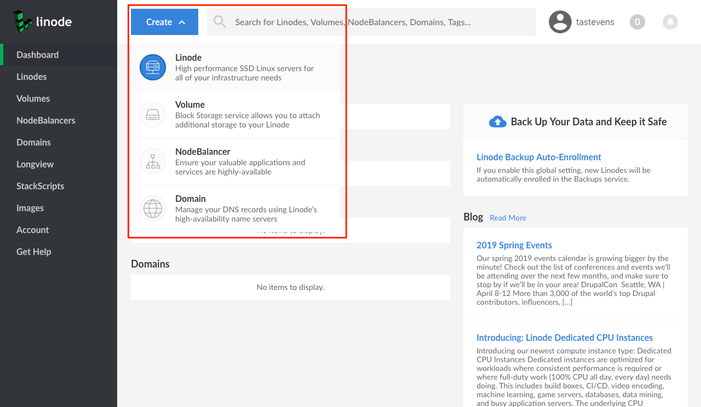
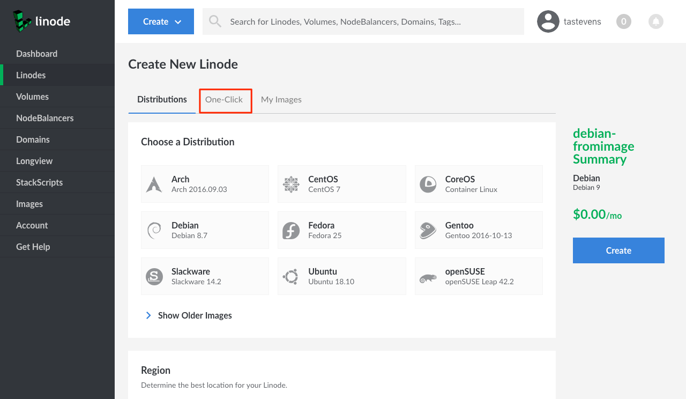
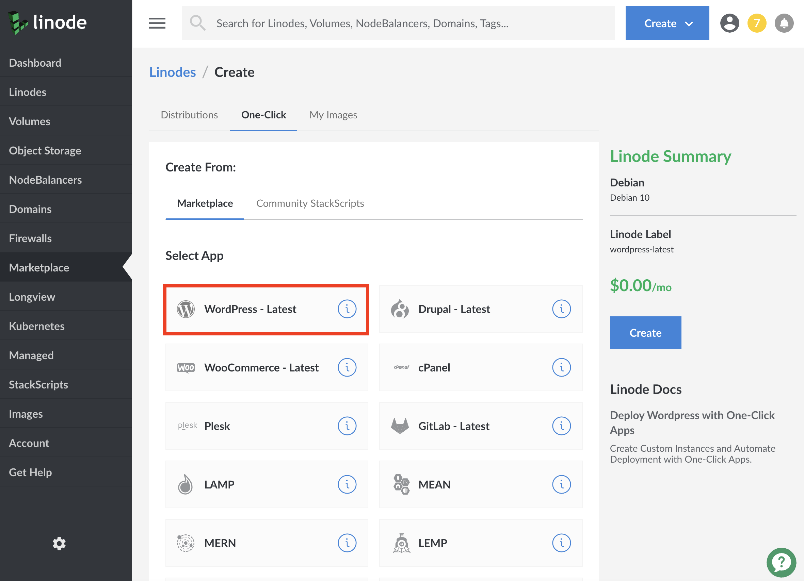
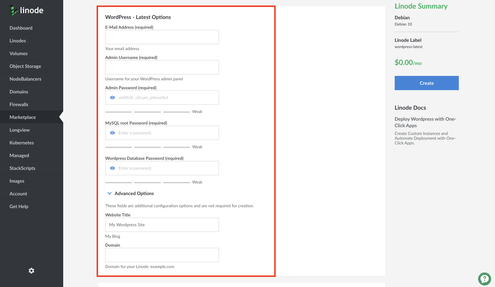
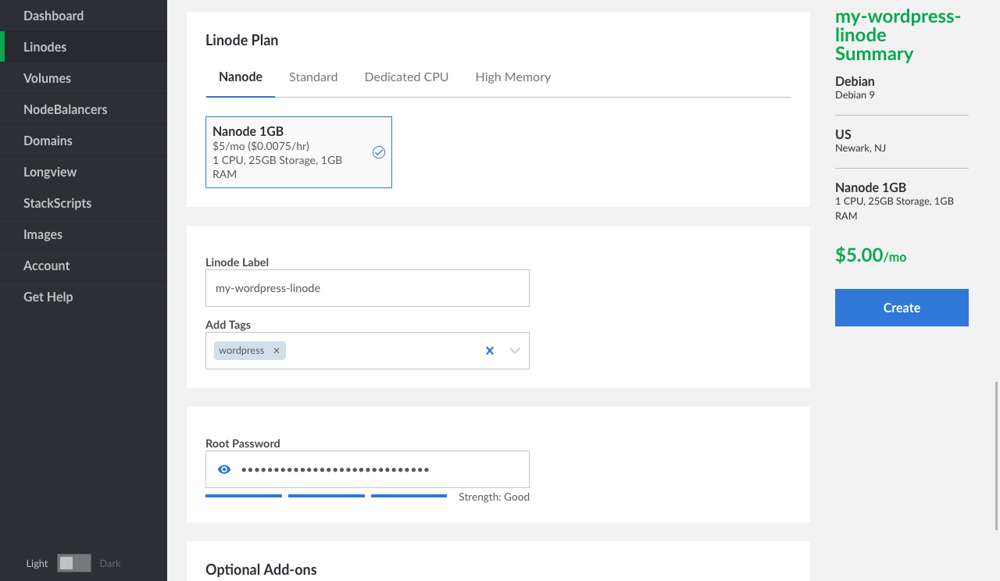
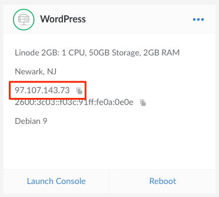
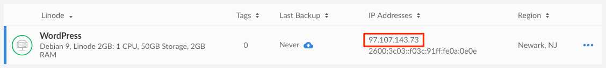
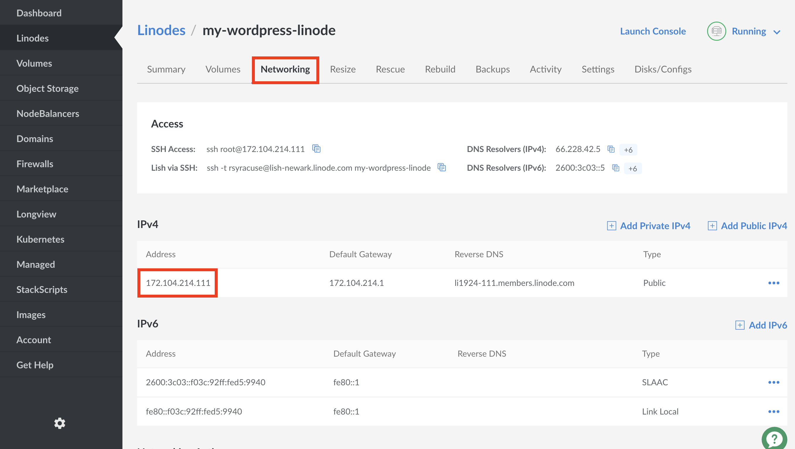

---
author:
  name: Linode Community
  email: docs@linode.com
description: 'How to deploy a One-Click App using the Linode Cloud Manager.'
keywords: ['manager','cloud','app','one click']
license: '[CC BY-ND 4.0](https://creativecommons.org/licenses/by-nd/4.0)'
published: 2019-03-26
modified: 2019-03-26
modified_by:
  name: Linode
title: "How to Use Linode's One-Click Apps"
contributor:
  name: Linode
---

One-Click Apps help you easily deploy and configure software on a Linode from a list of various apps that are built into the Linode [Cloud Manager](https://cloud.linode.com), without the hassle of using the command line. Of course, you'll still have full access to your Linode if you want to log in to your server and have a more hands-on approach later on.

When a One-Click App is deployed, a new Linode is created and the appropriate software is installed with the configurations you provide. One-Click Apps does not install software to already-existing Linodes in your account. This guide presents instructions for where to find One-Click Apps in the Cloud Manager and how deploy WordPress blogs, WooCommerce stores, your favorite game servers, and more.

## Deploying an App

1.  Log in the the Linode [Cloud Manager](https://cloud.linode.com).

1.  Click **Create** at the top of the screen and choose **Linode** from the dropdown menu that appears:

    

1. The Linode creation page will appear. Select the **One-Click** tab:

    

1.  The **Create From** section of the page's form will appear. Ensure that the **One-Click Apps** tab is selected in this section:

    

1.  Select the app you would like to create. For this example, WordPress will be selected:

    

1.  After the **Select App** section you'll find a new section with additional configuration options specific to your app. Fill out the required options; they will be marked with an asterisk. In the case of WordPress, you'll find fields for the WordPress administrator's username, password, and e-mail address.

    

    You can fill out additional options by clicking on **Show Advanced Options**. For the WordPress example, this option is the site's title.

1.  The **Select an Image** section displays that Debian is pre-selected. This is the underlying operating system that your Linode will run.

1.  Under the **Region** section, choose which data center you would like your app to be deployed. Choose a region that is close to your audience's geographic location. When you are closer to your data center, your network speeds will generally be higher, and your network latency will be lower.

1.  Choose which plan you'd like to use under the **Linode Plan** section. Your plan specifies the hardware resources assigned to your server. The resources that you need are determined by the requirements of your app. Linode's plans are split into four types: Nanode, Standard, Dedicated CPU, and High Memory.

    For small sites like WordPress blogs a 1GB Nanode is usually enough, and for video game servers a 2GB or 4GB Standard Linode is often a good choice. Some game servers may benefit from the Dedicated CPU plans. Our [How to Choose a Linode Plan](/docs/platform/how-to-choose-a-linode-plan/) guide presents more information about the different use-cases for each plan.

    
You can always upgrade your Linode later if you need more memory, CPU cores, or any of the other hardware resources. Also, you can downgrade your plan if you think you don't need as much as you're currently using. Furthermore, you can change plan types entirely, like going from a Standard Linode to a Dedicated CPU Linode.

Review the [Resizing a Linode](/docs/platform/disk-images/resizing-a-linode/) guide for upgrading and downgrading instructions. When downgrading your plan, the size of your Linode's disk must fit within the new plan's disk space allocation.


1.  For this example, a 1GB Nanode is selected.

    

1.  Create a label and (optionally) select tags for your Linode. The label is your Linode's name and must be unique among all the Linodes on your account. [Tags](/docs/quick-answers/linode-platform/tags-and-groups/) are used to organize your Linodes within the Cloud Manager.

1.  Create a root password. This is **not** the password for your WordPress site, game, or other application. Instead, this is the password for the Linode server. You will need it if you ever decide to perform maintenance on your server in the future.

    It is strongly recommended that you create a long, complex, and unique password and store it somewhere secure for future reference. If you forget your root password, check out our [Reset the Root Password on Your Linode](/docs/quick-answers/linode-platform/reset-the-root-password-on-your-linode/) guide to create a new one.

    
A strong password is the first step in securing your server and avoiding potential vulnerabilities for anyone trying to exploit your server. For more information on securing your server, check out our [How to Secure Your Server](/docs/security/securing-your-server/) guide.


1.  Click **Create**. You will be taken to the Linode's Dashboard where you can monitor the status of your Linode's creation.

    Once your Linode has been created, the Cloud Manager will then start to deploy your app in the background. **This will take several minutes**. Once your app has been deployed it will be available at the IP address of the Linode you created. If you visit your IP address before the app is ready, try again a few minutes later.

## Accessing Your App

Depending on the type of app you created, the app will be accessible in different ways. All the ways to access your app require the IP address of your Linode. Follow the instructions below to find your IP address.

1.  Log in to the [Cloud Manager](https://cloud.linode.com).

1.  Navigate to the Linodes page by clicking on the **Linodes** link in the sidebar.

1.  Find the Linode that you created. The IP address is a series of four numbers separated by periods. In the grid view of the Linodes page, your IP address will be located underneath the data center name for your Linode:

    

1.  In list view, your IP address will be under the **IP Addresses** column in the row that lists your Linode:

    

1.  Alternatively, you can find your IP address by navigating to the **Networking** tab of your Linode's detail page. The address is displayed under the **Address** column in the **IPv4** table:

    

1. Copy your IP address. For apps like WordPress, WooCommerce, and Drupal, you can navigate to the IP address in your browser to visit your installation. For game servers, connect to the IP address in-game to play on your new server. Other apps like MERN, LAMP, and WireGuard will require you to SSH into your Linode to access or provide more customized configurations.

## Adding a Domain Name for Your App

For websites like WordPress, WooCommerce, and Drupal, it's much more desirable to have a domain name rather than using an IP address to access your app.

For information on how to add a domain name to your app, visit our [DNS Manager](/docs/platform/manager/dns-manager/) guide. Specifically, you will want to [set up an *A record*](/docs/platform/manager/dns-manager/#add-dns-records) and assign your IP address to it. For more general information about how DNS works, review the the [DNS Records: An Introduction](/docs/networking/dns/dns-records-an-introduction/) guide.

## Connecting to your Server Remotely

Every One-Click App is deployed to its own Linode instance, and you can access the operating system for your app's server if you choose to. To gain command-line access to your server, [log in using a Secure Shell (SSH) client](/docs/getting-started/#connect-to-your-linode-via-ssh) on your computer.

When logging in over SSH, use `root` as the username, and supply the root password that you specified when you deployed your app. Follow our [Getting Started guide](/docs/getting-started/#connect-to-your-linode-via-ssh) to learn more about connecting to your Linode via SSH. If you use Windows at home, our [Using SSH on Windows](/docs/networking/ssh/using-ssh-on-windows/) guide has special instructions for Windows SSH clients. If you're new to Linux, some of the guides in our [Linux](/docs/quick-answers/linux/) and [Linux Essentials](/docs/quick-answers/linux-essentials/) sections may be useful.
