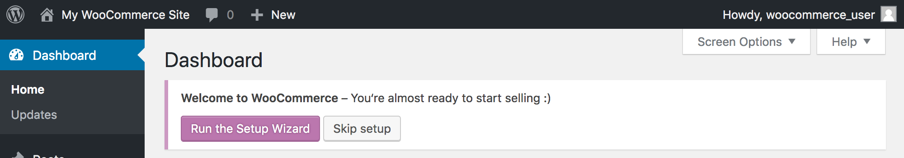

---
author:
  name: Linode Community
  email: docs@linode.com
description: 'Use One-Click Apps to deploy a Linode running WordPress and the popular eCommerce plugin, WooCommerce.'
keywords: ['woocommerce','wordpress','one-click apps','ecommerce','e-commerce','cms']
license: '[CC BY-ND 4.0](https://creativecommons.org/licenses/by-nd/4.0)'
published: 2019-04-02
modified_by:
  name: Linode
title: "Deploy WooCommerce with One-Click Apps"
contributor:
  name: Linode
external_resources:
- '[WooCommerce Docs](https://docs.woocommerce.com/)'
- '[Introduction to eCommerce for WordPress](https://woocommerce.com/guides/ecommerce-for-wordpress-intro/)'
- '[New Store Owners Guide](https://woocommerce.com/guides/new-store/)'
- '[WooCommerce Storefront Theme](https://woocommerce.com/storefront/)'
- '[WooCommerce Themes by Industry](https://woocommerce.com/product-category/themes/storefront-child-theme-themes/)'
- '[WooCommerce Extensions](https://woocommerce.com/product-category/woocommerce-extensions/)'
---
## WooCommerce One-Click App

[WooCommerce](https://woocommerce.com/) is a popular open source eCommerce plugin for WordPress that can power online storefronts to sell both digital and physical products for small-to-large businesses. A variety of [themes for WooCommerce](https://woocommerce.com/product-category/themes/storefront-child-theme-themes/) are available so you can create a store that looks the way you want it to.  WooCommerce takes payments via major credit cards, bank transfers, [PayPal](https://woocommerce.com/products/woocommerce-gateway-paypal-checkout/), and other providers like [Stripe](https://woocommerce.com/products/stripe/). The WooCommerce plugin is free, but some themes and extensions have a cost.

## Deploy WooCommerce with One-Click Apps



### WooCommerce Options

| **Field** | **Description** |
|--------------|------------|
| **Admin Username** | Username for your WordPress admin user. WooCommerce is managed through the [WordPress administrative interface](https://codex.wordpress.org/Administration_Screens). *Required*. |
| **Admin Password** | Password for your WordPress admin user. *Required*. |
| **Email Address** | Email address for your WordPress admin user. *Required*. |
| **Website Title** | The title that will appear at the top of your WooCommerce site. *Advanced Options*. |

### Linode Options

After providing the app specific options, provide configurations for your Linode server:

| **Configuration** | **Description** |
|-------------------|-----------------|
| **Select an Image** | Debian 9 is currently the only image supported by the WooCommerce One-Click App, and it is pre-selected on the Linode creation page. *Required* |
| **Region** | The region where you would like your Linode to reside. In general, it's best to choose a location that's closest to you. For more information on choosing a DC, review the [How to Choose a Data Center](/docs/platform/how-to-choose-a-data-center) guide. You can also generate [MTR reports](/docs/networking/diagnostics/diagnosing-network-issues-with-mtr/) for a deeper look at the network routes between you and each of our data centers. *Required*.* |
| **Linode Plan** | Your Linode's [hardware resources](/docs/platform/how-to-choose-a-linode-plan/#hardware-resource-definitions). As a plugin for WordPress, WooCommerce is an extremely flexible CMS that can be supported on any size Linode. We suggest you build your WooCommerce app on a Linode plan that reflects how much content you plan on featuring, as well as how much traffic you plan on having on your site. For small sites, a 1GB Nanode or a 2GB Linode should be enough. If you decide that you need more or fewer hardware resources after you deploy your app, you can always [resize your Linode](/docs/platform/disk-images/resizing-a-linode/) to a different plan. *Required* |
| **Linode Label** | The name for your Linode, which must be unique between all of the Linodes on your account. This name will be how you identify your server in the Cloud Manager’s Dashboard. *Required*. |
| **Root Password** | The primary administrative password for your Linode instance. This password must be provided when you log in to your Linode via SSH. It must be at least 6 characters long and contain characters from two of the following categories: lowercase and uppercase case letters, numbers, and punctuation characters. Your root password can be used to perform any action on your server, so make it long, complex, and unique. *Required* |

When you've provided all required Linode Options, click on the **Create** button. **Your WooCommerce app will complete installation anywhere between 2-5 minutes after your Linode has finished provisioning.** After WooCommerce has finished installing, a confirmation email will be sent to the email address you provided during configuration, at which point you will be able to [access your site](#getting-started-after-your-deployment).

## Getting Started After Deployment

### Access Your WooCommerce Site

After WooCommerce and WordPress have finished installing, you will be able to access your site by copying your Linode's IPv4 address and entering it in the browser of your choice. To find your Linode's IPv4 address:

1. Click on the **Linodes** link in the sidebar. You will see a list of all your Linodes.

1. Find the Linode you just created when deploying your app and select it.

1. Navigate to the **Networking** tab.

1. Your IPv4 address will be listed under the **Address** column in the **IPv4** table.

1. Copy and paste the IPv4 address into a browser window. You should see your WooCommerce site's home page.

1.  Once you have accessed your site via the browser, you can log in to the WordPress administrative interface and [start configuring your store](#complete-the-woocommerce-setup-wizard).

    The address of the WordPress login page is `http://< your IP address >/wp-login.php`. Or, you can click on the log in link that's visible on your site's home page, as highlighted below. Enter the credentials you previously specified in the **Admin Username** and **Admin Password** fields when you deployed the app.

    

### Set up a Domain for your Site

If you own a domain name, you can assign it (or a subdomain) to your WooCommerce site. Specifically, you will need to set up an [*A record*](/docs/networking/dns/dns-records-an-introduction/#a-and-aaaa) that's associated with your Linode's IP address. To learn how to set up DNS records in the Cloud Manager, review the [DNS Manager](/docs/platform/manager/dns-manager/) guide. For more general information about how DNS works, review the [DNS Records: An Introduction](/docs/networking/dns/dns-records-an-introduction/) guide.

Once you have set up DNS for your site, you will be able to visit it by entering your domain or subdomain in your browser. At this point, you should also update the [WordPress Address and Site URL settings](https://codex.wordpress.org/Changing_The_Site_URL) for your site:

1.  Log in to your WordPress admin interface as described in the previous section.

1.  Click on the **Settings** link in the sidebar, then click on the **General** option from the dropdown menu that appears.

    

1.  The **General Settings** form will appear. Update the **WordPress Address** and **Site URL** fields with the domain or subdomain you assigned to your site. Specifically, the value for both fields should be `http://example.com`, where `example.com` is replaced by your domain or subdomain.

1.  Click the **Save Changes** button at the bottom of the form.

### Complete the WooCommerce Setup Wizard

When you first log in to the WordPress admin interface, you will be presented with a banner that asks you to complete the WooCommerce setup wizard:

Click on the **Run the Setup Wizard** button to visit this form and start your store configuration.

### Software Included

| **Software** | **Description** |
|:--------------|:------------|
| [**MySQL Server**](https://www.mysql.com/) | Relational database. |
| [**PHP 7**](https://www.php.net/) | WordPress is written in PHP and requires PHP to operate. |
| [**Apache HTTP Server**](https://httpd.apache.org/) | Web server used to serve the WordPress site. |
| [**WordPress**](https://wordpress.org/) | Content management system. |
| [**WP CLI**](https://wp-cli.org/) | The command line interface for WordPress. |
| [**WooCommerce**](https://woocommerce.com/) | An online storefront plugin for WordPress. |
