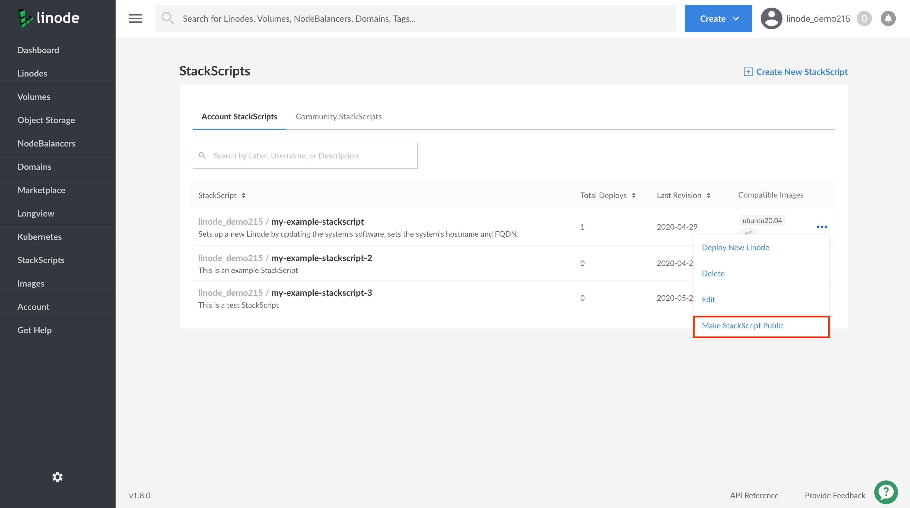

---
author:
  name: Linode
  email: docs@linode.com
description: 'Develop StackScripts  to create sustom Instances and automate deployments.'
og_description: 'Develop StackScripts  to create sustom Instances and automate deployments.'
keywords: ["automation", "develop", "cloud", "custom instance", "scripts"]
license: '[CC BY-ND 4.0](https://creativecommons.org/licenses/by-nd/4.0)'
modified: 2020-04-22
modified_by:
  name: Linode
published: 2020-04-22
title: Create and Manage StackScripts - A Tutorial
h1_title: A Tutorial for Creating and Managing StackScripts
external_resources:
  - '[StackScript Community Library](http://linode.com/stackscripts)'
---

## What are StackScripts?

[StackScripts](http://linode.com/stackscripts/) provide Linode users with the ability to automate the deployment of custom systems on top Linode's default Linux distribution images. For example, every time you deploy a new Linode you might execute the same tasks, like updating your system's software, installing your favorite Linux tools, and adding a limited user account. These tasks can be automated using a StackScript that will perform these actions for you as part of your Linode's first boot process.

All StackScripts are stored in the Linode Cloud Manager and can be accessed whenever you deploy a Linode. A StackScript authored by you is an *Account StackScript*. While a *Community StackScript* is a StackScript created by a Linode community member that has made their StackScript publicly available in the Linode Cloud Manager.

### In this Guide

This guide will show you how to do the following:

- [Create a new StackScript](#create-a-new-stackscript)
- [Edit an Account StackScript](#edit-an-account-stackscript)
- [Make your Account StackScript Public](#make-an-account-stackscript-public)
- [Delete an Account StackScript](#delete-an-account-stackscript)


For information on authoring a script to be used in a Linode StackScript, see the Writing a Script for Linode's StackScripts


## Create a New StackScript


Prior to creating a new StackScript in the Cloud Manager, it is recommended that you review the [Developing a StackScript]() section of this guide. You may consider writing the contents of your script prior to completing the steps in this section.


1. Log into the [Linode Cloud Manager](https://cloud.linode.com/).

1. Click on the **StackScripts** link in the left-hand navigation menu. You will be brought to the *StackScripts* page.

      

1. Viewing the **Account StackScripts** section, click on the **Create New StackScript** link at the top of the page.

      

1. On the **Create New StackScript** page, provide the required configurations to create your StackScript.

    | **Field**| **Description** |
    |:-----------------|:---------------------|
    | **StackScript Label** | The name with which to identify your StackScript. *Required*. |
    | **Description** | An overview of what your StackScript does. |
    | **Target Images** | The Linux distributions that can run this StackScript. *Required*.|
    | **Script** | The body of the script. See the [Developing a StackScript]() section for helpful tips on writing a script for use with StackScripts. *Required*. |
    | **Revision Note** | A short description of the updates made to your StackScript in this version of your script.|

    
The file below displays an example of a simple script that executes some basic set up steps on a Linode. Review the example's comments for details on what each line of the script does.


#!/bin/bash
# This block defines the variables the user of the script needs to provide
# when deploying using this script.
#
#
#<UDF name="hostname" label="The hostname for the new Linode.">
# HOSTNAME=
#
#<UDF name="fqdn" label="The new Linode's Fully Qualified Domain Name">
# FQDN=

# This sets the variable $IPADDR to the IP address the new Linode receives.
IPADDR=$(/sbin/ifconfig eth0 | awk '/inet / { print $2 }' | sed 's/addr://')

# This updates the packages on the system from the distribution repositories.
apt-get update
apt-get upgrade -y

# This section sets the hostname.
echo $HOSTNAME > /etc/hostname
hostname -F /etc/hostname

# This section sets the Fully Qualified Domain Name (FQDN) in the hosts file.
echo $IPADDR $FQDN $HOSTNAME >> /etc/hosts

    

1. Click **Save** when you are done. You can always edit your script later if needed. You will be brought back to the **StackScripts** page, where your new StackScript will be visible and ready to use with a new Linode deployment.

    
To deploy a new Linode with your StackScript, follow the steps in the [Deploying a New Linode Using a StackScript](/docs/platform/stackscripts/deploying-stackscripts/#deploy-a-linode-from-an-account-stackscript) guide.
    

    

## Manage StackScripts
### Edit an Account StackScript

After you've created an Account StackScript, you can go back and edit it as required. This section will show you how to access a StackScript for editing.

1. Log into the [Linode Cloud Manager](https://cloud.linode.com/).

1. Click on the **StackScripts** link in the left-hand navigation menu. You will be brought to the *StackScripts* page.

      

1. Viewing the **Account StackScripts** tab, you will see a list of all of your account's StackScripts. This will include both private and public StackScripts. Click on the **more options ellipsis** corresponding to the StackScript you'd like to modify and select **Edit** from the dropdown menu.

      

1. On your StackScript's *Edit page*, modify it as needed and click **Save** to keep your changes.

### Make an Account StackScript Public

You can make any of your Account StackScripts public. When an account StackScript is public it will become available to the rest of the Linode Community in the Cloud Manager as a Community StackScript.


Once you make an Account StackScript public, you will not be able to make it private again or to delete it. You can, however, edit your public StackScript, if needed.


1. Log into the [Linode Cloud Manager](https://cloud.linode.com/).

1. Click on the **StackScripts** link in the left-hand navigation menu. You will be brought to the *StackScripts* page.

      

1. Viewing the **Account StackScripts** tab, you will see a list of all of your account's StackScripts. This will include both private and public StackScripts. Click on the **more options ellipsis** corresponding to the StackScript you'd like to make public and select **Make StackScript Public** from the dropdown menu.

      

    A dialog box will appear asking you to confirm the action. Click on **Yes, make me a star!** if you would like to proceed. You will be brought back to the Account StackScripts page.

    
Your public [Account StackScript](/docs/platform/stackscripts/deploying-stackscripts/#account-stackscripts) will be available to you for use as an Account StackScripts page. For Linode Community members, your StackScript will be available to them as a [Community StackScripts](/docs/platform/stackscripts/deploying-stackscripts/#community-stackscripts) page.
    

### Delete an Account StackScript


You cannot delete Account StackScripts that have been [made public](#make-an-account-stackscript-public).


1. Click on the **StackScripts** link in the left-hand navigation menu. You will be brought to the *StackScripts* page.

      

1. Viewing the **Account StackScripts** tab, you will see a list of all of your account's StackScripts. Click on the **more options ellipsis** corresponding to the StackScript you'd like to delete and select **Delete** from the dropdown menu.

      

    A dialog box will appear asking you to confirm the action. Click on **Delete** if you would like to proceed.

## Next Steps

Now that you have created a StackScript, you can deploy a Linode using your StackScript. See the [Deploying a New Linode Using a StackScript](/docs/platform/stackscripts/deploying-stackscripts/) guide for details.