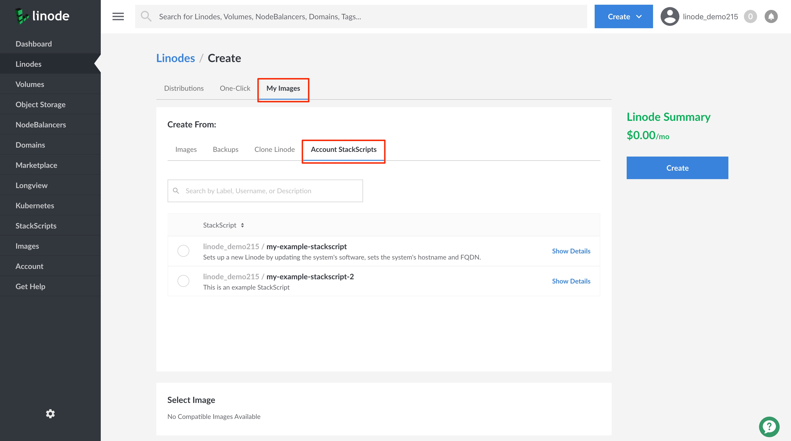
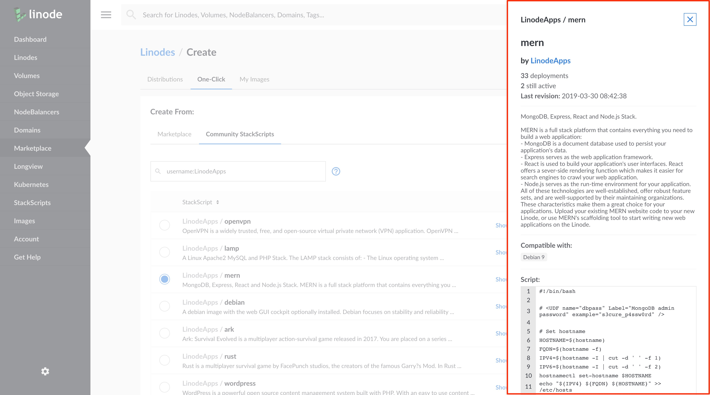

---
author:
  name: Linode
  email: docs@linode.com
description: 'Create custom instances and automate deployment with StackScripts.'
og_description: 'Create custom instances and automate deployment with StackScripts.'
keywords: ["automation", "deploy", "cloud", "custom instance", "scripts"]
license: '[CC BY-ND 4.0](https://creativecommons.org/licenses/by-nd/4.0)'
modified: 2020-04-22
modified_by:
  name: Linode
published: 2020-04-22
title: How to Deploy a New Linode Using a StackScript
h1_title: Deploying a New Linode Using a StackScript
external_resources:
  - '[StackScript Community Library](http://linode.com/stackscripts)'
---
## What are StackScripts?

[StackScripts](http://linode.com/stackscripts/) provide Linode users with the ability to automate the deployment of custom systems on top of the default Linux distribution images. For example, every time you deploy a new Linode you might execute the same tasks, like updating your system's software, installing your favorite Linux tools, and adding a limited user account. These tasks can be automated using a StackScript that will perform these actions for you as part of your Linode's first boot process.

All StackScripts are stored in the Linode Cloud Manager and can be accessed whenever you deploy a Linode. A StackScript authored by you is an *Account StackScript*. While a *Community StackScript* is a StackScript created by a Linode community member that has made their StackScript publicly available.

### In this Guide

This guide will show you how to do the following:

- Deploy a new Linode using an Account StackScript.
- Deploy a new Linode using a Community StackScript.


To learn how to create your own StackScript see the [Creating StackScripts] guide.


## Account StackScripts

An Account StackScripts is any StackScript that you create. It will be stored in the Linode Cloud Manager where you can access it to use when deploying a new Linode. By default, your Account StackScripts are only visible on your account and can only be used by you to deploy a new Linode.

This section will show you how to deploy a new Linode using an Account StackScript and how to access your Account StackScripts.


To learn how to make your Account StackScript publicly available see the [Create a StackScript]() guide for more details.


### Deploy a Linode from an Account StackScript

1. Log into the [Linode Cloud Manager](https://cloud.linode.com/).

1. Click on the **Create** button at the top of the Linode Cloud Manager and select **Linode**. This will take you to the *Linodes Create* page.

    

1. Click on the **My Images** tab to access different sources you can use from which to create a Linode.

1. Viewing the *My Images* page, click on the **Account StackScripts** tab. On this page you will be able to see a list of all of your account's StackScripts.

      

1. From the list, select the StackScript you would like to use to deploy your new Linode instance.

    
To view the details of a StackScript prior to using it to deploy your Linode, click on its **Show Details** link.

    

1. In the **StackScript Options** section, fill in values for your StackScript's Options. Not all StackScripts are written to accept [option values](), so your StackScript might not present this section.

1. From the **Select an Image** dropdown menu, select the Linux distribution to use. This list will be limited to the distributions your StackScript supports.

1. Choose the region where you would like your Linode to reside. If you’re not sure which to select, see our [How to Choose a Data Center](/docs/platform/how-to-choose-a-data-center) guide. You can also generate [MTR reports](/docs/networking/diagnostics/diagnosing-network-issues-with-mtr/) for a deeper look at the route path between you and a data center in each specific region.

1. Select a Linode plan.

1. Give your Linode a label. This is a name to help you easily identify it within the Cloud Manager’s Dashboard. If desired, assign a tag to the Linode in the **Add Tags** field.

1. Create a root password for your Linode in the **Root Password** field. This password must be provided when you log in to your Linode via SSH. It must be at least 6 characters long and contain characters from two of the following categories:

    - lowercase and uppercase case letters
    - numbers
    - punctuation characters

1. Click **Create**. You will be directed back to your new Linode's *Summary* page which will report the status of your Linode as it boots up.

### Access an Account StackScript

1. Log into the [Linode Cloud Manager](https://cloud.linode.com/).

1. Click on the **StackScripts** link in the left-hand navigation menu. You will be brought to the *StackScripts* page.

      

1. Viewing the **Account StackScripts** tab, you will see a list of all of your account's StackScripts.

1. To view the details and contents of an Account StackScript, click on the StackScript you would like to view to access its StackScript detail page.

    

1. If you would like to deploy a new Linode from the Account StackScript you are viewing, click on the **Deploy New Linode** at the top of the StackScript detail page.

    

    You will be brought to the *Linodes Create* page which will have your Account StackScript selected. Continue to provide the rest of the required configurations to create your Linode. See step 4 in the [Deploy a Linode from an Account StackScript](#deploy-a-linode-from-an-account-stackscript) section for details on the remaining configurations.

## Community StackScripts

Community StackScripts are any StackScripts that have been created by a Linode community member and is publicly available. You can deploy a new Linode using any Community StackScript.

This section will show you how to deploy a new Linode using a Community StackScript and how to access the contents of a Community StackScript.


Linode does not verify the accuracy of any Linode Community member submitted StackScripts.


### Deploy a Linode from a Community StackScript

For example, to deploy a WordPress server using **Community StackScripts** created by `LinodeApps`.

1.  Log in to your [Linode Cloud Manager](https://cloud.linode.com) account.

1.  At the top of the page, click **Create** and select **Linode**.

      

1.  Click on the **One-Click** tab to access the *Create From* options.

1.  Viewing the *Create From:* options, click on the **Community StackScripts** tab. On this page, you will see a list of all available Community StackScripts.

    

    You can scroll through the list of StackScripts or you can use the **Search** field to locate the Community StackScript you'd like to use. You can search by StackScript username, label or description. For example, to search for a Community StackScript by username, you can enter `username:LinodeApps` into the search field.

1. From the list, select the Community StackScript you would like to use to deploy your new Linode instance.

    
To view the details of a StackScript prior to using it to deploy your Linode, click on its **Show Details** link.

    

1. In the **StackScript Options** section, fill in values for your StackScript's Options. Not all StackScripts are written to accept [option values](), so your StackScript might not present this section.

1. From the **Select an Image** dropdown menu, select the Linux distribution to use. This list will be limited to the distributions your StackScript supports.

1. Choose the region where you would like your Linode to reside. If you’re not sure which to select, see our [How to Choose a Data Center](/docs/platform/how-to-choose-a-data-center) guide. You can also generate [MTR reports](/docs/networking/diagnostics/diagnosing-network-issues-with-mtr/) for a deeper look at the route path between you and a data center in each specific region.

1. Select a Linode plan.

1. Give your Linode a label. This is a name to help you easily identify it within the Cloud Manager’s Dashboard. If desired, assign a tag to the Linode in the **Add Tags** field.

1. Create a root password for your Linode in the **Root Password** field. This password must be provided when you log in to your Linode via SSH. It must be at least 6 characters long and contain characters from two of the following categories:

    - lowercase and uppercase case letters
    - numbers
    - punctuation characters

1. Click **Create**. You will be directed back to your new Linode's *Summary* page which will report the status of your Linode as it boots up.

----------------
1.  Click the **StackScripts** link in the sidebar and click **Community StackScripts** tab in the **StackScripts** page.

       

1.  Type `username:LinodeApps` to search for StackScripts created by `LinodeApps` user. You can also search based on `Label` or `Description`.

    

1.  Select the StackScript with the label `mern` to deploy a MERN stack on Linode.

    
Check if the StackScript references another script in the `source <ssinclude StackScriptID="####"` line.

-  If yes, then verify that the script is still valid by typing `https://cloud.linode.com/stackscripts/####` in the browser. Where, `####` is the ID  assigned to the script that is being referenced and proceed to the next step. Else, an error that reads:
**The SSINCLUDE (####) is referencing an inactive or invalid StackScript.** appears when you try to deploy a Linode.

-  If no, then proceed to the next step.
    

1.  Click **Deploy New Linode**.
    

1.  Type the required **MangoDB admin password**, and other configuration options that are optional to deploy a new Linode.

Every StackScript uses a different set of variables to run the script.

1.  Choose the image to deploy a new Linode, in **Select an Image**. The images that are listed depend on the distributions that are set when the script is created.

1.  Choose the region where you would like your Linode to reside. If you're not sure which to select, see our [How to Choose a Data Center](/docs/platform/how-to-choose-a-data-center) guide. You can also generate [MTR reports](/docs/networking/diagnostics/diagnosing-network-issues-with-mtr/) for a deeper look at the route path between you and a data center in each specific region.

1. Select a Linode plan.

1.  Give your Linode a label. This is a name to help you easily identify it within the Cloud Manager's Dashboard. If desired, assign a tag to the Linode in the **Add Tags** field.

1. Create a root password for your Linode in the **Root Password** field. This password must be provided when you log in to your Linode via SSH. It must be at least 6 characters long and contain characters from two of the following categories:

    - lowercase and uppercase case letters
    - numbers
    - punctuation characters
1.  Click **Create**. You will be directed back to the *Linodes* page which will report the status of your Linode as it boots up. You can now use the Cloud Manager to:

    * Boot and shut down your Linode
    * Access monitoring statistics
    * Update your [billing](/docs/platform/billing-and-support/manage-billing-in-cloud-manager/) and [account](/docs/platform/manager/accounts-and-passwords-new-manager/) information
    * Add additional Linode services, like [Block Storage](/docs/platform/block-storage/how-to-use-block-storage-with-your-linode-new-manager/)
    * Open a [support](/docs/platform/billing-and-support/support-new-manager/) ticket and perform other administrative task.
