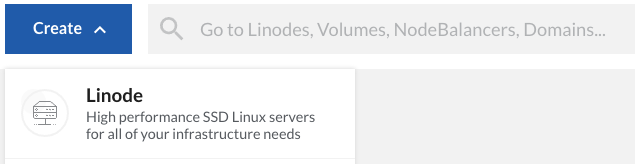
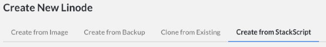
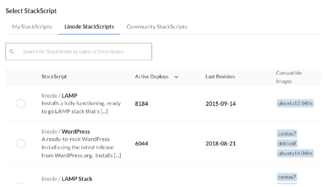
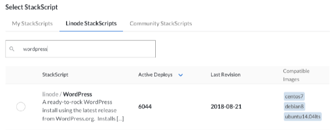
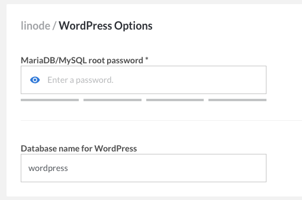
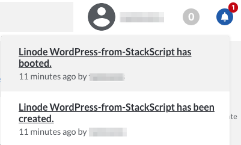
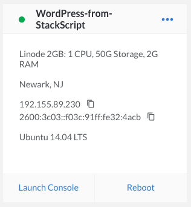
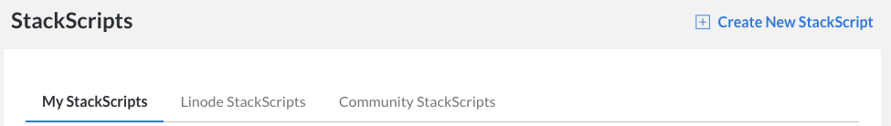
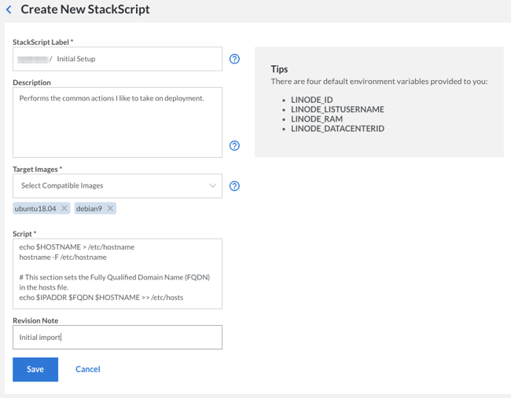
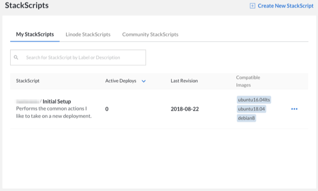

---
author:
  name: Alex Fornuto
  email: afornuto@linode.com
description: 'Create Custom Instances and Automate Deployment with StackScripts.'
keywords: ["ami", "automation", "elasticity", "cloud", "custom instance"]
license: '[CC BY-ND 4.0](https://creativecommons.org/licenses/by-nd/4.0)'
aliases: ['platform/stackscripts-new-manager/','stackscripts/']
modified: 2018-08-22
modified_by:
  name: Linode
published: 2011-04-05
title: Automate Deployment with StackScripts
external_resources:
  - '[StackScript Community Library](http://linode.com/stackscripts)'
classic_manager_link: platform/stackscripts-classic-manager/
---

[StackScripts](http://linode.com/stackscripts/) provide Linode users with the ability to automate the deployment of custom systems on top of our default Linux distribution images. Linodes deployed with a StackScript run the script as part of the first boot process. This guide explains how StackScripts work, and offer several examples of how to use them.

## Introduction

StackScripts are usually Bash scripts, stored in the Linode Cloud Manager, and can be accessed when you deploy a Linode. During the first boot job of the newly created disks, the StackScript will run, using any variable you may have added, and perform the scripted commands.

## Deploying from a StackScript

1.  Start by logging in to the [Linode Cloud Manager](https://cloud.linode.com).

1.  Click the **Create** button and selecting **Linode**.

    

1.  Navigate to the **Create from StackScript** tab.

    

1.  At this point you have the option of using a a Linode StackScript, Community StackScript, or one of your own.

    

<!-- Alternatively, you can follow along with this video, which will show you how to deploy from a StackScript:

 -->

### Using a Community StackScript


There is no default logging when using a StackScript. Output is sent to the console.


1.  In addition to the StackScripts created by Linode, any community member who creates a StackScript has the option to make it publicly available to other customers. As seen in the image below, you can use the search field to narrow your search to match your distribution and goal:

    

1.  For this example we'll select the first search result. This brings up a panel underneath the "Select StackScript" panel where we can define the variables that will go into the StackScript. Each StackScript has a different set of variables that are used when the script is run. The WordPress StackScript requires a root password for MySQL and a database name, along with the information required for deploying any new Linode.

    

1.  Once you've adjusted the options, click **Create**. You will be returned to the Linodes page, and your bell notifications will inform you when your Linode has been created.

    

    

### Creating a New StackScript

1.  To begin creating your own StackScript, navigate to the **StackScripts** page of the manager and click **Create New StackScript**.

    

1.  Fill in the various sections:

    -   *Label* - How the StackScript will be identified.
    -   *Description* - a brief explanation of what it does.
    -   *Target Images* - Select any and all available distributions that can run this StackScript.
    -   *Script* - The body of the script itself.
    -   *Revision Note* - A brief account of the change made in this update of the StackScript. It will be set to `Initial import` by default, and you can feel free to leave or change it.

    Below is an example of a new StackScript being written:

    

    Here's the code used in our example script. The comment lines explain what each section does:

    
#!/bin/bash
# This block defines the variables the user of the script needs to input
# when deploying using this script.
#
#
#<UDF name="hostname" label="The hostname for the new Linode.">
# HOSTNAME=
#
#<UDF name="fqdn" label="The new Linode's Fully Qualified Domain Name">
# FQDN=

# This sets the variable $IPADDR to the IP address the new Linode receives.
IPADDR=$(/sbin/ifconfig eth0 | awk '/inet / { print $2 }' | sed 's/addr://')

# This updates the packages on the system from the distribution repositories.
apt-get update
apt-get upgrade -y

# This section sets the hostname.
echo $HOSTNAME > /etc/hostname
hostname -F /etc/hostname

# This section sets the Fully Qualified Domain Name (FQDN) in the hosts file.
echo $IPADDR $FQDN $HOSTNAME >> /etc/hosts



1.  Once you've written the StackScript press **Save**. Remember, you can always edit the script later if you want to make adjustments.

1.  Now you will be able to see that your new StackScript is available. It can be deployed following the same procedure as step 2 of [Using a Community StackScript](#using-a-community-stackscript)

    

## StackScript Use Cases

Below are several common use cases for StackScripts.

### Calling StackScripts Recursively

StackScripts have the ability to call other StackScripts from the library at runtime. This functionality reduces the need to write duplicate code for multiple scripts. For example, the Linode [StackScript Bash Library](https://www.linode.com/stackscripts/view/1) is a set of functions that perform various tasks. The script creates the functions but does not run them. A new StackScript can import the Bash Library and then execute functions from it. This reduces the size and time-to-write of all StackScripts using the functions built into the library script.

In another example use case for linked StackScripts, a user could create a StackScript that updates all software packages on the system. They would most likely want to perform this function on all new Linodes. The user could then create a StackScript to build a web server that would integrate into his current cluster. Rather than rewrite the commands to update the system, they can call the previous StackScript.

Let’s then say that some of this user’s web servers will run a CMS, like WordPress. The user can create a StackScript which invokes his web server script, removing the need to rewrite the commands to install the web server software or update the system.

The syntax to pull another StackScript is:

    <ssinclude StackScriptID="[NUMBER]">

This will download the StackScript on the Linode as `ssinclude-[NUMBER]`. To download and run the script (assuming it's written as a Bash script) use:

    source <ssinclude StackScriptID="[NUMBER]">

If you're scripting in another language, execute the script on a second line, as seen below:

    <ssinclude StackScriptID="[NUMBER]">
    ./ssinclude-[NUMBER]

A great example of this use case is the [StackScript Bash Library](https://www.linode.com/stackscripts/view/1), created by Linode. This script contains several useful functions to perform common tasks such as updating software and installing Apache, MySQL,etc. Run on its own it does nothing to alter your system. By importing the Bash Library script you can save time in your own StackScripts.

### Demonstrating or Distributing Software Capabilities

If you develop software, you can use StackScripts to deploy a demonstration instance of your software. The resulting system may not need to be particularly durable or be fully configured. With a StackScript for demonstrating software, you can let people experience and test your software while giving them full control over the deployment. This same kind of procedure with minimal modification may also be an easy way to distribute the software itself. These StackScripts ought to be generalized so that other users can deploy from this StackScript without complication.

### Deploy Appliances and Cluster Instances

If your deployment includes function-specific "appliance-type" instances, you make want to explore using StackScripts to help manage these nodes, such as job-processing instances.

Application clusters are similar. If your architecture includes some sort of "cluster," you may be able to automate the deployment of a new cluster-member by using StackScripts to configure the instance. Here, StackScripts, in combination with the API, provide the ability to automate cluster deployment and management with a large degree of elasticity.

## Developing StackScripts

The only requirements to run a StackScript are that the first line of the script be a shebang (e.g. `#!/bin/bash`) and that the interpreter specified by the shebang be installed in the Linode base image you are deploying. While `Bash` may be an obvious choice for StackScripts, you may choose any language or system.

You can see the [community StackScript Library](http://linode.com/stackscripts/), for examples of StackScripts. Depending on the nature of the script you develop, you may consider sharing your script in this library so that others may deploy instances from your script.

### Bootstrapping StackScripts

If you have an existing deployment script, you can use StackScripts to deploy instances with this script. Consider the following methods for "bootstrapping" one script with StackScripts:


#!/bin/bash

wget http://example.com/ --output-document=/opt/deployment-script.pl
chmod +x /opt/deployment-script.pl

./opt/deployment-script.pl



This approach is useful for bootstrapping scripts written in languages that are not included in the default instance template, as in the following example:


#!/bin/bash

if [ -f /etc/apt/sources.list ]; then
   apt-get upgrade
   apt-get -y install php5
elif [-f /etc/yum.conf ]; then
   yum -y install php
elif [-f /etc/pacman.conf ]; then
   pacman -Sy
   pacman -S --noconfirm pacman
   pacman -S --noconfirm php
else
   echo "Your distribution is not supported by this StackScript"
   exit
fi

wget http://example.com/ --output-document=/opt/deployment-script.php
chmod +x /opt/deployment-script.php

./opt/deployment-script.php



If you do not want to rely on an existing external server to host your scripts for download, you can embed the bootstrapped script in the StackScript. Consider the following example:


#!/bin/bash

if [ -f /etc/apt/sources.list ]; then
   apt-get upgrade
   apt-get -y install php5
elif [-f /etc/yum.conf ]; then
   yum -y install php
elif [-f /etc/pacman.conf ]; then
   pacman -Sy
   pacman -S --noconfirm pacman
   pacman -S --noconfirm php
else
   echo "Your distribution is not supported by this StackScript"
   exit
fi

cat >/opt/deployment-script.php <<EOF
#!/usr/bin/php
<?php print('Hello World!'); ?>
EOF

chmod +x /opt/deployment-script.php

./opt/deployment-script.php



### Using StackScripts from the Linode API

The [Linode API](http://www.linode.com/api/index.cfm) contains support for managing StackScripts and deploying instances with StackScripts. Consider the documentation of the following Linode API methods:

-   [avail.stackscripts](https://www.linode.com/api/utility/avail.stackscripts)
-   [stackscript.create](https://www.linode.com/api/stackscript/stackscript.create)
-   [stackscript.list](https://www.linode.com/api/stackscript/stackscript.list)
-   [stackscript.update](https://www.linode.com/api/stackscript/stackscript.update)
-   [linode.disk.createfromstackscript](https://www.linode.com/api/linode/linode.disk.createfromstackscript)

    
If creating a disk with `linode.disk.createfromstackscript`, you will need to create a configuration profile and attach the disk to the profile before you can boot and run the StackScript.


### Variables and UDFs

The StackScript system provides a basic markup specification that interfaces with the Linode deployment process so that users can customize the behavior of a StackScript on a per-deployment basis. These `UDF` tags, when processed, insert variables and values into the script's environment.

The UDF tags are explained in the table below:

|Label    | Description           | Requirements
|:--------|:----------------------|:---------
|name     | The variable name     | Alphanumeric, len <64, must be unique
|label    | The question to ask   | Text 0-255
|default  | The default value     | If not specified then this UDF is required
|example  | Example input         |
|oneof    | A comma separated list of values| Optional
|manyof   | A comma separated list of values| Optional

Below is an example implementation of the UDF variables. Note that the UDF tags are commented out to prevent execution errors, as the StackScript system parses the tags without removing them:


# [...]
# <UDF name="var1" Label="A question" default="" example="Enter something here." />
# <UDF name="var2" Label="Pick one of" oneOf="foo,bar" example="Enter something here." />
# <UDF name="var3" Label="A question" oneOf="foo,bar" default="foo" />
# <UDF name="var4" Label="Pick several from" manyOf="foo,bar" default="foo,bar" />
# [...]



If you would like to create a masked password input field, use the word 'password' anywhere in the UDF name.


There are also a set of Linode created environmental variables that can be used for API calls or other tasks from within the script.

| Environment Variable               | Description                                                                               |
|:-----------------------------------|:------------------------------------------------------------------------------------------|
| `LINODE_ID=123456`                 | The Linode's ID number                                                                    |
| `LINODE_LISHUSERNAME=linode123456` | The Linode's full lish-accessible name                                                    |
| `LINODE_RAM=1024`                  | The RAM available on this Linode's plan                                                   |
| `LINODE_DATACENTERID=6`            | The ID number of the data center containing the Linode. See our API for more information. |

If you do not want to use the StackScript system to set your environment variables, you might consider hosting files with settings on a different system. This is accomplished with the following fragment:


# [...]
IPADDR=$(/sbin/ifconfig eth0 | awk '/inet / { print $2 }' | sed 's/addr://')

wget http://example.com/base.env --output-document=/tmp/base.env
wget http://example.com/$IPADDR.env --output-document=/tmp/system.env

source /tmp/base.env
source /tmp/system.env
# [...]



Make sure that there are files accessible via `HTTP` hosted on the `example.com` domain for both basic environment (e.g. `base.env`) and machine specific (e.g. `[ip-address].env`) files before launching this StackScript. Also consider the possible security implications of allowing any file with sensitive information regarding your deployment to be publicly accessible.
