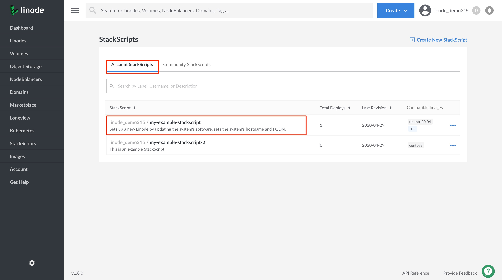

---
author:
  name: Linode Community
  email: docs@linode.com
description: 'Two to three sentences describing your guide.'
og_description: 'Two to three sentences describing your guide when shared on social media.'
keywords: ['list','of','keywords','and key phrases']
license: '[CC BY-ND 4.0](https://creativecommons.org/licenses/by-nd/4.0)'
published: 2020-05-21
modified_by:
  name: Linode
title: "Writing Scripts for Use with Linode StackScripts - A Tutorial"
h1_title: "Writing Scripts for Use with Linode StackScripts"
contributor:
  name: Linode
---
## What are StackScripts?

[StackScripts](http://linode.com/stackscripts/) provide Linode users with the ability to automate the deployment of custom systems on top Linode's default Linux distribution images. For example, every time you deploy a new Linode you might execute the same tasks, like updating your system's software, installing your favorite Linux tools, and adding a limited user account. These tasks can be automated using a StackScript that will perform these actions for you as part of your Linode's first boot process.

All StackScripts are stored in the Linode Cloud Manager and can be accessed whenever you deploy a Linode. A StackScript authored by you is an *Account StackScript*. While a *Community StackScript* is a StackScript created by a Linode community member that has made their StackScript publicly available in the Linode Cloud Manager.

## In this Guide

Writing a script for use in a StackScript will generally be the same as writing a script that will be executed from the command line or another program. This guide includes information about the StackScript system, including the following:

-  [Base requirements for any script that will be used as a StackScript](#stackscript-requirements).
-  [Importing an existing StackScript into your own script for code reuse](#import-a-stackscript).
-  [Accessing a StackScript's ID number](#access-a-stackscript-s-id-number).
-  [Inlcuding user defined fields (UDFs) in your script to allow for custom behavior when deploying a new Linode with your StackScript](#user-defined-fields-udfs).
-  [Using the StackScript system's default environment variables](#default-environment-variables).

## The StackScript System

### StackScript Requirements

- The primary requirement for your scripts are that the interpreter needed to execute your script be installed on the Linode base image you are deploying. While Bash is an obvious choice for a script, you may choose any language.

    
Linode images are created using "vanilla" versions of its given distribution. Consult our [Choosing a Linux Distribution](/docs/quick-answers/linux/choosing-a-distribution/) guide to see list of all distributions Linode provides and to access each distribution's corresponding websites. You can find more information on the interpreters available for each distribution on their official websites.
    

- When writing a script, you must use a [*shebang*](https://en.wikipedia.org/wiki/Shebang_(Unix)) as the first line of your script. This indicates to your Linux system which interpreter to use when running the script. For example, if you are writing a Bash script, the beginning of your script should include the following line:

    
#!/bin/bash
    

    Or, if you are writing a Python script, the beginning of your script should include the following line:

      
#!/usr/bin/env python
      

### Import a StackScript

Your scripts can import any Account StackScripts you own or any Community StackScripts. This allows you to reuse code minimizing what you need to write in your own scripts.

- The example below shows the syntax to import another StackScript. As a result of including this line in one a StackScript, the imported StackScript will be downloaded as `ssinclude-[NUMBER]` to your Linode. However, it must be run in order to execute its contents.

    
<ssinclude StackScriptID="[NUMBER]">
    

     In Bash, you can download and run the script in the following way:

    
source <ssinclude StackScriptID="[NUMBER]">
    

    If you're scripting in another language, import the StackScript, then execute it on a second line:

    
<ssinclude StackScriptID="[NUMBER]">
./ssinclude-[NUMBER]
    

- Linode provides a [StackScript Bash Library](https://cloud.linode.com/stackscripts/1) that includes a set of functions that perform various common tasks users might wish to execute on their Linodes. This script creates the functions, but does not run them. A new StackScript can import the Bash Library and then execute functions from it.

    
Linode's [StackScript Bash Library's]((https://cloud.linode.com/stackscripts/1)) ID number is `1`.
    

### Access a StackScript's ID Number

Follow the steps in this section to find the ID number of a StackScript.

1. Log into the [Linode Cloud Manager](https://cloud.linode.com/).

1. Click on the **StackScripts** link in the left-hand navigation menu. You will be brought to the *StackScripts* page.

      

1. Depending on which type of StackScript whose ID you'd like to find, click on the **Account StackScripts** tab or the **Community StackScripts** tab.

1. Click on the StackScript whose ID you'd like to access. This will bring you to its **StackScript detail page**.

    

1. The StackScript detail page's URL will display the StackScript's ID number. You can now use this number to [import the StackScript](#import-a-stackscript) into your own script.

    

### User Defined Fields (UDFs)

The StackScript system provides a basic markup specification that interfaces with the Linode deployment process so that users can customize the behavior of a StackScript on a per-deployment basis. When a StackScript contains a user defined filed (UDF), the Linode Cloud Manager will present the UDF as a form field, so a user can insert a corresponding custom value. The values and their related variables are inserted into the script's environment when used to deploy a new Linode.

- Use the following format to insert a UDF tag into a StackScript.

    
The UDF tags are commented out to prevent execution errors, as the StackScript system parses the tags without removing them.
    

    
# <UDF name="example-var" label="An example informative label for the user." default="A default value" example="An example value." />
    

- A UDF tag accepts the following attributes:

    |**Label**    | **Description**   | **Data Type** |
    |:--------|:----------------------|:---------
    |*name*     | The variable name to use within the StackScript.  
If you would like to create a masked password input field, use the word `password` anywhere in the UDF `name` attribute.
    *required*.    | String. Alphanumeric and underscore, length must be less than 64 characters, and the name must be unique within the StackScript. |
    |*label*    | The form field's label to present to a user in the Linode Cloud Manager. *required*.| String.
    |*default*  | The UDF's default value. If no value is specified by the user, the default value will be used when deploying a new Linode with the StackScript.     | String. |
    |*example*  | An example input value to present to a user in the Linode Cloud Manager.| String. |
    |*oneof*      | A comma separated list of acceptable single values for the field. When this attribute is provided, a dropdown menu will be presented to a user with a list of values to choose from within the Linode Cloud Manager. Only one value can be selected by the user. If your StackScript uses the *oneof* attribute, you cannot use the *manyof* attribute.| Comma separated list of strings. |
    |*manyof*     | A comma separated list of acceptable values for the field in any quantity, combination, or order. When this attribute is used, a dropdown menu will be presented to a user with a list of acceptable values they can choose from with the Linode Cloud Manager. Multiple values can be selected by the user.  If your StackScript uses the *manyof* attribute, you cannot use the *oneof* attribute. | Comma separated list of strings. |

### Default Environment Variables

Linode StackScripts provide a set of default environment variables that you can use to provide your script with information about the Linode it has deployed.

| **Environment Variable**               | **Description**                                                                       |
|:-----------------------------------|:------------------------------------------------------------------------------------------|
| `LINODE_ID`           | The deployd Linode's ID number                                                            |
| `LINODE_LISHUSERNAME` | The deployed Linode's full [Linode Shell (LISH)](/docs/platform/manager/using-the-linode-shell-lish/) accessible name. |
| `LINODE_RAM`          | The [RAM available on this Linode's plan](/docs/platform/how-to-choose-a-linode-plan/#hardware-resource-definitions).                                                   |
| `LINODE_DATACENTERID` | The ID number of the data center containing the Linode. You can use the [Linode API](https://developers.linode.com/api/v4/regions) to see a list of all data center IDs. |



It is possible to set your script's environment variables using externally hosted files. The example Bash script uses the wget utility to download two files named `base.env` and `$IPADDR.env` from the external site `http://example.com/`. The `source` command will load the downloaded files into the script.


# [...]
IPADDR=$(/sbin/ifconfig eth0 | awk '/inet / { print $2 }' | sed 's/addr://')

wget http://example.com/base.env --output-document=/tmp/base.env
wget http://example.com/$IPADDR.env --output-document=/tmp/system.env

source /tmp/base.env
source /tmp/system.env
# [...]



The files you reference within your script must exist and be accessible via `HTTP`. Also, ensure that the files you host externally do not contain any sensitive information.




## StackScript Examples

### Using an External Script

- If you have an existing deployment script, you can use a StackScripts to deploy Linode instances with it. The following example StackScript installs PHP on the Linode, downloads an external PHP script from the URL `wget http://example.com/deployment-script.php`, makes it executable, and then runs the downloaded script.

    
#!/bin/bash
if [ -f /etc/apt/sources.list ]; then
   apt-get upgrade
   apt-get -y install php
elif [-f /etc/yum.conf ]; then
   yum -y install php
elif [-f /etc/pacman.conf ]; then
   pacman -Sy
   pacman -S --noconfirm pacman
   pacman -S --noconfirm php
else
   echo "Your distribution is not supported by this StackScript"
   exit
fi

wget http://example.com/deployment-script.php --output-document=/opt/deployment-script.php
chmod +x /opt/deployment-script.php

./opt/deployment-script.php
    

- If you do not want to rely on an existing external server to host your scripts for download, you can embed the bootstrapped script into the StackScript.

    
#!/bin/bash

if [ -f /etc/apt/sources.list ]; then
   apt-get upgrade
   apt-get -y install php5
elif [-f /etc/yum.conf ]; then
   yum -y install php
elif [-f /etc/pacman.conf ]; then
   pacman -Sy
   pacman -S --noconfirm pacman
   pacman -S --noconfirm php
else
   echo "Your distribution is not supported by this StackScript"
   exit
fi

cat >/opt/deployment-script.php <<EOF
#!/usr/bin/php
<?php print('Hello World!'); ?>
EOF

chmod +x /opt/deployment-script.php

./opt/deployment-script.php

    

## Next Steps

- See [A Tutorial for Creating and Managing StackScripts](/docs/platform/stackscripts/creating-and-managing-stackscripts-a-tutorial/) to learn how to add your script to a StackScript and how to make a StackScript available to the rest of the Linode Community.

- See [A Tutorial for Solving Real World Problems with Bash Scripts](/docs/development/bash/solving-real-world-problems-with-bash-scripts-a-tutorial/) for a primer on creating Bash scripts.