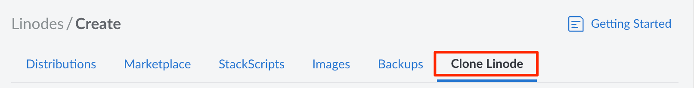
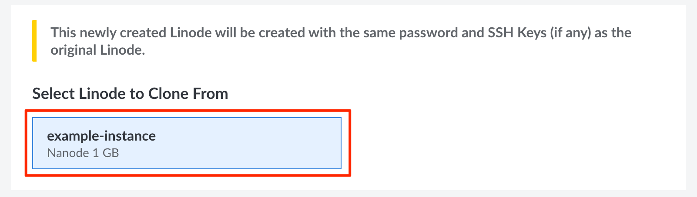
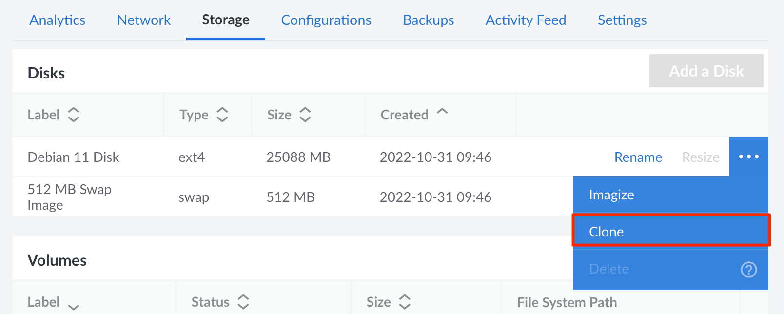
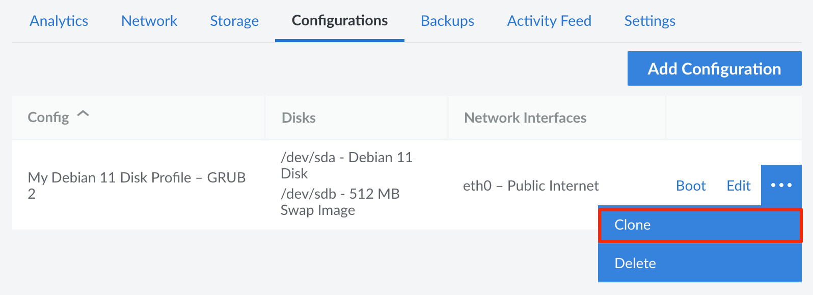
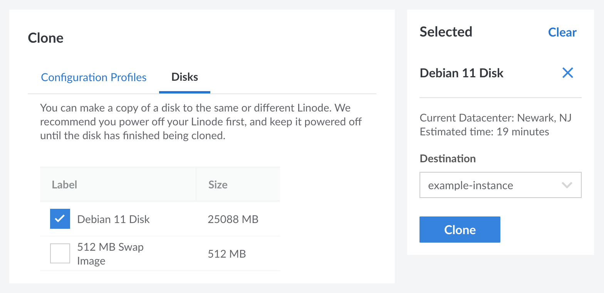

Linode's cloning feature allows you to duplicate a Compute Instance's disks (and configuration profiles) to a new or existing instance.

## Clone to a New Compute Instance

This process copies all disks and configuration profiles to a newly created Compute Instance on your account.


Before continuing, it's recommended to power off the instance you would like to clone. This helps prevent data corruption.


1. Log in to the [Cloud Manager](https://cloud.linode.com).

1. Click the **Create** dropdown menu on the top left and select **Linode**.

1. In the **Create New Linode** form, navigate to the **Clone Linode** tab.

    

1. Under **Select Linode to Clone From**, click on the Linode you wish to clone.

    

1. Complete the remainder of the form. Enter a label and select the region, the plan, and other options for the new Compute Instance.

    
    The plan's storage must be greater than the combined disk size of the original instance. If you wish to select a plan with less storage, you may need to [resize your disks](/docs/products/compute/compute-instances/guides/disks-and-storage/) before cloning.
    

1. Click the **Create Linode** button to start the cloning process. Cloning a Compute Instance can be much longer than creating a new instance based on a distribution image or custom image. The length of time depends on the size of the disks, among other factors. To keep track of the cloning progress, a status bar is displayed above the original Compute Instance with the percentage of completion.

1. Once the cloning process is complete, you need to power on the new Compute Instance to begin using it.


The new instance's IP address will be different than the original instance. If desired, you can transfer the IP address from the original Compute Instance to the new one. Swapping the IP address can prevent additional changes from being required, such as changing DNS records or the internal configuration of the new instance. See [Transferring IP Addresses](/docs/products/compute/compute-instances/guides/manage-ip-addresses/#transferring-ip-addresses).


## Clone to an Existing Compute Instance

This process allows you to select specific disks or configuration profiles and duplicate them to an existing Compute Instance. When cloning a configuration profile, all disks assigned to that profile are also cloned.

1. Log in to the [Cloud Manager](https://cloud.linode.com) and select the **Linodes** link in the left sidebar menu.

1. Locate the Compute Instance you wish to clone and click its corresponding label, which displays the instance's detail page.

1. To prevent data corruption, click the **Power off** link on the top right.

1. **To clone a disk:** Navigate to the **Storage** tab, locate the disk you wish to clone within the **Disks** table, click the **more options ellipsis** dropdown menu, and select **Clone**.

    

    **To clone a configuration profile:** Navigate to the **Configurations** tab, locate the profile you wish to clone within the **Config** table, click the **more options ellipsis** dropdown menu, and select **Clone**.

    

1. A **Clone** form appears with either the **Disks** or **Configuration Profiles** tab displayed, depending on the previous step. From here, select the exact disks and configuration profiles you wish to clone. When a configuration profile is selected, all disks assigned to it (through **Block Device Assignments**) are also selected.

    

1. In the **Destination** dropdown menu, select the destination Compute Instance.

    
    The destination instance must have enough free storage to accommodate the disks that are to be cloned. If there's not enough free storage space, you'll need to either [resize the disks](/docs/products/compute/compute-instances/guides/disks-and-storage/) (either on the original or destination Compute Instance) or [upgrade the destination instance to a larger plan](/docs/products/compute/compute-instances/guides/resize/).
    

1. Click the **Clone** button to start the cloning process. The length of time this takes depends on the size of the Compute Instance's disks (among other factors). To keep track of the cloning progress, a status bar is displayed above the original instance with the percentage of completion.

1. Once the cloning process is complete, you may need to make changes to the destination Compute Instance in order to begin using the disks. This involves either booting the instance using the cloned configuration profile or adjusting the existing configuration profile to assign the cloned disks. See [Configuration Profiles](/docs/products/compute/compute-instances/guides/configuration-profiles/)