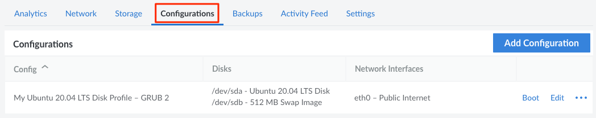
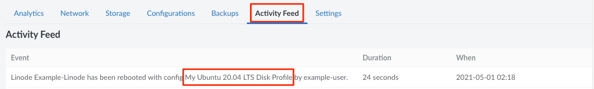

A **configuration profile** functions as a boot loader for a Compute Instance. It controls general boot settings, including the disk the instance will boot from, the disks that will be mounted, the kernel that will be used, and the network interfaces on the instance. Multiple configuration profiles can be created, each one booting from different disks with different settings. This can allow you to try out new Linux distributions without paying for additional Compute Instances (see [Deploy an Image to a Disk on an Existing Compute Instance](/docs/products/tools/images/guides/deploy-image-to-existing-linode/)) or to create custom software testing environments.

## View Configuration Profiles

The configuration profiles for a Compute Instance can be viewed and managed from the [Cloud Manager](https://cloud.linode.com).

1. Log in to the [Cloud Manager](https://cloud.linode.com), click the **Linodes** link in the sidebar, and select a Compute Instance from the list.

1. Navigate to the **Configurations** tab to view the configuration profiles on a Compute Instance.

    

From here, a [configuration profile can be created](#creating-a-configuration-profile) using the **Add Configuration** button. To take action on an certain configuration, locate it within the **Configurations** table and select from the list of actions, some or all of which may appear within the **ellipsis** menu:

- **Boot:** Boots the Compute Instance using the settings defined within the selected configuration profile. See [Booting from a Configuration Profile](#booting-from-a-configuration-profile).
- **Edit:** Modify the settings within a configuration profile. See [Editing a Configuration Profile](#editing-a-configuration-profile).
- **Clone:** Clones the configuration profile and the attached disks to any Compute Instance on the same account. See [Cloning a Configuration Profile and the Attached Disks](#cloning-a-configuration-profile-and-the-attached-disks).
- **Delete:** Deletes the configuration profile. See [Deleting a Configuration Profile](#deleting-a-configuration-profile).

## Settings

When adding or editing a configuration profile on a Compute Instance, the following settings are available:

-   **Virtual Machine:** VM mode determines whether devices inside your virtual machine are *paravirtualized* or *fully virtualized*. Here are the drivers used for various devices in each mode:

    | Device | Paravirtualization | Full virtualization |
    | -- | -- | -- |
    | Block | VirtIO SCSI | IDE |
    | Network | VirtIO Net | e1000 |
    | Serial | ttyS0 | ttyS0 |

    Since paravirtualization offers more performant networking and disk IO, it is the recommended mode. All Linux distributions provided by Linode support paravirtualization. When installing an operating system not offered by Linode, full virtualization may be required if that OS does not include virtualization-aware drivers.

-   **Boot Settings:**
    - **Kernel:** Select the version of the Linux kernel that will be used. The options include Grub 2 (for upstream or custom-compiled kernels), a specific Linode supplied kernel, or Direct Disk. For most distributions, its recommended to set this option to *Grub 2*. See [Manage the Kernel on a Compute Instance](/docs/products/compute/compute-instances/guides/manage-the-kernel/).
    - **Run Level:** Adjust the [run level](https://en.wikipedia.org/wiki/Runlevel) of the OS to allow for advanced diagnostics. Recommended setting: *Run Default Level*.
    - **Memory Limit:** Limits the amount of memory that the Compute Instance can use. Recommended setting: *Do not set any limits on memory usage*.

-   <span id="block-device-assignment">**Block Device Assignment:**</span> Assigns the Compute Instance's disks to the disk devices in Linux, making them accessible once the instance has booted up. Up to 8 disks can be assigned (`/dev/sda` through `/dev/sdg`), though it's common to only use the first two devices: `/dev/sda` as the main disk and `/dev/sdb` as the swap disk. The **Root Device** is used to select the primary disk device (commonly `/dev/sda`), though another predefined device or custom device path can be used.

    
    In some Linode distribution images, block devices are assigned using [UUIDs](https://en.wikipedia.org/wiki/Universally_unique_identifier) in the `/etc/fstab` file to support proper disk mounting. In order to see the UUID assigned to each block device, you can use the `lsblk` command:

    ```command
    lsblk -f
    ```

    This displays block devices for your booted configuration and their current mount points:

    ```output
    NAME FSTYPE FSVER LABEL       UUID                                 FSAVAIL FSUSE% MOUNTPOINTS
    sda  ext4   1.0   linode-root cfa3834a-c6ec-0c85-1b68-6345a69f3759   14.3G    20% /
    sdb  swap   1                 208b24eb-47fe-4e6b-907a-d70d24af0cf0                [SWAP]
    sdc  ext4   1.0   linode-root 72a6eb6d-941c-bf66-c5e7-636242a1efbe
    ```
    

-   **Network Interfaces:** Configures network interfaces for the Public Internet, a [VPC](/docs/products/networking/vpc/), or a [VLAN](/docs/products/networking/vlans/). There are a total of 3 available network interfaces, which correspond to the devices assigned within the Linux system: `eth0`, `eth1`, and `eth2`. If no VLANs or VPCs are in use, the recommended setting is _Public Internet_ for `eth0` and _None_ for all other interfaces. When assigning an instance to a VPC, it's recommended to use `eth0` for the VPC interface. If public internet is required along with a VPC, configure the VPC interface as a 1:1 NAT with internet access (the _Assign a public IPv4 address for this Linode_ option under the VPC interface) instead of designating a separate network interface as _Public Intenet_. For more details on assigning a Compute Instance to a VPC or VLAN, review the appropriate documentation:

    - [Assign a Compute Instance to a VPC](/docs/products/networking/vpc/guides/assign-services/)
    - [Attach a VLAN to a Compute Instance](/docs/products/networking/vlans/guides/attach-to-compute-instance/)

-   **Filesystem / Boot Helpers:** Various helper tasks that run when the Compute Instance is booted up. Recommended setting for all helpers: _Enabled_.
    - **Enable distro helper:** Helps maintain correct inittab/upstart console device.
    - **Disable `updatedb`:** Disables `updatedb` cron job to avoid disk thrashing.
    - **Enable modules.dep helper:** Creates a module dependency file for the kernel you run.
    - **Auto-mount devtmpfs:** Controls if `pv_ops` kernels auto-mount devtmpfs at boot.
    - **Auto-configure networking:** Automatically configures static networking. See [Network Helper](/docs/products/compute/compute-instances/guides/network-helper/).

## Create a Configuration Profile

Making a new configuration profile lets you create a new and separate boot configuration for your system. You can specify boot settings and disks to mount. Here's how to create a new configuration profile:

1. Within the [Cloud Manager](https://cloud.linode.com), view the Configuration Profiles for your desired Compute Instance. See [View Configuration Profiles](#view-configuration-profiles).

1. Select the **Add a Configuration** link. The **Add Configuration** form appears:

1. Enter the *Label* for the new configuration, as well as an optional *Comment*.

1. Complete the remainder of the form, referencing the [Settings](#settings) section above for additional details and recommended values. For most basic configurations, it's recommended to adjust the following settings:
    - **Kernel:** Select *Grub 2*.
    - **Block Device Assignments:** Set `/dev/sda` to the disk you want to use as the primary disk (and boot disk) and set `/dev/sdb` to the swap disk.

1. Click **Add Configuration** to create the new configuration profile.

## Edit a Configuration Profile

You can edit existing configuration profiles to change boot settings, set other disks to mount, and more. Here's how to edit a configuration profile:

1. Within the [Cloud Manager](https://cloud.linode.com), view the Configuration Profiles for your desired Compute Instance. See [View Configuration Profiles](#view-configuration-profiles).

1. Within the **Configurations** table, locate the configuration profile you wish to modify and click the corresponding **Edit** button, which may also appear within the **ellipsis** menu. This displays the **Edit Configuration** form.

1. Adjust any settings as needed, referencing the [Settings](#settings) section above for additional details and recommended values.

1. Once finished, click **Save Changes**.

The changes to the configuration profile have been saved. You may need to reboot your Compute Instance to activate the changes.

## Boot from a Configuration Profile

You can create and store many different configuration profiles in the Cloud Manager, but you can only boot your Compute Instance from one configuration profile at a time. Here's how to select a configuration profile and boot your instance from it:

1. Within the [Cloud Manager](https://cloud.linode.com), view the Configuration Profiles for your desired Compute Instance. See [View Configuration Profiles](#view-configuration-profiles).

1. Within the **Configurations** table, locate the configuration profile you wish to modify and click the corresponding **Boot** button, which may also appear within the **ellipsis** menu.

1. A confirmation dialog window will appear. Click **Boot** to confirm.

1. The Compute Instance will boot (or reboot) using the selected configuration profile. The progress of the boot can be viewed from the instance's status.

You have successfully selected and booted your Compute Instance from a configuration profile.

## Determine Which Configuration Profile Was Used

When a Compute Instance is powered on or rebooted, it uses the settings stored within a configuration profile. You can determine which configuration profile was used by looking at the event history. Events are visible within the **Activity Feed** tab for a particular Compute Instance or within the main [Events](https://cloud.linode.com/events) page for the account.

1. Log in to the [Cloud Manager](https://cloud.linode.com), click the **Linodes** link in the sidebar, and select a Compute Instance from the list.

1. Navigate to the **Activity Feed** tab to view all events for the instance.

1. Locate the particular boot or reboot event and review the text. The configuration profile used during that boot will be mentioned here.

    

    Sometimes the boot or reboot event doesn't list a configuration profile, such as when the [Lassie Shutdown Watchdog](/docs/products/compute/compute-instances/guides/lassie-shutdown-watchdog/) initiates the event. In this case, look at the most recent reboot or boot event which does include the configuration profile that was used.

## Clone a Configuration Profile and the Attached Disks

A configuration profile, along with any attached disks, can be duplicated to any *other* Compute Instance on the account. See [Cloning to an Existing Compute Instance](/docs/products/compute/compute-instances/guides/clone-instance/#clone-to-an-existing-compute-instance) for instructions.

## Delete a Configuration Profile

You can remove a configuration profile from the Cloud Manager at any time. Here's how:

1. Within the [Cloud Manager](https://cloud.linode.com), view the Configuration Profiles for your desired Compute Instance. See [View Configuration Profiles](#view-configuration-profiles).

1. Within the **Configurations** table, locate the configuration profile you wish to modify and click the corresponding **Delete** button, which may also appear within the **ellipsis** menu.

1. A confirmation dialog window will appear. Click **Delete** to confirm.

1. The Compute Instance will boot (or reboot) using the selected configuration profile. The progress of the boot can be viewed from the instance's status.