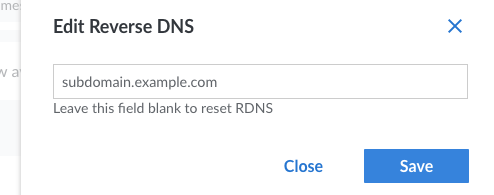
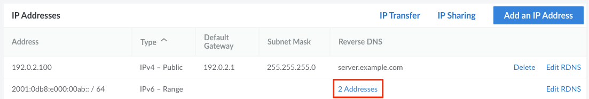

The ability to point a domain name to an IP address is referred to as *forward* DNS resolution. *Reverse* DNS (rDNS) lookup is the inverse process, where an IP address resolves to a domain name. Reverse DNS uses a *pointer record* (*PTR*) to match an IP address with a domain or subdomain. PTR records are generally set with a hosting provider. As such, rDNS can be set directly on Linode. Official Internet documents state that "every Internet-reachable host should have a name," and that the name should match a reverse pointer record (see [RFC 1033](http://tools.ietf.org/html/rfc1033) and [RFC 1912](http://tools.ietf.org/html/rfc1912)).


By default, every IP Addresses has a default rDNS value of `x.ip.linodeusercontent.com`, where *x* is the IP address with dashes (`-`) replacing periods. This default value should be replaced before using the IP Address in a production environment.


## Determine the Domain Name to Use for rDNS

First, decide the FQDN (full qualified domain name) you wish to use as your rDNS value. The structure of an FQDN is `[subdomain].[domain].[tld]`. For instance, this could be `web-01-prod.example.com` if you're hosting a website or `mail.example.com` for a mail server. Commonly, your rDNS domain should match the FQDN hostname of your Compute Instance. If you haven't yet configured your hostname, see [Configure a Custom Hostname](/docs/products/compute/compute-instances/guides/set-up-and-secure/#configure-a-custom-hostname) for example hostnames and instructions.

## Configure DNS Records

Before setting the rDNS value for your Compute Instance's IP address, you must first add an *A Record* on your domain's DNS provider that maps your full domain (including subdomain) to the IP. To do this, log in to whichever service you use to manage your domain's DNS records. This may be the Linode [DNS Manager](/docs/products/networking/dns-manager/), your domain's registrar, or a third-party DNS service. The instructions below assume you are using Linode's DNS Manager, though most DNS services work in a similar fashion.

1. Log in to the [Cloud Manager](https://cloud.linode.com/) and select **Domains** from the main navigation menu.

1. Within the list of domains that appears, click the **Edit** link corresponding with the domain you wish to use for rDNS. If your domain is not listed, you may be using a different DNS service.

1. Add the following two records by following the instructions within the [Add DNS Records](/docs/products/networking/dns-manager/guides/manage-dns-records/) guide.

    - *A Record*: Enter the subdomain you wish to use in the **Hostname** field and the public IPv4 address of your Compute Instance in the **IP Address** field.
    - *AAAA Record*: Enter the subdomain you wish to use in the **Hostname** field and the public IPv6 address of your instance in the **IP Address** field.

See our [Introduction to DNS Records](/docs/guides/dns-overview/) and [Common DNS Configurations](/docs/products/networking/dns-manager/guides/common-dns-configurations/) guides for more information about PTR and DNS records.

## Setting Reverse DNS

1. Log in to the [Cloud Manager](https://cloud.linode.com/) and click on the **Linodes** link in the sidebar to access a list of all your Compute Instances.

1. Select the Compute Instance whose reverse DNS you would like to set up and navigate to the **Network** tab.

1. Find the IP address whose reverse DNS you would like to configure and click on the **Edit rDNS** button, which may be available within the **more options** ellipsis menu on smaller screen sizes.

    

1. The *Edit Reverse DNS* menu appears. Enter the FQDN you've configured in a previous step. If you wish to reset the rDNS back to its original `*.members.linode.com` (or `*.ip.linodeusercontent.com`) domain, make sure this field is empty.

    

1. Click **Save** to make the change.

    
    If you did not previously set up an A record for your domain that matches your Compute Instance's IP address, you will see an error like the following:

    > We were unable to perform a lookup for 'example.com' at this time.

    You may also see this error if you very recently created your A record, as it can take some time for your DNS changes to propagate.
    

You can verify the reverse DNS entry was properly submitted within the *IP addresses* table under the Reverse DNS column.

Perform these steps for each IP address whose rDNS value you'd like to change.

### IPv6 Pools and Routed Ranges

While single IPv6 addresses can be configured following the same process as IPv4 addresses, reverse DNS for IPv6 pools (/116) and routed ranges (/64, /56) are configured a little differently.

1. Follow the steps for [Setting Reverse DNS](#setting-reverse-dns), clicking the **Edit rDNS** button next to an IPv6 pool or range (instead of an individual address).

2. In the **Edit Reverse DNS** form, enter the IPv6 address you'd like to use as well as the fully qualified domain name for that address. The IPv6 address needs to be a valid address within the selected IPv6 pool or range. Click on the **Save** button.

3. You can add or edit the rDNS values for other IPv6 addresses within that IPv6 pool or range by repeating this process. Once more than one rDNS entry is added, the **Reverse DNS** column of the IPv6 table will show you exactly how many IP addresses have been given rDNS entries.

    

4. To see each rDNS entry in more detail, click on the addresses entry in the rDNS column for your IPv6 pool or range. A new window will appear listing the IPv6 addresses you've configured along with their associated domain names.