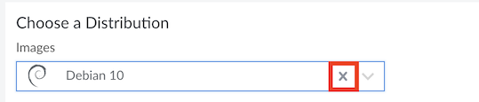
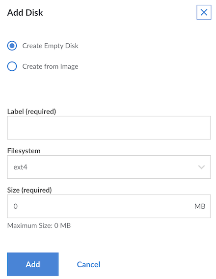
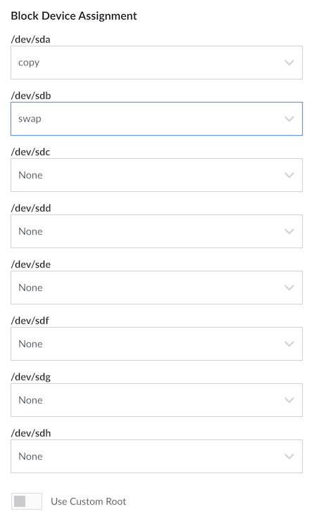
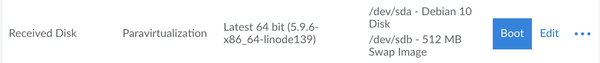

You can copy a disk of a Linode from one Linode account to another. This is a great way to prepare a disk for another Linode customer and transfer it from one individual account to another individual account. Or if you have multiple Linode accounts, this guide provides instructions to consolidate all the disks in one account.


If you are copying a disk of a Linode that hosts applications, then ensure that you complete the backup and migrate steps for the respective applications.


## Preparing the Receiving Linode

You need to prepare the *receiving* Linode before initiating the transfer. First, create a Linode with a new disks to hold the files from the other Linode.

### Creating a New Receiving Linode

1.  Log in to the [Cloud Manager](https://cloud.linode.com) with the username and password you created when signing up.
1.  Click **Create** at the top of the page and select **Linode**.
1.  Click **X** to not choose any **Image** in the **Choose a Distribution** section of the [Distributions](/docs/products/compute/compute-instances/guides/distributions/) tab.

    

1. Choose the region where you would like the Linode to reside. If you're not sure which to select, see our [How to Choose a Data Center](/docs/products/platform/get-started/guides/choose-a-data-center/) guide. You can also generate [MTR reports](/docs/guides/diagnosing-network-issues-with-mtr/) for a deeper look at the route path between you and a data center in each specific region.

1. Select a Linode plan.

1.  Give the Linode a label. This is a name to help you easily identify it within the Cloud Manager's Dashboard. If desired, assign a tag to the Linode in the **Add Tags** field.

1. Skip the **Root Password** and **SSH Keys** fields, as they are disabled when creating an empty Linode.

1.  Click **Create Linode**. The system directs you to the *Linodes* page that reports the status of the Linode as it boots up.

### Creating New Disks

To hold the files transferred from the other Linode, create two new disks labeled `copy` and `swap`:

1.  Select the Linode that is receiving the disk. The Linode's dashboard appears.

1.  Go to the **Storage** tab and click **Add a Disk** in the **Disks** section. The **Add Disk** window appears.

    

1.  Type a descriptive name such as `copy` for the disk in the **Label** field.
1.  Select `ext4` in the **Filesystem** dropdown field.
1.  Set the size of the disk in the **Size** field. The size of the disk must be large enough to hold the contents of the disk that you want to copy.
1.  Click **Add** to create the disk.
1.  Repeat the steps to create a disk labeled `swap` and select `swap` in the **Filesystem** dropdown field.
    Ensure that the size of the `swap` disk is the same as that of the `swap` disk of the disk that you want to copy.

The system creates disks to hold the files from the disk of other account.

### Booting into Rescue Mode

Start the receiving Linode in rescue mode:

1.  Select the Linode that is receiving the disk. The Linode's dashboard appears.
1. Select the **More Options Ellipsis** and click the **Rescue** button.
1.  Set the **/dev/sda** field to `copy` and **/dev/sdb** to `swap`.
1.  Click **Reboot into Rescue Mode**.

### Access the Linode in Rescue Mode

After the Linode has booted, connect to the Linode through [LISH](/docs/products/compute/compute-instances/guides/rescue-and-rebuild/#connecting-to-a-linode-running-in-rescue-mode).

1.  Select the Linode that is receiving the disk. The Linode's dashboard appears.
1.  Click **Launch Lish Console** . A new window appears that displays the Lish console, a `Welcome to Finnix!` message, and a root prompt.
1.  Set the `root` password for the Finnix rescue environment by entering the following command:

    ```command
    passwd
    ```

    
    This root password is separate from the root password of the disk that you normally boot from. Setting the root password for Finnix does not affect the root account of the distribution.
    

1.  Type the new password for the `root` user.
1.  Start the SSH server:

    ```command
    service ssh start
    ```

You can now connect to the server as root with the SSH client on the local computer.
The Linode is now ready to receive the files from the other Linode account.

## Copying the Disk

To start copying the files on the disk from one account to another, initiate the file transfer:

1.  Connect to the *source* Linode through an SSH client.

1.  Type the following command to start copying the disk, replace `192.0.2.0` with  the IP address of the *receiving* Linode:

    ```command
    dd if=/dev/sda | ssh -C 192.0.2.0 "dd of=/dev/sda" status=progress
    ```

1.  The following output appears. Enter `yes` to continue connecting:

    ```output
    The authenticity of host '192.0.2.0 (192.0.2.0)' can't be established.
    RSA key fingerprint is 20:f4:de:4d:5c:6e:a9:c7:e6:1f:8a:ad:60:62:96:3f.
    Are you sure you want to continue connecting (yes/no)?
    ```

1.  The system prompts you for the `root` password. Enter the password you created in the last section when you started the SSH server:

    ```output
    root@192.0.2.0's password:
    ```

1.  The file transfer starts, as shown below:

    ```output
    2048000+0 records in
    2048000+0 records out
    1048576000 bytes (1.0 GB) copied, 391.504 seconds, 2.7 MB/s
    2048000+0 records in
    2048000+0 records out
    1048576000 bytes (1.0 GB) copied, 387.843 seconds, 2.7 MB/s
    ```

Wait for the transfer to complete. Note that this process can take a while, depending on the size of your disk.

## Verifying the Disk

After the file transfer has completed, you should verify the disk by mounting it on the *receiving* Linode. Ensure that the [Network Helper](/docs/products/compute/compute-instances/guides/network-helper/) is on for the *receiving* Linode or the [Static IP](/docs/products/compute/compute-instances/guides/manual-network-configuration/) is configured to enable networking with the new IP addresses.

1.  Connect to the *receiving* Linode through SSH as `root`.

1.  To check that the disks are transferred successfully make a new directory for the disk by typing the following command:

    ```command
    mkdir linode
    ```

1.  Mount the disk by typing the following command:

    ```command
    mount /dev/sda linode
    ```

1.  View the directories in the disk by typing the following command:

    ```command
    ls linode/
    ```

    The output is similar to:

    ```output
    bin   dev  home  lost+found  mnt  proc  sbin     srv  tmp  var
    boot  etc  lib   media       opt  root  selinux  sys  usr
    ```


If the system displays any disk errors, then perform the [Copying the Disk](/docs/products/compute/compute-instances/guides/copy-a-disk-image-to-a-different-account/#copying-the-disk) steps again.


Now the Linode is ready to boot from the disk.

## Booting from the Disk

Boot the *receiving* Linode from the disk. First, create a configuration profile on the *receiving* Linode, and then boot the *receiving* Linode with the disk that you just transferred.

### Creating the Configuration Profile

To boot the *receiving* Linode from the transferred disk, create a new configuration profile:

1.  Click the **Linodes** tab.
1.  Select the Linode that received the disk. The Linode's dashboard appears.
1.  Select the **Configurations** tab followed by the **Add a Configuration** button. The **Add a Linode Configuration** window appears.
1.  Enter a name for the configuration profile in the **Label** field, such as *Received disk*.
1.  In the *Block Device Assignment* section, set **/dev/sda** to `copy` and **/dev/sdb** to `swap` disk.
    
1.  Click **Submit**.

You have successfully created the configuration profile.

### Booting the Receiving Linode

Now to start the *receiving* Linode from the transferred disk, select the configuration profile that you created:

1.  From the **Configurations** tab of the Linode's dashboard, find the *Received disk* configuration profile that you created.

1.  Click the **Boot** button to restart the Linode using the selected configuration profile, and boot from the transferred disk.

     

The Linode boots using the disk you transferred.