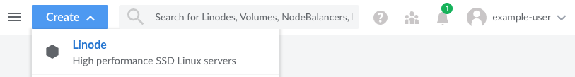
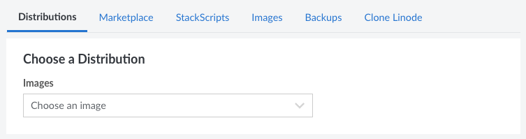
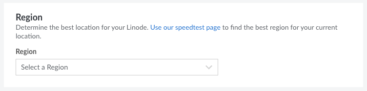
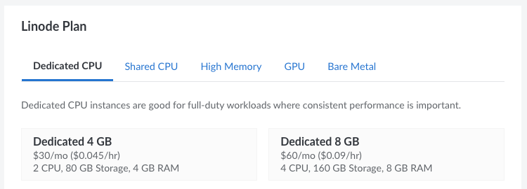
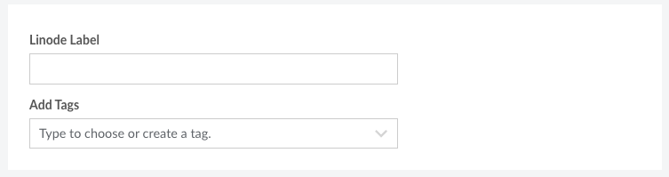
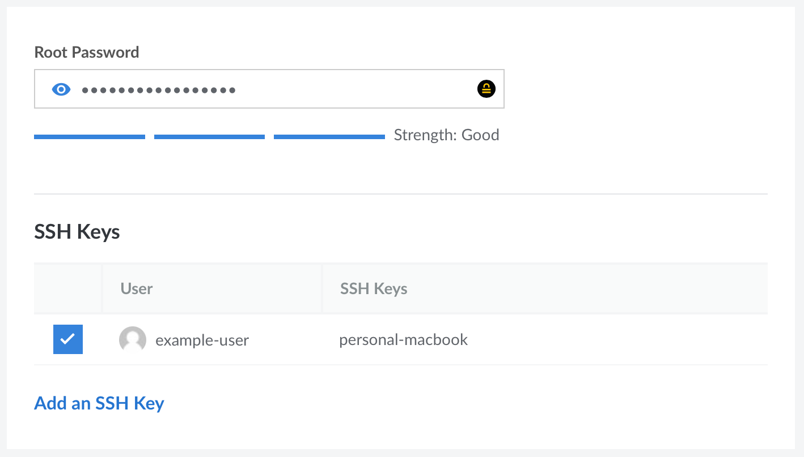
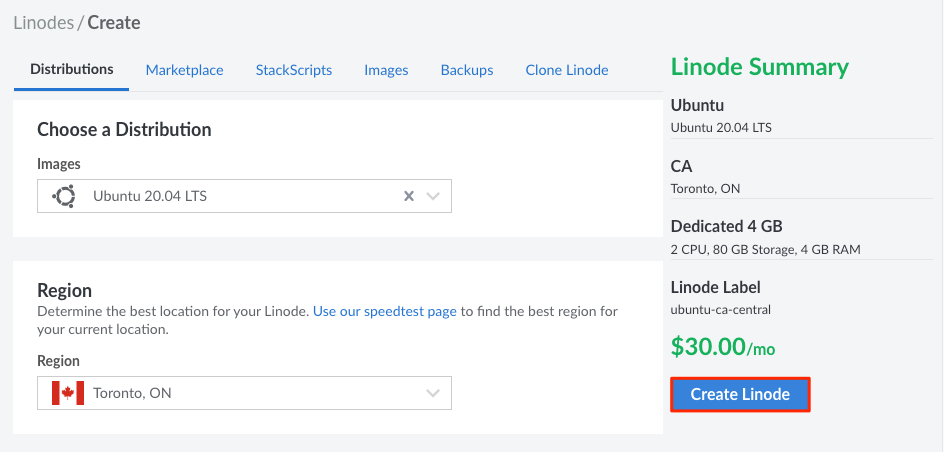
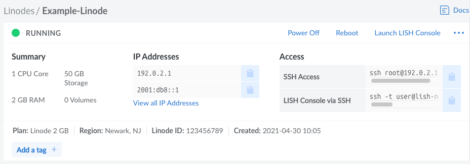

This guide walks you through creating a Compute Instance (also frequently called a *Linode*) through the Cloud Manager. Whether this is your first time using Linode or if you're a long time user, you should carefully consider each step in the process to make sure you're getting the most of your Linode services.

1. [Open the Create Form in the Cloud Manager](#open-the-create-form-in-the-cloud-manager)
1. [Choose a Distribution, App, or Image](#choose-a-distribution-app-or-image)
1. [Select a Region](#select-a-region)
1. [Choose an Instance Type and Plan](#choose-an-instance-type-and-plan)
1. [Set the Label and Add Tags](#set-the-label-and-add-tags)
1. [Create a Password and Add SSH Keys](#create-a-password-and-add-ssh-keys)
1. [Configure Additional Options](#configure-additional-options)
1. [Deploy the Instance](#deploy-the-instance)
1. [Getting Started After Deployment](#getting-started-after-deployment)

## Open the Create Form in the Cloud Manager

Log in to the [Cloud Manager](https://cloud.linode.com/), click the **Create** dropdown menu on the top bar, and select *Linode*. This opens the **Create Linode** form.

## Choose a Distribution, App, or Image

One of the first steps to deploy a Compute Instance is to decide *what* you actually wish to deploy. You're able to select a Linux distribution for a barebones install, a Marketplace App with your desired software, and a few other options.

- **Distributions:** Select from any [supported Linux distribution](https://www.linode.com/distributions/). This option allows you to start with a stable Linux operating system and build your own software stack from scratch. Popular distributions include the latest LTS releases of Ubuntu, Debian, CentOS Stream, RHEL-derivitates (such AlmaLinux and Rocky Linux), and more. Each distribution comes with its own set of preinstalled software and commands. See [Choosing a Linux Distribution](/docs/products/compute/compute-instances/guides/distributions/) for a full list of distributions.

- **Marketplace**: Select from the many [Apps](https://www.linode.com/marketplace/apps/) currently featured in the [Linode Marketplace](https://www.linode.com/marketplace/). This installs and configures your desired software, allowing you to start using your applications right away. Popular apps include [Wordpress](https://www.linode.com/marketplace/apps/linode/wordpress/), [WooCommerce](https://www.linode.com/marketplace/apps/linode/woocommerce/), [LEMP](https://www.linode.com/marketplace/apps/linode/lemp/), [cPanel](https://www.linode.com/marketplace/apps/cpanel/cpanel/), [Plesk](https://www.linode.com/marketplace/apps/plesk/plesk/), and [Nextcloud](https://www.linode.com/marketplace/apps/linode/nextcloud/). See [How to Use Linode's Marketplace Apps](/docs/products/tools/marketplace/get-started/).

- **StackScripts:** Select from any StackScripts previously created on your account or from a community StackScript. StackScripts automate the deployment of software and configuration by executing commands within your system after the first boot. See [How to Deploy a New Linode Using a StackScript](/docs/products/tools/stackscripts/guides/deploy-a-compute-instance/).

- **Images:** Select from any Custom Image or Recovery Image stored on your account. *Recovery Images* are generated after a Compute Instance has been deleted and *Custom Images* can be created based on existing instances or image files. See [Images - Get Started](/docs/products/tools/images/get-started/).

- **Backups:** If you have the Backups service enabled on an existing Compute Instance, you can select any available backup snapshot to deploy from. See [Restore a Backup to a New Linode](/docs/products/storage/backups/guides/restore-to-a-new-linode/).

- **Clone Linode:** Creates a new Compute Instance from the disks and configuration on an existing instance. See [Cloning a Linode](/docs/products/compute/compute-instances/guides/clone-instance/).

This guide assumes you are creating a Compute Instance from a **Distribution**. If you select a different option, you may wish to follow the specific instructions within their own corresponding guides.

## Select a Region

Next, you must select the **region** that the Compute Instance will reside. Regions correspond with individual data centers, each located in a different geographical area. You should likely select the region closest to you and/or your customers. This helps reduce latency and can make a significant impact in connection speeds and quality. If you wish to make use of a particular Linode product or service, you may also wish to verify that the product is available within your desired data center.

- [Global Infrastructure](https://www.linode.com/global-infrastructure/)
- [Speed Tests for Data Centers](https://www.linode.com/speed-test/)
- [How to Choose a Data Center](/docs/products/platform/get-started/guides/choose-a-data-center/)

## Choose an Instance Type and Plan

Linode offers a few different instance types and plan sizes, each with a preset amount of hardware resources (such as vCPU cores, memory, and storage space). The table below displays a list of instance types along with their plan sizes and use cases. Since every workload is different, you may wish to review the [Choosing a Compute Instance Type and Plan](/docs/products/compute/compute-instances/plans/choosing-a-plan/) guide for advice on selecting the best plan for your needs, application’s requirements, and pricing considerations.


You can resize to a different plan size or instance type at any time. This means your aren't locked in to whichever plan you select here. See [Resizing a Compute Instance](/docs/products/compute/compute-instances/guides/resize/) for instructions.




## Set the Label and Add Tags

- **Label:** The label is the name of the Compute Instance, allowing you to easily identify it from other instances. A good label should provide some indication as to what the instance is used for. As an example, a label of `acme-web-prod` may indicate that the instance is the production website for the company Acme. If you have already implemented your own naming conventions for your cloud infrastructure, follow those conventions. Labels must only use letters, numbers, underscores, dashes, and periods.

- **Tags:** Adding tags gives you the ability to categorize your Linode services however you wish. If you're a web development agency, you could add a tag for each client you have. You could also add tags for which services are for development, staging, or production.

## Create a Password and Add SSH Keys

-   **Root Password:** The password used to log in to the system as the root user. The root user is the main account and has access to the entire system, including files and commands. This password should be extremely strong to prevent attackers from gaining access to your system. By default, the root user can log in over Lish and SSH using this password, though we do recommend disabling this within the [Setting Up and Securing a Compute Instance](/docs/products/compute/compute-instances/guides/set-up-and-secure/) guide.

    

-   **SSH Keys:** Add any SSH Keys to the root user account on the server. This enables you to log in through SSH without needing a password. SSH keys are created as a pair: a *private key* stored on your local computer and a *public key* that you can upload to remote systems and services. Since you only share your public key and your private key is kept safe and secure, this is a much more secure method for authentication than passwords. Learn more about uploading SSH keys through the Cloud Manager on the [Manage SSH Keys](/docs/products/platform/accounts/guides/manage-ssh-keys/) guide.

## Configure Additional Options

The following features and services can be configured during the Compute Instance's creation or at any point after.

- **Attach a VLAN:** Add this Compute Instance to a secure private network. VLANs are available at no additional cost, though not all data centers currently support this feature. See [VLANs](/docs/products/networking/vlans/) to learn more.

- **Add the Backups service:** Safeguard your data with Linode’s Backups service, enabling automatic backups of the disks on your Compute Instances. Up to four backups are stored as part of this service, including automated daily, weekly, and biweekly backups in addition to a manual backup snapshot. See [Backups](/docs/products/storage/backups/) to learn more and view pricing.

- **Add a private IP:** A private IP gives you access to the data center's private network. This enables you to communicate over a non-public channel with other Compute Instances in the same region. Private IPs are needed to configure this instance as a NodeBalancer backend.

## Deploy the Instance

Confirm the details for this Compute Instance within the *Linode Summary* section. Once you are satisfied, click **Create Linode** to start the deployment process. This process can take anywhere from 3 minutes for Distribution Images to up to 30 minutes for some Marketplace Apps. After the creation process has started, you are automatically redirected to the detail page for this instance. From here, you can follow the status as the instance is deployed as well as see information about the new instance, such as the IP addresses.

## Getting Started After Deployment

Once the Compute Instance has been created and is done initializing, you can start configuring and using it. The next recommendation is to follow the guide linked below, which assists you in connecting to your instance, performing any initial configuration steps on your Linux system, and securing your server.

- [Setting Up and Securing a Compute Instance](/docs/products/compute/compute-instances/guides/set-up-and-secure/)

