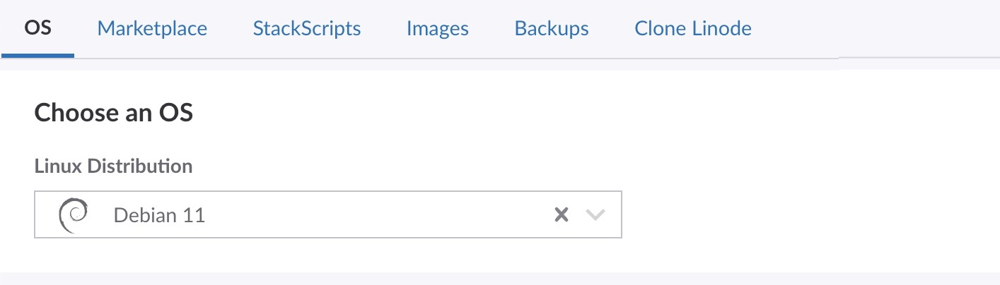
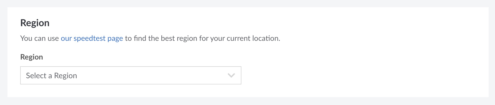
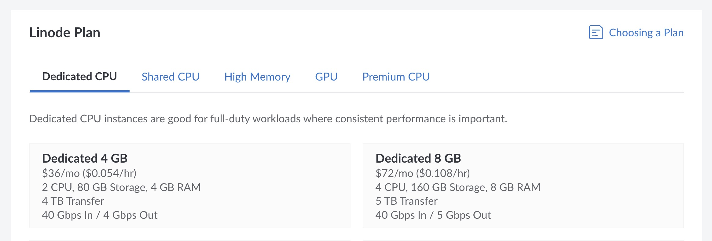
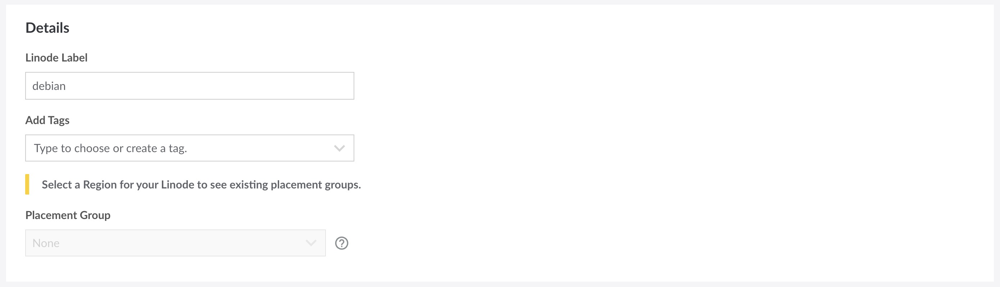
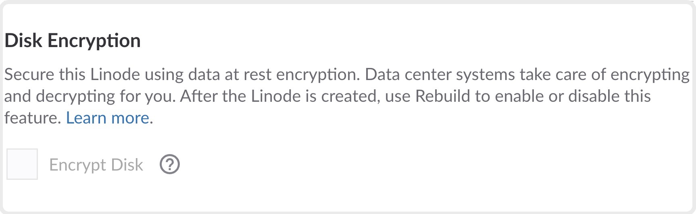
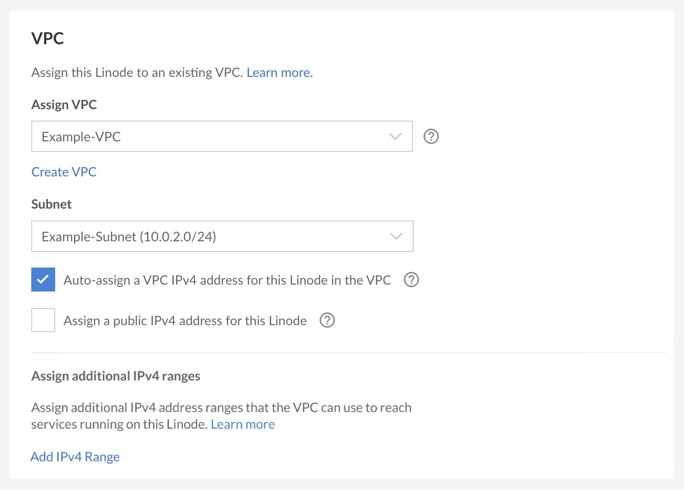
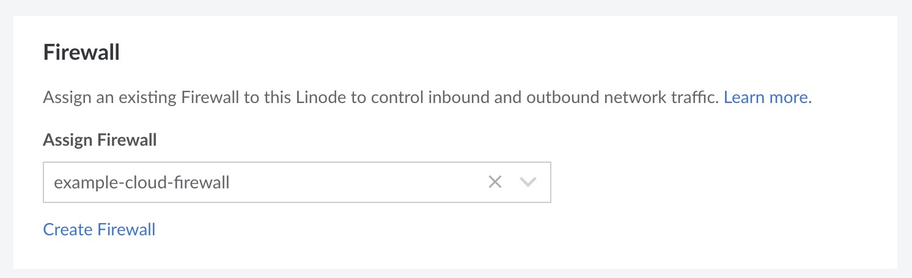
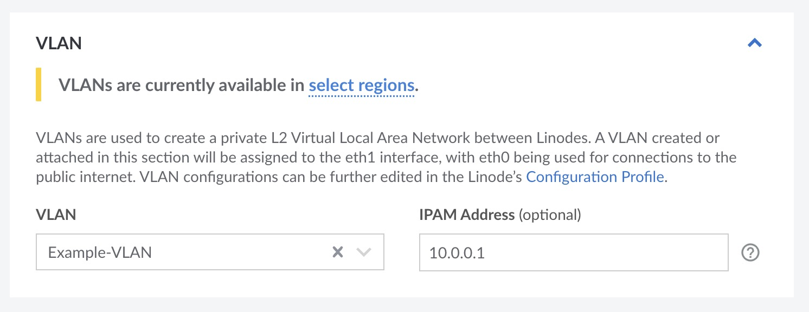
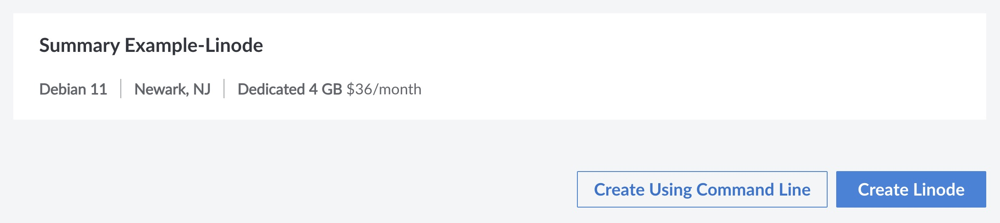

This guide walks you through creating a Compute Instance (also frequently called a *Linode*) through the Cloud Manager. Whether this is your first time using Linode or if you're a long time user, you should carefully consider each step in the process to make sure you're getting the most of your Linode services.

- [Open the Create Form in the Cloud Manager](#open-the-create-form-in-the-cloud-manager)
- [Choose a Distribution, App, or Image](#choose-a-distribution-app-or-image)
- [Select a Region](#select-a-region)
- [Choose an Instance Type and Plan](#choose-an-instance-type-and-plan)
- [Set the Label, Add Tags, and Assign a Placement Group](#set-the-label-add-tags-and-assign-a-placement-group)
- [Create a Password and Add SSH Keys](#create-a-password-and-add-ssh-keys)
- [Enable or Disable Disk Encryption](#enable-or-disable-disk-encryption)
- [Assign to a VPC (Optional)](#assign-to-a-vpc-optional)
- [Assign to a Cloud Firewall (Optional)](#assign-to-a-cloud-firewall)
- [Assign to a VLAN (Optional)](#assign-to-a-vlan)
- [Assign to a Placement Group (Optional)](#assign-to-a-placement-group)
- [Configure Additional Options](#configure-additional-options)
- [Add User Data](#add-user-data)
- [Deploy the Instance](#deploy-the-instance)
- [Getting Started After Deployment](#getting-started-after-deployment)

## Open the Create Form in the Cloud Manager

Log in to the [Cloud Manager](https://cloud.linode.com/), click the **Create** dropdown menu on the top bar, and select *Linode*. This opens the **Create Linode** form.

## Choose a Distribution, App, or Image

One of the first steps to deploy a Compute Instance is to decide *what* you actually wish to deploy. You're able to select a Linux distribution for a barebones install, a Marketplace App with your desired software, and a few other options.

- **Distributions:** Select from any [supported Linux distribution](https://www.linode.com/distributions/). This option allows you to start with a stable Linux operating system and build your own software stack from scratch. Popular distributions include the latest LTS releases of Ubuntu, Debian, CentOS Stream, RHEL-derivitates (such AlmaLinux and Rocky Linux), and more. Each distribution comes with its own set of preinstalled software and commands. See [Choosing a Linux Distribution](/docs/products/compute/compute-instances/guides/distributions/) for a full list of distributions.

- **Marketplace**: Select from the many [Apps](https://www.linode.com/marketplace/apps/) currently featured in the [Linode Marketplace](https://www.linode.com/marketplace/). This installs and configures your desired software, allowing you to start using your applications right away. Popular apps include [Wordpress](https://www.linode.com/marketplace/apps/linode/wordpress/), [WooCommerce](https://www.linode.com/marketplace/apps/linode/woocommerce/), [LEMP](https://www.linode.com/marketplace/apps/linode/lemp/), [cPanel](https://www.linode.com/marketplace/apps/cpanel/cpanel/), [Plesk](https://www.linode.com/marketplace/apps/plesk/plesk/), and [Nextcloud](https://www.linode.com/marketplace/apps/linode/nextcloud/). See [How to Use Linode's Marketplace Apps](/docs/products/tools/marketplace/get-started/).

- **StackScripts:** Select from any StackScripts previously created on your account or from a community StackScript. StackScripts automate the deployment of software and configuration by executing commands within your system after the first boot. See [How to Deploy a New Linode Using a StackScript](/docs/products/tools/stackscripts/guides/deploy-a-compute-instance/).

- **Images:** Select from any Custom Image or Recovery Image stored on your account. *Recovery Images* are generated after a Compute Instance has been deleted and *Custom Images* can be created based on existing instances or image files. See [Images - Get Started](/docs/products/tools/images/get-started/).

- **Backups:** If you have the Backups service enabled on an existing Compute Instance, you can select any available backup snapshot to deploy from. See [Restore a Backup to a New Linode](/docs/products/storage/backups/guides/restore-to-a-new-instance/).

- **Clone Linode:** Creates a new Compute Instance from the disks and configuration on an existing instance. See [Cloning a Linode](/docs/products/compute/compute-instances/guides/clone-instance/).

This guide assumes you are creating a Compute Instance from a **Distribution**. If you select a different option, you may wish to follow the specific instructions within their own corresponding guides.

## Select a Region

Next, you must select the **region** where the Compute Instance will reside. Regions correspond with individual data centers, each located in a different geographical area. You should likely select the region closest to you and/or your customers. This helps reduce latency and can make a significant impact in connection speeds and quality. If you wish to make use of a particular Linode product or service, you may also wish to verify that the product is available within your desired data center.

You need to select a region before selecting your plan type. [Pricing](https://www.linode.com/pricing/) may vary between data centers.

- [Global Infrastructure](https://www.linode.com/global-infrastructure/)
- [Speed Tests for Data Centers](https://www.linode.com/speed-test/)
- [How to Choose a Data Center](/docs/products/platform/get-started/guides/choose-a-data-center/)

## Choose an Instance Type and Plan

Linode offers a few different instance types and plan sizes, each with a preset amount of hardware resources (such as vCPU cores, memory, and storage space). The table below displays a list of instance types along with their plan sizes and use cases.

Since every workload is different, you may wish to review the [Choosing a Compute Instance Type and Plan](/docs/products/compute/compute-instances/plans/choosing-a-plan/) guide for advice on selecting the best plan for your needs, application’s requirements, and pricing considerations. Note that [pricing and plan](https://www.linode.com/pricing/) options may vary between data centers.


You can resize to a different plan size or instance type at any time. This means your aren't locked in to whichever plan you select here. See [Resizing a Compute Instance](/docs/products/compute/compute-instances/guides/resize/) for instructions.


{}

## Set the Label, Add Tags, and Assign a Placement Group

- **Label:** The label is the name of the Compute Instance, allowing you to easily identify it from other instances. A good label should provide some indication as to what the instance is used for. As an example, a label of `acme-web-prod` may indicate that the instance is the production website for the company Acme. If you have already implemented your own naming conventions for your cloud infrastructure, follow those conventions. Labels must only use letters, numbers, underscores, dashes, and periods.

- **Tags:** Adding tags gives you the ability to categorize your Linode services however you wish. If you're a web development agency, you could add a tag for each client you have. You could also add tags for which services are for development, staging, or production.

- **Placement Groups:** (Optional) Add this Compute Instance to a Placement Group to manage its physical location in a data center ("region"). Placement Groups can be set up to group your compute instances close together to help with performance, or further apart to support high availability. Placement Groups are available at no additional cost, but they're not available in all regions. See [Work with Placement Groups](/docs/products/compute/compute-instances/guides/placement-groups/) to learn more.


If you don't have an existing Placement Group, you can click **Create Placement Group** to create a new one. This takes you to a separate interface, outside creating your compute instance. For ease of use, create your compute instances in a supported region, then later create a Placement Group and assign your compute instances to it.


## Create a Password and Add SSH Keys

-   **Root Password:** The password used to log in to the system as the root user. The root user is the main account and has access to the entire system, including files and commands. This password should be extremely strong to prevent attackers from gaining access to your system. By default, the root user can log in over Lish and SSH using this password, though we do recommend disabling this within the [Setting Up and Securing a Compute Instance](/docs/products/compute/compute-instances/guides/set-up-and-secure/) guide.

    {}

-   **SSH Keys:** Add any SSH Keys to the root user account on the server. This enables you to log in through SSH without needing a password. SSH keys are created as a pair: a *private key* stored on your local computer and a *public key* that you can upload to remote systems and services. Since you only share your public key and your private key is kept safe and secure, this is a much more secure method for authentication than passwords. Learn more about uploading SSH keys through the Cloud Manager on the [Manage SSH Keys](/docs/products/platform/accounts/guides/manage-ssh-keys/) guide.

## Enable or Disable Disk Encryption

Consider enabling **Disk Encrypt** on this Compute Instance. The platform manages encryption and decryption for you. After a Compute Instance is created, use [Rebuild](/docs/products/compute/compute-instances/guides/rescue-and-rebuild/#rebuilding) to change this setting.


Disk Encryption is not currently available in all regions.


More information is available from the [Local Disk Encryption](/docs/products/compute/compute-instances/guides/local-disk-encryption/) guide.

## Assign to a VPC (Optional)

Consider using a [VPC](/docs/products/networking/vpc/) (Virtual Private Network) to isolate your new Compute Instance from other systems on the Akamai cloud computing platform and the internet. This adds an additional layer of privacy and can be used alongside Cloud Firewalls. If you are not sure you need a VPC, you can skip this step. You can add this new Compute Instance to a VPC at any time in the future by following the steps within the [Assign (and Remove) Services to a VPC](/docs/products/networking/vpc/guides/assign-services/) guide.

- **Select VPC:** To assign this instance to a VPC, select the VPC from the **Assign VPC** dropdown menu. If you do not yet have a VPC in the selected data center, click the **Create a VPC** button and follow the instructions on the [Create a VPC](/docs/products/networking/vpc/guides/create/) guide.

- **Select Subnet:** An instance can be assigned to a single subnet, which allows you to further segment traffic and services within a VPC. Select the desired subnet within the **Subnet** dropdown menu.

- **Auto-Assign IPv4 address:** By default, an IPv4 address will be automatically generated for the instance on the subnet’s defined CIDR range. If you want to manually assign an IP address, uncheck the **Auto-assign a VPC IPv4 address for this Linode** option and enter your custom IPv4 address. This address must still be within the subnet’s IP range.

- **Public IPv4 address:** If you wish to enable public internet access on this new instance, check the **Assign a public IPv4 address for this Linode** option. By default, this is unchecked and you will not be able to access the internet from this instance.

-   **Additional IPv4 ranges:** You can assign additional IPv4 ranges that can be used to reach this Compute Instance and/or the services running on it. For example, you may wish to assign additional IPv4 ranges to directly expose Docker containers to the VPC.

For additional information and considerations, review the [Assign (and Remove) Services](/docs/products/networking/vpc/guides/assign-services/) guide.

## Assign to a Cloud Firewall (Optional) {#assign-to-a-cloud-firewall}

To protect your new Compute Instance from unwanted traffic, consider using a [Cloud Firewall](/docs/products/networking/cloud-firewall/). This allows you to cascade firewall rules across multiple services and manage those rules within the Cloud Manager, Linode CLI, and Linode API.

To assign your instance to a Cloud Firewall, select the firewall from the **Assign Firewall** dropdown menu. If you do not have a firewall or wish to create a new one, click the **Create Firewall** link and follow the instructions within the [Create a Cloud Firewall](/docs/products/networking/cloud-firewall/guides/create-a-cloud-firewall/) guide. You can always skip this step and assign a firewall at a later time by following the instructions in the [Apply Firewall Rules to a Service](/docs/products/networking/cloud-firewall/guides/apply-to-service/) guide.

## Assign to a VLAN (Optional) {#assign-to-a-vlan}

Add this Compute Instance to a secure private network. VLANs are available at no additional cost, though not all data centers currently support this feature. See [VLANs](/docs/products/networking/vlans/) to learn more.


In most cases, it's recommended to use a VPC over a VLAN. VPCs operate on a higher network layer and come with more IP addressing and IP routing functionality. Additionally, you can further segment out network traffic through subnets, each of which has its own CIDR range. Review [these differences](/docs/products/networking/vpc/#difference-between-private-network-options-vpcs-vlans-and-private-ips) to learn more.


## Configure Additional Options

The following features and services can be configured during the Compute Instance's creation or at any point after.

- **Add the Backups service:** Safeguard your data with Linode’s Backups service, enabling automatic backups of the disks on your Compute Instances. Up to four backups are stored as part of this service, including automated daily, weekly, and biweekly backups in addition to a manual backup snapshot. See [Backups](/docs/products/storage/backups/) to learn more and view pricing.

- **Add a private IP:** A private IP gives you access to the data center's private network. This enables you to communicate with other Compute Instances with private IPs in the same region without using a public IPv4 address. Private IPs are needed to configure your instance as a NodeBalancer backend. The private IP feature requires a _Public Internet_ network interface. As such, Compute Instances configured with both VPCs _and_ a private IP address are configured with the _VPC_ network interface on `eth0` and the _Public Internet_ interface on `eth1`.

    
    Private IP addresses are accessible by any other instance in the same data center, provided that instance also has a private IP. To further isolate your instance, consider using a VPC instead. Review [these differences](/docs/products/networking/vpc/#difference-between-private-network-options-vpcs-vlans-and-private-ips) to learn more.
    

## Add User Data

User data can be provided to the Metadata service, which is then consumed by cloud-init when your Compute Instance boots up for the first time. For information on the Metadata service, user data formats, and our cloud-init integration, review [Overview of the Metadata Service](/docs/products/compute/compute-instances/guides/metadata/).

## Deploy the Instance

Confirm the details for this Compute Instance within the *Linode Summary* section. Once you are satisfied, click **Create Linode** to start the deployment process. This process can take anywhere from 3 minutes for Distribution Images to up to 30 minutes for some Marketplace Apps. After the creation process has started, you are automatically redirected to the detail page for this instance. From here, you can follow the status as the instance is deployed as well as see information about the new instance, such as the IP addresses.

## Getting Started After Deployment

Once the Compute Instance has been created and is done initializing, you can start configuring and using it. The next recommendation is to follow the guide linked below, which assists you in connecting to your instance, performing any initial configuration steps on your Linux system, and securing your server.

- [Setting Up and Securing a Compute Instance](/docs/products/compute/compute-instances/guides/set-up-and-secure/)

{}