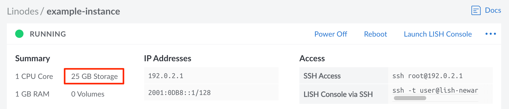
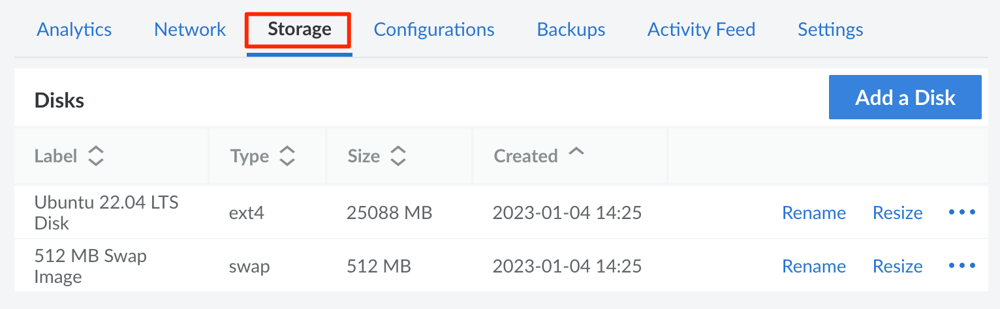
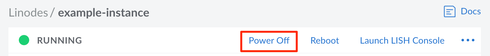
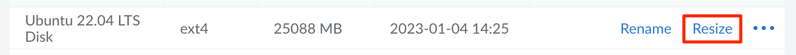
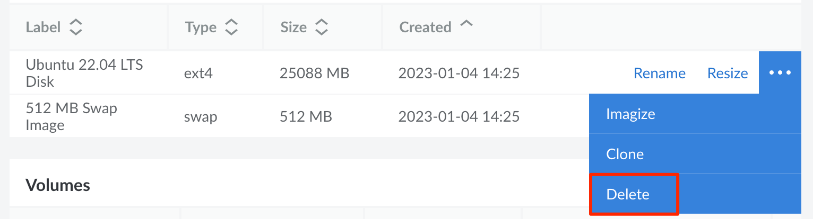

## Understanding Storage

Every Compute Instance is equipped with persistent storage, the amount of which varies based on size and type of the instance's plan. This local storage is built entirely on enterprise-grade SSDs (solid state disks) and is extremely performant and reliable.

### Disks

The storage space on a Compute Instance can be allocated to individual *disks*. Disks are be used to store any data, including the operating system, applications, and files. Most instances are deployed with two disks. A large primary disk is used to store the Linux distribution, software, and data. There's also a much smaller swap disk, which is used in the event that your instance runs out of memory.

While two disks may be the default, a Compute Instance can be configured to have many more disks. These additional disks can serve a variety of purposes, including dedicated file storage or switching between entirely different Linux distributions. When multiple disks are added, [configuration profiles](/docs/products/compute/compute-instances/guides/configuration-profiles/) are used to determine the disks that are accessible when the instance is powered on, as well as which of those disks serves as the primary root disk.

### Add Additional Storage

The local storage capacity of a Compute Instance can only be increased by upgrading to a larger plan. This allows you to increase the size of existing disks or add additional disks. [Block Storage](/docs/products/storage/block-storage/) Volumes can also be used to add additional storage, though these Volumes are separate from a Compute Instance's local disks and, for some use cases, may be less performant.

## View Disks

A Compute Instance's total storage space and disks can be viewed and managed from the [Cloud Manager](https://cloud.linode.com).

1. Log in to the [Cloud Manager](https://cloud.linode.com), click the **Linodes** link in the sidebar, and select a Compute Instance from the list.

1. Look within the **Summary** section of the instance's dashboard to view the total storage.

    

1. Navigate to the **Storage** tab and find the **Disks** section, which lists all disks on the Compute Instance.

    

From here, a [disk can be created](#creating-a-disk) using the **Add a Disk** button. To take action on an disk, locate the disk within the **Disks** table and select from the list of actions, some or all of which may appear within the **ellipsis** menu:

- **Rename:** Change the name of the disk.
- **Resize:** Increase or decrease the size of the disk. See [Resize a Disk](#resize-a-disk).
- **Imagize:** Create a Custom Image based on the disk. See [Capture an Image](/docs/products/tools/images/guides/capture-an-image/).
- **Clone:** Duplicate the disk, adding it to any Linode on your account. See [Clone a Disk](#clone-a-disk).
- **Delete:** Permanently delete's the disk and all of its data (cannot be undone). See [Delete a Disk](#delete-a-disk).

## Create a Disk

Each Compute Instance can have multiple disks. To create a new disk, follow the instructions below.


If you wish to deploy an Image to a new disk, see the [Deploy an Image to a Disk on an Existing Compute Instance](/docs/products/tools/images/guides/deploy-image-to-existing-linode/) guide for complete instructions on creating the main disk, an optional swap disk, and a configuration profile.


1. Navigate to the **Storage** tab on the Compute Instance you wish to edit. See [View Disks](#view-disks).

1. Click the **Add a Disk** button to show the **Add Disk** form.

    

    
    If this button is disabled, all of the instance's storage space has been allocated towards disks. Before continuing, [resize an existing disk](#resize-a-disk) or [upgrade the instance](/docs/products/compute/compute-instances/guides/resize/) to a larger plan. You'll want to confirm there is enough unallocated storage space to accommodate the desired size of the new disk.
    

1. Select from either the **Create Empty Disk** or **Create from Image** options.

    **Empty disks:** An empty disk can store additional data, be used as a swap disk, or it can be used to manually [install a custom distribution](/docs/products/compute/compute-instances/guides/install-a-custom-distribution/). When creating an empty disk, select the desired *Filesystem*. In most cases, it's recommended to use the *ext4* filesystem. This ensures compatibility with our Backups service. If needed, *ext3* and *raw* disks are also available. If creating a swap disk, select the *swap* option.

    **Images:** Selecting an Image allows you to deploy a [Distribution Image](https://www.linode.com/distributions/), a [Custom Image](/docs/products/tools/images/), or a Recovery Image to the new disk. When creating a disk based on an Image, select the *Image*, *Root Password*, and optionally add *SSH Keys*.

1. Once an option is chosen, complete the remaining fields in the form. Enter the *Label* and the *Size* for the new disk. The *maximum size* of the disk is pre-populated and based on the Compute Instance's remaining storage allocation, though a smaller size can be entered if desired.

1. Click the **Add** button to create the disk. The progress can be monitored from the new entry appearing for the disk within the Compute Instance's **Storage** page.

Once a disk has been created, you will need to modify the existing configuration profile or add a new configuration profile. Specifically, the disk will need to be assigned to a device and optionally marked as the root device if this new disk will function as the primary boot disk. See the [Deploy an Image to a Disk on an Existing Compute Instance](/docs/products/tools/images/guides/deploy-image-to-existing-linode/) guide or the [Configuration Profiles](/docs/products/compute/compute-instances/guides/configuration-profiles/) guide for additional details.

## Resize a Disk

The size of a Compute Instance's disk can be increased or decreased as needed. When resizing, it's important to keep the following restrictions in mind:

- The **maximum size** of a disk is equal to the current size of the disk and the remaining unallocated storage space on the Compute Instance. The maximum size is displayed underneath the **Size** field when resizing the disk.
- The **minimum size** of a disk is equal to the current disk usage within the filesystem. This number is not displayed in the Cloud Manager. To determine how much space the files on the disk are using, run the command `df -h` within the Compute Instance's command line (through [SSH](/docs/products/compute/compute-instances/guides/set-up-and-secure/#connect-to-the-instance) or [Lish](/docs/products/compute/compute-instances/guides/lish/)).
- **Raw disks** can only be resized to a larger disk.
- Disks with **custom partitions** cannot be resized.

The following instructions cover how to resize a disk. For instructions regarding resizing a Compute Instance's plan (including downgrading to a smaller plan), see the [Resizing a Compute Instance](/docs/products/compute/compute-instances/guides/resize/) guide.

1. Navigate to the **Storage** tab on the Compute Instance you wish to edit. See [View Disks](#view-disks).

1. Click the **Power Off** button in the upper right of the page or within the **ellipsis** menu. Wait until the Compute Instance has been fully powered off before continuing to the next step.

    

1. Within the **Disks** table, locate the disk you wish to resize and click the corresponding **Resize** button, which may also appear within the **ellipsis** menu.

    

    
    If the **Resize** button is disabled, confirm that the Compute Instance has been fully powered off.
    

1.  The **Resize Disk** form is displayed. In the **Size** field, enter the new size for the disk in megabytes. The new size of the disk needs to be within the maximum and minimize disk size discussed above.

1.  Click **Resize**. The progress can be monitored from the corresponding entry for the disk within the **Disks** table on the Compute Instance's **Storage** page.

1.  Once the disk has been successfully resized, click the **Power On** button to boot up the Linode.

## Clone a Disk

A disk can be duplicated onto the same Compute Instance or any other instance on the account. See [Cloning to an Existing Compute Instance](/docs/products/compute/compute-instances/guides/clone-instance/#cloning-to-an-existing-linode) for instructions.

## Delete a Disk

A disk can be deleted to remove it from the Compute Instance and free up additional storage space that can be used for other disks.


Deleting a disk is permanent and cannot be undone. Make sure all required data is properly backed up before continuing.


1. Navigate to the **Storage** tab on the Compute Instance you wish to edit. See [View Disks](#view-disks).

1. Click the **Power Off** button in the upper right of the page or within the **ellipsis** menu. Before proceeding, wait until the Compute Instance has been fully powered off.

    

1. Within the **Disks** table, locate the disk you wish to delete and click the corresponding **Delete** button, which may also appear within the **ellipsis** menu.

    

    
    If the **Delete** button is disabled, confirm that the Compute Instance has been fully powered off.
    

1. A confirmation dialog window will appear. Click the **Delete** button to confirm.

1. The disk will be deleted within a few seconds. Click the **Power On** button to boot up the Compute Instance.