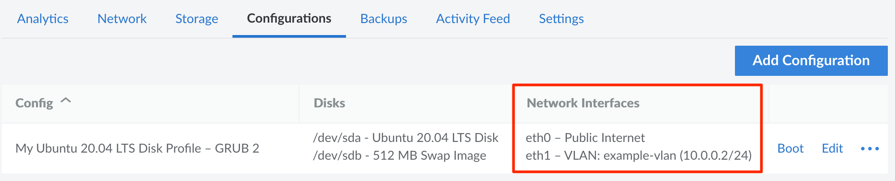


Not all data centers supports configuring IP failover through keepalived. Review the [Configuring IP Failover on a Compute Instance](/docs/products/compute/compute-instances/guides/failover/) to learn more about IP Sharing / IP failover availability within each data center.


This guide covers using keepalived to configure IP failover with Linode Compute Instances. Keepalived is a routing service that can be used to monitor and fail over components in a high availability configuration. In a typical setup with IP failover, there is one **primary** Instance and one or more **secondary** Instances.

- **Primary** (also called `MASTER` in keepalived): The primary Compute Instance is the one containing the IP address you'd like to configure for IP failover.
- **Secondary** (also called `BACKUP` in keepalived): The secondary Compute Instances are then configured to use that IP address in the event the primary Instance stops responding.

## IP Failover Compatibility

Linode's IP failover feature using keepalived is compatible with various IP address types in certain data centers. Review the list below to learn what types are available in your data center.

- **Public and Private IPv4 addresses:** Can be configured in a supported data center using keepalived. You must first configure Linode's IP Sharing feature as outlined in the [Configuring IP Sharing](#configuring-ip-sharing) section. See [Configure Failover > IP Sharing Availability](/docs/products/compute/compute-instances/guides/failover/#configure-failover) for a list of data centers that support ARP-based failover.

- **IPv6 addresses:** IP failover with IPv6 addresses is not currently supported.

- **VLAN IP addressses:** Can be configured in a supported data center using keepalived. See [VLANs > Availability](/docs/products/networking/vlans/#availability) for a list of data centers.

## Configuring IP Sharing

Before using keepalived to configure IP failover for a public or private IPv4 address (not VLANs), you first need to use Linode's IP Sharing feature to share your IP address with other Compute Instances. To do so, follow the instructions within the **Configuring IP Sharing** section of the [Managing IP Addresses](/docs/products/compute/compute-instances/guides/manage-ip-addresses/#configuring-ip-sharing) guide for *each secondary* Compute Instance.

## Installing and Configuring keepalived

This section covers installing the keepalived software from your distribution's repository. See [Installing Keepalived](https://keepalived.readthedocs.io/en/latest/installing_keepalived.html) on the official documentation if you prefer to install it from source. After installing keepalived, the next step is to configure it for your particular IP failover scenario.

1.  Log in to your Compute Instance over SSH. See [Connecting to a Remote Server Over SSH](/docs/guides/connect-to-server-over-ssh/) for assistance.

1.  Install keepalived by following the instructions for your system's distribution.

    **Ubuntu and Debian:**

    ```command
    sudo apt update && sudo apt upgrade
    sudo apt install keepalived
    ```

    **CentOS 8 Stream, CentOS/RHL 8 (including derivatives such as AlmaLinux 8 and Rocky Linux 8), Fedora:**

    ```command
    sudo dnf upgrade
    sudo dnf install keepalived
    ```

    **CentOS 7:**

    ```command
    sudo yum update
    sudo yum install keepalived
    ```

1.  Start editing a new keepalived configuration file.

    ```command
    sudo nano /etc/keepalived/keepalived.conf
    ```

1.  Enter the proper settings for your configuration into this file. Use the example below as a starting point, replacing the following items. For more configuration options, see [Configuration Options](#configuration-options).

    - Replace *$password* with a secure password to use for this configuration instance. You should use the same password for each Compute Instance you configure.

    - Replace *192.0.2.1* with the IP address for which you'd like to enable failover.

    
    If configuring IP failover on a VLAN IP, you likely need to change the *interface* value from `eth0` to `eth1`. See the **interface** item under [Configuration Options](#configuration-options) for help finding the Network Interface your VLAN may be using.
    

    ```file {title="/etc/keepalived/keepalived.conf"}
    vrrp_instance Instance1 {
        state MASTER
        interface eth0
        virtual_router_id 10
        priority 100
        advert_int 1
        authentication {
            auth_type PASS
            auth_pass $password
        }
        virtual_ipaddress {
            192.0.2.1
        }
    }
    ```

1.  Enable and start the keepalived service.

    ```command
    sudo systemctl enable keepalived
    sudo systemctl start keepalived
    ```

1.  Perform these steps again on *each* secondary Compute Instance you would like to configure. You can use the same configuration file as provided above, but make the following adjustments:

    - Set the *state* value to `BACKUP`
    - Set the *priority* value to `99` or less, depending on the failover order you prefer for the secondary Compute Instances.

## Configuration Options

When configuring keepalived, there are quite a few options that can be modified to accomplish various tasks and behaviors. This section covers some of them, though you can review the [Keepalived configuration synopsis](https://keepalived.readthedocs.io/en/latest/configuration_synopsis.html) page on the official documentation to learn more.

- **vrrp_instance:** The VRRP instance definition block. Set this to whatever you'd like to call this block. To help with identification, this should be the same value across all Compute Instances that will share the specified IP address.
- **state:** Set this to `MASTER` if the IP address is natively assigned to this Compute Instance. When configuring it as a secondary failover server, use `BACKUP`.
- **interface:** Set this to whichever Network Interface the IP address is using or should use. To find the interface, log in to the [Cloud Manager](https://cloud.linode.com/), click on the **Linodes** link on the left menu, select your Compute Instance, navigate to the **Configurations** tab and review the **Network Interfaces** column for your active configuration profile. For public IP addresses the interface is typically `eth0` and for vlan addresses the interface is likely `eth1`.

    

- **priority:** When multiple secondary Compute Instances are configured for IP failover, this sets the order in which they will be used.
- **auth_pass:** Set the password used by keepalived for failover synchronization. This should be used across all Compute Instances that will share the specified IP address.
- **virtual_ipaddress:** This block defines which IP address is configured for IP failover. Set this to the IP address you'd like to use.

## Testing the IP Failover Functionality

1.  Power off the *primary* Compute Instance.

1.  If you've configured IP failover for a public IP address, ping the IP address on your local machine. If you've configured IP failover on a private network, such as a VLAN, ping the IP address from another machine on that network.

    ```command
    ping 192.0.2.1
    ```

    If IP failover is successfully configured, the output should be similar to the following (once the primary Compute Instance has fully powered off):

    ```output
    64 bytes from 192.0.2.1: icmp_seq=3310 ttl=64 time=0.373 ms
    ```

    If you are instead receiving output telling you that the host is unreachable, IP failover likely hasn't been successfully configured.

    ```output
    From 192.0.2.1 icmp_seq=3293 Destination Host Unreachable
    ```