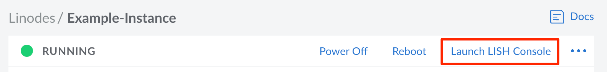
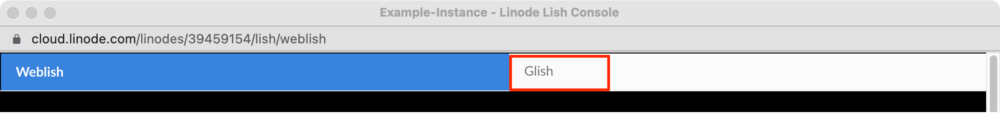
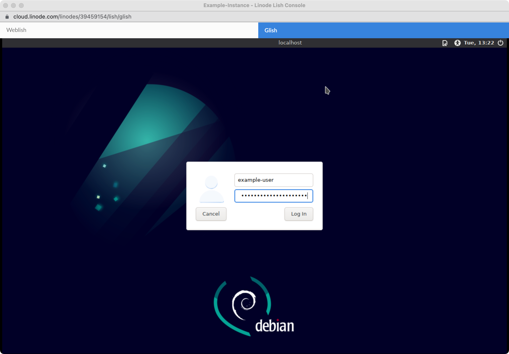
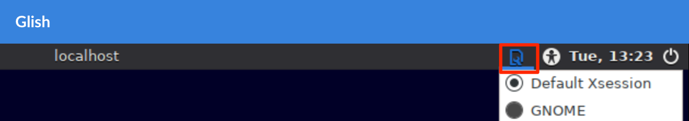
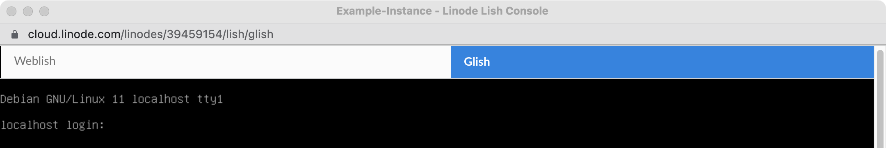
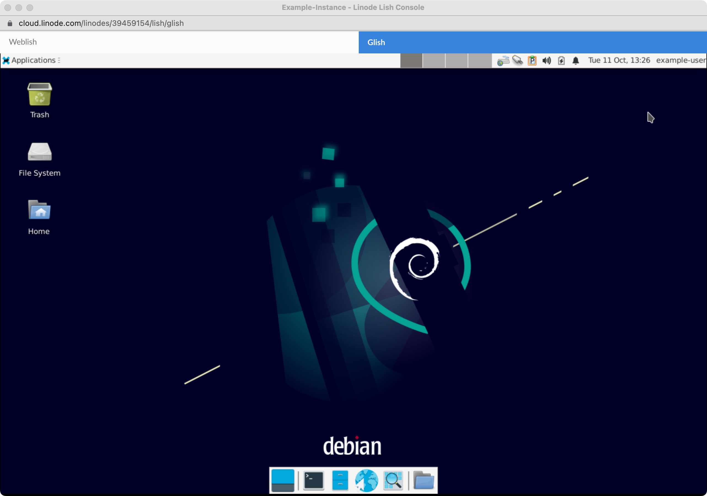

Glish is the graphical version of [Lish](/docs/products/compute/compute-instances/guides/lish/) (the Linode Shell). It allows you to run a desktop environment on your Compute Instance and access it through the Cloud Manager.


Linode distribution images do not have any desktop environments pre-installed. While this guide provides instructions for installing Xfce on Debian, you can use any other desktop environment and distribution. Popular desktop environments on Linux include Gnome, KDE, MATE, and Xfce.


## Enable Glish

By default, Glish is enabled on all Compute Instances as part of the distro helper configuration tool. There is no additional configuration needed. Glish works by accessing the `tty1` console over the virtual VGA device.

If you have disabled distro helper on your Compute Instance's [Configuration Profile](/docs/products/compute/compute-instances/guides/configuration-profiles/), manually launch a [getty](https://en.wikipedia.org/wiki/Getty_(Unix)) on `tty1` using the command below. This command may vary depending on the installed distribution.

```command
exec /sbin/getty -8 38400 tty1 &
```


If you are having issues accessing Weblish or Glish, you may be behind a restrictive local firewall. See [Lish Gateways](/docs/products/compute/compute-instances/guides/lish/#lish-gateways) for a list of data centers, their corresponding gateways, and the ports that are used.


## Install a Display Manager and Desktop Environment

Before using Glish, a display manager and desktop environment must be installed on the Compute Instance. You can use any desktop environment that you wish, including [Gnome](https://www.gnome.org/), [KDE](https://kde.org/), [MATE](https://mate-desktop.org/), and [Xfce](https://www.xfce.org/). When choosing one, consider the size of your Compute Instance and the requirements of that desktop environment. For instance, Xfce and MATE are lightweight and can run on the smallest Compute Instance. When running Gnome, at least 2 GB of memory is recommended. For KDE, at least 4 GB of memory is recommended.


The instructions below install Xfce4 and LightDM on Debian 11. You are not limited to using these applications or this distribution. If you wish to use other software, follow the instructions for that application.


1.  Log in to your Compute Instance using [Lish](/docs/products/compute/compute-instances/guides/lish/) or [SSH](/docs/products/compute/compute-instances/guides/set-up-and-secure/#connect-to-the-instance).

1.  Follow all of the instructions within the [Set Up and Secure a Compute Instance](/docs/products/compute/compute-instances/guides/set-up-and-secure/) guide, including updating your system, setting the timezone, and adding a limited user account. Most display managers do not allow root login by default.

    ```command
    sudo apt update && sudo apt upgrade
    ```

1.  Install your preferred desktop environment. The command below installs Xfce, along with the optional enhancements package and a web browser.

    ```command
    sudo apt install xfce4 xfce4-goodies dbus-x11 firefox-esr
    ```

1.  Install a display manager, which provides a graphical login screen. This allows you to log in as your desired user and with your preferred desktop environment. There are many display managers available, including [LightDM](https://wiki.debian.org/LightDM), [GDM](https://wiki.debian.org/GDM) (Gnome Desktop Manager), [SDDM](https://wiki.debian.org/SDDM), and [Ly](https://github.com/fairyglade/ly). This guide uses LightDM.

    ```command
    sudo install lightdm
    ```

1.  Set your new display manager as the system default. The command below opens up a prompt that allows you to select your preference from all display manager's that are currently installed.

    ```command
    sudo dpkg-reconfigure lightdm
    ```

## Access Glish and the Linux Desktop

1.  Log in to the [Cloud Manager](https://cloud.linode.com), click the **Linodes** link in the sidebar, and select your desired Compute Instance from the list.

1.  To open the console, click on the **Launch Console** button in the top right corner of the summary page.

    

1.  Log in to the *Weblish* prompt (or use SSH) and start the display manager. The example below is for LightDM.

    ```command
    sudo systemctl start lightdm
    ```

1.  Once the display manager has started, select the **Glish** tab.

    

1.  The display manager's login prompt should appear within the Glish tab. If you are using LightDM, it should look similar to the screenshot below. Enter your username and password. Since the root user is likely disabled by default, use a limited user account on your system.

    

    If you have multiple desktop environments, you can select between them by using the configuration button in the top left of the screen.

    

    If your display manager is not working properly, you may still see the tty prompt as shown below. If this is the case, go back to *weblish* and troubleshoot.

    

1.  Once you are successfully logged in, your desktop environment should be visible. From here, you can use your mouse and keyboard to control your desktop.

    

    
    Glish does not offer copy and paste functionality.
    