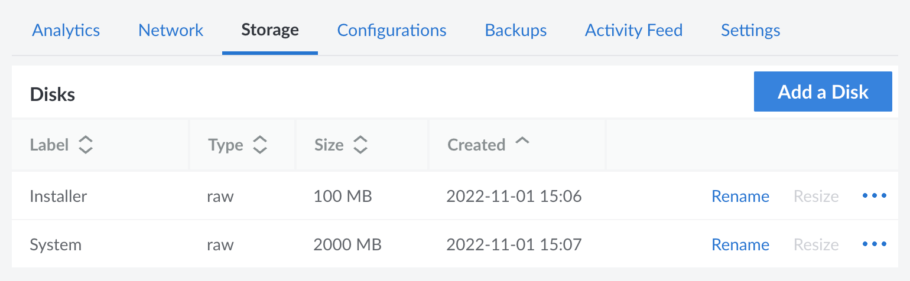
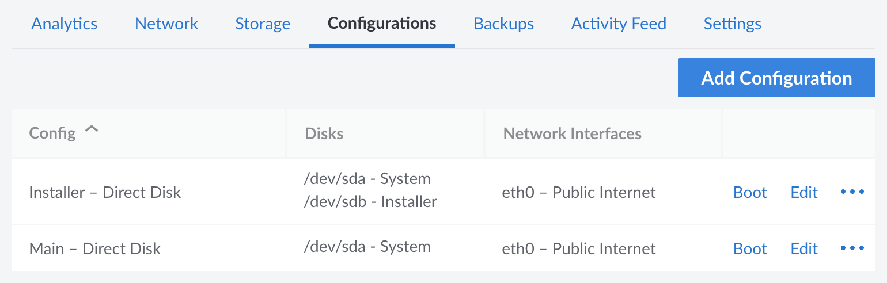
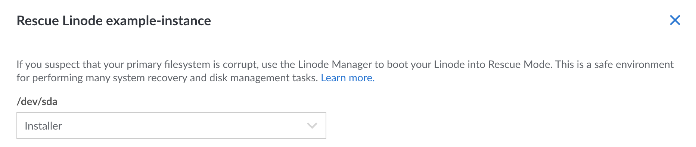
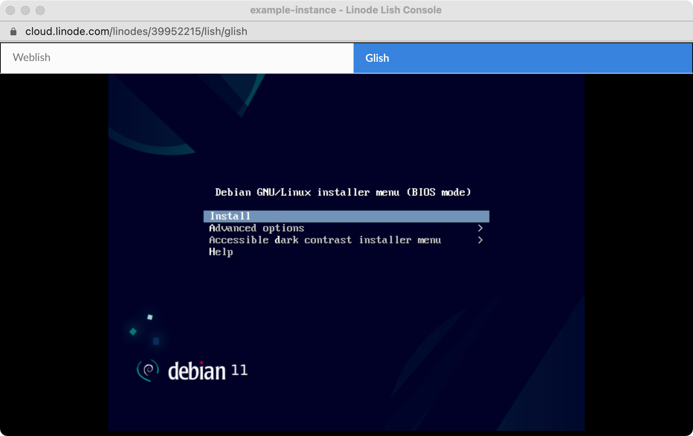
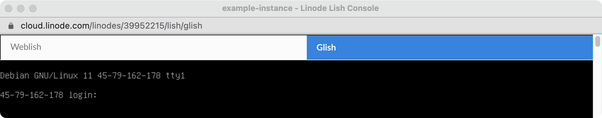

Linode provides images for many Linux distributions, all of which are available to use when deploying Compute Instances. These officially supported distributions are constantly updated and include popular general purpose distributions (like Ubuntu, CentOS, and Debian) as well as many other more advanced or focused distributions (such as Arch, Kali, and Alpine). See the [Choosing a Linux Distribution](/docs/products/compute/compute-instances/guides/distributions/) guide for a complete list.

While these official images are generally sufficient for most customers, some applications or workloads may require distributions that aren't provided by Linode. There are a few methods that can be used to build custom images or install distributions on Linode.

- **Upload a custom image.** This requires either obtaining the image from a third-party source or using a distribution's official installer. After downloading the image to your workstation, install it on a local virtual machine. Then, save the system to a compatible format. For more detailed instructions, see [Upload a Custom Image](/docs/products/tools/images/guides/upload-an-image/).

- **Install the distribution directly on a Compute Instance.** This requires that you download the distribution's installer to a Compute Instance and use [Glish](/docs/products/compute/compute-instances/guides/glish/) to install the distribution onto the instance's disks.

This guide covers the latter method. The instructions walk you through:

- Downloading the installer for the latest Debian version
- Installing it onto a Compute Instance
- Performing additional configuration steps so that it is compatible with some features of the Linode Platform

## Install the Distribution onto a Compute Instance

In this section, learn how to download and install a Linux distribution onto a Compute Instance.

### Create the Compute Instance

First, create the Compute Instance and add the necessary disks and configuration profiles needed throughout the remaining steps.

1. Log into the [Cloud Manager](https://cloud.linode.com), select **Linodes** in the left navigation menu, and click on the **Create Linode** button.

1. Within the creation form, click the **X** icon within the **Images** dropdown. This creates a Compute Instance without any operating system, disks, or configuration profiles. Complete the rest of the form, including selecting a region, plan, and entering a label. Some fields, such as the root password and SSH keys, are disabled when no distribution image is selected.

1. Click the **Create** button to create the Compute Instance. Once it has been created, you should be taken to its dashboard page.

1. Navigate to the **Storage** tab and create two disks on your new Compute Instance. One disk is for the installer image itself and the other is where the system will be installed. The settings for each of these disks are outlined below. See the [Creating a Disk](/docs/products/compute/compute-instances/guides/disks-and-storage/#creating-a-disk) guide for additional instructions.

    

    - **Installer Disk:** This disk will contain the installer image for whichever Linux distribution you wish to install. Set the **Label** to *Installer* and the **Filesystem** to *raw*. The size of the disk should be large enough for your installer image. For instance, the install media for the example distribution used in this guide (the latest Debian release) is approximately 50 MB. If following this example to install Debian, this disk should be 100 MB in size.

    - **System Disk:** This disk is where you will install the distribution. Set the **Label** to *System* and the **Filesystem** to *raw*. When setting the **Size** of this disk, there are some important considerations.

        - If you do not plan on making this system compatible with [Linode platform actions, tools, and features](#make-the-system-compatible-with-the-linode-platform) (such as automatic network configuration, disk resizing, and more), this *System* disk can take up the rest of the free space available on your instance.

        - If you plan to make this system compatible with [Linode platform features](#make-the-system-compatible-with-the-linode-platform), another third disk needs to be created (outlined later in this guide). As a result, the System disk cannot take up the rest of the free space available on your instance. The System disk and that other third disk both need to be large enough to fit the operating system you wish to install. This is covered in a later step, but be sure to leave enough remaining storage space to create that disk.

1. Navigate to the **Configurations** tab and create two configuration profiles for your new instance. See the [Create a Configuration Profile](/docs/products/compute/compute-instances/guides/configuration-profiles/) guide for instructions.

    

    - **Installer Configuration Profile:** This is only used to boot up the installer disk and can be deleted in a later step.

        - **Label:** Installer
        - **Kernel:** Direct Disk
        - **Block Device Assignment > /dev/sda:** *System* disk image.
        - **Block Device Assignment > /dev/sdb:** *Installer* disk image.
        - **Root (boot) device:** /dev/sdb
        - **Filesystem and Boot Helpers:** Disable all settings within this section.

    - **Main Configuration Profile:** This will be used to boot up your system after the distribution has been installed.

        - **Label:** Main
        - **Kernel:** Direct Disk
        - **Block Device Assignment > /dev/sda:** *System* disk image.
        - **Root (boot) device:** /dev/sda
        - **Filesystem and Boot Helpers:** Disable all settings within this section.

1. Navigate to the Settings tab for the Compute Instance and disable the Shutdown Watchdog (Lassie). See [Enable (or Disable) Shutdown Watchdog](/docs/guides/lassie-shutdown-watchdog/#enable-or-disable-shutdown-watchdog) for instructions.

### Download the Distribution's Installer Image

After the Compute Instance has been created and prepared, the next step is to download the installer file for whichever distribution you wish to use. To do this, [Rescue Mode](/docs/products/compute/compute-instances/guides/rescue-and-rebuild/) is used. This loads a recovery operating system that can be used to mount and access your disks.

1. Boot your Compute Instance into Rescue Mode. To do this, click the **ellipsis** menu on the top left of your instance's dashboard page and select **Rescue**. You are presented with a prompt to assign your disks. Set **/dev/sda** to your *Installer* disk and then click the **Reboot into Rescue Mode** button to continue. See [Booting into Rescue Mode](/docs/products/compute/compute-instances/guides/rescue-and-rebuild/#booting-into-rescue-mode) for instructions.

    

1. Connect to your instance using the [Lish Console](/docs/products/compute/compute-instances/guides/lish/) and wait for it to fully boot into Rescue Mode.

1. Download the installation media for the Linux distribution you wish to install and copy it to the *Installer* disk. The example below shows the instructions to download the network installer for the latest stable version of Debian, but you can replace the URL with one pointing to whichever installer you want.

    ```command {title="Lish console (Rescue Mode)"}
    wget https://ftp.debian.org/debian/dists/stable/main/installer-amd64/current/images/netboot/mini.iso
    dd if=mini.iso of=/dev/sda
    ```

    
    As an additional security step, you can use the keys provided in the same directory as the `iso` to [verify the authenticity](https://www.debian.org/CD/verify) of the image.
    

    
    If you would prefer to write the installer directly to the disk as it downloads, use:

    ```command {title="Lish console (Rescue Mode)"}
    curl https://ftp.debian.org/debian/dists/stable/main/installer-amd64/current/images/netboot/mini.iso | dd of=/dev/sda
    ```
    

1. Empty the cache so that you have enough space to unpack and install the image.

    ```command {title="Lish console (Rescue Mode)"}
    sync; echo 3 > /proc/sys/vm/drop_caches
    ```

### Install the Distribution

After the installation disk is ready, you can install the distribution onto your main *System* disk.

1. In the Cloud Manager, reboot your Compute Instance using the *Installer* configuration profile.

1. Open [Glish](/docs/products/compute/compute-instances/guides/glish/) and, once the instance fully boots up, you should see your distribution's installer. The screenshot below shows the Debian 11 installer.

    

1. Follow the prompts to install the distribution. When doing so, you may want to consult the installation instructions for that distribution. When selecting a disk or partition to install the system onto, be sure to select the `/dev/sda` volume. Most installers create separate root and swap partitions, but you can adjust this as needed.

    
    Some installers offer an option to place `/boot` on a separate partition. If you intend to make use of the steps in the [second part](#linode-manager-compatibility) of this guide for Linode compatibility, it's important that your `/boot` directory is located on the same partition as your root filesystem.
    

    
    If you ever lose access through Glish, try closing the Glish window and opening it again.
    

1.  Once the installation completes, close the Glish window and return to the Cloud Manager.

1. Reboot into your *Main* profile and open the Glish console again. After the instance boots up, you should see the login prompt for your system.

    

    If so, you can now log in using the credentials you configured during installation.

## Make the System Compatible with the Linode Platform

At this point, you should have a working system that you can connect to over Glish. While this setup is functional, it's not yet compatible with many features of the Linode Platform including:

- **Lish:** Provides direct access to your system's command-line, bypassing your system's SSH software. This offers you the flexibility of accessing your system through the Cloud Manager or your local terminal without worrying about SSH settings.

- **Disk Resizing:** Since the disks are marked as unformatted (*raw*) through the Linode platform, Linode isn't able to determine the amount of *used* disk space or resize the file system. Because of this, you are only able to increase the size of the disk (not decrease it) and any changes to the file system need to be done manually. Also, some ext4 features like enabled `metadata_csum` are not supported.

- **Backups:** The Linode Backup Service needs to be able to mount your filesystem and does not support partitioned disks.

- **Helpers:** Several helpful features, such as [root password resets](/docs/products/compute/compute-instances/guides/reset-root-password/) and [Network Helper](/docs/products/compute/compute-instances/guides/network-helper/), need access to your file system in order to make changes. Since Network Helper is not able to work properly, your system is not configured with network access and cannot yet access the internet.

This section covers how to move your custom installation over to an **ext4** formatted disk so it can take advantage of these tools.


These features are not available even if you formatted the disk to *ext4* during installation because *direct disk* was selected during disk creation.


### Configure Lish Access

To use Lish with your new system, you must enable the serial console in Grub.

1. Log in to your system through Glish.

1. Open the grub configuration file `/etc/default/grub` with your preferred text editor. Make the following changes to the `GRUB_CMDLINE_LINUX_DEFAULT` and `GRUB_CMDLINE_LINUX` parameters.

    ```command {title="Glish command prompt"}
    sudo nano /etc/default/grub
    ```

    ```file {title="/etc/default/grub" hl_lines="9-10"}
    # If you change this file, run 'update-grub' afterwards to update
    # /boot/grub/grub.cfg.
    # For full documentation of the options in this file, see:
    #   info -f grub -n 'Simple configuration'

    GRUB_DEFAULT=0
    GRUB_TIMEOUT=10
    GRUB_DISTRIBUTOR=`lsb_release -i -s 2> /dev/null || echo Debian`
    GRUB_CMDLINE_LINUX_DEFAULT=""
    GRUB_CMDLINE_LINUX="console=ttyS0,19200n8 net.ifnames=0"
    ```

1. Once you've finished editing `grub`, issue the appropriate command to apply your changes to your Grub configuration:

    - Ubuntu and Debian:

        ```command {title="Glish command prompt"}
        sudo update-grub
        ```

    - CentOS and Fedora:

        ```command {title="Glish command prompt"}
        grub2-mkconfig -o /boot/grub2/grub.cfg
        ```

    - Arch Linux and Gentoo:

        ```command {title="Glish command prompt"}
        grub-mkconfig -o /boot/grub/grub.cfg
        ```

1. For the rest of this guide, you can continue working in Glish or start using Lish.


If you're still not able to access your Linode via Lish after updating your GRUB configuration, a reboot may be required. If this is the case, make sure you're rebooting into your *Main* configuration profile.


### Additional System Configuration

Next, you need to determine which partition your root file system is installed on. Then, update fstab and GRUB to prepare your system to use a different partition.

1. Determine which partition is mounted as the root (`/`) by running the `lsblk` command. In the example output below, it is `sda1` (`/dev/sda1`) - though your device and partitions may vary.

    ```command {title="Lish console or Glish command prompt"}
    lsblk
    ```

    ```output
    NAME   MAJ:MIN RM SIZE RO TYPE MOUNTPOINT
    sda      8:0    0   2G  0 disk
    └─sda1   8:1    0   2G  0 part /
    ```

1. Run the `blkid` command to find the UUID of that partition. This is used in a later step when updating GRUB.

    ```command {title="Lish console or Glish command prompt"}
    blkid
    ```

    ```output
    /dev/sda1: UUID="59a7ea75-58c8-46cc-8b71-86f07b56f41f" BLOCK_SIZE="4096" TYPE="ext4" PARTUUID="f886f0d7-01"
    ```

1. Back up the `/etc/fstab` file before you make changes.

    ```command {title="Lish console or Glish command prompt"}
    sudo cp /etc/fstab /etc/fstab.backup
    ```

1. Open the `/etc/fstab` file and update it so that it now mounts the root file system on `/dev/sda`. The file should match (or be similar to) the following:

    ```file {title="/etc/fstab"}
    # <file system> <mount point>   <type>  <options>       <dump>  <pass>
    proc        /proc           proc    defaults                    0       0
    /dev/sda    /               ext4    noatime,errors=remount-ro   0       1
    /dev/sdb    none            swap    sw
    ```

    Depending upon your distribution, it may use different parameters for your root disk under the "options" section. These can be adjusted as needed. Note that you're using `/dev/sda` instead of the `sda1` root partition that was identified previously.

1. Confirm the location of your `grub.cfg` file. Some distributions (notably, CentOS and Fedora) place this file under the `/boot/grub2` directory, while others have it under `/boot/grub`. Your new setup uses Linode's *Grub 2* mode, which looks for a configuration file under `/boot/grub/grub.cfg`. You can confirm if your `grub.cfg` is located in the necessary spot with the `ls` command:

    ```command {title="Lish console or Glish command prompt"}
    ls -la /boot/grub/grub.cfg
    ```

    The output should display information for that file, if it exists.

    ``` {title="Lish console or Glish command prompt"}
    -r--r--r-- 1 root root 5235 Dec 28 08:05 /boot/grub/grub.cfg
    ```

    If the Grub config is located under `/boot/grub2` instead, create a symlink to provide the correct configuration to the bootloader:

    ```command {title="Lish console or Glish command prompt"}
    mkdir /boot/grub
    ln -s /boot/grub2/grub.cfg /boot/grub/grub.cfg
    ```

1. Open your `grub.cfg` file and replace all instances of the old partition location and UUID with the new intended location. Run the following commands, replacing the UUID value with the one for your current root partition (determined in step 2 of the current section). You may also need to make adjustments to the following commands if your root partition is at a location other than `/dev/sda1`:

    ```command {title="Lish console or Glish command prompt"}
    sed -i -e 's$/dev/sda1$/dev/sda$g' /boot/grub/grub.cfg
    sed -i -e 's$--fs-uuid --set=root 59a7ea75-58c8-46cc-8b71-86f07b56f41f$--set=root /dev/sda$g' /boot/grub/grub.cfg
    sed -i -e 's$root=UUID=59a7ea75-58c8-46cc-8b71-86f07b56f41f$root=/dev/sda$g' /boot/grub/grub.cfg
    ```

    Keep in mind that if your `grub.cfg` is located under `/boot/grub2`, you should adjust this command to reflect that.

### Transfer the System to a New Ext4 Disk

This next step involves making changes to your disks and configuration profiles, which then allows you to transfer your data to a *ext4* formatted disk.

1. In the Cloud Manager, navigate to the **Storage** tab. From here, you can delete the *Installer* disk and create two additional disks.

    - **System (ext4) Disk:** This disk will contain the main system files, transferred over from the *System (raw)* disk. Set the **Label** to *System (ext4)* (or whatever you wish to call it) and the **Filesystem** to *ext4*. The new disk should be large enough to accommodate the root file system that was created on your raw disk.

    - **Swap Disk:** Set the **Label** to *Swap* and the **Filesystem** to *swap*. The size of this disk depends on your own swap needs, but should likely be at least 256-512 MB.

    
    If there is not enough room to create these disks, you may need to temporarily upgrade the plan for your Compute Instance. This provides additional storage space for your disks. See [Resizing a Compute Instance](/docs/products/compute/compute-instances/guides/resize/).
    

1. Navigate to the **Configurations** tab and create an additional configuration profile. See the [Create a Configuration Profile](/docs/products/compute/compute-instances/guides/configuration-profiles/) guide for instructions.

    - **Main (compatible) Configuration Profile:** This should be the only configuration profile you need to use going forward.

        - **Label:** Main (compatible)
        - **Kernel:** GRUB 2
        - **Block Device Assignment > /dev/sda:** *System (ext4)* disk
        - **Block Device Assignment > /dev/sdb:** *Swap* disk
        - **Root (boot) device:** /dev/sda (default)
        - **Filesystem and Boot Helpers:** All settings can remain enabled (default).

1. Boot your Compute Instance into Rescue Mode. To do this, click the **ellipsis** menu on the top left of your instance's dashboard page and select **Rescue**. You are presented with a prompt to assign your disks. Make the following disk assignments and then click the **Reboot into Rescue Mode** button to continue.

    - `/dev/sda` > *System*
    - `/dev/sdb` > *System (ext4)*

    See [Booting into Rescue Mode](/docs/products/compute/compute-instances/guides/rescue-and-rebuild/#booting-into-rescue-mode) to learn more about using Rescue Mode.

1. Connect to your instance using the [Lish Console](/docs/products/compute/compute-instances/guides/lish/) and wait for it to fully boot into Rescue Mode.

1. Transfer your root file system from the `/dev/sda1` partition to your new ext4 disk:

    ```command {title="Lish console (Rescue Mode)"}
    dd if=/dev/sda1 of=/dev/sdb bs=1M
    ```

1. Once the transfer completes, you can power off the instance and continue with the next section.

### Test the System and Clean Up the Instance

You now should have a Linux system that's compatible with the Linode Platform. Follow the steps below to power on your Compute Instance, test network connectivity, and clean up any disks and configuration profiles that are no longer needed.

1. Within the Cloud Manager dashboard for your Compute Instance, navigate to the **Configurations** tab and boot into your *Main (compatible)* profile.

1. Once the system fully boots up, log in using Lish. If you encounter any issues with system boot, verify that your configuration profile settings are correct (according to previous steps). If these settings are correct, you may need to boot into Rescue Mode again and investigate. There could be issues with fstab or GRUB that cause errors during boot.

1. To test internet connectivity, ping an IP address or domain name.

    ```command {title="Lish console or Glish command prompt"}
    ping www.linode.com
    ```

    If the ping is not successful, verify that Network Helper is enabled (see [Enable or Disable Network Helper](/docs/products/compute/compute-instances/guides/network-helper/#enable-or-disable-network-helper)). If it was disabled, enable it and reboot using the same configuration profile. If you still do not have network connectivity, your distribution may not be compatible with Network Helper and you may need to manually adjust your network settings. See [Manual Network Configuration on a Compute Instance](/docs/products/compute/compute-instances/guides/manual-network-configuration/) or consult the network software used within your distribution.

1. Once you're satisfied that the system is working properly, you can delete any disks and configuration profiles that are no longer needed. If you intend to use our [Backup service](/docs/products/storage/backups/), this step is required as there can be no *raw* disks on your Compute Instance.

    - **Disks:** You now only need two disks, the ones labelled *System (ext4)* and *Swap*. Any other disks, including the old *System* disk and *Installer* disks can be deleted.

    - **Configuration Profiles:** The only profile you need is *Main (compatible)*. The other two (*Main* and *Installer*) can be removed.

## Save the System as a Custom Image

If you wish to save a copy of this system to quickly deploy later, you may want to use Linode's Custom Image feature. This allows you to create a Compute Instance based on this system without needing to go through this guide again. See [Capture an Image](/docs/products/tools/images/guides/capture-an-image/) for instructions on creating the image.