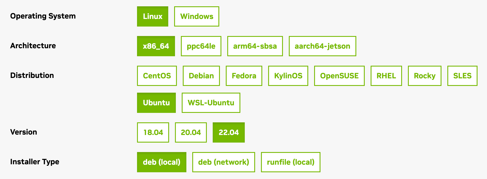

To take advantage of the powerful parallel processing capabilities offered by GPU instances equipped with NVIDIA Quadro RTX cards, you first need to install NVIDIA's CUDA Toolkit. This guide walks you through deploying a GPU instance and installing the CUDA Toolkit.

1.  Deploy a GPU Compute Instance using the [Cloud Manager](https://cloud.linode.com/), the Linode CLI, or the Linode API. It's recommended to follow the instructions within the following guides:

    - [Getting Started with Linode](/docs/products/platform/get-started/)
    - [Securing Your Server](/docs/products/compute/compute-instances/guides/set-up-and-secure/)

    Be sure to select a distribution that's compatible with the NVIDIA CUDA Toolkit. Review NVIDIA's [System Requirements](https://docs.nvidia.com/cuda/cuda-installation-guide-linux/index.html#system-requirements) to learn which distributions are supported.

1.  Upgrade your system and install the kernel headers and development packages for your distribution. See NVIDIA's [Pre-installation Actions](https://docs.nvidia.com/cuda/cuda-installation-guide-linux/index.html#pre-installation-actions) for additional information.

    -   **Ubuntu and Debian**

        ```command
        sudo apt update && sudo apt upgrade
        sudo apt install build-essential linux-headers-$(uname -r)
        ```

    -   **CentOS/RHEL 8, AlmaLinux 8, Rocky Linux 8, and Fedora**

        ```command
        sudo dnf upgrade
        sudo dnf install gcc kernel-devel-$(uname -r) kernel-headers-$(uname -r)
        ```

    -   **CentOS/RHEL 7**

        ```command
        sudo yum update
        sudo yum install gcc kernel-devel-$(uname -r) kernel-headers-$(uname -r)
        ```

1.  Install the NVIDIA CUDA Toolkit software that corresponds to your distribution.

    1.  Navigate to the [NVIDIA CUDA Toolkit Download](https://developer.nvidia.com/cuda-downloads) page. This page provides the installation instructions for the latest version of the CUDA Toolkit.

    1.  Under the **Select Target Platform** section, choose the following options:

        -   **Operating System:** Linux
        -   **Architecture:** x86_64
        -   **Distribution:** Select the distribution you have installed on your GPU instance (such as Ubuntu).
        -   **Version:** Select the distribution version that's installed (such as 22.04).
        -   **Installer Type:** Select from one of the following methods:
            - **rpm (local)** or **deb (local):** Stand-alone installer that contains dependencies. This is a much larger initial download size but is recommended for most users.
            - **rpm (network)** or **deb (network):** Smaller initial download size as dependencies are managed separately through the package management system. Some distributions may not contain the dependencies needed and you may receive an error when installing the CUDA package.
            - **runfile (local):** Installs the software outside of your package management system, which is typically not desired or recommended.

                
                If you decide to use the runfile installation method, you may need to install gcc and other dependencies before running the installer file. In addition, you also need to disable any existing nouveau drivers that installed on most distributions by default. The runfile method is not covered in this guide. Instead, reference NVIDIA's runfile installation instructions for [Ubuntu](https://docs.nvidia.com/cuda/cuda-quick-start-guide/index.html#id8), [Debian](https://docs.nvidia.com/cuda/cuda-quick-start-guide/index.html#id10), [CentOS](https://docs.nvidia.com/cuda/cuda-quick-start-guide/index.html#runfile-installer), [Fedora](https://docs.nvidia.com/cuda/cuda-quick-start-guide/index.html#id2), or [openSUSE](https://docs.nvidia.com/cuda/cuda-quick-start-guide/index.html#id6).
                

        

    1.  The **Download Installer** (or similar) section should appear and display a list of commands needed to download and install the CUDA Toolkit. Run each command listed there.

    1.  Reboot the GPU instance after all the commands have completed successfully.

    1.  Run `nvidia-smi` to verify that the NVIDIA drivers and CUDA Toolkit are installed successfully. This command should output details about the driver version, CUDA version, and the GPU itself.

1.  You should now be ready to run your CUDA-optimized workloads. You can optionally download NVIDIA's [CUDA code samples](https://github.com/nvidia/cuda-samples) and review CUDA's [Programming Guide](https://docs.nvidia.com/cuda/cuda-c-programming-guide/index.html) to learn more about developing software to take advantage of a GPU instance.