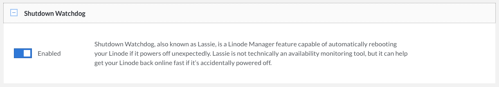

Linode Compute Instances have a featured called *Lassie* (Linode Autonomous System Shutdown Intelligent rEbooter), also referred to as the Shutdown Watchdog. When this feature is enabled, a Compute Instance automatically reboots if it ever powers off unexpectedly.

## Shutdown Recovery Behavior

The Shutdown Watchdog feature detects when a Compute Instance is powered off and checks if that directive came from the Linode platform (such as the Cloud Manager or Linode API). If the power off command *did not* originate from the Linode platform, the shutdown is considered unexpected and the Compute Instance is automatically powered back on.


Shutdown Watchdog can power back on a Compute Instance up to 5 times within a 15 minute period. If there is a recurring issue that is causing 6 or more shutdowns within this time period, the instance remains powered off until it is manually powered back on. This is to prevent endless reboot loops if there is an issue with the internal software of a Compute Instance.


## Enable (or Disable) Shutdown Watchdog

By default, Shutdown Watchdog is enabled on all new Compute Instances. If you wish to disable or re-enable this feature, follow the instructions below:

1.  Log in to the [Cloud Manager](https://cloud.linode.com) and navigate to the **Linodes** link in the sidebar.
1.  Select the Linode Compute Instance that you wish to modify.
1.  Navigate to the **Settings** tab.
1.  Scroll down to the section labeled **Shutdown Watchdog**.

    

1.  From here, click the corresponding toggle button to update this setting to the desired state, either *enabled* or *disabled*.

## Reasons for an Unexpected Shutdown

An *unexpected shutdown* is when a Compute Instance powers off without receiving a power off command from the Linode platform (such as one issued by a user in the Cloud Manager or API). In general, this is caused within a Compute Instance's internal system or software configuration. The following list includes potential reasons for these unexpected shutdowns.

- **A user issues the [**shutdown command**](https://man7.org/linux/man-pages/man8/shutdown.8.html)** in the shell environment of a Compute Instance. In Linux, a system can be powered off by entering the `shutdown` command (or other similar commands) in the system's terminal. Since Linode has no knowledge of internal commands issued on a Compute Instance, it is considered an unexpected shutdown.

- **Kernel panic:** A kernel panic can occur when your system detects a fatal error and it isn't able to safely recover. Here is an example of a console log entry that indicates a kernel panic has occurred:

    ```output
    Kernel panic - not syncing: No working init found.
    ```

- **Out of memory (OOM) error:** When a Linux system runs out of memory, it can start killing processes to free up additional memory. In many cases, your system remains accessible but some of the software you use may stop functioning properly. OOMing can occasionally result in your system becoming unresponsive or crashing, causing an unexpected shutdown.

    ```output
    kernel: Out of memory: Kill process [...]
    ```

- **Other system crashes**, such as a crash caused by the software installed on your system or a malicious process (such as malware).


The Shutdown Watchdog feature never *causes* a Compute Instance to shut down and only ever *powers on* an instance if it detects an unexpected shutdown.


## Investigate the Cause of a Shutdown

The underlying cause of these issues can vary. The most helpful course of action is to review your system logs.

1. Open the [Lish console](/docs/products/compute/compute-instances/guides/lish/). This displays your system's boot log and, if your system boot was normal, a login prompt appears. If you do not see a login prompt, look for any errors or unexpected output that indicates a kernel panic, file system corruption, or other type of system crash.

1. Log in to your system through either [SSH](/docs/guides/connect-to-server-over-ssh/) or [Lish](/docs/products/compute/compute-instances/guides/lish/) and review the log files for you system using either journald or syslog. For systems using systemd-journald for logging, you can use the `journalctl` command to review system logs. See [Use journalctl to View Your System's Logs](/docs/guides/how-to-use-journalctl/) for instructions.

    - `journalctl -b`: Log entries for the last system boot
    - `journalctl -k`: Kernel messages

    For systems using syslog, you should review the following log files using your preferred text editor (such as [nano](/docs/guides/use-nano-text-editor-commands/) or [vim](/docs/guides/what-is-vi/)) or file viewer (such as cat or [less](/docs/guides/how-to-use-less/)).

    - `/var/log/syslog`: Most logs as recorded by [syslog](https://en.wikipedia.org/wiki/Syslog).
    - `/var/log/boot.log`: Log entries for the last system boot
    - `/var/log/kern.log`: Kernel messages
    - `/var/log/messages`: Various system notifications and messages typically recorded at boot.

    You may also want to review log files for any other software you have installed on your system that might be causing these issues.


Unexpected shutdowns are primarily caused by issues with the internal software configuration of a Compute Instance. To investigate these issues further, it is recommended that you reach out to your own system administrators or on our [Community Site](https://www.linode.com/community/questions/). These issues are generally [outside the scope](/docs/products/platform/get-started/guides/support/#scope-of-support) of the Linode Support team.


## File System Corruption

In some cases, unexpected shutdowns can cause file system corruption on a Compute Instance. If an error message (such as the one below) appears within your console logs, your file system may be corrupt or otherwise be in an inconsistent state.

```output
/dev/sda: UNEXPECTED INCONSISTENCY; RUN fsck MANUALLY.
```

In cases like this, it is recommended that you attempt to correct the issue by running the `fsck` tool in [Rescue Mode](/docs/products/compute/compute-instances/guides/rescue-and-rebuild/). See [Using fsck to Find and Repair Disk Errors and Bad Sectors](/docs/guides/how-to-use-fsck-to-fix-disk-problems/) for instructions.