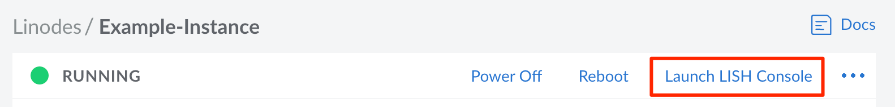
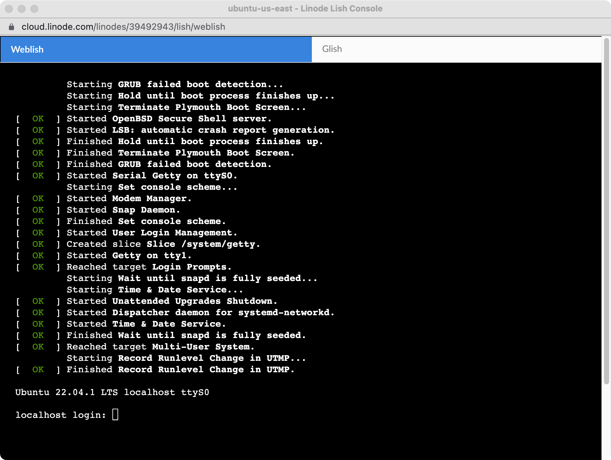
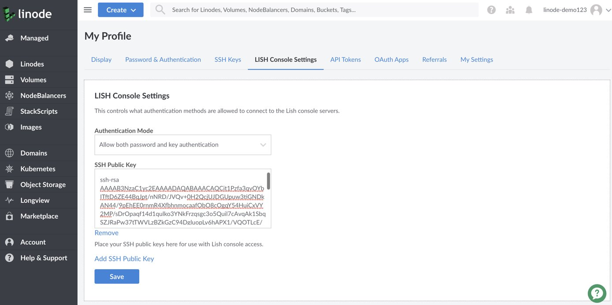

The **Lish Console**, also called the *Linode Shell*, provides direct console access to all of your Compute Instances. Through Lish, you can easily access your Compute Instance's internal Linux system and run commands, install software, or configure applications. Lish is especially useful when you are not able to connect to your server through other means, such as SSH.

## Access Lish

There are two ways to access Lish. You can use a terminal application to connect to a *Lish SSH gateway*, or you can log in to the [Linode Cloud Manager](https://cloud.linode.com) and use the Lish console in your web browser. This section explains both methods.


Lish used to be accessible via a direct SSH connection to your Linode's host machine, but as of May 10, 2013, all users must connect to a Lish SSH gateway to access Lish. For more information, please see [this blog post](https://blog.linode.com/2013/04/30/lish-ssh-gateway/).


### Through the Cloud Manager (Weblish)

You can connect to Lish using a web browser. This is useful when you don't have access to a terminal application, or if you just need quick and easy console access from the Cloud Manager.

1.  Log in to the [Cloud Manager](https://cloud.linode.com).

1.  Click on the **Linodes** link in the sidebar and select the desired Compute Instance.

1.  Click on the **Launch LISH Console** link in the top right-hand corner of the Cloud Manager.

    

1.  The Lish Web Console window appears, as shown below. From here, you can log in to your Compute Instance with any other username and password available on that system (such as `root`).

    

You can exit to the Lish prompt by pressing **CTRL+A** then **D**. You cannot exit to a Lish gateway box using your web browser. To exit the session entirely, just close the Lish Web Console window.

### Through SSH (Using a Terminal)

You can connect to Lish with the SSH client of your choice. For example, you can use the Terminal application in Mac OS X, PuTTY in Windows, or your favorite X11 terminal emulator.


If you have [Third Party Authentication](/docs/products/platform/accounts/guides/third-party-authentication/) enabled on your account, you will not be able to log in to your Compute Instance through Lish with password authentication, and must instead use SSH key authentication. Read the [Add Your Public Key](#add-your-public-key) section for more instructions on how to add an SSH key to your account for use with Lish.


1.  Determine which Lish SSH gateway you wish to use. There's one in every data center. See [Lish Gateways](#lish-gateways) for a full list.

1.  Open a terminal window and enter the following command, replacing `username` with your Cloud Manager username, and `location` with your preferred Lish SSH gateway.

    ```command
    ssh username@location
    ```

    For example, logging in as `user` via the Newark gateway would look like:

    ```command
    ssh user@lish-newark.linode.com
    ```

    
    Users who have been granted "Access" rights on a particular Compute Instance will have access to its Lish console via the gateway. Linodes that a user can't access in the Cloud Manager won’t show up in the Lish list. For more information about creating user accounts and configuring permissions, see [Accounts and Passwords](/docs/products/platform/accounts/guides/manage-users/).
    

1.  Verify that the Lish SSH gateway's fingerprint is valid by verifying the Terminal's output against the list of our [Lish Gateway Fingerprints](#lish-gateways). Once verified, enter *yes* to proceed.

    ```output
    The authenticity of host 'lish-newark.linode.com (66.228.40.59)' can't be established.
    ECDSA key fingerprint is SHA256:57OGBNARJ1fhI+zrE3eTEeQWXVVDHRU8QHcP+BsWmN8.
    Are you sure you want to continue connecting (yes/no)?
    ```

    
    If after verifying the authenticity of the Lish SSH gateway's fingerprint, you receive a message indicating that the ECDSA host key differs from the key for the IP address, remove the cached IP address on your local machine. Ensure you replace `192.0.2.0` with the IP address indicated by the Terminal.

    ```command
    ssh-keygen -R 192.0.2.0
    ```

    Once you have removed the cached IP address, you can again attempt to SSH into the Lish gateway.
    

1.  Enter the password you use to log in to the Cloud Manager. You are now at the Lish shell. A list of your Compute Instances appears, as shown below:

    ```output
    Linodes located in this data center:
    linode241706         Newark, NJ
    linode276072         Newark, NJ

    Linodes located in other data centers:
    linode287497         Dallas, TX
    ```

    
    You can add a public SSH key for Lish in the Cloud Manager to automatically connect to Lish without a password. See [this section](#add-your-public-key) for more information.
    

1.  At the Lish command prompt, type a Compute Instance's name from the list. For example, typing `linode241706` will connect you to the screen console session for that Instance.

1.  Log in to the system with your username and password.

After you log in, you'll have console access to your Compute Instance. You'll be able to restart services like `sshd`, edit firewall settings, and make other changes. To exit the console, press **CTRL+A** then **D** to return to the host machine, and then press **CTRL+D** to return to the Lish menu. If you'd like to see the list of your Compute Instances again, type `list` from the gateway.

## Add Your Public Key

If you don't want to enter your password every time you connect to Lish, or if you have [Third Party Authentication](/docs/products/platform/accounts/guides/third-party-authentication/) enabled on your account, you can add your public SSH key to the Linode Cloud Manager. If you haven't yet created SSH keys, please see our [Public Key Authentication with SSH](/docs/guides/use-public-key-authentication-with-ssh/) guide for more information.

1.  Log in to the [Cloud Manager](https://cloud.linode.com).

1.  Click on the profile icon in the top right hand corner of the Manager and select **LISH Console Settings**.

1.  Copy your public SSH key into the **SSH Public Key** field, as shown below.

    

1.  Click the **Save** button. Your Lish key will be saved in the Cloud Manager.

Now you can log in to any of the Lish gateway boxes without having to type your password.

If you wish to disable Lish access for users without keys, use the **Authentication Mode** dropdown menu on the same page, and select **Allow key authentication only** then click **Save**.

## Lish Commands

The Lish shell provides access to many functions which are otherwise only accessible via the Cloud Manager web-based administration tool. Enter the `help` command to see a full list of available commands. The output provides an introduction to Lish functionality:

```output
kill            - kill stuck screen sessions
exit            - exit from lish
help            - this menu

[return]        - connect to console
version         - display running kernel version
boot            - boot last used (or the only) config profile
boot N          - boot the specified config profile
shutdown        - shut down the Linode
reboot          - shut down, then boot the last used config profile
reboot N        - shut down, then boot the specified config profile
sysrq X         - send SysRq X to your Linode
destroy         - pulls the plug on a running Linode, no fs sync, no warning

jobs            - view the job queue for your Linode
configs         - view the configuration profiles for your Linode
config N        - view configuration profile details for profile N
status          - view the status of your Linode
logview         - view contents of console log
```

There are two ways to run these commands for a specific Compute Instance. If you are at the main Lish gateway, you can prefix the command with a ID, like this:

```command
linode123456 logview
```

You can also bring up the Compute Instance's console, then type **CTRL+A** then **D** to drop back to the host for that Instance. Now all of the commands above will be run for that Instance specifically. To exit back to the main Lish menu, type `exit`.


You can activate the ability to scroll back through the Lish console by pressing **CTRL-A + ESC**


## Advanced Lish Tricks

While the Lish interface as described above is useful as a basic command-line interface, you may find that you want to issue commands to your Compute Instance without going through the Lish login process.

You can directly connect to a Compute Instance's console:

```command
ssh -t [manager-username]@lish-[location].linode.com [linode-name]
```

You can also append Lish commands to the SSH command on your system prompt. For instance, to reboot your system, using your Cloud Manager username, location, and the host-id for your Compute Instance:

```command
ssh -t [manager-username]@lish-[location].linode.com [linode-name] reboot
```

Similarly, you can generate a view of the log using Lish:

```command
ssh -t [manager-username]@lish-[location].linode.com [linode-name] logview
```

This command format works for all Lish functionality.

## Lish Gateways

Each data center has its own gateways, which provides access to Lish, Weblish, and Glish. When connecting through Lish, you can use the corresponding gateway within any data center, though we recommend choosing the data center the instance is located within. These gateways are accessible over IPv4 and IPv6.


If you are having issues accessing Lish, Weblish, or Glish, you may be blocked by a local firewall. Make sure your firewall allows outbound connections to the following ports and the gateway you wish to access:

- **Lish ports:** 22, 443, 2200
- **Weblish port:** 8181
- **Glish port:** 8080


#### Atlanta, GA (USA)

-   **Lish SSH Gateway:** `lish-atlanta.linode.com`

    
    ```command
    RSA 59:30:1a:0b:93:5e:3f:4b:6f:d1:96:ff:7e:9e:12:f8
    ECDSA SHA256:8emv5PuUgPB2GFejMYWl1f4x1yj3YqAQPAYIrBm43ZI
    Ed25519 SHA256:7k2c442k+zqbGaraZvmqXM3MA5lCcthaR2lbrB651lg
    Ed25519 MD5:b3:76:56:3a:d8:66:5e:0c:61:90:03:b7:0b:ca:58:25
    ```
    

-   **Weblish Gateway:** `atlanta.webconsole.linode.com`
-   **Glish Gateway:** `atlanta.webconsole.linode.com`

#### Chicago, IL (USA)

-   **Lish SSH Gateway:** `lish-us-ord.linode.com`

    
    ```command
    RSA 3072 SHA256:rRwktOKfSApeffa+YOVxXXL70Ba1CpTYp/oFywEH2Pc lish-us-ord.linode.com
    ECDSA 256 SHA256:SV9A/24Jdb++ns/+6Gx7WqZCyN4+0y4ICFsaqK3Rm8s lish-us-ord.linode.com
    ED25519 256 SHA256:J+yN8rjhr9j27M4zLSF6OX9XmIoipWbPP/J1AGRlRYc lish-us-ord.linode.com
    ```
    

-   **Weblish Gateway:** `us-ord.webconsole.linode.com`
-   **Glish Gateway:** `ord2.glish.linode.com`

#### Dallas, TX (USA)

-   **Lish SSH Gateway:** `lish-dallas.linode.com`

    
    ```command
    RSA 6d:3d:b5:d0:42:1c:49:45:a6:47:29:bd:88:4e:58:d4
    ECDSA SHA256:1fL1HTGas1APIpshCu1ZWys7LI97s8eTFN3+f8zEYXA
    Ed25519 SHA256:Ime9h7IAxAjBvMGR+G+EnbaLWpvXO+Z7TaGHzM9g5Sc
    Ed25519 MD5:23:c1:02:ba:40:77:f7:73:0b:d4:0f:3a:f1:8c:74:b6
    ```
    

-   **Weblish Gateway:** `dallas.webconsole.linode.com`
-   **Glish Gateway:** `dallas.webconsole.linode.com`

#### Frankfurt (Germany)

-   **Lish SSH Gateway:** `lish-frankfurt.linode.com`

    
    ```command
    RSA 43:76:22:43:0e:01:cb:84:6a:80:b9:9b:90:34:c7:b1
    ECDSA SHA256:e1FxEXiZVi6n13tagd1ZAQEW/fsRqz29ez5IfWf9kxg
    Ed25519 SHA256:vG1rnoGe7XRRY0nauJREQk75OamxCwRRpeaTDB8LpgM
    Ed25519 MD5:9e:83:86:e2:f9:f7:f7:56:fc:bf:54:bb:75:7e:79:37
    ```
    

-   **Weblish Gateway:** `frankfurt.webconsole.linode.com`
-   **Glish Gateway:** `frankfurt.webconsole.linode.com`

#### Fremont, CA (USA)

-   **Lish SSH Gateway:** `lish-fremont.linode.com`

    
    ```command
    RSA 2c:43:0e:fc:88:f2:3a:dd:01:43:3a:fc:9f:67:9f:66
    ECDSA SHA256:fwuaKryHbvtKjFFviDocnMTNKWXUzfZSGPY8mgLgiNM
    Ed25519 SHA256:s3MVXFaTiL7Fb5oB0s9zMBk9VJsrkNxXXZfdeJG2enQ
    Ed25519 MD5:c8:eb:9d:e6:b0:60:b1:ca:9e:89:d1:e4:6a:3c:10:31
    ```
    

-   **Weblish Gateway:** `fremont.webconsole.linode.com`
-   **Glish Gateway:** `fremont.webconsole.linode.com`

#### London (UK)

-   **Lish SSH Gateway:** `lish-london.linode.com`

    
    ```command
    RSA 71:27:30:cd:dc:69:7a:fe:58:4a:04:e6:6b:5f:b4:e2
    ECDSA SHA256:mE/plOHLl+NJ7LUdW7AaMEOnhskXZxav5Em/rD6VZ5g
    Ed25519 SHA256:HXHM8/wCx7NrGsnfGpaexiBfOLKN9g0hoaL9wRaSeWg
    Ed25519 MD5:c1:43:45:93:d6:96:4e:50:41:d2:d0:9f:81:e5:f8:9e
    ```
    

-   **Weblish Gateway:** `london.webconsole.linode.com`
-   **Glish Gateway:** `london.webconsole.linode.com`

#### Mumbai (India)

-   **Lish SSH Gateway:** `lish-mum1.linode.com`

    
    ```command
    RSA 57:72:e0:79:a6:48:13:2b:8a:cd:1e:35:7c:c1:a2:ed
    ECDSA SHA256:uWVLSBPZ0E72VawrP4yWsW3YYHPM9b7A/seeEy7GG0c
    Ed25519 SHA256:5VkP3/dLsfrKic9p6y9QnFq4sKa92RBzxGJrsX5/dBQ
    Ed25519 MD5:e8:a7:f2:7c:5e:b3:ee:1d:bf:a3:37:68:d7:1d:b2:bf
    ```
    

-   **Weblish Gateway:** `mum1.webconsole.linode.com`
-   **Glish Gateway:** `mum1.webconsole.linode.com`

#### Newark, NJ (USA)

-   **Lish SSH Gateway:** `lish-newark.linode.com`

    
    ```command
    RSA 11:2a:57:a4:f8:ca:42:b2:c0:ab:17:58:0d:0c:b7:8b
    ECDSA SHA256:57OGBNARJ1fhI+zrE3eTEeQWXVVDHRU8QHcP+BsWmN8
    Ed25519 SHA256:tyelNHfgaPGbN2cppfJVr/db3/pHnItR9maW+ocAS18
    Ed25519 MD5:c1:f7:57:1a:09:ca:46:f8:5d:d3:d4:8a:34:6f:77:ae
    ```
    

-   **Weblish Gateway:** `newark.webconsole.linode.com`
-   **Glish Gateway:** `newark.webconsole.linode.com`

#### Paris, France

-   **Lish SSH Gateway:** `lish-fr-par.linode.com`

    
    ```command
    RSA 3072 SHA256:qTliFB86axo9n07H0hUP/z5nm7Fbkzlf8eKnmtXBhZU lish-fr-par.linode.com
    ECDSA 256 SHA256:NU4UctBefhWIR3mpCrh+r2p5lNmtwFFoeelZspjMNYM lish-fr-par.linode.com
    ED25519 256 SHA256:GYNvVuHJqGIdCiU6yTPbkJmMgj+ZYBGRVGDqnrtJoQc lish-fr-par.linode.com
    ```
    

-   **Weblish Gateway:** `fr-par.webconsole.linode.com`
-   **Glish Gateway:** `par3.glish.linode.com`

#### Singapore

-   **Lish SSH Gateway:** `lish-singapore.linode.com`

    
    ```command
    RSA 06:26:d8:2a:12:8b:2f:d7:6c:54:72:5a:a7:7b:da:7b
    ECDSA SHA256:rFYWuld4hWMbTzX+xZMuQ3kxiJ6t8A+FNQ5k889mKEA
    Ed25519 SHA256:q1G1pBrLuhsUAnZ04SOYoxVthKYyLz+wA0hBAUVkKtE
    Ed25519 MD5:4c:d1:55:68:a1:90:6c:15:9b:af:c1:f7:27:31:68:29
    ```
    

-   **Weblish Gateway:** `singapore.webconsole.linode.com`
-   **Glish Gateway:** `singapore.webconsole.linode.com`

#### Sydney (Australia)

-   **Lish SSH Gateway:** `lish-syd1.linode.com`

    
    ```command
    RSA 31:89:80:92:aa:c0:2f:12:f6:2d:20:3a:27:88:ea:ba
    ECDSA SHA256:whZwcrXeixljj6ZrrRYzLc6UguvkNqKmtXz+JrMSI9w
    Ed25519 SHA256:0lOHVxRAMMOY3HDFIE4nMz11W4y+9OYqdtFqhi8NkWs
    Ed25519 MD5:ef:2d:cc:c7:aa:10:6f:cd:de:8f:c1:5d:8b:68:56:2b
    ```
    

-   **Weblish Gateway:** `syd1.webconsole.linode.com`
-   **Glish Gateway:** `syd1.webconsole.linode.com`

#### Tokyo (Japan)

-   **Lish SSH Gateway:** `lish-tokyo2.linode.com` or `lish-shg1.linode.com`

    
    ```command
    RSA 2c:60:9a:ce:cf:4b:8d:4e:8f:09:ae:e0:c2:b0:fb:b7
    ECDSA SHA256:0sRmstQ+6lfa4KwnAIQvuZMunq8KKNmu/n4KeAcAXmg
    Ed25519 SHA256:SWEV04SJt+DDG4ov2AfDYdZRavcg4GHufNP60QRkZzk
    Ed25519 MD5:99:7c:4e:b3:2d:c9:79:53:a9:60:b0:40:b2:73:52:73
    ```
    

-   **Weblish Gateway:** `shg1.webconsole.linode.com`
-   **Glish Gateway:** `shg1.webconsole.linode.com`

#### Toronto (Canada)

-   **Lish SSH Gateway:** `lish-tor1.linode.com`

    
    ```command
    RSA 4a:d9:fb:43:b8:0e:7f:fd:d3:cd:fc:87:06:61:51:df
    ECDSA SHA256:iAWnqR3XYcooliTQ7W1tiMmjsA4k1WJVItvLz4lUxQE
    Ed25519 SHA256:TSbQmRFaaWEHKEwgwvqQFKMfHKduPftou9/ue9K/Z2c
    Ed25519 MD5:84:02:57:5e:b7:90:e3:78:3c:57:91:1a:e0:b4:e1:d4
    ```
    

-   **Weblish Gateway:** `tor1.webconsole.linode.com`
-   **Glish Gateway:** `tor1.webconsole.linode.com`

#### Washington, DC (USA)

-   **Lish SSH Gateway:** `lish-us-iad.linode.com`

    
    ```command
    RSA 3072 SHA256:mzFtMaMVX6CsLXsYWn6c8BXnXk0XHfoOXGExDUEH2OI lish-us-iad.linode.com
    ECDSA 256 SHA256:of9osuoFwh7g5ZiO0G3ZGYi/8JcCw3BA/ZdkpaKQlT0 lish-us-iad.linode.com
    ED25519 256 SHA256:oFoUJn/xXV/+b7EJIcIt6G6hV5jXzjM/pOsoceDDOaA lish-us-iad.linode.com
    ```
    

-   **Weblish Gateway:** `us-iad.webconsole.linode.com`
-   **Glish Gateway:** `iad3.glish.linode.com`