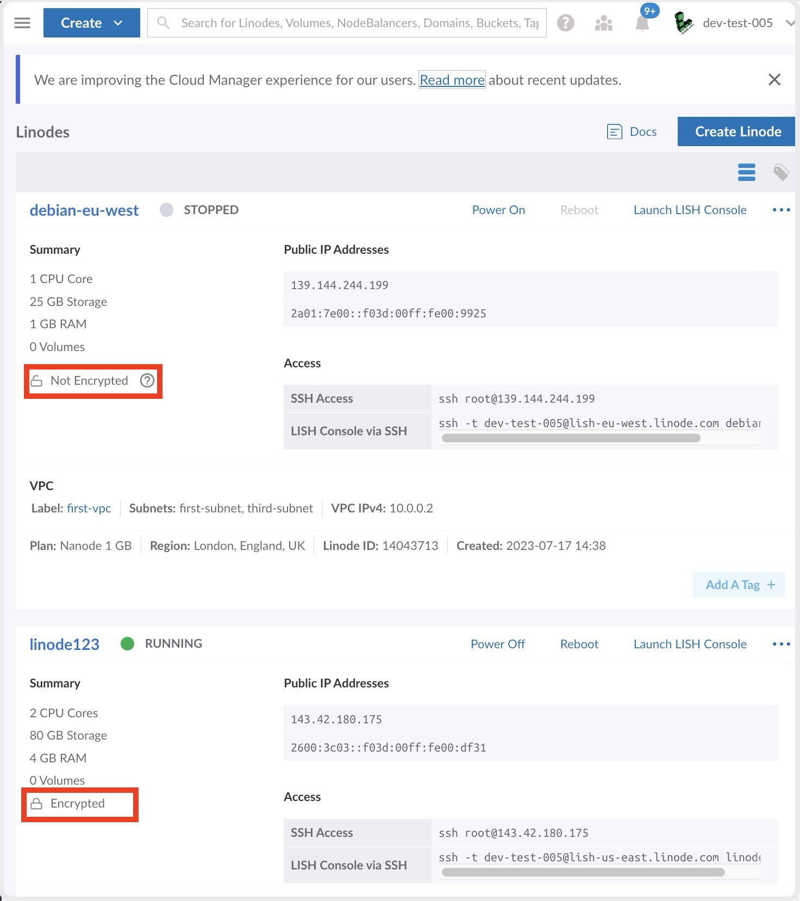

Local disk encryption ensures that your data stored on Compute Instances is secured. Disk encryption protects against unauthorized data access by keeping the data encrypted if the disk is ever removed from the datacenter, decommissioned, or disposed of. The platform manages the encryption and decryption for you.

By default, disk encryption is enabled on all compute instances.

## How Disk Encryption Works With Different Services and Features

| Service or Feature| Disk Encryption Behavior |
|------|-------|
| [**Backups:**](/docs/products/storage/backups/) automatic full file-based snapshot of your disks taken during your preferred scheduled time slot while the compute instance is still running. |Backups are not encrypted even when they are taken from an encrypted disk. When a backup is restored, and if encryption is enabled, the data stored on the disk is encrypted again. |
| [**Images:**](/docs/products/tools/images/) allows you to store custom disk images in the Cloud. These images can be preconfigured with the exact software and settings and can be deployed to new or existing compute instances. |Images are not encrypted even when they are taken from an encrypted disk. When an image is deployed, and if encryption is enabled, the data stored on the disk is encrypted again. |
| [**Clone:**](/docs/products/compute/compute-instances/guides/clone-instance/) allows duplication of a compute instance to a new or existing instance.|<li>Data on encrypted disks remain encrypted.</li> <li>Data on unencrypted disks remain unencrypted.</li>|
| [**Create:**](/docs/products/compute/compute-instances/guides/create/) Compute Instances equipped with a tailored set of resources designed to run any cloud-based workload. |Disk encryption is enabled by default if it's available in a region. You can change the disk encryption setting (**Encrypt Disk**) if the Compute Instance is not part of a LKE node pool. Disk encryption is always enabled on Distributed Compute Instances.  After a Compute Instance is created, changing the **Encrypt Disk** setting requires a Rebuild.  |
| [**Migration:**](/docs/products/compute/compute-instances/guides/migrate-to-different-dc/) moves your compute instance to another data center. |During migration, a new disk is created on the destination host. Decrypted bits are copied over from the source to the destination. The new disk is encrypted if the destination host has disk encryption enabled. |
| [**Rebuild:**](/docs/products/compute/compute-instances/guides/rescue-and-rebuild/) start over with a fresh Linux distribution or use a backup. | You can change the **Encrypt Disk** setting by performing a Rebuild. During a Rebuild, the previous encryption setting is used unless it's changed. The **Encrypt Disk** setting for Compute Instances attached to an LKE node pool can not be changed. |
| [**Rescue:**](/docs/products/compute/compute-instances/guides/rescue-and-rebuild/) boot your compute instance into Rescue Mode to perform system recovery tasks and transfer data off the disks when you suspect a corrupt file system. | When a rescue image is deployed, and if encryption is enabled, the data stored on the disk is encrypted again.|
| [**Resize:**](/docs/products/compute/compute-instances/guides/resize/) changing a compute instances plan to resize your instance. |<li>Data on encrypted disks remain encrypted.</li> <li>Data on unencrypted disks remain unencrypted.</li> |

## Considerations

- Disk encryption is currently not available in all regions. Select another region to use Disk Encryption or enable encryption when it does become available using [Rebuild](/docs/products/compute/compute-instances/guides/rescue-and-rebuild/#rebuilding).

- After a Compute Instance is created, changing the **Encrypt Disk** setting requires a [Rebuild](/docs/products/compute/compute-instances/guides/rescue-and-rebuild/#rebuilding).

- Distributed Compute Instances are encrypted automatically if this feature is supported in the region. The disk encryption setting can not be changed.

- New LKE clusters are encrypted if disk encryption is supported in the region. This disk encryption setting can not be changed.

- If the Compute Instance is part of a LKE node pool, you cannot change the disk encryption setting. If a node pool is not encrypted and you want an encrypted node pool, delete the node pool and create a new node pool. New node pools are always encrypted.

- Encryption in general, can increase CPU overhead and decrease realized throughput.
  - For performance-sensitive workloads on Compute Instances that are not part of an LKE node pool, you can opt-out of disk encryption or disable **Encrypt Disk** by performing a [Rebuild](/docs/products/compute/compute-instances/guides/rescue-and-rebuild/).
  - For performance-sensitive workloads on Compute Instances that are part of a LKE node pool, you can create additional node pools to spread out the workloads if required.

## Check if Disk Encryption is Enabled on a Compute Instance

1.  Log into [Cloud Manager](https://cloud.linode.com) and click the **Linodes** link in the sidebar.

1.  Click on a Compute Instance from the list to view more details.

1.  Within the top *Summary* section, you can view if the compute instance is `Encrypted` or `Not Encrypted`.

    

## Check if Disk Encryption is Enabled on a Cluster's Node Pools

1. Log into [Cloud Manager](http://cloud.linode.com), click **Kubernetes** in the left menu, and select the cluster you wish to view.

1. Scroll down to the **Node Pools** section. This lists all node pools for your cluster and their encryption status.

    


If a node pool is not encrypted and you want an encrypted node pool, delete the node pool and create a new node pool. New node pools are always encrypted.
