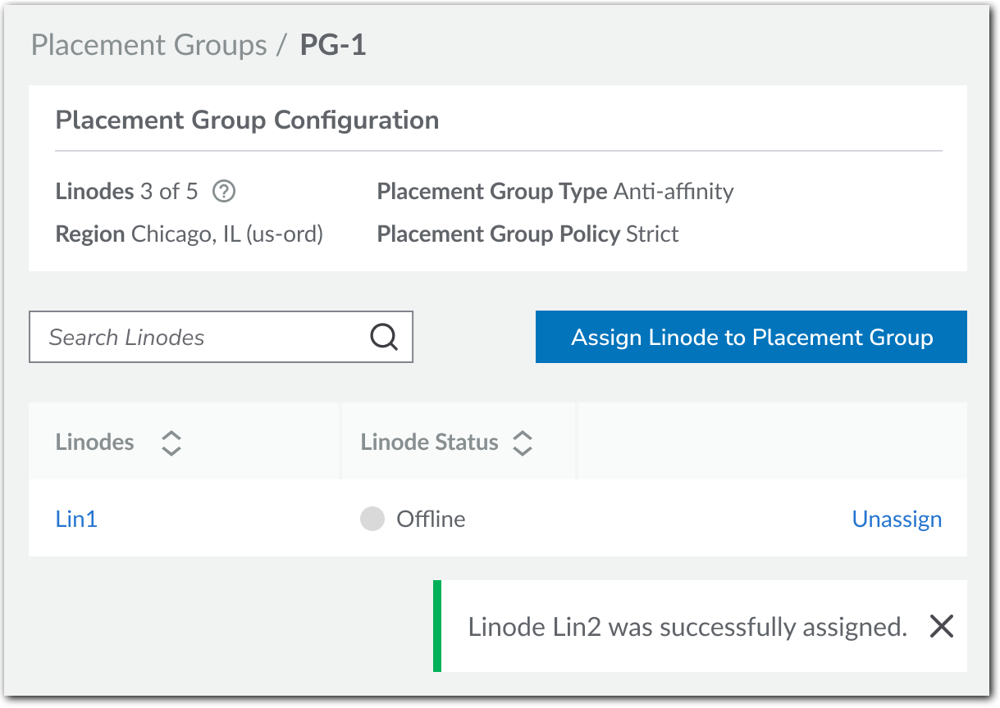

When you deploy several compute instances in one of our compute regions, they’re allocated to physical machines (“hosts”) with available resources. However, depending on your workload requirements, you may need your compute instances to follow specific strategies:

- **Grouped-together**. You may want them placed close together to reduce latency between compute instances that are used for an application or workload.

- **Spread apart**. You may want to disperse them across several hosts to support high-availability, for example when required for fail-over.

Placement groups disperse your compute instances across hosts in a region to meet either of these models.

## Overview

Setting up a placement group is a simple process using Cloud Manager, the Linode API, or our CLI. Create a new group in a supported region and add new or existing compute instances from that region to your group. When assigning compute instances to the placement group, we physically place them, based on your desired model.

## Availability

Placement Groups is available in all [core compute regions](/docs/products/platform/get-started/guides/choose-a-data-center/#product-availability) that support compute instances.


Currently, placement groups aren't supported in distributed compute regions.


## Placement groups and compliance

Review these sections for an understanding of the placement groups concept.

### Placement group type

To distribute your compute instances in a placement group, we use industry-recognized placement strategies. When creating a new group, you select from one of two placement group types:

- **Affinity**. When you assign compute instances to the group, we place them physically close together, possibly on the same host. This supports the grouped-together model and is best for applications that require low-latency.

- **Anti-affinity**. When you assign compute instances to the group, we place them in separate hosts, but keep them in the same region. This supports the spread-apart model for high-availability.


Currently, only the **Anti-affinity** Placement Group Type is supported.


### Compliance

Your placement group is in compliance if all of the compute instances in it currently meet your grouped-together or spread-apart model, based on your selected [placement group type](#placement-group-type).

- When you create a new placement group and assign compute instances to it, we'll place them as necessary to make sure the group is compliant with your selected placement group type. There's nothing you need to do to apply compliance at this phase.

- Compliance comes into play when you add more compute instances to your placement group in the future. For example, assume you've set **Anti-affinity** as your placement group type. Your group already has three qualifying compute instances in separate hosts, to support the spread-apart model. If a fourth compute instance is added that's on the _same host_ as one of the existing three, this would make the placement group non-compliant. Compliance at this stage is enforced by your selected placement group policy.

### Placement group policy

This determines how we handle requests to add compute instances to your placement group in the future, and whether or not it stays compliant.

- **Strict (Best practice)**. If a target compute instance breaks the grouped-together or spread-apart model set by your placement group type, it won't be added. Use this to ensure the placement group stays compliant.

- **Flexible**. A target compute instance will be added even if it breaks the grouped-together or spread-apart model set by your placement group type. This makes the placement group non-compliant. Use this if you need more flexibility to add future compute instances and compliance isn't an immediate concern.

### Fix non-compliance

If a placement group becomes non-compliant, we're alerted. We'll move an out-of-compliance compute instance, once the necessary capacity is available in the region. Non-compliance can only be fixed by Akamai staff. **_You can't fix it yourself_**.

Based on your selected placement group policy, here are the ways a placement group can become non-compliant:

- **Strict**. There are rare cases when we may need to fail-over or migrate your compute instances for maintenance.

- **Flexible**. A placement group using this policy can become non-compliant if a compute instance is added from outside of the placement group type's grouped-together or spread-apart model.


Fixing non-compliance for **Strict** placement groups is prioritized over **Flexible** groups.


## Create a placement group

Here are a few processes you can follow to create a new placement group and add existing compute instances to it.

### Use Cloud Manager

Review these sections to create a new group using Cloud Manager.

#### Before you begin

* Review [Placement groups and compliance](#placement-groups-and-compliance) to understand the placement group concept.
* Review the [Technical specifications](#technical-specifications) for details on what's supported.

#### Creation process

1.  Navigate to the **Placement Groups** page in [Akamai Cloud Manager](http://cloud.linode.com) and click **Create Placement Groups**. The **Create Placement Group** form opens.

2.  Fill out the form with your desired settings:

    - **Label**. Give your placement group an easily recognizable name.
    - **Region**. Select the [core compute region](#availability) that includes the compute instances you want to add.
    - **Placement Group Type**. Select the [affinity](#placement-group-type) that meets your model.
    - **Placement Group Policy**. Pick how you want to [enforce](#placement_group_policy) compliance for your placement group, when adding compute instances to it in the future.


- Currently, only **Anti-affinity** is available for Placement Group Type.
- Once you create your placement group, you *can't change* its Placement Group Policy.


3.  When you're ready, click **Create Placement Group**. A summary of your group is revealed.

4.  Select the **Linodes (0)** tab.

5.  Click **Assign Linode to Placement Group**. The Assign Linodes form opens.

6.  The **Linodes in \<Region\>** drop-down is auto-populated with eligible compute instances in your selected Region. Pick one to add it and click **Assign Linode**.

    <div align=center>
    
    </div>

7. Review the **Linode limit for this placement group**, and repeat steps 5-6 to add more compute instances, as necessary.


Currently, you’re limited to a maximum of 5 compute instances in a placement group.


With all your compute instances added, we begin provisioning by moving them into the placement group to meet your selected Placement Group Type.

### Use the API

Here, we combine API operations to create a new placement group and add existing compute instances to it.

#### Before you begin

* Review [Placement groups and compliance](#placement-groups-and-compliance) to understand the placement group concept.
* Review the [Technical specifications](#technical-specifications) for details on what's supported.

#### List regions

Run this API curl request, making sure to properly paste in or reference your [API token](/docs/products/tools/api/guides/manage-api-tokens/). Store the `id` and `label` values for the region where your target compute instances live.
```command
curl -H "Authorization: Bearer $TOKEN" \
    https://api.linode.com/v4/regions
```

During the limited availability phase, only specific [regions](#availability) support placement groups.


#### Identify the maximum number of compute instances

Run this request, using the stored region `id`. Store the `maximum_linodes_per_pg` value. This represents the maximum number of compute instances you can add to a placement group for that region.
```command
curl -H "Authorization: Bearer $TOKEN" \
    https://api.linode.com/v4/regions/us-east
```

Currently, you can have a maximum of 5 compute instances in a placement group.


#### List compute instances

Run this request using the stored region `id` to filter the response. Identify the specific compute instances you want to include -- up to the `maximum_linodes_per_pg` value -- and store the `id` value for each.
```command
curl -H "Authorization: Bearer $TOKEN"
    -H 'X-Filter: { "region": "us-east" }'
    https://api.linode.com/v4/networking/ips
```

#### Create the new placement group

Run this request to create a new placement group. Store the `id` value that's generated for it.

- `label`. Give your placement group an easily recognizable name.
- `region`. Set this to the `label` you stored for your region.
- `placement_group_type`. Set this to the [affinity](#placement-group-type) that meets your model.
- `placement_group_policy`. Define how to [enforce](#placement-group-policy) compliance for your placement group, when adding compute instances to it in the future. Set to `strict` for strict enforcement or `flexible` for flexible enforcement.


- Currently, only anti-affinity (`anti-affinity:local`) is available for `placement_group_type`.
- Once you create your placement group, you *can't change* its `placement_group_policy` enforcement setting.


```command
curl -H "Content-Type: application/json" \
    -H "Authorization: Bearer $TOKEN" \
    -X POST -d '{
      "label": "new-placement-group",
      "region": "us-east",
      "placement_group_type": "anti_affinity:local",
      "placement_group_policy": "strict"
    }' \
    https://api.linode.com/v4/placement/groups
```

#### Add compute instances to the group

In this request, populate the `linodes` array with a comma-separated data center list of stored `id` values for the compute instances. In the URL, target the new placement group using its stored `id`.

```command
curl -H "Content-Type: application/json" \
    -H "Authorization: Bearer $TOKEN" \
    -X POST -d '{
      "linodes": [
        123, 456, 789
      ]
    }' \
    https://api.linode.com/v4/placement/groups/12/assign
```
With all your compute instances added, we begin provisioning by placing them into the placement group to meet your selected `placement_group_type`.

#### More with the Placement Groups API

There are several other operations in the [Linode API](https://techdocs.akamai.com/linode-api/reference/post-placement-group) you can use to interact with placement groups.

## Technical Specifications

- Placement groups support dedicated, premium, and shared compute instance plans. You can mix dedicated and shared plan compute instances in the same placement group, but you can't mix premium plans with any other type.

- Specialty hardware, such as GPUs aren't supported.

- A compute instance can only exist in one placement group.

- The maximum number of compute instances in a placement group is currently five. This quantity is reflected in Cloud Manager when reviewing your placement group. With the API, the [GET /v4/regions/\{regionid\}](/docs/api/regions/#region-view) operation contains the `maximum_linodes_per_pg` element that displays this maximum.

- Placement groups can be renamed or deleted. To delete a placement group, you need to remove all compute instances from it.

- When you remove a compute instance from a placement group, it continues to function as-is, but the placement decisions are no longer guided by the group's Placement Group Type.

- Entry points to create a placement group are also available when creating a new compute instance or editing an existing one.