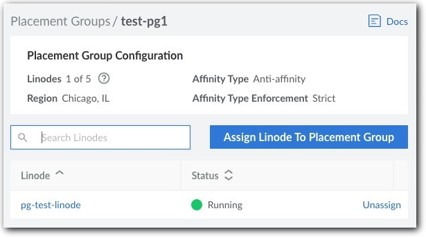

When you deploy several compute instances in an Akamai data center ("region"), they're allocated to physical machines. This allocation varies based on several factors, including the compute instance plan and availability for that plan's sizes. However, you may want your compute instances in specific physical locations, to best support your need:

- You may want them close together, even on the same host to speed up performance.
- You may want to disperse them across several hosts to support high availability.

Placement groups let you determine this physical location to meet either of these models.

## Overview

The Placement Groups service gives you a convenient way to set up groups of your compute instances, using our various tools. Create a new placement group in a supported region and add new or existing compute instances from that region to your group. With the new group created, we physically move your compute instances into it, based on your desired model.

## Availability

The Placement Groups service is available in select regions. Currently, this includes:

- Miami, FL (us-mia)

- Chicago, IL (us-ord)


Placement Groups is in limited availability. Throughout this phase, we expect to increase the number of supported regions.


## Affinity, enforcement, and compliance

To distribute your compute instances in a placement group, we use the industry-recognized affinity standard. This standard supports two "preferred container" types:

- **Affinity**. Compute instances are physically close together, possibly on the same host. This preferred container type is best for applications that require performance over availability.

- **Anti-affinity**. Compute instances are placed in separate fault domains, but they're still in the same region. This preferred container type better supports a high-availability model.


During the limited availability phase, only the **Anti-affinity** preferred container type is supported.


Placement groups also enforce the use of the preferred container type using one of two methods:

- **Strict (Best practice)**. You can't add more compute instances to your placement group if the preferred container lacks capacity or is unavailable. For example, let's assume the preferred container type is **Anti-affinity**. If you try to add a compute instance that's on the same host, or there's no capacity outside that host in the region, you get an error and can't add the compute instance. This helps you keep your placement group compliant, because you can only pick compute instances that fit the preferred container type.

- **Flexible**. You can add more compute instances to your placement group even if they're outside the preferred container type. However, if you add one and it violates the preferred container type, the placement group becomes non-compliant. Once the necessary capacity is available in the region, we physically move the compute instance for you to fit your preferred container type and make it compliant again. This can work for you if you know you need to add more compute instances in the future.

### Fix Non-compliance

If a placement group becomes non-compliant, we're alerted and we'll bring it back into compliance as soon as possible. Non-compliance can only be fixed by Akamai staff. **_You can't fix it yourself_**.

By design, a Strict placement group can't be made non-compliant when simply creating it or managing its compute instances. In rare cases, non-compliance can occur if we need to fail-over or migrate your compute instances for maintenance. Fixing non-compliance for Strict placement groups is prioritized over Flexible groups.

## Create a placement group



Here's how to create a new placement group and add existing compute instances to it.

#### Before you begin

Make sure you understand how placement groups work. Have a look at [Affinity, enforcement, and compliance](#affinity-enforcement-and-compliance).

#### Creation process

1.  Navigate to the **Placement Groups** page in [Akamai Cloud Manager](http://cloud.linode.com) and click **Create Placement Groups**. The **Create Placement Group** drawer opens.

2.  Apply your desired settings:

    - **Label**. Give your placement group an easily recognizable name.
    - **Region**. Select the [data center](#availability) that includes the compute instances you want to add.
    - **Affinity Type**. Select the [affinity](#affinity-enforcement-and-compliance) that meets your model.
    - **Affinity Type Enforcement**. Pick how you want to [enforce](#affinity-enforcement-and-compliance) compliance for your placement group, when adding compute instances to it in the future.


- During the limited availability phase, only **Anti-affinity** is available for Affinity Type.
- Once you create your placement group, you *can't change* its Affinity Type Enforcement.


3. When you're ready, click **Create Placement Group**.

4. Click the Label for you new placement group. A summary of your group is shown.

5. Click **Assign Linode to Placement Group**. The Assign Linodes to \<Label\> drawer opens.

6.  The **Linodes in \<Region\>** drop-down is auto-populated with eligible compute instances in your selected Region. Pick one to add it and click **Assign Linode**.

    <div align=center>
    
    </div>

7. Review **Linodes \<#\> of \<#\>** to see the maximum number you can add. Repeat steps 5-6 to add more compute instances, as necessary.


During the limited availability phase, you’re limited to a maximum of five compute instances in a placement group.


With all your compute instances added, we begin provisioning by moving them into the placement group to meet your selected Affinity Type.



Here, we combine API operations to create a new placement group and add existing compute instances to it.

#### Before you begin

Make sure you understand how placement groups work. Have a look at [Affinity, enforcement, and compliance](#affinity-enforcement-and-compliance).

#### List regions

Run this API curl request, making sure to properly paste in or reference your [API token](/docs/products/tools/api/guides/manage-api-tokens/). Store the `id` and `label` values for the region where your target compute instances live.
```command
curl -H "Authorization: Bearer $TOKEN" \
    https://api.linode.com/v4/regions
```

During the limited availability phase, only specific [regions](#availability) support placement groups.


#### Identify the maximum number of compute instances

Run this request, using the stored region `id`. Store the `maximum_linodes_per_pg` value. This represents the maximum number of compute instances you can add to a placement group for that region.
```command
curl -H "Authorization: Bearer $TOKEN" \
    https://api.linode.com/v4/regions/us-east
```

During limited availability, you can have a maximum of 5 compute instances in a placement group.


#### List compute instances

Run this request using the stored region `id` to filter the response. Identify the specific compute instances you want to include -- up to the `maximum_linodes_per_pg` value -- and store the `id` value for each.
```command
curl -H "Authorization: Bearer $TOKEN"
    -H 'X-Filter: { "region": "us-east" }'
    https://api.linode.com/v4/networking/ips
```

#### Create a new placement group

Run this request to create a new placement group. Store the `id` value that's generated for it.

- `label`. Give your placement group an easily recognizable name.
- `region`. Set this to the `label` you stored for your region.
- `affinity-type`. Set this to the [affinity](#affinity-enforcement-and-compliance) that meets your model.
- `is_strict`. Define how to [enforce](#affinity-enforcement-and-compliance) compliance for your placement group, when adding compute instances to it in the future. Set to `true`, strict enforcement is applied and `false` sets it to flexible.


- During the limited availability phase, only anti-affinity (`anti-affinity:local`) is available for `affinity-type`.
- Once you create your placement group, you *can't change* its affinity type enforcement setting (`is_strict`).


```command
curl -H "Content-Type: application/json" \
    -H "Authorization: Bearer $TOKEN" \
    -X POST -d '{
      "label": "new-placement-group",
      "region": "us-iad",
      "affinity-type": "anti_affinity:local",
      "is_strict": "true"
    }' \
    https://api.linode.com/v4/placement/groups
```

#### Add compute instances to the group

In this request, populate the `linodes` array with a comma-separated data center list of stored `id` values for the compute instances. In the URL, target the new placement group using its stored `id`.

```command
curl -H "Content-Type: application/json" \
    -H "Authorization: Bearer $TOKEN" \
    -X POST -d '{
      "linodes": [
        123, 456, 789
      ]
    }' \
    https://api.linode.com/v4/placement/groups/12/assign
```
With all your compute instances added, we begin provisioning by moving them into the placement group to meet your selected affinity type.

#### More with the Placement Groups API

There are several other operations in the [Linode API](https://techdocs.akamai.com/linode-api/reference/post-placement-group) that let you interact with placement groups.




## Technical Specifications

- Placement groups support dedicated and shared compute instance plans. Plan types can be mixed in a placement group. However, specialty hardware, such as GPUs aren't supported.

- A compute instance can only exist in one placement group.

- The Affinity Type and Region you select determine the maximum number of compute instances per placement group. This quantity is reflected in Cloud Manager when reviewing your placement group. With the API, the [GET /v4/regions/\{regionid\}](/docs/api/regions/#region-view) operation contains the `maximum_linodes_per_pg` element that displays this maximum.

- Placement groups can be renamed or deleted. To delete a placement group, you need to remove all compute instances from it.

- When you remove a compute instance from a placement group, it continues to function as-is, but the placement decisions are no longer guided by the group's Affinity Type.

- Entry points to create a placement group are also available when creating a new compute instance or editing an existing one.