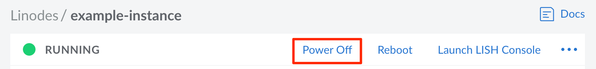
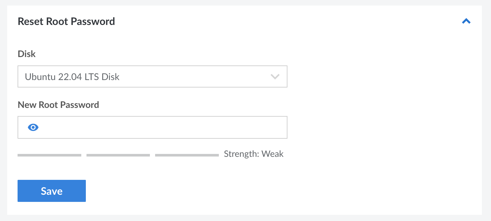

All Compute Instances deployed using one of Linode's [official distribution images](/docs/products/compute/compute-instances/guides/distributions/) provide the ability to reset the root password on the system. This is useful if you ever lock yourself out of your instance's root account or are simply rotating your password for security. Follow the instructions below to reset your root password:

1.  Log in to the [Cloud Manager](https://cloud.linode.com), click the **Linodes** link in the sidebar, and select a Compute Instance from the list.

1.  Click the **Power Off** button in the upper right of the Compute Instance's dashboard or within the **ellipsis** menu. Wait until the Compute Instance has been fully powered off before continuing to the next step.

    

1.  Navigate to the **Settings** tab.

1.  Scroll down to the **Reset Root Password** section.

    

1.  Select your primary disk from the **Disk** dropdown menu.

1.  Enter a new password for the root user in the **New Root Password** field.

    

1.  Click **Save** to make the change.

1.  Click **Power On** button to turn on your Compute Instance.

You can now use this new password when logging in as the root user on your Compute Instance over [SSH](/docs/products/compute/compute-instances/guides/set-up-and-secure/#connect-to-the-instance) or [Lish](/docs/products/compute/compute-instances/guides/lish/) (the Linode Shell). If you're able to log in as root using Lish but not SSH, there may be an issue with the SSH configuration, firewall rules, or other network issues. The following guides provide more troubleshooting steps:

- [Troubleshooting Basic Connection Issues on Compute Instances](/docs/products/compute/compute-instances/guides/troubleshooting-connection-issues/)
- [Troubleshooting SSH on Compute Instances](/docs/products/compute/compute-instances/guides/troubleshooting-ssh-issues/)
- [Troubleshooting Firewall Issues on Compute Instances](/docs/products/compute/compute-instances/guides/troubleshooting-firewall-issues/)