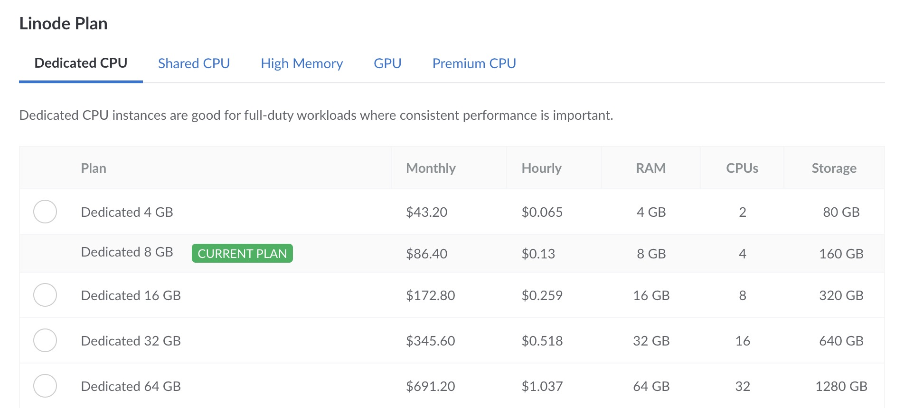

Changing a Compute Instances plan (and plan type) is made easy through the Cloud Manger. This includes upgrading to a larger plan or downgrading to a smaller plan. If you're expecting a temporary burst of traffic to your website, or if you're not using your plan's resource allotment as much as you thought, you can temporarily or permanently resize your instance.

## What to Expect

- You can upgrade your Compute Instance to a larger plan, downgrade to a smaller plan, or even change to a different plan type (such as switching from a Shared CPU plan to a Dedicated CPU plan).

- While resizing a Compute Instance, it is migrated to a different physical host within the same data center. This new host may have slightly different hardware, though performance is consistent across our entire fleet.

-  The disks are transferred to the new hardware at a typical rate of ~150 MB/sec. While you can use this rate to approximate any downtime, the actual transfer speeds may vary and downtime may be shorter or longer than expected.

- You can choose from two resize types: a **warm resize** or a **cold resize**. Which type of resize you choose will determine the amount of downtime your instance will experience when migrating from one host to another. See [Warm Resize vs. Cold Resize](#warm-resize-vs-cold-resize) to determine which resize type is right for you.

- All of your existing data and configuration settings are preserved during the resize, and your IP addresses remain the same.

## Warm Resize vs. Cold Resize

There are two resize options to choose from when configuring your resize: **warm** and **cold**. The terms “warm” and “cold” refer to the [type of migration](/docs/products/compute/compute-instances/guides/compute-migrations/) that occurs during the resize process. Your instance must be powered on in order to attempt a warm migration. If your instance is powered off, you may proceed with a cold migration.

- **Warm resize:** A warm resize will make sure your Compute Instance remains up while migrating to a new host prior to being rebooted. During this process, your instance is synced across hosts while running, automatically powers off, goes through the resize job, and boots back up to complete the resize. If your instance fails to automatically power off, you will be notified of the failed job attempt. Should the warm resize fail, we recommend reattempting the resize process using the cold resize option. There is less downtime during a warm resize than a cold resize.

- **Cold resize:** A cold resize will shut down your Compute Instance, migrate it to a new host, and restore it to its state prior to the resize process (either booted or powered off). There is more downtime during a cold resize than a warm resize.

## Resizing a Compute Instance

1.  Log in to the [Cloud Manager](https://cloud.linode.com) and select the **Linodes** link within the left sidebar.

1.  Within the list of Compute Instances, locate the instance you'd like to resize, click the corresponding **more options ellipsis** dropdown menu, and select **Resize**. This displays the **Resize Linode** panel.

    

1.  Select the desired plan.

    -  **To select a larger plan**, review [Upgrading to a Larger Plan](#upgrading-to-a-larger-plan).

    -  **To select a smaller plan**, you first need to resize the instance's disks. See [Downgrading to a Smaller Plan](#downgrading-to-a-smaller-plan).

    -  **To select a different plan type**, review [Switching to a Different Plan Type](#switching-to-a-different-plan-type).

1. Under **Choose Your Resize Type**, select **warm resize** or **cold resize** to determine how you would like your instance to resize. See [Warm Resize vs. Cold Resize](#warm-resize-vs-cold-resize) to help decide which option best suits your use case.

1.  Check **Auto Resize Disk** if you'd like to automatically resize your Compute Instance's primary disk. This can only be selected if the following conditions are met:

    - The new plan provides more storage space than the current plan.
    - There is only a single ext3 or ext4 disk (not a raw disk). A swap disk can also be present, but it will not be resized.

    

1.  Enter the Compute Instance's label in the **Confirm** field and select the **Resize Linode** button to initiate the resize.

1.  If performing a warm resize, your instance will be powered on to complete the resize process. If performing a cold resize, your instance will return to its original power state (powered on or off).

You are now able to utilize the resources of your new plan.

## Upgrading to a Larger Plan

Upgrading to a plan with additional resources and capacity enables you to scale vertically. Larger plans can accommodate increased traffic and provide your application with the additional computing power it needs. Since larger plans come equipped with more resources, you may want to make adjustments to take advantage of these resources.

- **Resize Disks:** When resizing a Compute Instance to a larger plan, you can (in most cases) opt to automatically resize the disks as well. If your instance does not meet the requirements for this functionality or if you decide not to do this automatically, you can manually resize the disks at any point. See [Resize a Linode's Disk](/docs/products/compute/compute-instances/guides/disks-and-storage/)

- **Optimize Applications:** Many applications can be configured to enhance performance when additional resources become available. This configuration may include increasing the memory limit, enabling multiple threads, and increasing the maximum size of data, cache, logs, or other files. Review the documentation for your application and any software such as PHP, MySQL, Apache, or NGINX.

- **Enable Multi-Queue NICS:** When upgrading to a plan with two or more vCPU cores, make sure that the multi-queue NICs feature is enabled. In most cases, this feature is already enabled or will be enabled once the Compute Instance reboots during the resize process. However, older distributions may require additional steps. See [Configuring Multi-Queue NICS](/docs/products/compute/compute-instances/guides/multiqueue-nic/).

## Downgrading to a Smaller Plan

Downgrading to a plan with less resources may be helpful when looking to reduce computing costs or after making your application use system resources more efficiently. When moving to a smaller plan, the combined size of the Compute Instance's disks must be equal to or less than the desired plan's storage allocation.

1.  Determine the storage space that's included in the new desired plan. This information is listed on the [Pricing Page](https://www.linode.com/pricing/) (under the *Storage* column).

1.  Determine the amount of disk space currently being used on your Compute Instance. To do this, log in to your instance via [SSH](/docs/guides/connect-to-server-over-ssh/) or [Lish](/docs/products/compute/compute-instances/guides/lish/) and run the following command:

    ```command
    df -h
    ```

    Specifically, review the *Used* column from the output of that command.

    - If you're using less space than your intended plan requires, you can move onto the next step without any further action.

    - If you're using more space than your intended plan allows, you need to remove some files to free up some space before moving onto the next step. See the options for doing this in the [Download Files from Your Linode](/docs/guides/download-files-from-a-compute-instance/) guide.

1.  Resize the Compute Instance's disks to fit within the storage space of the new plan. See [Resizing a Disk](/docs/products/compute/compute-instances/guides/disks-and-storage/).

## Switching to a Different Plan Type

There are multiple Compute Instance options available, each with their own benefits and use cases. When resizing your instance, you are also able to switch to a different plan type that may better suit your workload. For help deciding on a plan type, review the [Choosing a Compute Instance Type and Plan](/docs/products/compute/compute-instances/plans/choosing-a-plan/) guide for advice and a comparison of each plan.

To switch your plan type, follow the instructions outlined within [Resizing a Linode](#resizing-a-linode). When choosing the plan, select the tab that corresponds with your desired plan type.

See below for the different Compute Instance plan types available:

- **Dedicated CPU:** Optimized for CPU-intenseive applications. This plan type is equipped with dedicated vCPU cores, suitable for almost any workload that requires consistently high CPU performance. Use cases include production (and high traffic) websites, e-commerce sites, machine learning, data processing, and much more. See [Dedicated CPU Compute Instances](https://www.linode.com/products/dedicated-cpu/).

- **Shared CPU:** Balancing performance with value. This plan type is a solid foundation for many common use cases, including development, low-traffic websites, or any workload that doesn't require consistent 100% CPU usage. See [Shared CPU Compute Instances](https://www.linode.com/products/shared/).

- **Premium CPU:** Guaranteed hardware for CPU-intensive workloads. Built off of our Dedicated CPU offering, this plan comes equipped with the latest AMD EPYC™ CPUs to make sure your applications are running on the best available hardware with consistent high performance. Use cases include enterprise-grade production applications, video transcoding, and more. See [Premium CPU Compute Instances](https://www.linode.com/products/premium-cpu/).

- **High Memory:** Optimized for memory-intensive applications. This plan type is also equipped with dedicated vCPU cores, though they contain more memory than other similarly priced plans. Use cases include large or high-traffic databases, caching servers, and more. See [High Memory Compute Instances](https://www.linode.com/products/high-memory/).

- **GPU:** The only plan type that is equipped with high performance NVIDIA GPU cards. GPU plans are capable of processing large amounts of data in parallel, performing complex calculations much more efficiently. See [GPU Compute Instances](https://www.linode.com/products/gpu/).


Pricing and plan options may vary by region. See our [Pricing](https://www.linode.com/pricing/) page for more information on pricing options and [How to Choose a Data Center](/docs/products/platform/get-started/guides/choose-a-data-center/#product-availability) for plan and product availability.


## Troubleshooting

- **If a warm resize fails:** Should the warm resize process fail for any reason, you will receive a notification in Cloud Manager, as well as an email notification regarding the failed job. There are several reasons a warm resize may fail, including the inability to successfully reboot due to internal configuration settings. If this is the case, we recommend proceeding with a cold resize.

- **If a cold resize fails:** Should the cold resize process fail to complete, we recommend reattempting the resize. If it continues to fail, reach out to our [Support](/docs/products/platform/get-started/guides/support/) department for assistance.

For additional information on troubleshooting resizes or migrations, please see our [Compute Migrations](/docs/products/compute/compute-instances/guides/compute-migrations/) guide.
