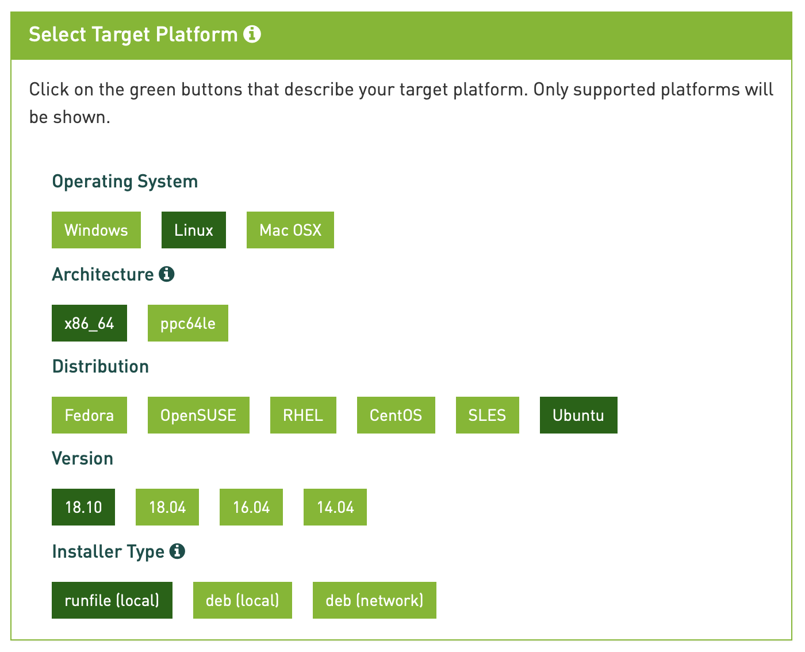
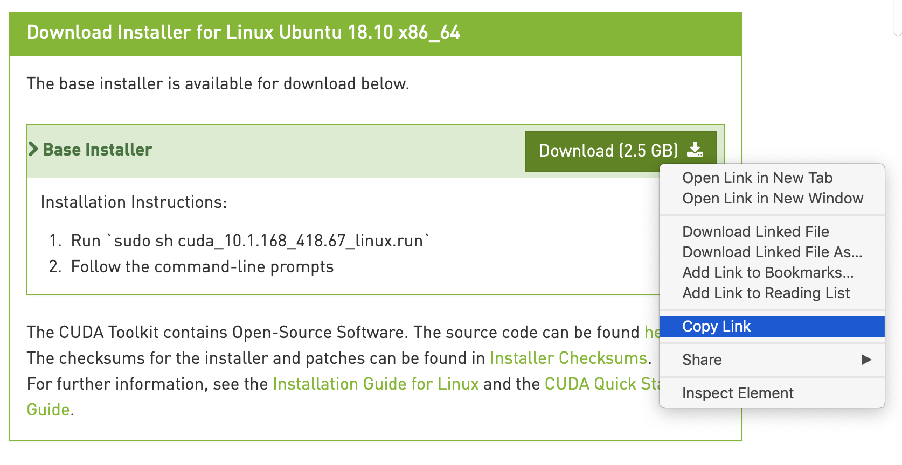


If you are using **Ubuntu 18.04, CentOS 7, or OpenSUSE**, follow the steps below. If you are using **Debian 9**, proceed to the [Install Manually](/docs/products/compute/gpu/guides/install-nvidia-drivers-manually) instructions instead.


In this section, you will install your GPU driver using [NVIDIA's CUDA Toolkit](https://developer.nvidia.com/cuda-toolkit).

For a full list of native Linux distribution support in CUDA, see the [CUDA toolkit documentation](https://docs.nvidia.com/cuda/cuda-installation-guide-linux/index.html#system-requirements).

1. Visit the [CUDA Downloads Page](https://developer.nvidia.com/cuda-downloads) and navigate to the **Select Target Platform** section.

1. Provide information about your target platform by following the prompts and selecting the appropriate options. Once complete, you will gain access to the correct download link for the CUDA Toolkit installer. Use the table below for guidance on how to respond to each prompt:

    | **Prompt** | **Selection** |
    |--------|-----------|
    | Operating System | Linux |
    | Architecture | x86_64 |
    | Distribution | Your Linode's distribution |
    | Version | Your distribution's version |
    | Installer type | runfile (local) |

    A completed set of selections will resemble the example:

    

1.  A **Download Installer** section will appear below the **Select Target Platform** section. The green **Download** button in this section will link to the installer file. Copy this link to your computer's clipboard:

    

1.  On your Linode, enter the `wget` command and paste in the download link you copied. This example shows the syntax for the command, but you should make sure to use the download link appropriate for your Linode:

        wget https://developer.nvidia.com/compute/cuda/10.1/Prod/local_installers/cuda_10.1.168_418.67_linux.run

1. After wget completes, run your version of the installer script to begin the installation process:

        sudo sh cuda_*_linux.run

    
The installer will take a few moments to run before generating any output.


1. Read and accept the License Agreement.

1. Choose to install the CUDA Toolkit in its entirety or partially. To use your GPU, you only need to install the driver. Optionally, you can choose to install the full toolkit to gain access to a set of tools that will empower you to create GPU-accelerated applications.

    To only install the driver, uncheck all options directly below the Driver option. This will result in your screen resembling the following:

    

1. Once you have checked your desired options, select **Install** to begin the installation. A full install will take several minutes to complete.

    

Installation on CentOS and Fedora will fail following this step, because the installer requires a reboot to fully remove the default Nouveau driver. If you are running either of these operating systems, reboot the Linode, run the installer again, and your installation will be successful.



1. When the installation has completed, run the `nvidia-smi` command to make sure that you're currently using your NVIDIA GPU device with its associated driver:

        nvidia-smi

    You should see a similar output:

        +-----------------------------------------------------------------------------+
        | NVIDIA-SMI 418.67       Driver Version: 418.67       CUDA Version: 10.1     |
        |-------------------------------+----------------------+----------------------+
        | GPU  Name        Persistence-M| Bus-Id        Disp.A | Volatile Uncorr. ECC |
        | Fan  Temp  Perf  Pwr:Usage/Cap|         Memory-Usage | GPU-Util  Compute M. |
        |===============================+======================+======================|
        |   0  Quadro RTX 6000     Off  | 00000000:00:03.0 Off |                  Off |
        | 34%   57C    P0    72W / 260W |      0MiB / 24190MiB |      0%      Default |
        +-------------------------------+----------------------+----------------------+

        +-----------------------------------------------------------------------------+
        | Processes:                                                       GPU Memory |
        |  GPU       PID   Type   Process name                             Usage      |
        |=============================================================================|
        |  No running processes found                                                 |
        +-----------------------------------------------------------------------------+

    In the output, you can see that the driver is installed and functioning correctly, the version of CUDA attributed to it, and other useful statistics.
