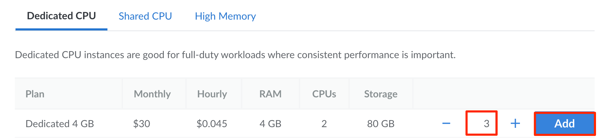
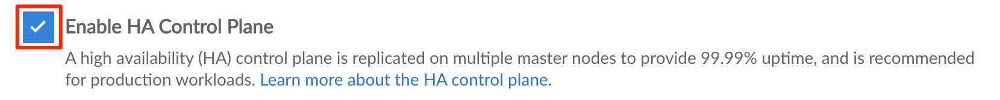

This guide walks you through creating an LKE (Linode Kubernetes Engine) cluster through the Cloud Manager.

1. [Open the Create Kubernetes Cluster Form in the Cloud Manager](#open-the-create-kubernetes-cluster-form-in-the-cloud-manager)
1. [Set the Label](#set-the-label)
1. [Select a Region](#select-a-region)
1. [Choose a Kubernetes Version](#choose-a-kubernetes-version)
1. [Add Node Pools](#add-node-pools)
1. [Optionally Enable High Availability](#optionally-enable-high-availability)
1. [Deploy the Cluster](#deploy-the-cluster)

## Open the Create Kubernetes Cluster Form in the Cloud Manager

Log in to the [Cloud Manager](https://cloud.linode.com/) and select **Kubernetes** from the left navigation menu. Click the **Create Cluster** button. This opens the *[Kubernetes Create Cluster](https://cloud.linode.com/kubernetes/create)* form.

## Set the Label

Within the **Cluster Label** field, enter the label you wish to use. This label allows you to identify it from within the Cloud Manager, Linode CLI, and Linode API. The label must be alphanumeric, between 3 and 32 characters, and unique from other cluster labels on your account.

## Select a Region

Select the **region** where the LKE cluster will reside. Regions correspond with individual data centers, each located in a different geographical area. All resources attached to your cluster are deployed in the selected region, including nodes (Compute Instances) in the Node Pools, volumes (Block Storage Volumes), and load balancers (NodeBalancers). If you haven't yet deployed Compute Instances or chosen a region, select the region closest to you and/or your customers. This helps reduce latency and can make a significant impact in connection speeds and quality.

- [Global Infrastructure](https://www.linode.com/global-infrastructure/)
- [Speed Tests for Data Centers](https://www.linode.com/speed-test/)
- [How to Choose a Data Center](/docs/products/platform/get-started/guides/choose-a-data-center/)

## Choose a Kubernetes Version

Next, select the **Kubernetes Version** you wish to use from the corresponding dropdown list. Only Kubernetes versions that have been approved for LKE are listed. As new versions of Kubernetes are released (and older ones are deprecated), upgrade paths are made available.

## Add Node Pools

Each LKE cluster is created with *at least* one node pool. Node pools are made up of individual worker nodes, which are run on top of Compute Instances.


Currently, the available plan types for LKE worker nodes include [Shared CPU](/docs/products/compute/compute-instances/plans/choosing-a-plan/#shared-cpu-instances), [Dedicated CPU](/docs/products/compute/compute-instances/plans/choosing-a-plan/#dedicated-cpu-instances), and [High Memory](/docs/products/compute/compute-instances/plans/choosing-a-plan/#high-memory-instances). 1 GB Shared CPU Compute Instances Nanodes (also known as *nanodes*) are not available.


In the **Add Node Pools** section, locate the plan type you wish to use for your first node pool. Enter the number of worker nodes that you wish to be included in the node pool and click the **Add** button to add that pool to your cluster configuration. You can repeat this process to add additional node pools if desired. Node pools can also be added, resized, and deleted after the cluster has been created.

## Optionally Enable High Availability

LKE's [HA (high availability) control plane](/docs/products/compute/kubernetes/guides/high-availability-control-plane/) feature is a paid add-on that provides an additional layer of redundancy to the Kubernetes cluster. It creates replicas of the control plane components, eliminating a single point of failure for your cluster and providing a guaranteed uptime of 99.99%. To enable this feature, check the **Enable HA Control Plane** box in the Cluster Summary section. The HA control plane can also be enabled any time after your cluster has been created.


Once the high availability control plane feature has been enabled, it is not possible to remove this feature and *downgrade* to a non-HA control plane.


## Deploy the Cluster

Review your cluster's configuration within the **Cluster Summary** section. This should list each Node Pool that has been added, display the HA control plane selection, and list the monthly cost associated with this cluster. When you are satisfied with the configuration of your cluster, click the **Create Cluster** button. Your cluster's detail page appears while your cluster is being created. From this page, you can [edit your existing Node Pools](/docs/products/compute/kubernetes/guides/manage-node-pools/), [access your Kubeconfig file](/docs/products/compute/kubernetes/guides/kubectl/), and view an overview of your cluster's resource details.