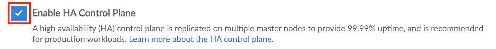
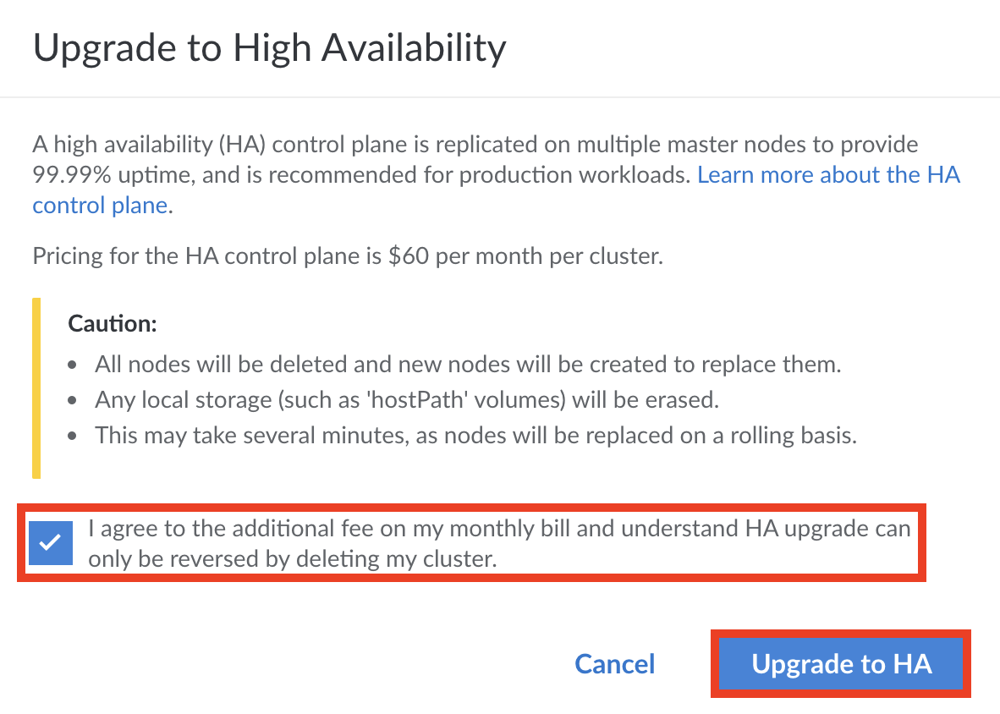
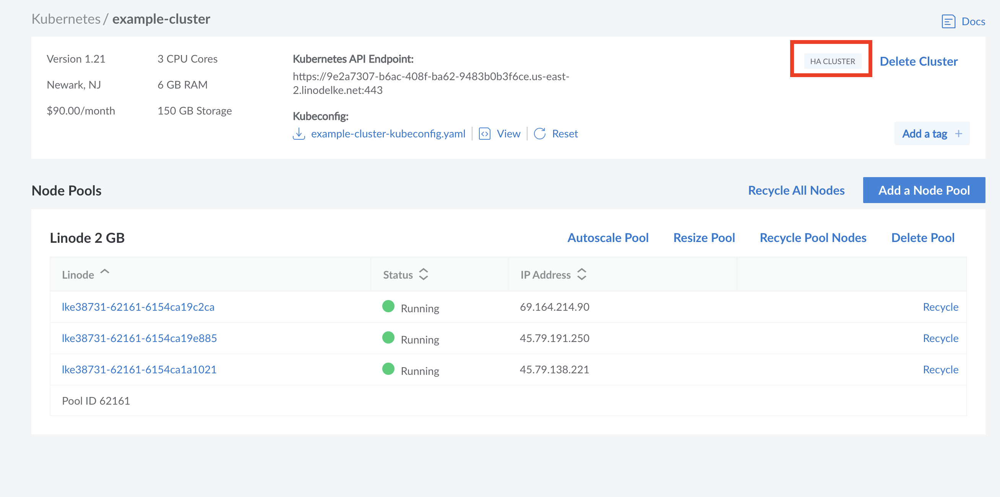

In Kubernetes, the control plane is the set of components that orchestrate the cluster and manage the worker nodes (Compute Instances) in that cluster and the pods (containers) within the worker nodes. The control plane components include the Kubernetes API server (`kube-api-server`), etcd, the Kubernetes scheduler (`kube-scheduler`), the cloud control manager (`cloud-control-manager`), and the Kubernetes controller manager (`kube-controller-manager`).

Within the Linode Platform, this control plane is fully managed by LKE (the Linode Kubernetes Engine). By default, these components are not replicated. If any of them fail, it's possible that there may be issues with your cluster. Enabling **HA (High Availability) Control Plane** adds an additional layer of redundancy by replicating these control plane components. In doing so, this feature can ensure that the cluster experiences maximum uptime (99.99% guaranteed) and is recommended for all production applications running on LKE.

## Cost

The HA control plane feature is an optional billable service that costs $60 per cluster. For more information, see our [pricing page](https://www.linode.com/pricing/).


While upgrading to an HA cluster is always possible, **downgrading your cluster is not currently supported**. Enabling HA is an **irreversible** change for your cluster.


## Replication Details

When HA control plane is enabled on a cluster, the following control plane components are replicated:

- **etcd** and **kube-api-server** increases from *one* to *three* replicas.
- All other components, including the **Cloud Controller Manager**, **kube-scheduler**, and **kube-controller-manager**, increase from *one* to *two* replicas, with leader election put in place.

When multiple replicas are created, they are always placed on separate infrastructure to better support uptime and redundancy. This configuration maintains a guaranteed 99.99% uptime for the control plane and worker nodes.

## Enable During Cluster Creation

To enable this feature when creating a cluster, check the **Enable HA Control Plane** box in the Cluster Summary section. Review the [Create a Cluster](/docs/products/compute/kubernetes/guides/create-cluster/#optionally-enable-high-availability) guide for full instructions.

## Enable on Existing Clusters

If a cluster was created *without* this feature, you can enable it at any time.


Enabling the high availability control plane feature may result in *brief and temporary* downtime while the cluster is upgraded and the following actions are performed:

- All nodes will be deleted and new nodes are created to replace them.
- Any local storage (such as `hostPath` volumes) will be erased.

The upgrade process may take several minutes to complete, as nodes are replaced on a rolling basis.


High Availability can be added to pre-existing clusters at any given time through the cluster's **Summary Page**.

1. To reach the summary page for the cluster, navigate first to the [Kubernetes section of the Cloud Manager](https://cloud.linode.com/kubernetes/clusters).

1. Select the Cluster by label that you would like to enable HA for. The summary page for the cluster appears.

1. To enable HA, select the **Upgrade to HA** button at the top of the page.

    

1. A new window appears, asking you to confirm all of the changes that come with High Availability. Read through the message and select the **Enable HA Control Plane** checkbox to confirm that you agree to the changes. Then click the **Upgrade to HA** button.

    

All clusters that have HA enabled will have an HA Cluster watermark on their summary page.

