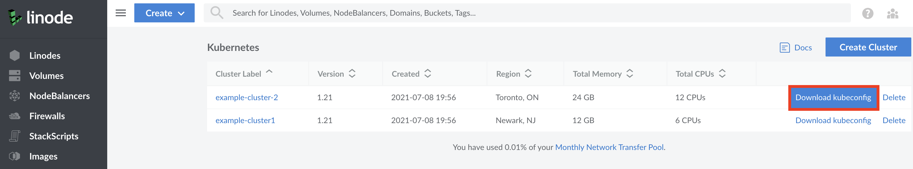

## Install kubectl

You need to install the kubectl client to your computer before proceeding. Follow the steps corresponding to your computer's operating system.



## Connect to a Cluster with kubectl

After you've created your LKE cluster using the Cloud Manager, you can begin interacting with and managing your cluster. You connect to it using the kubectl client on your computer. To configure kubectl, download your cluster's *kubeconfig* file.

### Access and Download your kubeconfig

Anytime after your cluster is created you can download its *kubeconfig*. The kubeconfig is a YAML file that will allow you to use kubectl to communicate with your cluster. Here is an example kubeconfig file:

```file {title="example-cluster-kubeconfig.yaml" lang=yaml}
apiVersion: v1
kind: Config
preferences: {}

clusters:
- cluster:
    certificate-authority-data: LS0tLS1CRUd...
    server: https://example.us-central.linodelke.net:443
  name: lke1234

users:
- name: lke1234-admin
  user:
    as-user-extra: {}
    token: LS0tLS1CRUd...

contexts:
- context:
    cluster: lke1234
    namespace: default
    user: lke1234-admin
  name: lke1234-ctx

current-context: lke1234-ctx
```

This configuration file defines your cluster, users, and contexts.

1. To access your cluster's kubeconfig, log into your Cloud Manager account and navigate to the **Kubernetes** section.

1. From the Kubernetes listing page, click on your cluster's **more options ellipsis** and select **Download kubeconfig**. The file will be saved to your computer's `Downloads` folder.

    

    
    You can also download the kubeconfig from the Kubernetes cluster's details page.

    1. When viewing the Kubernetes listing page, click on the cluster for which you'd like to download a kubeconfig file.

    1. On the cluster's details page, under the **kubeconfig** section, click the **Download icon**. The file will be saved to your `Downloads` folder.

    1. To view the contents of your kubeconfig file, click on the **View icon**. A pane will appear with the contents of your cluster's kubeconfig file.
    

1. To improve security, change the `kubeconfig.yaml` file permissions to be only accessible by the current user:

    ```command
    chmod go-r /Downloads/kubeconfig.yaml
    ```

1. Open a terminal shell and save your kubeconfig file's path to the `$KUBECONFIG` environment variable. In the example command, the kubeconfig file is located in the `Downloads` folder, but you should alter this line with this folder's location on your computer:

    ```command
    export KUBECONFIG=~/Downloads/kubeconfig.yaml
    ```

    
    It is common practice to store your kubeconfig files in `~/.kube` directory. By default, kubectl will search for a kubeconfig file named `config` that is located in the  `~/.kube` directory. You can specify other kubeconfig files by setting the `$KUBECONFIG` environment variable, as done in the step above.
    

1. View your cluster's nodes using kubectl.

    ```command
    kubectl get nodes
    ```

    
    If your kubectl commands are not returning the resources and information you expect, then your client may be assigned to the wrong cluster context. Visit our [Troubleshooting Kubernetes](/docs/guides/troubleshooting-kubernetes/#troubleshooting-examples) guide to learn how to switch cluster contexts.
    

You are now ready to manage your cluster using kubectl. For more information about using kubectl, see Kubernetes' [Overview of kubectl](https://kubernetes.io/docs/reference/kubectl/overview/) guide.

### Persist the Kubeconfig Context

If you create a new terminal window, it does not have access to the context that you specified using the previous instructions. This context information can be made persistent between new terminals by setting the [`KUBECONFIG` environment variable](https://kubernetes.io/docs/tasks/access-application-cluster/configure-access-multiple-clusters/#set-the-kubeconfig-environment-variable) in your shell's configuration file.


If you are using Windows, review the [official Kubernetes documentation](https://kubernetes.io/docs/tasks/access-application-cluster/configure-access-multiple-clusters/#set-the-kubeconfig-environment-variable) for how to persist your context.


These instructions persist the context for users of the Bash terminal. They are similar for users of other terminals:

1.  Navigate to the `$HOME/.kube` directory:

    ```command
    cd $HOME/.kube
    ```

1.  Create a directory called `configs` within `$HOME/.kube`. You can use this directory to store your kubeconfig files.

    ```command
    mkdir configs
    ```

1. Copy your `kubeconfig.yaml` file to the `$HOME/.kube/configs` directory.

    ```command
    cp ~/Downloads/kubeconfig.yaml $HOME/.kube/configs/kubeconfig.yaml
    ```

    
    Alter the above line with the location of the Downloads folder on your computer.

    Optionally, you can give the copied file a different name to help distinguish it from other files in the `configs` directory.
    

1.  Open up your Bash profile (e.g. `~/.bash_profile`) in the text editor of your choice and add your configuration file to the `$KUBECONFIG` PATH variable.

    If an `export KUBECONFIG` line is already present in the file, append to the end of this line as follows; if it is not present, add this line to the end of your file:

    ```command
    export KUBECONFIG=$KUBECONFIG:$HOME/.kube/config:$HOME/.kube/configs/kubeconfig.yaml
    ```

1.  Close your terminal window and open a new window to receive the changes to the `$KUBECONFIG` variable.

1.  Use the `config get-contexts` command for `kubectl` to view the available cluster contexts:

    ```command
    kubectl config get-contexts
    ```

    You should see output similar to the following:

    ```output
    CURRENT   NAME          CLUSTER   AUTHINFO        NAMESPACE
    *         lke1234-ctx   lke1234   lke1234-admin   default
    ```

1.  If your context is not already selected, (denoted by an asterisk in the `current` column), switch to this context using the `config use-context` command. Supply the full name of the cluster (including the authorized user and the cluster):

    ```command
    kubectl config use-context lke1234-ctx
    ```

    You should see output like the following:

    ```output
    Switched to context "lke1234-ctx".
    ```

1.  You are now ready to interact with your cluster using `kubectl`. You can test the ability to interact with the cluster by retrieving a list of Pods. Use the `get pods` command with the `-A` flag to see all pods running across all namespaces:

    ```command
    kubectl get pods -A
    ```

    You should see output like the following:

    ```output
    NAMESPACE     NAME                                      READY   STATUS    RESTARTS   AGE
    kube-system   calico-kube-controllers-dc6cb64cb-4gqf4   1/1     Running   0          11d
    kube-system   calico-node-bx2bj                         1/1     Running   0          11d
    kube-system   calico-node-fg29m                         1/1     Running   0          11d
    kube-system   calico-node-qvvxj                         1/1     Running   0          11d
    kube-system   calico-node-xzvpr                         1/1     Running   0          11d
    kube-system   coredns-6955765f44-r8b79                  1/1     Running   0          11d
    kube-system   coredns-6955765f44-xr5wb                  1/1     Running   0          11d
    kube-system   csi-linode-controller-0                   3/3     Running   0          11d
    kube-system   csi-linode-node-75lts                     2/2     Running   0          11d
    kube-system   csi-linode-node-9qbbh                     2/2     Running   0          11d
    kube-system   csi-linode-node-d7bvc                     2/2     Running   0          11d
    kube-system   csi-linode-node-h4r6b                     2/2     Running   0          11d
    kube-system   kube-proxy-7nk8t                          1/1     Running   0          11d
    kube-system   kube-proxy-cq6jk                          1/1     Running   0          11d
    kube-system   kube-proxy-gz4dc                          1/1     Running   0          11d
    kube-system   kube-proxy-qcjg9                          1/1     Running   0          11d
    ```