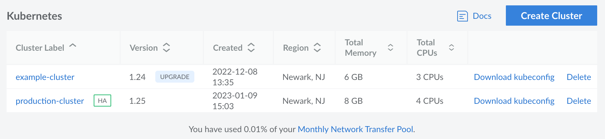
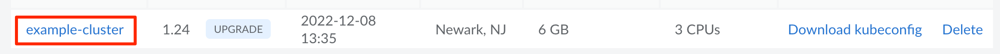
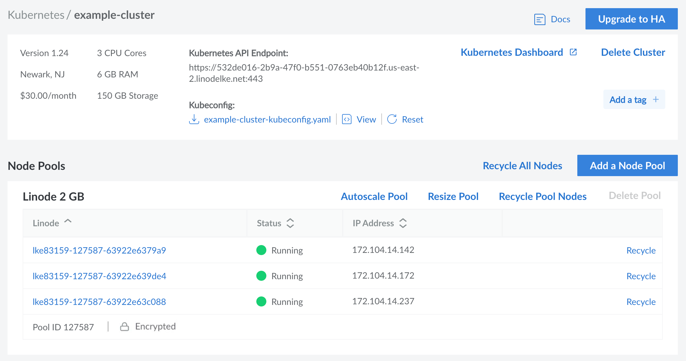

## View Kubernetes Clusters

Log in to the [Cloud Manager](https://cloud.linode.com) and select Kubernetes from the left menu. If any LKE clusters exist on your account, they are listed on this page.

Each Kubernetes cluster in the matrix is displayed alongside the following details:

- **Version:** The Kubernetes version that the cluster is using.
- **Created:** The day and time the cluster was created.
- **Region:** The data center where the cluster resides.
- **Total Memory:** The total combined memory of all worker nodes in the cluster.
- **Total CPUs:** The total combined number of CPU cores in all worker nodes in the cluster.

## Create a Cluster

To create a new Kubernetes cluster within LKE, follow the instructions within the [Create a Cluster](/docs/products/compute/kubernetes/guides/create-cluster/) guide.

## Review and Edit a Cluster

Navigate to the **Kubernetes** page in the Cloud Manager and select the cluster you wish to edit. See [View Kubernetes Clusters](#view-kubernetes-clusters).

This displays the details page for the selected cluster. From here, you can view the summary section (which includes the Kubernetes version, region, cost, and combined computing resources) as well as the following details:

- **Kubernetes API Endpoint**
- **Kubeconfig:** Download, view, and reset the Kubeconfig configuration file. This file outlines the configuration of your cluster and allows you to connect to it.

There are also links to view the Kubernetes dashboard, upgrade the cluster to high availability, delete the cluster, and more. From here, you can also add, remove, recycle, and resize node pools (see [Manage Node Pools](/docs/products/compute/kubernetes/guides/manage-node-pools/)).

## Delete a Cluster

1. Navigate to the **Kubernetes** page in the Cloud Manager and select the cluster you wish to delete. See [View Kubernetes Clusters](#view-kubernetes-clusters).

1. Within the summary and details section, click the **Delete Cluster** button.

1. A confirmation dialog appears. Click **Delete Cluster** to proceed with removing the Kubernetes cluster from your account.