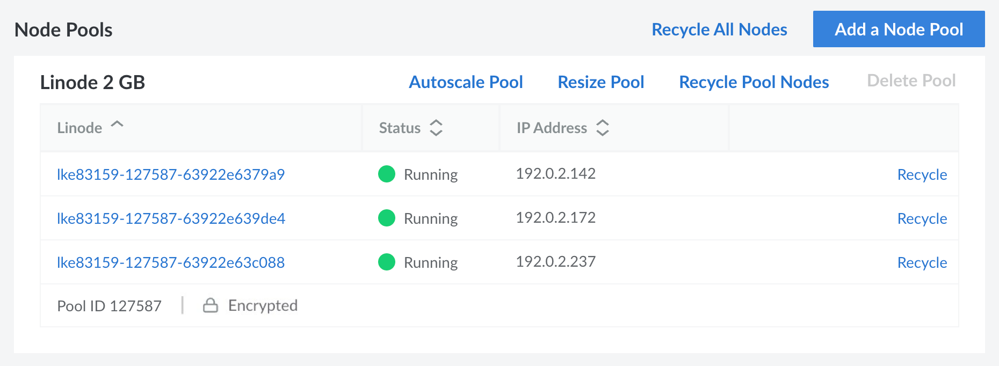
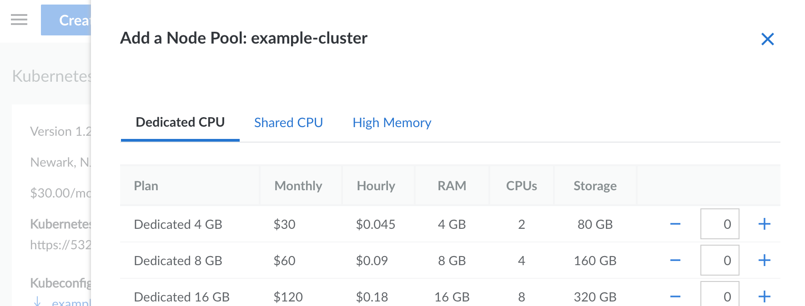
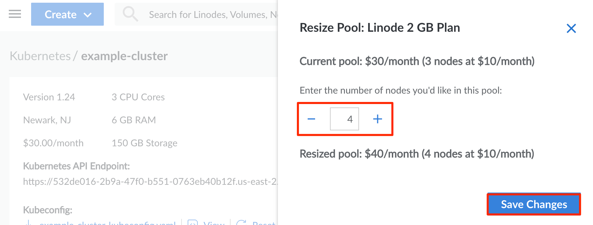
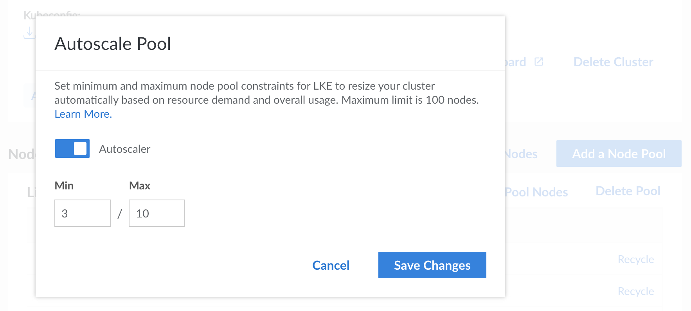

**Nodes**, also known as *worker nodes*, are virtual machines (built on top of Compute Instances) that serve as hosts for your containerized applications (*pods*). A **node pool** is a group of nodes that all run the same applications and configuration. Each LKE cluster has at least one node pool but additional node pools can be deployed as needed.

This guide covers managing the node pools on your cluster, including adding and resizing them to fit the needs of your applications. It also covers recycling node pools to replace all of the associated nodes with new ones that are upgraded to the most recent patch of your cluster's Kubernetes version. For an automated approach, you can also enable cluster autoscaling to automatically create and remove nodes as needed. For any other changes to your LKE cluster, you should use kubectl.

## View Node Pools

1. Log in to the [Cloud Manager](http://cloud.linode.com), click **Kubernetes** in the left menu, and select the cluster you wish to view. See [Manage Kubernetes Clusters](/docs/products/compute/kubernetes/guides/manage-clusters/).

1. Scroll down to the **Node Pools** section. This lists all node pools for your cluster and their associated nodes.

    

## Add a Node Pool

Additional node pools can be added to host different applications or services within the same Kubernetes cluster. Since each node pool can be assigned its own virtual machine (Compute Instance) plan, separating applications into node pools can boost efficiency and allow each application to only be assigned the resources it needs.

1. Navigate to the **Kubernetes** page in the Cloud Manager and select the cluster you wish to edit. See [View Node Pools](#view-node-pools).

1. Within the **Node Pool** section, click the **Add a Node Pool** button.

1. In the side panel that opens, locate the plan type you wish to use for your first node pool. Currently, the available plan types for LKE worker nodes include [Shared CPU](/docs/products/compute/compute-instances/plans/choosing-a-plan/#shared-cpu-instances), [Dedicated CPU](/docs/products/compute/compute-instances/plans/choosing-a-plan/#dedicated-cpu-instances), and [High Memory](/docs/products/compute/compute-instances/plans/choosing-a-plan/#high-memory-instances). 1 GB Shared CPU Compute Instances Nanodes (also known as *nanodes*) are not available.

    

1. In the corresponding field, enter the number of worker nodes that you wish to be included in the node pool.

1. To add the node pool to your cluster's configuration, click the **Add pool** button.

## Resize a Node Pool

Node pools can be resized manually or automatically (through auto-scaling). Both of these processes allow you to increase or decrease the *number of worker nodes*. The instructions below cover manually resizing a pool.

1. Navigate to the **Kubernetes** page in the Cloud Manager and select the cluster you wish to edit. See [View Node Pools](#view-node-pools).

1. Within the **Node Pool** section, locate the node pool you wish to resize and click the **Resize Pool** button.

1. In the side panel that opens, enter the new number of nodes you wish to have in the pool. As the number is adjusted, the total cost of your new resources are displayed. To accept these changes, select the `Save Changes` button to continue.

    

    
    Shrinking a node pool results in the deletion of some associated Compute Instances. Any local storage on these instances (such as `hostPath` and `emptyDir` volumes, or "local" PersistentVolumes) is erased.
    

## Autoscale (Automatically Resize Node Pools)

Many production applications benefit from increasing or decreasing infrastructure based on the resources needed in the moment. In Kubernetes, this can be handled through autoscaling. While autoscaling can be applied to any cluster using tools like [Cluster Autoscaler](https://github.com/kubernetes/autoscaler/tree/master/cluster-autoscaler), LKE has built-in autoscaling. When this feature is enabled, nodes can automatically be added or removed from a pool when the following conditions are met:

- If Pods are unschedulable due to an insufficient number of nodes in the node pool, the number of nodes is increased.

- If Pods are able to be scheduled on less nodes than are currently available in the node pool, nodes are drained and removed automatically. Pods on drained nodes are immediately rescheduled on pre-existing nodes.

1. Navigate to the **Kubernetes** page in the Cloud Manager and select the cluster you wish to edit. See [View Node Pools](#view-node-pools).

1. Within the **Node Pool** section, locate the node pool you wish to modify and click the **Autoscale Pool** button. A popup form appears with settings for autoscaling the node pool.

    

1. To enable autoscaling, toggle the **Autoscaler** button.

1. Enter the minimum and maximum number of nodes for the node pool. The autoscaler feature ensures that the total number of nodes in the pool is never below the minimum number and above the maximum number. The minimum number can be between 1 and 99 while the maximum number needs to be higher than the minimum up to a limit of 100.

1. Click the `Save Changes` button to complete the process and enable (or disable) the autoscaling feature.


The LKE Autoscaler will not automatically increase or decrease the size of the node pool if the current node pool is either below the minimum of the autoscaler, or above the maximum. This behavior can be further described by following examples:

- If the Node pool has 3 nodes in the current node pool and a minimum of 5, the autoscaler will not automatically scale the current node pool up to meet the minimum. It will only scale up if pods are unschedulable otherwise.

- If the Node Pool has 10 nodes in the current node pool and a maximum of 7, the autoscaler will not automatically scale the current node pool down to meet the maximum. It can only scale down when the maximum is at or above the current number of nodes in the node pool. This is an intentional design choice to prevent the disruption of existing workloads.


## Recycle Nodes

Recycling a worker node deletes the corresponding Compute Instance and deploys a new one. This is used when upgrading minor versions of Kubernetes or when debugging a node. You can recycle an individual node, recycle all nodes in a node pool, or recycle all nodes within a cluster. When recycling multiple nodes, each node is recycled on a rolling basis so that only a single node is down at any time.

1. Navigate to the **Kubernetes** page in the Cloud Manager and select the cluster you wish to edit. See [View Node Pools](#view-node-pools).

1. Within the **Node Pool** section, select the button corresponding with the recycle operation you wish to perform:

    - **Recycle All Nodes**: Performs recycle operations on each node in the cluster on a rolling basis.

    - **Recycle Pool Nodes**: Performs recycle operations on each node in the selected node pool on a rolling basis.

    - **Recycle**: Performs a recycle operation on the corresponding node.

1. A popup message appears which details the recycle process. Click the **Recycle** button to confirm.

    
    Shrinking a node pool results in the deletion of some associated Compute Instances. Any local storage on these instances (such as `hostPath` and `emptyDir` volumes, or "local" PersistentVolumes) is erased.
    

## Remove a Node Pool

If you no longer need to use a node pool, you can remove it from the cluster. This deletes all corresponding Compute Instance. If you instead wish to decrease the number of nodes in a node pool, see [Resize a Node Pool](#resize-a-node-pool)

1. Navigate to the **Kubernetes** page in the Cloud Manager and select the cluster you wish to edit. See [View Node Pools](#view-node-pools).

1. Within the **Node Pool** section, locate the node pool you wish to delete and click the **Delete Pool** button.

    
    Each cluster must have at least one active node pool. If there is only a single node pool, the **Delete Pool** button is disabled.
    

1. A popup message appears requesting you to confirm the operation. Click **Delete** to confirm.