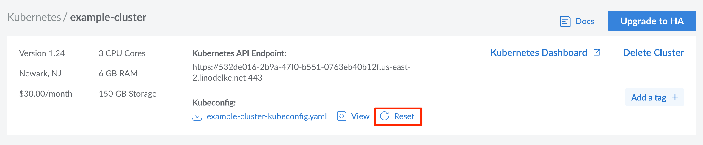

### Reset Cluster Kubeconfig

In cases where access to a cluster using a current kubeconfig must be revoked, LKE provides the ability to **Reset** a cluster kubeconfig. This will effectively remove the current kubeconfig, and create a new one for cluster administrators to use.

1. To reset the cluster kubeconfig access the [cluster's details page](/docs/products/compute/kubernetes/guides/manage-clusters/).

1. Select the **Reset** button under the **kubeconfig** sub-category.

    

1. A confirmation message will appear confirming the Kubeconfig reset. Select the **Reset kubeconfig** button to proceed.

A new kubeconfig will now be created. Once this process is completed, the new kubeconfig can be [Accessed and Downloaded](/docs/products/compute/kubernetes/guides/kubectl/) as usual.