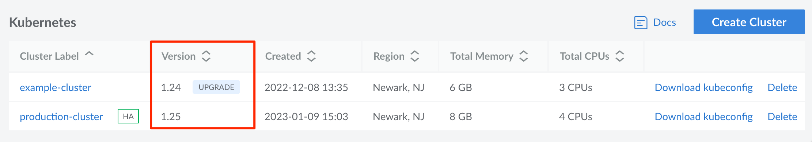
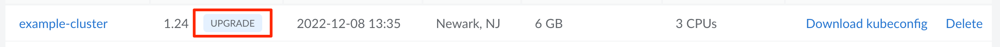
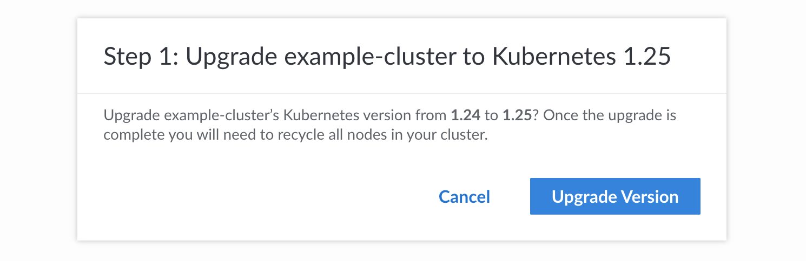
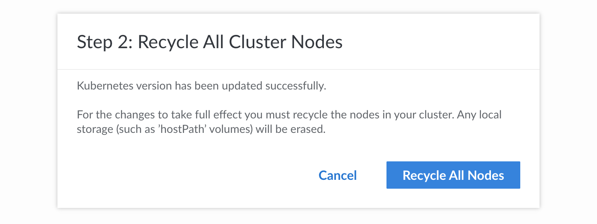

Kubernetes releases new software versions and patches on a regular cadence. These updates are integrated into LKE *after* they are released on upstream Kubernetes, which ensures they are properly tested on the Linode Platform. Kubernetes uses a semantic versioning system that includes three parts: x.y.z, where **x** is the *major* version, **y** is the *minor* version, and **z** is the *patch* version.

- **Patch version upgrades** *(ex: 1.23.4 to 1.23.5)*: Patches are generally critical bug fixes, which include fixing security vulnerabilities. LKE clusters are automatically upgraded to the latest available patch versions for the cluster's minor version of Kubernetes (once they are released on LKE).
- **Minor version upgrades** *(ex: 1.23.5 to 1.24.0)*: Minor versions include new features and may make breaking changes or introduce incompatibilities. Customers are highly encouraged to manually upgrade their clusters, though an upgrade will be scheduled automatically once a cluster's existing minor version in deprecated.


When upgrading a minor version of Kubernetes on LKE, you must upgrade to the next consecutive version. If the cluster is multiple versions behind, each version upgrade must be completed individually. For instance, if the current version on the cluster is 1.23.x and the latest available version on LKE is 1.25.x, the cluster must be upgraded to v1.24.x *before* upgrading to 1.25.x.


## Upgrade Process

When a Kubernetes version upgrade is initiated on an LKE cluster (including both patch versions and minor versions), the control plane components are automatically upgraded. New worker nodes are also created using the new version. In most cases, there is no downtime or impact to performance for this part of the upgrade.

After the initial upgrade, existing worker nodes need to also be upgraded to the newer Kubernetes version. This typically requires a few extra steps. This guide outlines three options for upgrading these existing nodes, including recycling all worker nodes, performing an in-place upgrade, and performing an out-of-place upgrade. Each of these options is discussed in the [Upgrade Worker Nodes](#upgrade-worker-nodes) section.


Existing worker nodes are *automatically upgraded* when initiating the upgrade in the Cloud Manager if **Recycle All Nodes** is selected during the upgrade process. This can also be triggered manually by using the recycle all nodes feature in the Cloud Manager, Linode CLI, and Linode API. This recycles all nodes on a rolling basis so that only a single node is down at any time. Since this means there is one less worker node during the upgrade process, it can affect performance and might not be preferred for production applications.

It is strongly recommended that steps are taken to ensure that there is enough space on all nodes to accommodate for this temporary shift in resources. If a cluster of three nodes cannot briefly support the resources demands of an application using only two nodes, then the upgrade process may result in unintended application downtime. To overcome this, you can temporarily add additional worker nodes and perform either an *in-place* or *out-of-place* upgrade to avoid any performance impact. For more details on these approaches, see [Upgrade Worker Nodes](#upgrade-worker-nodes).


## Deprecating Kubernetes Versions (End of Life)

Kubernetes versions are also regularly *deprecated* on LKE. This prevents customers from experiencing issues as a result of using outdated software. When a minor version of Kubernetes is deprecated, an upgrade is scheduled for any LKE clusters using that version. This scheduled update is communicated via email to all affected customers in advance. It is recommended that customers manually initiate the upgrade. If an upgrade does not occur manually, the cluster is automatically upgraded at the scheduled time.

## Review the Kubernetes Changelog

Changelogs for each new version of Kubernetes are published on the [Kubernetes CHANGELOG](https://github.com/kubernetes/kubernetes/tree/master/CHANGELOG) page on GitHub. To ensure a clean upgrade and eliminate potential issues, review the changelog entry that corresponds with the Kubernetes version to which your cluster will be upgraded. Since LKE clusters can only be upgraded one minor version at a time (i.e. v1.24.x to v1.25.x), you only need to review a single changelog entry.

Each Kubernetes changelog entry includes patch versions and apha/development versions. It's recommended that you review every section titled `Changelog since vX.Y.Z` starting from your current Kubernetes version and continuing through the latest patch release for the version to which you'll be upgraded. Compare these changes with the components and configuration of your cluster to help identify any breaking changes or issues that may occur. Additionally, review any upgrade notes, known issues, deprecation notes, or API changes, all of which may appear alongside each changelog.

The [Kubernetes Blog](https://kubernetes.io/blog/) may also include a post regarding changes in each version (such as the [Kubernetes Removals and Major Changes In 1.25](https://kubernetes.io/blog/2022/08/04/upcoming-changes-in-kubernetes-1-25/) post). These blog posts may be less detailed, but should be easier to understand so you can quickly identify major changes.

As API changes are an issue that can commonly go unnoticed when upgrading LKE, we additionally recommend checking Kubernetes' [API deprecation guide](https://kubernetes.io/docs/reference/using-api/deprecation-guide/) for more information on API changes, and how they should be addressed in specific circumstances.


When reviewing the changelog, it is important to keep in mind that **patch releases** are deployed automatically to LKE clusters as needed. These patch versions should not effect the intended behavior of your cluster. Only major and minor releases have potentially breaking changes.


## Search for Compatibility Issues with Popeye

One way to identify breaking changes and compatibility issues with Kubernetes upgrades is to use the [Popeye](https://github.com/derailed/popeye) tool. For help with this process, see the [Use Popeye to Check for Kubernetes Configuration Issues](/docs/guides/check-for-configuration-issues-with-popeye/) guide.

## Check the Kubernetes Version on an LKE Cluster



Navigate to the **Kubernetes** page in the [Cloud Manager](http://cloud.linode.com) to see a list of all LKE clusters on your account (see [Manage Kubernetes Clusters](/docs/products/compute/kubernetes/guides/manage-clusters/)).



The current overall Kubernetes version of each LKE cluster is listed within the *Version* column. If an upgrade is available, an **Upgrade** button is displayed next to the version number.

To determine the exact version being used by your control plane and your worker nodes, view the instructions for kubectl.


**Cluster version:**

To get the current overall version of Kubernetes on your cluster through kubectl, use the following command:

```command
kubectl version --short | grep Server
```

```output
Server Version: v1.25.6
```

**Control plane version:**

Since LKE manages the control plane, the control plane components are automatically upgraded to match the cluster's Kubernetes version.

Run the following command to get a list of all kube-proxy pods running on your control plane:

```command
kubectl get pods --namespace kube-system | grep "kube-proxy"
```

```output
kube-proxy-gh6xg                           1/1     Running   0          49m
kube-proxy-p4fkm                           1/1     Running   0          53m
kube-proxy-pd5vb                           1/1     Running   0          51m
```

Then, perform the following command to check the version on any of the kube-proxy pods, replacing *[pod]* with the name of one of the pods listed in the previous output.

```command
kubectl describe pod kube-proxy-gh6xg -n kube-system | grep "Image"
```

```output
    Image:         linode/kube-proxy-amd64:v1.25.6
    ...
```

**Worker node version:**

Existing worker nodes may still be on older versions (unless they have already been recycled). To view the version of Kubernetes in use by your worker nodes, run the command below and look at the `VERSION` column in the output.

```command
kubectl get nodes
```

```output
NAME                           STATUS   ROLES    AGE    VERSION
lke83159-127587-63922e6379a9   Ready    <none>   103d   v1.24.8
lke83159-127587-63922e639de4   Ready    <none>   103d   v1.24.8
lke83159-127587-63922e63c088   Ready    <none>   103d   v1.24.8
```



## Upgrade Kubernetes on an LKE Cluster

### Initiate the Upgrade and Upgrade the Control Plane

Once you are ready to perform an upgrade, you can start the upgrade process. This automatically upgrades the managed Control Plane on your LKE cluster and ensures that any *new* worker nodes are created using the newer Kubernetes version.



1. Navigate to the **Kubernetes** page in the [Cloud Manager](http://cloud.linode.com) to see a list of all LKE clusters on your account (see [Manage Kubernetes Clusters](/docs/products/compute/kubernetes/guides/manage-clusters/)).

1. Locate the cluster you wish to upgrade and click the corresponding **Upgrade** button in the *Version* column. This button only appears if there is an available upgrade for that cluster.

    

1. A confirmation popup should appear notifying you of the current and target Kubernetes version. Click the **Upgrade Verion** button to continue with the upgrade.

    

1. The next step is to upgrade all worker nodes in the cluster so that they use the newer Kubernetes version. A second popup should automatically appear requesting that you start the recycle process. Each worker node is recycled on a rolling basis so that only a single node is down at any time. *Only click the **Recycle All Nodes** button if you do not care about performance impact to your application.* For high performance production applications, consider clicking the **Cancel** button and performing one of the upgrade procedures outlined in the [Upgrade Worker Nodes](#upgrade-worker-nodes) section.

    


1. Identify the ID of the cluster you wish to upgrade.

    ```command
    linode-cli lke clusters-list
    ```
    ```output
    ┌───────┬─────────────────────┬──────────────┬─────────────┬───────────────────┐
    │ id    │ label               │ region       │ k8s_version │ high_availability │
    ├───────┼─────────────────────┼──────────────┼─────────────┼───────────────────┤
    │ 83159 │ production-cluster  │ us-east      │ 1.25        │ False             │
    │ 99169 │ example-cluster     │ us-southeast │ 1.24        │ False             │
    └───────┴─────────────────────┴──────────────┴─────────────┴───────────────────┘
    ```

1. Initiate the upgrade, replacing *[cluster-id]* with the ID of your cluster (obtained in the previous step) and *[kubernetes-version]* with the Kubernetes version you'd like to upgrade to (keeping in mind that you can only upgrade to the next sequential version number).

    ```command
    linode-cli lke cluster-update [cluster-id] --k8s_version [kubernetes-version]
    ```

    ```output
    ┌─────────────────────┬──────┬─────────────────────┬─────────────────────┬──────────────┬─────────────┐
    │ label               │ tags │ created             │ updated             │ region       │ k8s_version │
    ├─────────────────────┼──────┼─────────────────────┼─────────────────────┼──────────────┼─────────────┤
    │ example-cluster-002 │      │ 2023-03-22T13:19:40 │ 2023-03-22T13:19:40 │ us-southeast │ 1.25        │
    └─────────────────────┴──────┴─────────────────────┴─────────────────────┴──────────────┴─────────────┘
    ```

    Since this process does not upgrade the worker nodes, perform one of upgrade procedures outlined in the [Upgrade Worker Nodes](#upgrade-worker-nodes) section.



1. Identify the ID of the cluster you wish to upgrade. Run the API curl request below, making sure to properly paste in or reference your [API token](/docs/products/tools/api/guides/manage-api-tokens/).

    ```command
    curl -H "Authorization: Bearer $TOKEN" \
      https://api.linode.com/v4/lke/clusters
    ```

    Within the output, locate the `id` of the cluster.

    ```output
    "data" : [
      {
         "control_plane" : {
            "high_availability" : false
         },
         "created" : "2022-12-08T18:35:08",
         "id" : 83159,
         "k8s_version" : "1.24",
         "label" : "example-cluster",
         "region" : "us-east",
         "status" : "ready",
         "tags" : [],
         "updated" : "2023-03-22T13:02:52"
      },
      ...
    ```

1. Initiate the upgrade, replacing *[cluster-id]* with the ID of your cluster (obtained in the previous step) and *[kubernetes-version]* with the Kubernetes version you'd like to upgrade to (keeping in mind that you can only upgrade to the next sequential version number).

    ```command
    curl -H "Content-Type: application/json" \
      -H "Authorization: Bearer $TOKEN" \
      -X PUT -d '{
        "k8s_version": "[kubernetes-version]"
      }' \
      https://api.linode.com/v4/lke/clusters/[cluster-id]
    ```

    The output should list the new Kubernetes version.

    ```output
    {
      "control_plane" : {
          "high_availability" : false
      },
      "created" : "2023-03-22T13:52:31",
      "id" : 99184,
      "k8s_version" : "1.25",
      "label" : "example-cluster-003",
      "region" : "ca-central",
      "status" : "ready",
      "tags" : [],
      "updated" : "2023-03-22T13:53:26"
    }
    ```

    Since this process does not upgrade the worker nodes, perform one of upgrade procedures outlined in the [Upgrade Worker Nodes](#upgrade-worker-nodes) section.



### Upgrade Worker Nodes

Once the upgrade has been initiated, the control plane should be on the newer Kubernetes version but the existing worker nodes will still be on the older version. You can now decide how you'd like to handle upgrading the existing worker nodes to the newer Kubernetes version. Select from one of the options below.

- [Recycle All Worker Nodes](#recycle-all-worker-nodes): This recycles each worker node on a rolling basis so that only one node is down at a time. While this process is generally the easiest method, it will likely impact the application's performance as your application will have access to fewer resources during the upgrade. It is only recommended if you are not running a production application.

- [Perform an In-Place Upgrade](#perform-an-in-place-upgrade): This process temporarily creates one additional worker node on each node pool. This minimizes the cost impact of the upgrade (compared with an out-of-place upgrade) but increases the time the upgrade may take. This is recommended for smaller production applications.

- [Perform an Out-of-Place Upgrade](#perform-an-out-of-place-upgrade): This process temporarily creates an additional node pool (with multiple worker nodes). This minimizes the time the upgrade may take (compared with an in-place upgrade) but increases the cost impact. This is recommended for larger production applications.

It is highly recommended to add additional resources and take a "cordon and migrate" approach, meaning that pods will no longer land on existing nodes and they are all migrated to newer nodes.

#### Recycle All Worker Nodes

*This process is the easiest way to upgrade all worker nodes but will likely impact application performance. It is only recommended if you are not running a production application.*

This recycles each worker node on a rolling basis so that only one node is down at any particular moment. In the highest level of detail, each worker node is independently [drained and cordoned](https://kubernetes.io/docs/tasks/administer-cluster/safely-drain-node/) *one at a time*. During this process, all workloads are migrated to other nodes. Once a worker node is drained and cordoned, it is removed and a new node is created using the new Kubernetes version. It is synced, and then uncordoned, immediately putting it back live into the cluster with the `Ready` status.



On the details page of your LKE cluster in the Cloud Manager, click the **Recycle All Nodes** button. See [Recycle Nodes](/docs/products/compute/kubernetes/guides/manage-node-pools/#recycle-nodes) for more details.


Run the command below, replacing *[cluster-id]* with the ID of your cluster.

```command
linode-cli lke cluster-nodes-recycle [cluster-id]
```

For more details, review the CLI request sample on the [Cluster Nodes Recycle API reference](/docs/api/linode-kubernetes-engine-lke/#cluster-nodes-recycle).


Perform the API request below, replacing *[cluster-id]* with the ID of your cluster.

```command
curl -H "Content-Type: application/json" \
      -H "Authorization: Bearer $TOKEN" \
      -X POST \
      https://api.linode.com/v4/lke/clusters/[cluster-id]/recycle
```

For more details, review the API request sample on the [Cluster Nodes Recycle API reference](/docs/api/linode-kubernetes-engine-lke/#cluster-nodes-recycle).



#### Perform an In-Place Upgrade

*This process temporarily creates one additional worker node on each node pool. This minimizes the cost impact of the upgrade (compared with an out-of-place upgrade) but increases the time the upgrade may take. This is recommended for smaller production applications.*

1.  First, add an additional worker node and, if using the Autoscale feature, increase the minimum number of nodes.

    
    
    Locate the node pool on the details page of your LKE cluster in the Cloud Manager. Click the corresponding **Resize Pool** button. Increase the size of the node pool by 1. For example, if you have 3 nodes in the pool, increase that value to 4. For additional instructions, see [Resize a Node Pool](/docs/products/compute/kubernetes/guides/manage-node-pools/#resize-a-node-pool).

    If you are also using the autoscale feature, increase the minimum and maximum nodes by 1. This can be done by clicking the corresponding **Autoscale Pool** button and adjusting the minimum and maximum values. For more details, see [Autoscale](/docs/products/compute/kubernetes/guides/manage-node-pools/#autoscale-automatically-resize-node-pools).
    
    
    Run the command below, replacing the following values as needed. If you are not using the autoscale feature, remove the last 3 options (starting with *autoscaler*) from the command.

    - *[cluster-id]*: The ID of your cluster.
    - *[pool-id]*: The ID of your node pool.
    - *[number-of-nodes]*: Enter one value more than the number of nodes that already exist in the node pool.
    - *[maximum-nodes]*: The maximum number of nodes for the pool. Enter one value more than the existing value.
    - *[minimum-nodes]*: The minimum number of nodes for the pool. Enter one value more than the existing value.

    ```command
    linode-cli lke pool-update [cluster-id] [pool-id] \
      --count [number-of-nodes] \
      --autoscaler.enabled true \
      --autoscaler.max [maximum-nodes] \
      --autoscaler.min [minimum-nodes]
    ```

    For more details, review the CLI request sample on the [Node Pool Update API reference](/docs/api/linode-kubernetes-engine-lke/#node-pool-update).
    
    
    Perform the API request below, replacing the following values as needed. If you are not using the autoscale feature, remove the `autoscaler` parameters from the request.

    - *[cluster-id]*: The ID of your cluster.
    - *[pool-id]*: The ID of your node pool.
    - *[number-of-nodes]*: Enter one value more than the number of nodes that already exist in the node pool.
    - *[maximum-nodes]*: The maximum number of nodes for the pool. Enter one value more than the existing value.
    - *[minimum-nodes]*: The minimum number of nodes for the pool. Enter one value more than the existing value.

    ```command
    curl -H "Content-Type: application/json" \
          -H "Authorization: Bearer $TOKEN" \
          -X PUT -d '{
            "count": [number-of-nodes],
            "autoscaler": {
              "enabled": true,
              "max": [maximum-nodes],
              "min": [minimum-nodes]
          }' \
          https://api.linode.com/v4/lke/clusters/[cluster-id]/pools/[pool-id]
    ```

    For more details, review the shell request sample on the [Node Pool Update API reference](/docs/api/linode-kubernetes-engine-lke/#node-pool-update).
    
    

1.  Select one worker node running the older Kubernetes version and prevent new pods from being created on it. This can be accomplished using the `cordon` command through kubectl, replacing *[node]* with the name of the node you are taking action on.

    ```command
    kubectl cordon [node]
    ```

1.  Once traffic is no longer being assigned to that node, drain that worker node so that the existing workloads are rescheduled to other nodes.

    ```command
    kubectl drain [node] --ignore-daemonsets
    ```

    By default, this will allow the pods to gracefully terminate with a default grace period of 30 seconds. If your nodes have a long grace period, it may take a while to migrate off the existing workloads. You can adjust this by using the `--grace-period [value]` option in the above drain command, replacing *[value]* with the time in seconds you wish to use. See [Termination of Pods](https://kubernetes.io/docs/concepts/workloads/pods/pod-lifecycle/#pod-termination) on the official Kubernetes documentation.

1.  After the node has been drained, it can be recycled, which rebuilds the worker node using the newer Kubernetes version.

    
    
    Locate the node pool on the details page of your LKE cluster in the Cloud Manager. Next to the node that has just been drained, click the corresponding **Recycle** button as outlined in [Recycle Nodes](/docs/products/compute/kubernetes/guides/manage-node-pools/#recycle-nodes).
    
    
    Run the command below, replacing *[cluster-id]* with the ID of your cluster and *[node-id]* with the ID of the node.

    ```command
    linode-cli lke node-recycle [cluster-id] [node-id]
    ```

    For more details, review the CLI request sample on the [Node Recycle API reference](/docs/api/linode-kubernetes-engine-lke/#node-recycle).
    
    
    Perform the API request below, replacing *[cluster-id]* with the ID of your cluster and *[node-id]* with the ID of the node.

    ```command
    curl -H "Content-Type: application/json" \
          -H "Authorization: Bearer $TOKEN" \
          -X POST \
          https://api.linode.com/v4/lke/clusters/[cluster-id]/nodes/[node-id]/recycle
    ```

    For more details, review the API request sample on the [Node Recycle API reference](/docs/api/linode-kubernetes-engine-lke/#node-recycle).
    
    

1.  Repeat steps 2 through 4 for each worker node until *all but the last* worker nodes are using the newer Kubernetes version. For the last worker node, repeat steps 2 and 3 to cordon and drain that node - but do not recycle it as that will cause workloads to land back on that node. Instead, continue with the step below to delete it.

1.  Remove the additional worker node that was added during this upgrade process. This can be accomplished by resizing your cluster back to your original value to use one less worker node. The last worker node that was created, which was the one you have not yet recycled, is removed during the resize. Then, if you previously adjusted the Autoscale Pool, adjust the values back to what they were prior to the upgrade.

    
    
    Locate the node pool on the details page of your LKE cluster. Click the corresponding **Resize Pool** button. Decrease the size of the node pool by 1. For example, if you have 4 nodes in the pool, decrease that value to 3. For additional instructions, see [Resize a Node Pool](/docs/products/compute/kubernetes/guides/manage-node-pools/#resize-a-node-pool).

    If you are also using the autoscale feature, decrease the minimum and maximum nodes by 1. This can be done by clicking the corresponding **Autoscale Pool** button and adjusting the minimum and maximum values. For more details, see [Autoscale](/docs/products/compute/kubernetes/guides/manage-node-pools/#autoscale-automatically-resize-node-pools).
    
    
    Run the command below, replacing the following values as needed. If you are not using the autoscale feature, remove the last 3 options (starting with *autoscaler*) from the command.

    - *[cluster-id]*: The ID of your cluster.
    - *[pool-id]*: The ID of your node pool.
    - *[number-of-nodes]*: Enter one value less than the number of nodes that exist in the node pool.
    - *[maximum-nodes]*: The maximum number of nodes for the pool. Enter one value less than the existing value.
    - *[minimum-nodes]*: The minimum number of nodes for the pool. Enter one value less than the existing value.

    ```command
    linode-cli lke pool-update [cluster-id] [pool-id] \
      --count [number-of-nodes] \
      --autoscaler.enabled true \
      --autoscaler.max [maximum-nodes] \
      --autoscaler.min [minimum-nodes]
    ```

    For more details, review the CLI request sample on the [Node Pool Update API reference](/docs/api/linode-kubernetes-engine-lke/#node-pool-update).
    
    
    Perform the API request below, replacing the following values as needed. If you are not using the autoscale feature, remove the `autoscaler` parameters from the request.

    - *[cluster-id]*: The ID of your cluster.
    - *[pool-id]*: The ID of your node pool.
    - *[number-of-nodes]*: Enter one value less than the number of nodes that already exist in the node pool.
    - *[maximum-nodes]*: The maximum number of nodes for the pool. Enter one value less than the existing value.
    - *[minimum-nodes]*: The minimum number of nodes for the pool. Enter one value less than the existing value.

    ```command
    curl -H "Content-Type: application/json" \
          -H "Authorization: Bearer $TOKEN" \
          -X PUT -d '{
            "count": [number-of-nodes],
            "autoscaler": {
              "enabled": true,
              "max": [maximum-nodes],
              "min": [minimum-nodes]
          }' \
          https://api.linode.com/v4/lke/clusters/[cluster-id]/pools/[pool-id]
    ```

    For more details, review the shell request sample on the [Node Pool Update API reference](/docs/api/linode-kubernetes-engine-lke/#node-pool-update).
    
    

#### Perform an Out-of-Place Upgrade

*This process temporarily creates an additional node pool (with multiple worker nodes). This minimizes the time the upgrade may take (compared with an in-place upgrade) but increases the cost impact. This is recommended for larger production applications.*


These instructions cover deleting the old node pool after all nodes have been fully drained. This allows you to fallback to the existing nodes should the need arise. Alternatively, you can delete each node after it has been successfully drained, which reduces the overall cost impact of the upgrade.


1.  Create a new pool with the same Compute Instance plans and number of nodes as your existing pool.

    
    
    Within the **Node Pools** section on the details page of your LKE cluster in the Cloud Manager, click the **Add a Node Pool** button. In the prompt that appears, enter the plan type, plan size, and the number of nodes to match the existing node pool. See [Add a Node Pool](/docs/products/compute/kubernetes/guides/manage-node-pools/#add-a-node-pool).
    
    
    Run the command below, replacing the following values as needed. If you are not using the autoscale feature, remove the last 3 options (starting with *autoscaler*) from the command.

    - *[cluster-id]*: The ID of your cluster
    - *[plan-type]*: The ID of the Compute Instance plan you wish to use. You can see all available plans and their corresponding IDs by running `linode-cli linodes types`.
    - *[maximum-nodes]*: The maximum number of nodes for the pool.
    - *[minimum-nodes]*: The minimum number of nodes for the pool.

    ```command
    linode-cli lke pool-create [cluster-id] \
        --type [plan-id]
        --count [number-of-nodes]
        --autoscaler.enabled true \
        --autoscaler.max [maximum-nodes] \
        --autoscaler.min [minimum-nodes] \
    ```

    For more details, reference the corresponding operation on the [API/CLI docs](/docs/api/linode-kubernetes-engine-lke/#node-pool-create) (select the **CLI** tab).
    
    
    Perform the API request below, replacing the following values as needed. If you are not using the autoscale feature, remove the `autoscaler` parameters from the request.

    - *[cluster-id]*: The ID of your cluster
    - *[plan-type]*: The ID of the Compute Instance plan you wish to use. You can see all available plans and their corresponding IDs by running `linode-cli linodes types`.
    - *[maximum-nodes]*: The maximum number of nodes for the pool.
    - *[minimum-nodes]*: The minimum number of nodes for the pool.

    ```command
    curl -H "Content-Type: application/json" \
          -H "Authorization: Bearer $TOKEN" \
          -X POST -d '{
            "type": "[plan-id]",
            "count": [number-of-nodes],
            "autoscaler": {
              "enabled": true,
              "max": [maximum-nodes],
              "min": [minimum-nodes]
            }
          }' \
          https://api.linode.com/v4/lke/clusters/[cluster-id]/pools
    ```
    For more details, reference the corresponding operation on the [API/CLI docs](/docs/api/linode-kubernetes-engine-lke/#node-pool-create).
    
    

1.  Select one worker node on the old pool and prevent new pods from being created on it. This can be accomplished using the `cordon` command through kubectl, replacing *[node]* with the name of the node you are taking action on.

    ```command
    kubectl cordon [node]
    ```

1.  Once traffic is no longer being assigned to that node, drain that worker node so that the existing workloads are rescheduled to nodes on the other pool.

    ```command
    kubectl drain [node] --ignore-daemonsets
    ```

    By default, this will allow the pods to gracefully terminate with a default grace period of 30 sections. If your nodes have a long grace period, it may take a while to migrate off the existing workloads. You can adjust this by using the `--grace-period [value]` option in the above drain command, replacing *[value]* with the time in sections you wish to use. See [Termination of Pods](https://kubernetes.io/docs/concepts/workloads/pods/pod-lifecycle/#pod-termination) on the official Kubernetes documentation.

1.  Repeat steps 2 through 3 for *each* worker node on the old pool.

1.  Once all worker nodes have been drained on the old node pool, the pool can be deleted.

    
    
    Locate the original node pool on the details page of your LKE cluster in the Cloud Manager. Click the corresponding **Delete Pool** button as outlined in [Remove a Node Pool](/docs/products/compute/kubernetes/guides/manage-node-pools/#remove-a-node-pool).
    
    
    Run the command below, replacing *[cluster-id]* with the ID of your cluster and *[pool-id]* with the ID of the original node pool.

    ```command
    linode-cli lke pool-delete [cluster-id] [pool-id]
    ```

    For more details, reference the corresponding operation on the [API/CLI docs](/docs/api/linode-kubernetes-engine-lke/#node-pool-delete) (select the **CLI** tab).
    
    
    Perform the API request below, replacing *[cluster-id]* with the ID of your cluster and *[pool-id]* with the ID of the original node pool.

    ```command
    curl -H "Authorization: Bearer $TOKEN" \
        -X DELETE \
        https://api.linode.com/v4/lke/clusters/[cluster-id]/pools/[pool-id]
    ```

    For more details, reference the corresponding operation on the [API/CLI docs](/docs/api/linode-kubernetes-engine-lke/#node-pool-delete).
    
    