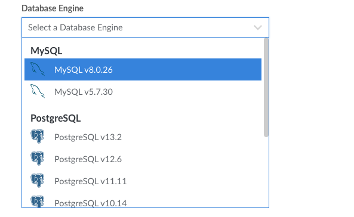

---
author:
  name: Linode
  email: docs@linode.com
title: "Create a Managed Database"
description: "A walkthough on creating a Managed Database through the Cloud Manager"
published: 2022-06-06
modified: 2022-08-09
---

This guide walks you through creating a Linode Managed Database through the Cloud Manager.

1. [Open the Create Database Cluster Form in the Cloud Manager](#open-the-create-database-cluster-form-in-the-cloud-manager)
1. [Set the Label](#set-the-label)
1. [Select the Database Engine](#select-the-database-engine)
1. [Select a Region](#select-a-region)
1. [Choose a Plan](#choose-a-plan)
1. [Determine the Number of Nodes](#determine-the-number-of-nodes)
1. [Add Access Controls](#add-access-controls)
1. [Deploy the Managed Database](#deploy-the-managed-database)

## Open the Create Database Cluster Form in the Cloud Manager

Log in to the [Cloud Manager](https://cloud.linode.com/) and select **Databases** from the left navigation menu. Click the **Create Database Cluster** button. This opens the *[Create Database Cluster](https://cloud.linode.com/databases/create)* page.

## Set the Label

Enter a name for your cluster under **Cluster Label**, allowing you to easily identify it from other database clusters on your account. A good label should provide some indication as to what the database is used for. The label must be alphanumeric and between 3 and 32 characters.

## Select the Database Engine

Select the **database engine** you'd like to use for your new database. This setting determines the underlying database management system (DBMS) that your cluster uses. Each database engine is significantly different and you should choose the one that is required by the application you intend to use it with. For instance, WordPress requires MySQL. If you are building a custom application, work with your developers to determine the best selection. See [Choosing a Database Engine and Plan](/docs/products/databases/managed-databases/guides/database-engines/) to learn about each of the available database engines.

*It's recommended to select the latest database version available, unless your application requires an older version.*

## Select a Region

Select the **region** where the database cluster will reside. Regions correspond with individual data centers, each located in a different geographical area. If you will access this database from a Linode Compute Instance or LKE cluster, you should likely select the same region as those services. Otherwise, select the region closest to you and/or your customers. This helps reduce latency and can make a significant impact in connection speeds and quality.

- [Global Infrastructure](https://www.linode.com/global-infrastructure/)
- [Speed Tests for Data Centers](https://www.linode.com/speed-test/)
- [How to Choose a Data Center](/docs/guides/how-to-choose-a-data-center/)

## Choose a Plan

Every node of a database cluster is built on its own Linode Compute Instance. In the **Choose a Plan** section, select the Compute Instance type and plan that the nodes will use. You can choose from either [Dedicated CPU](/docs/products/compute/dedicated-cpu/) or [Shared CPU](/docs/products/compute/shared-cpu/) plans. In general, Dedicated CPU plans are recommended for high-performance production databases.

- [Choosing a Compute Instance Type and Plan](/docs/guides/choosing-a-compute-instance-plan/)


Once a Managed Database cluster is created, it cannot be resized to a different plan. To modify the resources allocated to your database, you will need to create a new Managed Database with the desired plan, migrate your data, and delete the original Managed Database.


## Determine the Number of Nodes

Each Managed Database can be built with either 1 or 3 nodes (individual virtual machines):

- **1 node standalone database**: This option is recommended for development purposes or production databases where a lower cost is more beneficial than redundancy and failover.
- **3 node high availability database cluster**: This option is recommended for product databases. High availability database clusters have built-in data redundancy and automatic failover. Your data is replicated across every other node in the cluster. If one goes down, any traffic is redirected to the other available nodes.

## Optionally Add Access Controls

Within the **Add Access Controls** section, you can specify which IP addresses (and ranges) are permitted to access your new database cluster. Each Managed Database cluster has its own access control list, which grants specific IP addresses or ranges access to the database. By default, all connections (both public and private) are blocked unless they appear on this list. See [Manage Access Controls](/docs/products/databases/managed-databases/guides/manage-access-controls/) for more information and for assistance adding access controls after the database has been deployed.

If you are testing the connection from your local machine, you may also wish to enter the IP address that your ISP has assigned to your machine. One way you can find this out is by typing ["What's my IP"](https://www.google.com/search?q=what%27s+my+ip) into Google.

## Deploy the Managed Database

Once you have completed the form, click the **Create Database Cluster** button to start deploying your new database cluster. It takes approximately 15 to 30 minutes to fully provision the cluster. You can track the status by reviewing the *Status* column within the list of [Database Clusters](https://cloud.linode.com/databases) in the Cloud Manager.