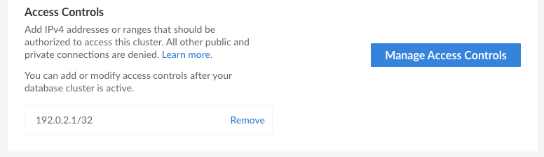

Each Managed Database cluster has its own access control list, which allows specific IPv4 addresses or ranges to connect to the database. By default, all connections (both public and private) are blocked unless they appear on this list.

## View Access Controls

1. Log in to the [Cloud Manager](https://cloud.linode.com/) and select **Databases** from the left navigation menu.

1. Select your Managed Database from the list. This opens the detail page for that database cluster.

1. Within the *Summary* tab, access controls appears under the *Access Controls* section. A list of each allowed IP address or range is displayed.

## Types of Access

- **No access** (*blank*): If no IP addresses are provided, the database will not allow any connections.

- **Open access** (`0.0.0.0/0`): Entering an IP address of *0.0.0.0/0* allows connections from any IP address.

- **Individual access** (`192.0.2.1/32`): To grant an individual system access, enter that system's IPv4 address. The `/32` is added automatically if no prefix size is provided, which means only this single IPv4 address is included within this rule.

- **Range access** (`192.0.2.0/24`): Allow connections from an entire range of IP addresses by specifying the prefix and the prefix length. For instance, entering *192.0.2.0/24* as an access control allows connections from 192.0.2.0 - 192.0.2.255.

## Add or Modify IP Addresses or Ranges

1. View your access controls by following the steps within [View Access Controls](#view-access-controls).

1. Click the **Manage Access Controls** button to open the *Manage Access Controls* panel.

1. The *Manage Access Controls* panel appears and displays a list of allowed IP addresses and ranges. From here, you can perform the following actions:

    - **Add** a new entry by clicking the **Add an IP** button and enter your desired IP address or range into the new field.
    - **Modify** an existing entry by updating it with the new IP address or range.
    - **Remove** an entry by clicking the **X** icon to the right of the entry.

1. Once you've made your changes, click the **Update Access Controls** button to commit them.

## Remove an IP Address or Range

1. View your access controls by following the steps within [View Access Controls](#view-access-controls).

1. Find the IP address or range you wish to remove and click the **Remove** link. A confirmation dialog appears.

1. Click the **Remove IP Address** button to confirm and remove the address.