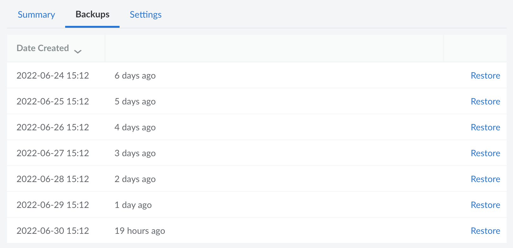
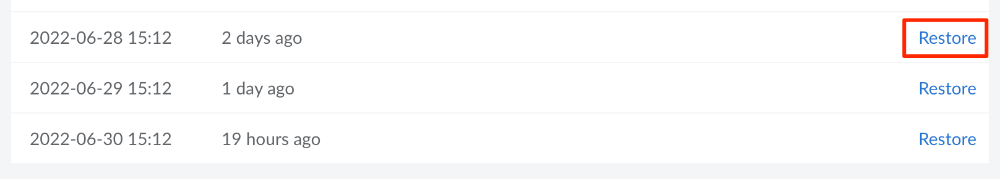

Each Managed Database includes daily backups of your data, taken on a 24 hour cadence. Up to 7 backups are stored for each database cluster, which provides you with a restore point for each day in the last week. This guide walks you through viewing and restoring from these managed backups.

## View Managed Backups

1. Log in to the [Cloud Manager](https://cloud.linode.com/) and select **Databases** from the left navigation menu.

1. Select your Managed Database from the list. This opens the detail page for that database cluster.

1. Navigate to the **Backups** tab. A list of your available backups are displayed, organized by the date they were created.



## Restore Managed Backups


Restoring from a backup erases all data stored within the database cluster and replaces it with the data from that backup.


1. View the available backups by following the [View Managed Backups](#view-managed-backups) instructions.

1. Locate the backup you wish to restore and click the corresponding **Restore** link. A confirmation dialog appears.

    

1. Enter the name of the database cluster in the **Database Label** field and click the **Restore Database** button. This deletes all the data currently stored on the database and restores the data from the selected backup. The restore process takes a few moments, the length of which depends on the amount of data. You can monitor the progress by viewing the listing page for all your database clusters.

## Alternative Backup Methods

To fully protect your data, your backup strategy should include additional backup solutions. While managed backups provide several quick recovery points, you may wish to retain backups for longer periods of time, store backups offsite, or only backup certain databases or tables. In these cases, you can use built-in DBMS tools or other third-party solutions.

The following is a list of command-line tools included with each DBMS. These tools can all be used to create manual backups or to automate backups through cron jobs or other tools.

### MySQL

The [mysqldump](https://dev.mysql.com/doc/refman/8.0/en/mysqldump.html) utility captures *logical* backups of MySQL databases and is included as part of the MySQL software. The following command exports a database called *Example* within the MySQL Managed Database cluster and saves it as an `.sql` file. Replace the host and database name with your own values. See [Connect to a MySQL Managed Database](/docs/products/databases/managed-databases/guides/mysql-connect/) guide for instructions on viewing the connection details (including the username, password, host, and port).

```command
mysqldump -h lin-1111-1111-mysql-primary.servers.linodedb.net -u linroot -p --single-transaction --set-gtid-purged=OFF Example > backup-$(date +%F-%H.%M.%S).sql
```

For more instructions, see [Backing Up MySQL Databases Using mysqldump](/docs/guides/mysqldump-backups/).

### PostgreSQL

[pg_dump](https://www.postgresql.org/docs/current/app-pgdump.html), included with PostgreSQL, captures logical backups of PostgreSQL databases. The following command exports the database called *Example* within the given PostgreSQL Managed Database cluster and saves it as a file. Replace the host and database name with your own values. See [Connect to a PostgreSQL Managed Database](/docs/products/databases/managed-databases/guides/postgresql-connect/) guide for instructions on viewing the connection details (including the username, password, host, and port).

```command
pg_dump -Fd --host lin-1111-1111-pgsql-primary.servers.linodedb.net --dbname Example --quote-all-identifiers --verbose --lock-wait-timeout=480000 --no-unlogged-table-data --serializable-deferrable --jobs=1 --username linpostgres --file database.backup
```

For more information, review the [Backing Up a PostgreSQL Database (Database Dump)](/docs/guides/how-to-back-up-your-postgresql-database/) guide.